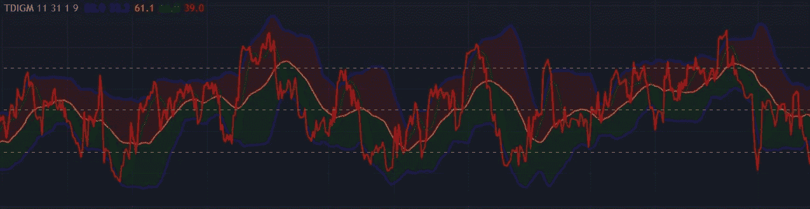
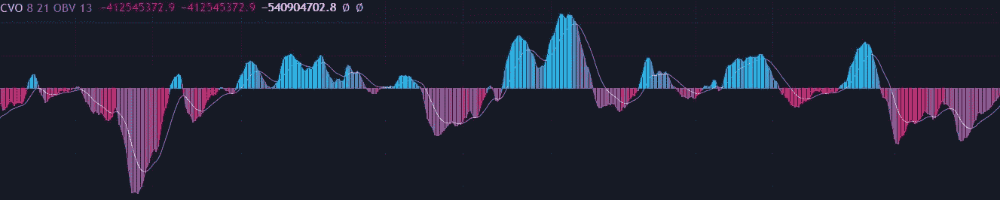
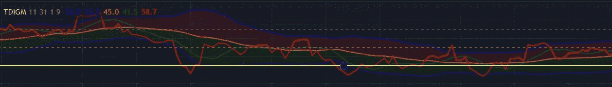
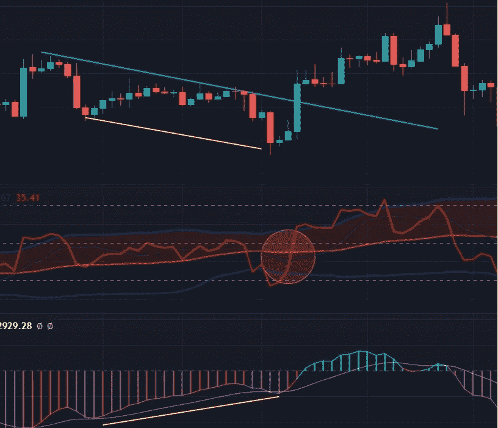
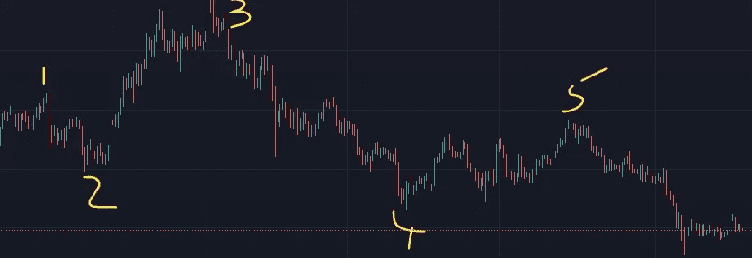

# 寻找市场顶部和底部第二部分

> 原文：<https://medium.com/coinmonks/finding-market-tops-and-bottoms-part-2-409dee3b90b6?source=collection_archive---------31----------------------->

关于如何寻找市场顶部和底部的系列文章的第 2 部分，特别关注比特币。[第 1 部分可以在这里找到](/@m_navarro/finding-market-tops-and-bottoms-part-1-ae39986d6de0)。

# **哪个时间段？**

最终，分歧会出现在任何时间框架内。时间框架越长，你要清除“假”背离的时间就越少。对于我的策略，我使用的是 **4 小时**时间框架，尽管要知道在不同的时间框架之间转换是很有用的。

# 确认/汇合

我们需要确认，我们发现的分歧可能会带来逆转。这有时被称为**确认**，有人称确认条件为**汇合**。你得到的确认越多，反转就越有可能发生。我使用 2 或 3 次确认，我将在这里记录。有了经验，你学会了“感觉”交易，所以我说 2 或 3。我很清楚这听起来很俗气。

# 附加指标

通过 **Goldminds** 和**FractalTrade 15**将**TDI-交易者动态指数**添加到您的交易视图屏幕。

**TDI** by Goldminds

**Cumulative Volume Oscillator (CVO)** by FractalTrade15

# 我们在寻找什么

假设看涨信号

1.  使用 CVO 的常规看涨背离。
2.  理想情况下，TDI 上的红线应该在最近跌破超卖水平，或者至少触及超卖水平。

Oversold level is highlighted yellow here

3.然后等待 TDI 上的红线穿过绿色，这意味着等待蜡烛关闭以确认交叉。

4.为了极度谨慎，我们可以做以下两件事中的一件。我们可以等红色和绿色的线越过橙色。或者你可以等待价格向上突破其下降通道(我更喜欢 2)。见下文。

在上图中，我们可以看到底部的 CVO 在增加(黄线)，而价格在下降(黄线)，这证实了我们的常规看涨背离。我们最近在 TDI 上触及超卖水平，因为红线已经低于较低的虚线。我们一直在等待 TDI(橙色圆圈)上的红线穿过绿线。为了安全起见，我们等待价格突破下降通道(蓝线)。(如果你愿意，你可以用 16 均线作为更动态的破位线)。

我喜欢这个例子，因为在我们发现常规的看跌背离之前，它只为我们带来了 5%的净增长。不是每笔交易都能让我们净赚 40%，但是你必须买一张票来承担这些收益的风险，当然我们会有一个止损来减少下跌的风险。在以后的文章中会有更多的介绍。

这里有一个有趣的线索是关于建立一个股权千足虫。这个想法是你在每个波峰和波谷建仓。许多职位将被停止，但 1 或 2 将仍然是值得的。

Only positions 3 and 5 would remain open at the time of writing but they would be valuable

在下一篇文章中，我有一个挑战，看看你是否能支持这个策略。

> 加入 Coinmonks [电报频道](https://t.me/coincodecap)和 [Youtube 频道](https://www.youtube.com/c/coinmonks/videos)了解加密交易和投资

# 另外，阅读

*   [比斯勒评论](https://coincodecap.com/bitsler-review)|[WazirX vs coin switch vs coin dcx](https://coincodecap.com/wazirx-vs-coinswitch-vs-coindcx)
*   [7 大副本交易平台](https://coincodecap.com/copy-trading-platforms) | [BuyCoins 点评](https://coincodecap.com/buycoins-review)
*   [XT.COM 评论](https://coincodecap.com/profittradingapp-for-binance)币安评论 |
*   [SmithBot 评论](https://coincodecap.com/smithbot-review) | [4 款最佳免费开源交易机器人](https://coincodecap.com/free-open-source-trading-bots)
*   [杠杆代币](/coinmonks/leveraged-token-3f5257808b22) | [最佳密码交易所](/coinmonks/crypto-exchange-dd2f9d6f3769) | [Paxful 点评](/coinmonks/paxful-review-4daf2354ab70)
*   [加密套利](/coinmonks/crypto-arbitrage-guide-how-to-make-money-as-a-beginner-62bfe5c868f6)指南| [如何做空比特币](/coinmonks/how-to-short-bitcoin-568a2d0b4ae5)