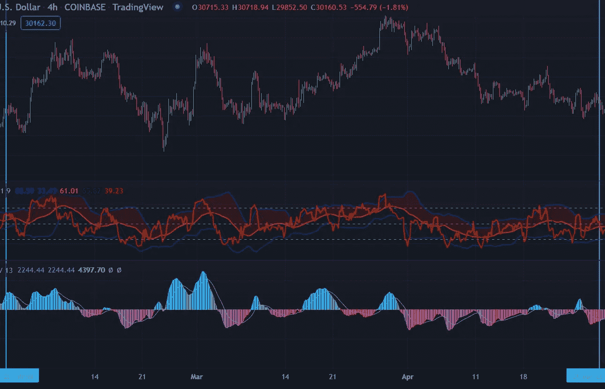

# 寻找市场顶部和底部第 3 部分

> 原文：<https://medium.com/coinmonks/finding-market-tops-and-bottoms-part-3-1df50609e508?source=collection_archive---------49----------------------->

这是系列文章的第 3 部分。第一部分在这里可用[，第二部分在这里](/coinmonks/finding-market-tops-and-bottoms-part-1-ae39986d6de0)可用[。](/coinmonks/finding-market-tops-and-bottoms-part-2-409dee3b90b6)

# 挑战

看看你能否回溯测试该策略，找出 BTCUSD 4HR 市场的高点和低点。

确保在交易视图中 2022 年 2 月 1 日-2022 年 4 月 9 日可见，并且在图上有 CVO、TDI 和 16 均线。

没有奖励，但在学习策略时测试自己是有用的。在网上学习新策略时，我们都有点头同意的倾向。直到你试图回溯测试或预测未来，我们才会遇到问题。

我将在下一篇文章中公布我的发现，然后分析经过几次大规模抛售后 BTCUSD 的现状。

> 加入 Coinmonks [电报频道](https://t.me/coincodecap)和 [Youtube 频道](https://www.youtube.com/c/coinmonks/videos)了解加密交易和投资

# 另外，阅读

*   [红狗赌场评论](https://coincodecap.com/red-dog-casino-review) | [Swyftx 评论](https://coincodecap.com/swyftx-review) | [CoinGate 评论](https://coincodecap.com/coingate-review)
*   [Bookmap 评论](https://coincodecap.com/bookmap-review-2021-best-trading-software) | [美国 5 大最佳加密交易所](https://coincodecap.com/crypto-exchange-usa)
*   [如何在 FTX 交易所交易期货](https://coincodecap.com/ftx-futures-trading) | [OKEx vs 币安](https://coincodecap.com/okex-vs-binance)
*   [CoinLoan 审查](https://coincodecap.com/coinloan-review) | [YouHodler 审查](/coinmonks/youhodler-4-easy-ways-to-make-money-98969b9689f2) | [BlockFi 审查](https://coincodecap.com/blockfi-review)
*   《XT.COM 评论》的|
*   [SmithBot 评论](https://coincodecap.com/smithbot-review) | [4 款最佳免费开源交易机器人](https://coincodecap.com/free-open-source-trading-bots)