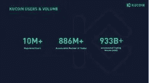
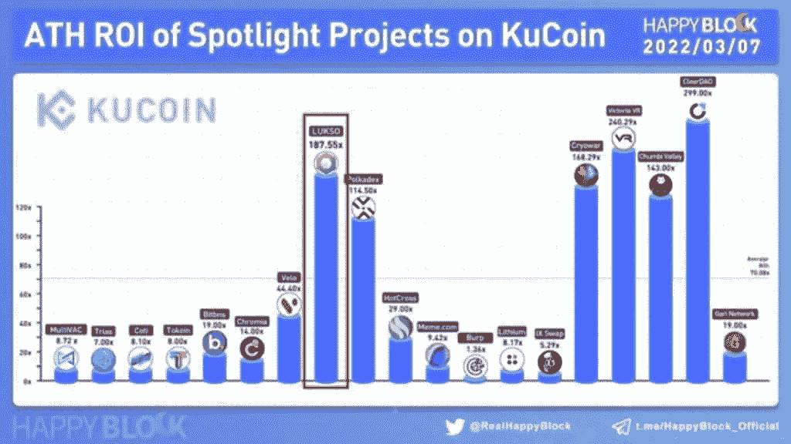

# 寻找下一个 CRYTO 宝石。

> 原文：<https://medium.com/coinmonks/finding-the-next-cryto-gem-9f2ded0081db?source=collection_archive---------38----------------------->

这个世界正在转变为一种去中心化的观念，没有一个中央机构能够操纵局面来反对你。区块链和加密货币使这一切成为可能。现在我们可能都听说过比特币，但为了清楚起见，比特币是世界上第一个建立在去中心化区块链上的数字令牌(它的运行不受任何中央控制或银行或政府的监督)。在推出比特币之后，出现了数千种其他加密货币，其中一些仍被广泛采用并日常使用，另一些则被其开发者抛弃。

一些区块链和加密货币(但不是全部)是为了解决现实世界的问题而创建的，作为一个冒险进入加密领域的初学者，起初找到正确和负担得起的项目可能是一个真正的头痛，因为大多数非常受欢迎的数字货币已经处于价格链的高端，一些可能被误导或欺骗购买非常便宜的硬币，没有坚实的支持或用例，并承诺获得 100 倍的投资。总是这样吗？50 个新手中只有 1 个这么幸运。由于无价值的令牌的数量每天都在增长，并且由于其分散的性质而不受监管，因此值得注意的是，所有这些流行的项目都是从廉价开始的，并不像当前这样流行，但是由于可行的用例以及正确的实现，它们获得了成功。如何找到下一个大资产？别担心，我很快就会谈到这一点。

由于加密货币依赖于点对点软件和加密技术，公共账本记录了区块链上的所有交易，副本保存在世界各地的服务器上，以确保透明度。然而，对于普通人来说，要在区块链上成功地进行交易，他们需要通过一种交换服务，这种服务有助于实现用户和不同加密货币之间的无缝和轻松的交易。

> 寻找合适的交易

与一个信誉良好、可靠的加密交易所合作是在加密领域取得成功的关键。什么是好的交换？

a)低费用——这很重要，因为你不会想把你的大部分利润作为交易费用交给交易所。

b)多种多样的资产可供选择——每个人都希望有更多的选择，多种多样的资产可供选择，这给了你更多的交易和投资选择，这对做出正确的选择非常重要。

c)可信度——这可能是选择交易所时要考虑的最重要的事情，它的可信度得分、为保护用户及其资金而设置的安全模块和基础设施，以及用户个人信息的安全性也是必要的。没有人愿意担心自己的资金、个人信息和投资的安全。

考虑到所有这些，选择 KuCoin 作为最佳选择是不可避免的，原因还有很多。—

KuCoin 是世界上排名第一的 altcoin 交易所，提供各种各样的资产可供选择；600 多项顶级性能资产

Kucoin 通常被称为人民交易所，在全球最佳加密交易所中排名前五，为所有类别的投资者提供服务，Kucoin 目前拥有加密爱好者最佳交易所的称号。如果你是一个爱好者，这是一列你想跳上的火车。还有呢？

超低费用

高流动性，日均交易量超过 70 亿美元

购买密码的简单、安全和直接的方法，包括但不限于:sepa、信用卡/借记卡、paypal、本地银行转账、visa/mastercard 和超过 26 种以上的选项。但这还不是全部，KuCOIN 为用户提供了多种方式，通过赌博和贷款从闲置资产中获得被动收入。提升交易所中最好的交易机器人服务之一，用户可以在没有额外成本的情况下，在 kucoin 上运行交易机器人，获得更多被动收入。

10 million registered users

现在，我们有了一个重视我们的基金和个人信息安全的交易所，并以较低的交易费用为我们提供了绝大多数有价值的资产。我如何着手寻找下一个潜在价值是我的 KuCoin 投资组合 10 倍或 100 倍的加密宝石？正确研究的力量被大大低估了，人们未能对一个项目进行广泛的研究，主要是因为缺乏时间或在研究后无法辨别有效和无效，这是互联网上相互冲突的结果的结果。这使得寻找下一个加密宝石成为一项非常乏味的任务。在这一点上，我应该指出你对下一个潜在的加密宝石一站式商店；KuCoin 聚光灯和燃烧滴列表。

Spotlight on KuCoin 是一项活动，平台用户可以在资产可供交易之前以预售价格购买新代币。通过这种方式购买的所有资产在推出后总是以 10 倍或更高的预售价格结束，因为这些项目是由行业专家仔细审查和挑选的。[这里的](https://www.kucoin.com/spotlight-center?spm=kcweb.B1homepage.header6.3)是一个跟踪记录，显示了 KuCoin 上过去的聚光灯列表的表现。

performance of coins listed through kucoin spotlight event.

燃烧下降事件非常相似，除了在这种情况下，你可以在最低和最高购买限额内自由投资你认为合适的任何金额。你也可以在这里看到最近的燃烧掉落列表$BULL [的表现](https://trade.kucoin.com/spot/BULL-USDT)

现在发现下一个加密宝石从来都不是一件容易的事情，但是在 KuCoin，你有机会在潜在的宝石上获得高于平均水平的利润。凭借高 ROI 和 APYs，您还可以通过投资 KuCoin 从闲置资产中获得被动收入。参加聚光灯和燃烧滴事件是一个肯定火的方式让你对投资乘数。如果你没有 KuCoin 账号，可以在这里注册[。我们走吧。](https://www.kucoin.com/r/rf/r395ZQJ)

> 加入 Coinmonks [电报频道](https://t.me/coincodecap)和 [Youtube 频道](https://www.youtube.com/c/coinmonks/videos)了解加密交易和投资

# 另外，阅读

*   [如何在 FTX 交易所交易期货](https://coincodecap.com/ftx-futures-trading) | [OKEx vs 币安](https://coincodecap.com/okex-vs-binance)
*   [CoinLoan 审查](https://coincodecap.com/coinloan-review) | [YouHodler 审查](/coinmonks/youhodler-4-easy-ways-to-make-money-98969b9689f2) | [BlockFi 审查](https://coincodecap.com/blockfi-review)
*   [XT.COM 评论](https://coincodecap.com/profittradingapp-for-binance)币安评论 |
*   [SmithBot 评论](https://coincodecap.com/smithbot-review) | [4 款最佳免费开源交易机器人](https://coincodecap.com/free-open-source-trading-bots)
*   [比特币基地僵尸程序](/coinmonks/coinbase-bots-ac6359e897f3) | [AscendEX 审查](/coinmonks/ascendex-review-53e829cf75fa) | [OKEx 交易僵尸程序](/coinmonks/okex-trading-bots-234920f61e60)