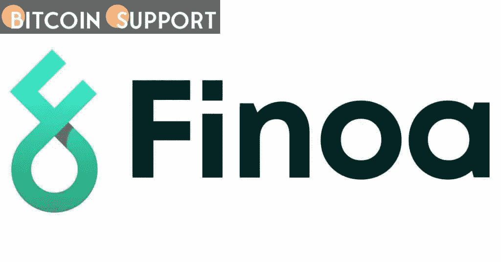
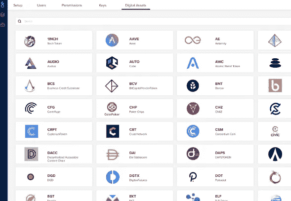

# Finoa，一个加密管理工具，已经与 Outlier Ventures 合作来促进 web3 公司的发展

> 原文：<https://medium.com/coinmonks/finoa-a-crypto-management-tool-has-partnered-with-outlier-ventures-to-increase-the-growth-of-web3-5dfb13500084?source=collection_archive---------57----------------------->

**Visit our website:-** [**https://bitcoinsupports.com/**](https://bitcoinsupports.com/)

总部位于欧洲的加密货币提供商 Finoa 专注于托管和赌注，今天宣布与专注于区块链的商业基金和加速器平台 Outlier Ventures 建立合作关系。Finoa 将通过该协议为管理加密投资和运营提供机构级端到端解决方案。Outlier Ventures 是第一批只关注新生加密货币生态系统的风险投资公司之一。

这种关系将通过 Finoa 的用户友好界面为 Outlier Ventures accelerator 参与者提供专业的加密货币托管和管理服务。

**Visit our website:-** [**https://bitcoinsupports.com/**](https://bitcoinsupports.com/)

**“我们期待在现金管理和投资者关系方面帮助有前途的加速器参与者，并与创始人合作，为公开销售和商业化铺平道路。”**

**— Marius Smith，Finoa 的合作伙伴和生态系统负责人**

**Finoa+Outlier Ventures**

Finoa 的目标是让创始人尽可能轻松地管理投资者的资金、未来的本地代币和赌注活动，同时满足财务和监管报告义务。

通过利用 Finoa 平台，加密项目可以显著降低与早期加密资金管理和运营相关的风险、运营成本和摩擦。

**“通过为今年将通过我们大本营的 120 多家投资组合公司提供简化的银行和托管程序，我们的创始人将能够专注于他们最擅长的事情:打造世界级的 web3 产品。”**

**—大卫·沙马什，Outlier Ventures 的合伙企业负责人**

**访问我们的网站:-**[**https://bitcoinsupports.com/**](https://bitcoinsupports.com/)

**免责声明:这些是作者的观点，不应被视为投资建议。读者应该自己做研究。**

> 加入 Coinmonks [电报频道](https://t.me/coincodecap)和 [Youtube 频道](https://www.youtube.com/c/coinmonks/videos)了解加密交易和投资

# 另外，阅读

*   [加密货币储蓄账户](/coinmonks/cryptocurrency-savings-accounts-be3bc0feffbf) | [YoBit 评论](/coinmonks/yobit-review-175464162c62)
*   [Botsfolio vs nap bots vs Mudrex](/coinmonks/botsfolio-vs-napbots-vs-mudrex-c81344970c02)|[gate . io 交流回顾](/coinmonks/gate-io-exchange-review-61bf87b7078f)
*   [CoinFLEX 评论](https://coincodecap.com/coinflex-review) | [AEX 交易所评论](https://coincodecap.com/aex-exchange-review) | [UPbit 评论](https://coincodecap.com/upbit-review)
*   [AscendEx 保证金交易](https://coincodecap.com/ascendex-margin-trading) | [Bitfinex 赌注](https://coincodecap.com/bitfinex-staking) | [bitFlyer 审核](https://coincodecap.com/bitflyer-review)
*   [Bitget 回顾](https://coincodecap.com/bitget-review)|[Gemini vs block fi](https://coincodecap.com/gemini-vs-blockfi)cmd |[OKEx 期货交易](https://coincodecap.com/okex-futures-trading)