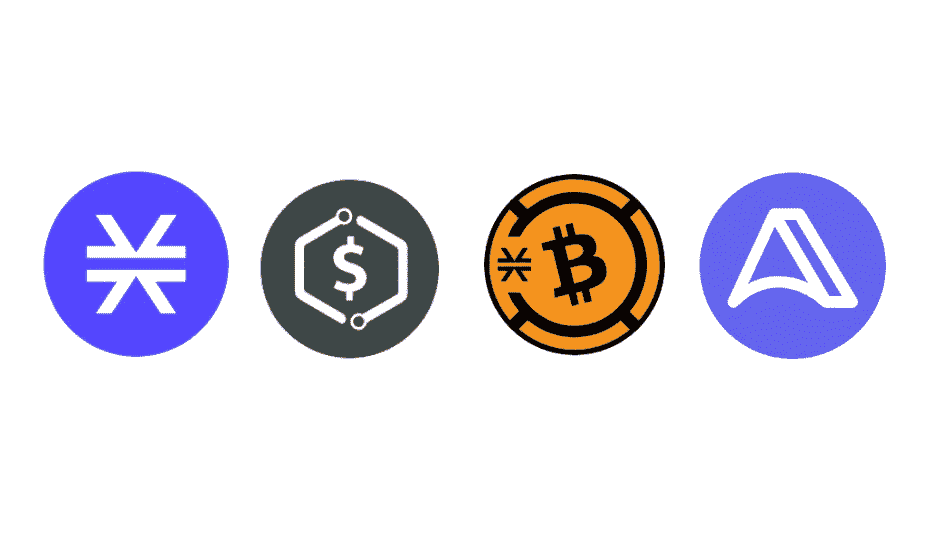
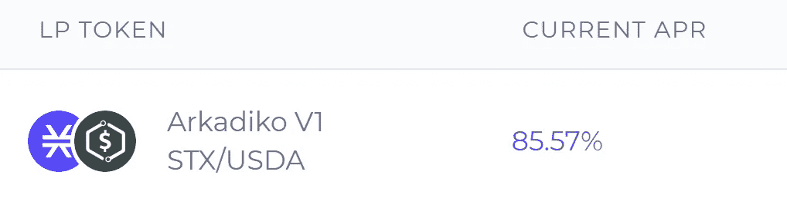
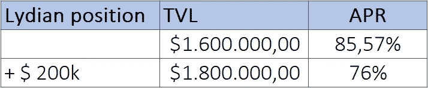
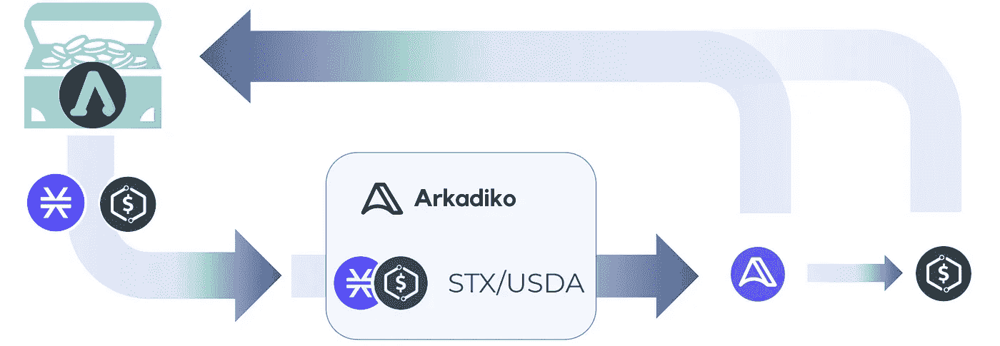
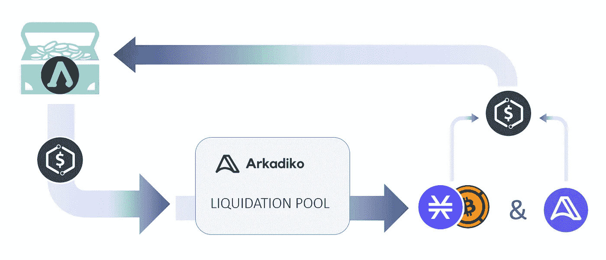

# 首次耕作策略

> 原文：<https://medium.com/coinmonks/first-farming-strategy-bbd2c3f955ff?source=collection_archive---------19----------------------->

2022 年 4 月 18 日

# 介绍

我们的财政部最近积累了期待已久的第一笔真正的生产性资产:STX。我们财政部的 STX 已经收集，并且正在通过我们平台上利润丰厚的债券发行收集。

我们认为获得农业代币的最佳方式是通过债券收集代币或作为农业奖励收集代币。这最大限度地减少了在部署农业策略之前进行交易或交换的需要。

所以，现在金库包含了 STX 代币，就由公会来决定应该如何部署它们。

# 让 STX 发挥作用！

吕底亚人的耕作方式将会在我们不和的情况下通过持续的行会治理来决定。为了引导讨论，本文将详细介绍首选的第一种耕作方法。

作为第一步，为了用我们的 STX 代币获得最佳回报，建议将它们与来自 Lydian treasury 的一些 USDA 代币结合使用。然后，该组合将被添加到 Arkadiko 互换 STX/USDA 池中，并用于下注 LP 令牌。这一步形成了吕底亚财政部的第一个核心战略。

基于 160 万美元的 TVL，当前的年利率为 85.57%。我们的潜在投资将对这一百分比产生影响，但它应保持足够的利润。

Current Arkadiko STX/USDA LP Staking rewards

Projected impact on APR after a potential Lydian investment

STX/USDA LP 赌注的赌注奖励以 DIKO 计价，并为我们的国库提供一种新的有价值资产的自然增长。根据公会的决定，高达 50k 美元的 DIKO 价值阈值将由财政部持有。应计 DIKO 将应用于 DIKO/USDA 联合养殖策略，直到达到 10 万美元的 LP 值。任何超过这一门槛的 DIKO 都将被出售给其他资产，如美国农业部。

财政部的养殖 DIKO 将被添加到 DIKO/USDA 池中，直到 LP 价值达到 10 万美元。

使我们能够在未来部署这一策略和其他收益汇总策略势在必行。为了进一步增强 Lydian 的战略，将在不久的将来发行更多 STX 债券。

# 下一步！

在我们农业战略的第一步将 STX 与 USDA 合并后，财政部仍将有大量 USDA 可用。

为了利用市场上最好的新机会，财政部剩余的 USDA 的 50%，在与 STX 配对后，可以部署在 Arkadiko Finance 的**清算池**。清算池是 Arkadiko Finance 的一个全新功能。将 USDA 存入清算池时，将获得 DIKO 奖励。所以这基本上是美国农业部的单一赌注。当一个金库需要清算时，来自金库的 USDA 用于偿还债务。作为回报，你会以折扣价得到抵押品。请注意，美国农业部提供的将被锁定至少 30 天。因此，建议只锁定剩余 USDA 的 50%。

这些奖励可以被卖掉，为我们的国库换来更多的 USDA！

美国农业部在财政部的另外 50%将作为未来操作的安全缓冲。

# 让我们知道你的想法！

我们非常高兴听到您对这篇文章的反馈。我们相信这可能是一个伟大的第一次农业战略，让吕底亚在地图上。更上一层楼！

加入我们的 [Discord](https://discord.gg/UFg6U4cPcc) 让我们知道你的想法！

> 加入 Coinmonks [电报频道](https://t.me/coincodecap)和 [Youtube 频道](https://www.youtube.com/c/coinmonks/videos)了解加密交易和投资

# 另外，阅读

*   [德国最佳加密交易所](https://coincodecap.com/crypto-exchanges-in-germany) | [Arbitrum:第二层解决方案](https://coincodecap.com/arbitrum)
*   [币安交易机器人](/coinmonks/binance-trading-bots-d0d57bb62c4c) | [OKEx 评论](/coinmonks/okex-review-6b369304110f) | [Atani 评论](https://coincodecap.com/atani-review)
*   [最佳加密交易信号电报](/coinmonks/best-crypto-signals-telegram-5785cdbc4b2b) | [MoonXBT 评论](/coinmonks/moonxbt-review-6e4ab26d037)
*   如何在 Bitbns 上购买柴犬(SHIB)币？ | [买弗洛基](https://coincodecap.com/buy-floki-inu-token)
*   [CoinFLEX 评论](https://coincodecap.com/coinflex-review) | [AEX 交易所评论](https://coincodecap.com/aex-exchange-review) | [UPbit 评论](https://coincodecap.com/upbit-review)
*   [十大最佳加密货币博客](https://coincodecap.com/best-cryptocurrency-blogs) | [YouHodler 评论](https://coincodecap.com/youhodler-review)