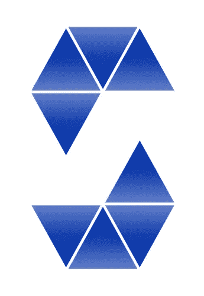

# 坚实的第一印象

> 原文：<https://medium.com/coinmonks/first-impressions-of-solidity-60a272b24fb0?source=collection_archive---------52----------------------->



我有过使用松散类型和强类型语言的经历，我对可靠性的最初想法是非常非常积极的。

快速回顾:稳健是用来创建区块链合同的语言。

Solidity 中的结构和语法感觉非常熟悉，即使是不同的关键字。

以下面的合同为例:

```
contract BlockChain {
    uint256 myNumber; struct myObject { uint256 anotherNumber;     
     string name;
     }string[] public people;}
```

***契约*关键字**:类似于 JavaScript 或 C#中的 ***类关键字***

**unint256**

**struct my object:**c#中相同的语法。JS 中类似的概念是对象文字。

**People[] people:** 一个数组(动态的)，也可以在 JavaScript 中用相同的语法找到。在 C#中，这将产生一个数组，但当然它们需要是固定大小的。

唯一有趣的区别是成员可见性。在 Typescript/C#中，可见性是在类型声明之前声明的。比如说:

```
public string[] varName;
```

而在 Solidity 中，可见性是在类型声明之后声明的:

```
string[] public varName;
```

在语言语法和结构方面还有很多——我在构建东西的时候还在努力！

但如果你对区块链感兴趣，但不确定你是否能吸收另一种语言，我强烈建议你投入进去，哪怕是一两个小时，玩一玩:)

> 加入 Coinmonks [电报频道](https://t.me/coincodecap)和 [Youtube 频道](https://www.youtube.com/c/coinmonks/videos)了解加密交易和投资

# 另外，阅读

*   [德国最佳加密交易所](https://coincodecap.com/crypto-exchanges-in-germany) | [Arbitrum:第二层解决方案](https://coincodecap.com/arbitrum)
*   [币安交易机器人](/coinmonks/binance-trading-bots-d0d57bb62c4c) | [OKEx 评论](/coinmonks/okex-review-6b369304110f) | [阿塔尼评论](https://coincodecap.com/atani-review)
*   [最佳加密交易信号电报](/coinmonks/best-crypto-signals-telegram-5785cdbc4b2b) | [MoonXBT 评论](/coinmonks/moonxbt-review-6e4ab26d037)
*   如何在 Bitbns 上购买柴犬(SHIB)币？ | [买弗洛基](https://coincodecap.com/buy-floki-inu-token)
*   [CoinFLEX 评论](https://coincodecap.com/coinflex-review) | [AEX 交易所评论](https://coincodecap.com/aex-exchange-review) | [UPbit 评论](https://coincodecap.com/upbit-review)
*   [十大最佳加密货币博客](https://coincodecap.com/best-cryptocurrency-blogs) | [YouHodler 评论](https://coincodecap.com/youhodler-review)