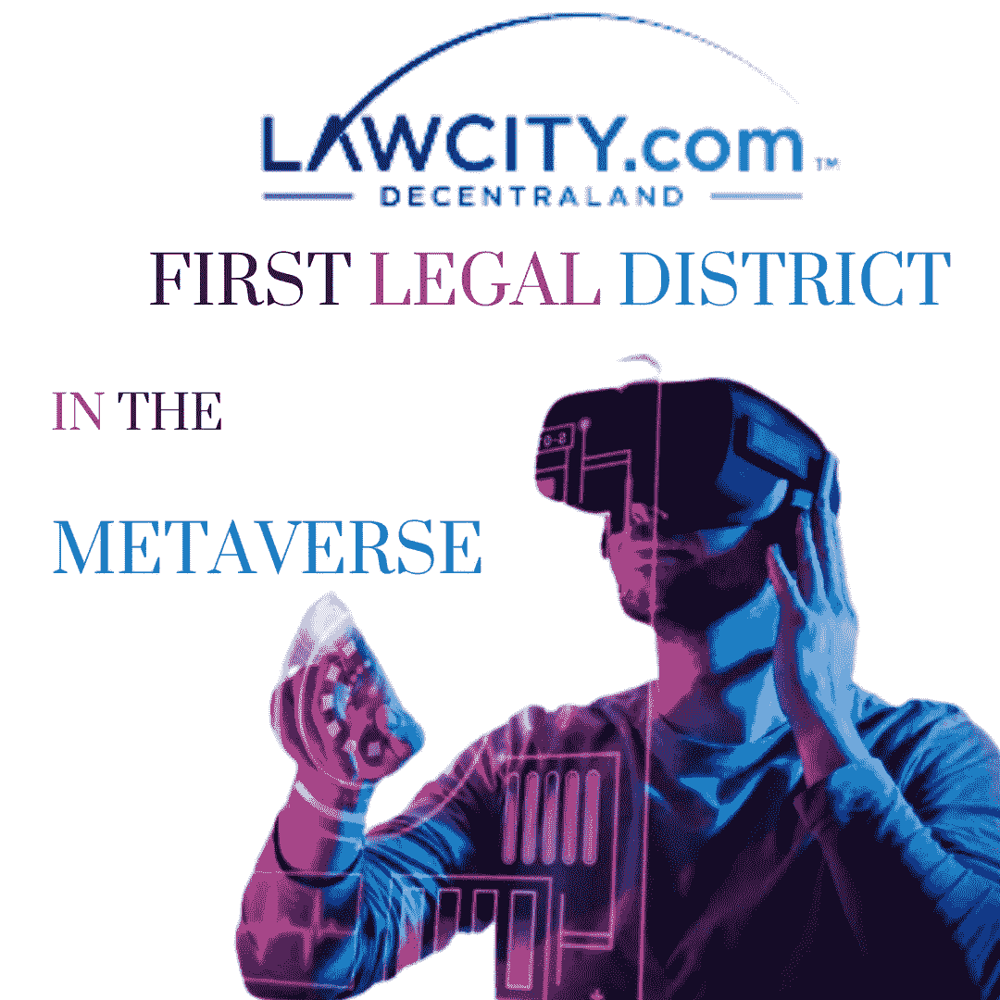

# 元宇宙的第一个法律区

> 原文：<https://medium.com/coinmonks/first-legal-district-in-the-metaverse-d0f37d5d8534?source=collection_archive---------47----------------------->

随着元宇宙和 web3.0 的兴起，大量的应用使得增长变得更加令人羡慕和不可避免。

我们已经看到在元宇宙举办了不同的活动和一些项目。此外，婚礼、音乐会、时装秀、游戏等活动，以及不同的公司在元宇宙购买房产等等。元宇宙进入现实世界只是时间问题。

就在最近，lawcity.com 宣布，他们已经在元宇宙开设了第一个法律区。就像我们有律师事务所、图书馆和研究中心一样，lawcity.com 的目标是提供几乎所有关于法律问题的解决方案。

该法律区位于元宇宙 37-58 号，分散的土地(一个分散的虚拟现实平台，允许其用户创建、体验和货币化他们的内容和应用)。他们的服务包括:为律师、律师事务所或任何世界上任何法律相关服务提供服务。分散土地，沙盒，机器人等等。如果你的公司从事法律行业并在元宇宙有业务，你也可以让它上市。

据 LawCity.com 公司的创始合伙人小威廉·a·科拉鲁洛说:

> “我们相信 LawCity.Com 将提高法律相关公司在元宇宙设立办事处的速度，以及潜在法律客户在元宇宙寻求服务的速度”。

此外，活动，NFTS，道，令牌等，都是计划在未来为 LawCity.com 成员。这给我们带来了今天的问题:

## **你认为这会增加元宇宙的收养率吗？你觉得今天的元宇宙怎么样？**

想了解更多关于 LawCity.Com 的信息，请访问 http://www.LawCity.com

## 关于作者

Igwe Ihuoma Patience 是一名自学成才的创意和行业特定内容作家，加密货币爱好者，拥有 2 年多的经验和不断发展的区块链空间的知识。

我擅长内容创作、文案写作、字幕管理、视频编辑和手机图形设计，我教其他人如何在加密货币和区块链领域起步，我的目标是让区块链的学习和更新易于任何人理解。

> 加入 Coinmonks [电报频道](https://t.me/coincodecap)和 [Youtube 频道](https://www.youtube.com/c/coinmonks/videos)了解加密交易和投资

# 另外，阅读

*   [最佳加密交换平台](https://coincodecap.com/best-crypto-swap-platforms) | [最佳加密交易所](https://coincodecap.com/crypto-exchange)
*   [购买比特币印度](/coinmonks/buy-bitcoin-in-india-feb50ddfef94) | [Pionex 评论](/coinmonks/pionex-review-exchange-with-crypto-trading-bot-1e459d0191ea) | [加密交易机器人](/coinmonks/crypto-trading-bot-c2ffce8acb2a)
*   [n 平均零点评审](/coinmonks/ngrave-zero-review-c465cf8307fc) | [Phemex 评审](/coinmonks/phemex-review-4cfba0b49e28) | [PrimeXBT 评审](/coinmonks/primexbt-review-88e0815be858)
*   最佳[区块链分析](https://bitquery.io/blog/best-blockchain-analysis-tools-and-software)工具| [赚比特币](/coinmonks/earn-bitcoin-6e8bd3c592d9)
*   [Cloudbet 赌场评论](https://coincodecap.com/cloudbet-casino-review) | [点火赌场评论](https://coincodecap.com/ignition-casino-review)