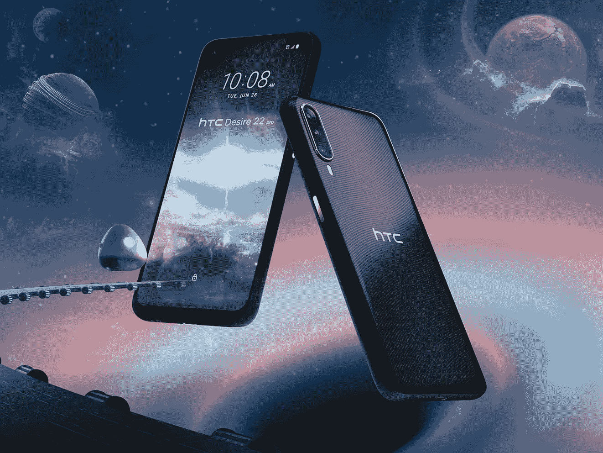

# HTC 首款元宇宙手机

> 原文：<https://medium.com/coinmonks/first-metaverse-phone-by-htc-65728e264477?source=collection_archive---------48----------------------->

现实世界、数字世界和虚拟世界相互连接的新玩意儿

Source [https://www.htc.com/uk](https://www.htc.com/uk)

HTC Desire 22 Pro 拥有 6.6 英寸的显示屏，分辨率为 1，080 x 2，412 像素，刷新率为 120 Hz，8GB 的内存和 128GB 的存储空间——4，520 毫安时的电池，并提供反向无线充电。此外，它的背面有一个三摄像头系统，有一个 6500 万像素的主摄像头，1300 万像素的超宽摄像头和 500 万像素的深度感应摄像头。对于自拍，这款手机有一个 3200 万像素的前置摄像头。

那么值得导火索吗？价格从 400 美元起，可以预订。

> 能够在扩展现实(XR)设备上运行 2D 和 3D 内容。

这个上下文并没有给我们太多关于元宇宙函数的理解。如果用户想在虚拟现实中观看电影和电视或访问他们的应用程序，该手机可以与 Vive Flow VR 耳机配对，但你可以将其安装在任何支持 miracast 的 Android 手机上。

HTC Desire 22 Pro 本身似乎并没有任何实际的 VR 功能。

另一个特点是，HTC 实际上在几个月前推出了“Vive Arts NFT 商店”，这款手机有一个名为 Vive Wallet 的应用程序。

> 加入 Coinmonks [电报频道](https://t.me/coincodecap)和 [Youtube 频道](https://www.youtube.com/c/coinmonks/videos)了解加密交易和投资

# 另外，阅读

*   [加密货币储蓄账户](/coinmonks/cryptocurrency-savings-accounts-be3bc0feffbf) | [YoBit 审核](/coinmonks/yobit-review-175464162c62)
*   [Botsfolio vs nap bots vs Mudrex](/coinmonks/botsfolio-vs-napbots-vs-mudrex-c81344970c02)|[gate . io 交流回顾](/coinmonks/gate-io-exchange-review-61bf87b7078f)
*   [CoinFLEX 评论](https://coincodecap.com/coinflex-review) | [AEX 交易所评论](https://coincodecap.com/aex-exchange-review) | [UPbit 评论](https://coincodecap.com/upbit-review)
*   [AscendEx 保证金交易](https://coincodecap.com/ascendex-margin-trading) | [Bitfinex 赌注](https://coincodecap.com/bitfinex-staking) | [bitFlyer 点评](https://coincodecap.com/bitflyer-review)
*   [Bitget 回顾](https://coincodecap.com/bitget-review) | [双子座 vs BlockFi](https://coincodecap.com/gemini-vs-blockfi) cmd| [OKEx 期货交易](https://coincodecap.com/okex-futures-trading)
*   [AscendEx Staking](https://coincodecap.com/ascendex-staking)|[Bot Ocean Review](https://coincodecap.com/bot-ocean-review)|[最佳比特币钱包](https://coincodecap.com/bitcoin-wallets-india)