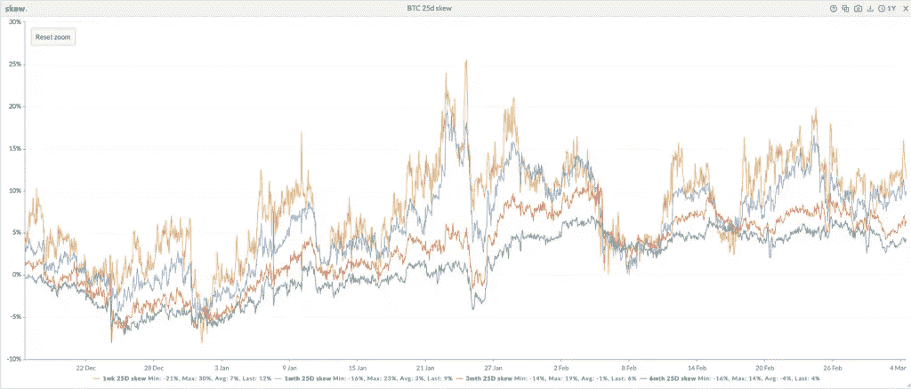
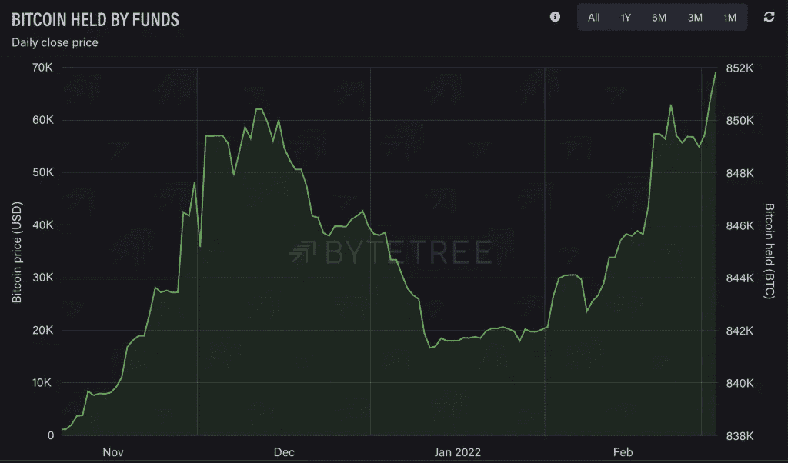
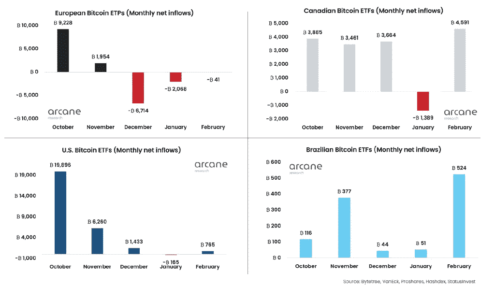

# 第一推动者美洲:基金持有创纪录数量的比特币

> 原文：<https://medium.com/coinmonks/first-mover-americas-funds-hold-record-amount-of-bitcoin-23cd985051fc?source=collection_archive---------44----------------------->

**Visit our website:-** [**https://bitcoinsupports.com/**](https://bitcoinsupports.com/)

**2022 年 3 月 4 日背景下的最新加密货币市场动向。**

比特币正在监测美国的非农就业人数和工资增长数据。期权市场依然低迷。

美联储收紧可能促使新兴市场投资者购买比特币。此外，请收看东部时间上午 9 点由克里斯汀·李、艾米丽·帕克和劳伦斯·刘易斯丁主持的 CoinDesk 电视节目《第一推动者》。今天的节目将包括以下嘉宾:

Michele Schneider，Marketgauge Group 的董事总经理

Alona Shevchenko，乌克兰 DAO 的创始人

**市场波动**

在俄罗斯军队袭击乌克兰核电站的消息传出后，由于市场被避险情绪笼罩，比特币连续第三天下跌。在传统市场，投资者将注意力从高风险资产转移到避险的美元。美元兑包括欧元在内的一篮子主要法定货币飙升至 21 个月高点，这可能表明人们担心正在进行的俄罗斯-乌克兰冲突对美国经济的影响有限。风险资产的近期前景似乎黯淡，定于 13:30 发布的美国非农就业数据预计将显示，2 月份劳动力市场进一步收紧，推动薪资上涨。增加工资会导致通货膨胀，这证实了美联储的鹰派立场。

据路透社报道，经济学家平均预期 2 月份非农就业人口增加 40 万。Tagus Capital 多策略基金(Tagus Capital Multi-Strategy Fund)合伙人伊兰索洛特(Ilan Solot)在一次电报讨论中表示:“我认为，一个强大的 NFP 将重新点燃对更激进的美联储的呼吁，并引发另一轮风险厌恶——crypto 也不会幸免。”。

“同样，监控国债收益率曲线的结构也很关键。我认为，收益率曲线的熊市陡峭化——即 10 年期收益率比 2 年期收益率攀升得更快——将吓坏市场，”Solot 补充道。加密货币资产管理公司 Blofin 的波动性交易员格里芬·阿尔登(Griffin Ardern)表示，非农就业报告可能不是一个事件，目前人们的注意力集中在欧洲央行(ECB)下周的会议上。

“非农就业报告将对加密货币市场产生轻微影响。利率市场已经消化了最多六次加息，加密货币市场也消化了更多加息。目前，我们知道美联储将加息，因此无论美国市场表现如何，这都将发生，”Ardern 在一次电报讨论中表示。

“眼下，最显著的因素可能是欧洲央行本周的鹰派。欧洲央行将于下周宣布利率决定。我们不知道欧洲央行将采取什么行动来收紧流动性，加密市场似乎没有反映这一点，”阿尔登观察到，并补充说，“欧洲央行的任何意外举动都可能引发市场调整。”

**期权市场继续走弱看跌**

比特币的期权市场保持看跌倾斜，看跌看涨期权保持正偏。

看跌-看涨偏离度表示看跌期权或相对押注与看涨期权之间的价格差。对下行对冲的持续需求表明，人们对比特币最近从 34500 美元的反弹缺乏信任。

一周、一个月、三个月和六个月的指标在 1 月的最后一周都高于零，此后一直保持在中性线以上，表明对更深衰退的持续担忧。Split Capital 的 Zaheer Ebtikar 在推特上写道:“在 crypto 中的定位很少能持续很长时间，但这肯定是我们在 crypto 中见过的持续时间最长的高偏斜期。”“这与一年前的市场体系完全是 180 度大转弯，怎么说都不为过。”

**Visit our website:-** [**https://bitcoinsupports.com/**](https://bitcoinsupports.com/)

**基金持有的比特币创历史新高**

由于俄乌问题导致通胀预期上升，基金似乎正在积累比特币。

“机构正在路上。基金和交易所交易基金(ETF)持有的比特币最近达到了历史最高水平，”周五早些时候，ByteTree Asset Management 的首席信息官查理·莫里斯(Charlie Morris)在推特上写道。

**Visit our website:-** [**https://bitcoinsupports.com/**](https://bitcoinsupports.com/)

根据 ByteTree Asset Management 汇编的数据，美国和加拿大的封闭式基金以及加拿大和欧洲的交易所交易基金(ETF)持有的硬币总价值达到了 851，841 BTC 的创纪录高位，四周内上涨了约 1 万 BTC。根据 Arcane Research 的报告，加拿大、美国和巴西 ETF 持有的比特币上月出现流入。虽然欧洲交易所交易产品和交易所交易基金连续第三个月持续亏损，但流出量明显小于前几个月。分析师表示，欧洲基金的资金外流可能是比特币相关产品供应商之间竞争加剧的结果，并不一定意味着需求低迷。

“我认为欧盟(EU)目前出血最多，有两个明显的原因:1)ETP 产品的全球“供应”增加。费用结构中的竞争加剧导致资金转移。2)某些欧盟 etp 更老，可以追溯到 2015 年，因此具有不同的结构，”神秘研究市场分析师 Vetle Lunde 在 Twitter 聊天中表示。

“大多数主要的欧盟 etp 都是证书追踪工具，没有赎回 BTC 的能力。这在去年发生了变化。在欧盟集团内部，我们发现追踪工具损失了最多的 AUM，而实物 etp 则获得了净流入。这种趋势很可能会继续下去”伦德继续说道。

**访问我们的网站:-**[**https://bitcoinsupports.com/**](https://bitcoinsupports.com/)

**免责声明:这些是作者的观点，不应被视为投资建议。读者应该自己做研究。**