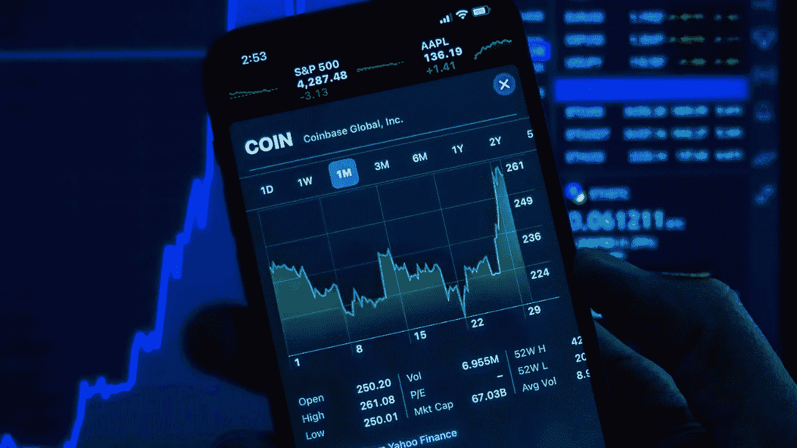

# 首次加密投资者生存指南:现在是购买加密的好时机吗？

> 原文：<https://medium.com/coinmonks/first-time-crypto-investor-survival-guide-is-now-a-good-time-to-buy-crypto-9f7db10921e0?source=collection_archive---------24----------------------->

每次你打开新闻、阅读报纸或浏览你的推特，你很可能会看到关于比特币价格的故事。我知道我有。你甚至可能有朋友投资于这种旗舰加密货币。或者你自己可能已经在游戏中有一些皮肤。不管是什么情况，加密货币的世界不仅仅是最初的硬币，它引发了[加密热潮](https://www.pcmag.com/encyclopedia/term/crypto-craze#:~:text=%28CRYPTO%20currency%20craze%29%20The%20huge%20public%20interest%20in,people%20heard%20others%20made%20a%20fortune%20in%20Bitcoin)。随着对加密投资越来越多的热情，小投资者和首次投资者获得一些关于是否、何时以及如何购买加密的宝贵见解是很重要的。在这里，我谈论的是这一革命性技术的所有版本:从 BTC 和瑞士联邦理工学院这样久经考验的大公司，到新兴的 NFT 和 meme 令牌市场。

# **这是你的首次投资者生存指南**

## 现在购买 crypto 合适吗？

我最喜欢的一句话是:“种一棵树最好的时候是 20 年前。第二好的时机就是现在。”进入秘密投资领域时，你需要决定的主要事情是:你能承受不被投资吗？总有一天，加密技术会取代我们目前的货币和金融系统。为什么？因为它是去中心化的，点对点的，它的价值仍然是可证明的。这意味着我们不再需要世界上的大银行和金融机构控制我们的货币交易并从中受益。密码，尤其是 NFT，代表了自由企业、财富创造和价值交换等机会复兴。

所以，当人们问我:我应该等着买 crypto 吗？我的回答是不。你负担不起！我们用它来支付我们在 IRL 和元宇宙需要的所有东西只是时间问题。也就是说，如果你现在不学习如何正确购买 crypto，你将会落后于其他人！

## **如何购买 crypto**

每当你研究如何购买密码的话题时，一个首字母缩略词不断出现:DYOR。这代表做你自己的研究，也是我向对密码领域感兴趣的人强调的那种事情的主要部分。关于买什么，不要只听我或任何人的话……DYOR！首先，投资于你理解的事物会有回报。如果你想把你的钱投入到更普遍接受的领域，比如 BTC 和瑞士联邦理工学院，那就去吧！如果你对萌芽中的 NFT 和迷因令牌市场感兴趣，我只能说，研究，研究，研究！在这些领域肯定有很多价值。看看 [Dogecoin](https://www.msn.com/en-in/news/world/the-rise-and-rise-of-dogecoin-in-2021/ar-AASiQvU?pfr=1) 发生了什么。

最初出现在 Reddit 的黑暗死水中的一个笑话，现在已经上升到全球知名，令人难以置信的[市值](https://www.investopedia.com/terms/m/marketcapitalization.asp)价值 10 亿美元。如果你能在 meme tokens 的下一个大东西暴涨之前抓住它，你将会非常富有。然而，值得注意的是，一个 meme token 的惊人成功激发了数百个其他衍生产品涌入市场。其中很多都不是为长期增长而设计的。当心那里的抽水和倾倒计划！

每一项投资都带有一定程度的风险，购买 crypto 也不例外。学习如何购买加密的最好方法是开始。当你知道为什么你应该开始投资密码，就很容易弄清楚[如何](https://www.youtube.com/watch?v=1ROUfMzw2BY)。现在，您不仅可以在加密货币的新世界中生存，还可以在其中茁壮成长！

 [## 你准备好迎接加密经济了吗？加密派

### 每次你打开新闻，阅读报纸，或者浏览你的推特，你很可能会看到一些故事…

www.thecryptopie.com](https://www.thecryptopie.com/) 

> *加入 Coinmonks* [*电报频道*](https://t.me/coincodecap) *和* [*Youtube 频道*](https://www.youtube.com/c/coinmonks/videos) *了解加密交易和投资*

# 另外，阅读

*   [XT.COM 评论](https://coincodecap.com/profittradingapp-for-binance)币安评论 |
*   [SmithBot 评论](https://coincodecap.com/smithbot-review) | [4 款最佳免费开源交易机器人](https://coincodecap.com/free-open-source-trading-bots)
*   [比特币基地僵尸程序](/coinmonks/coinbase-bots-ac6359e897f3) | [AscendEX 审查](/coinmonks/ascendex-review-53e829cf75fa) | [OKEx 交易僵尸程序](/coinmonks/okex-trading-bots-234920f61e60)
*   [如何在印度购买比特币？](/coinmonks/buy-bitcoin-in-india-feb50ddfef94) | [WazirX 审查](/coinmonks/wazirx-review-5c811b074f5b)
*   [CryptoHopper 替代品](/coinmonks/cryptohopper-alternatives-d67287b16d27) | [HitBTC 审查](/coinmonks/hitbtc-review-c5143c5d53c2)
*   [折叠 App 审核](https://coincodecap.com/fold-app-review) | [Kucoin 交易机器人](/coinmonks/kucoin-trading-bot-automate-your-trades-8cf0ca2138e0) | [Probit 审核](https://coincodecap.com/probit-review)
*   [如何匿名购买比特币](https://coincodecap.com/buy-bitcoin-anonymously) | [比特币现金钱包](https://coincodecap.com/bitcoin-cash-wallets)
*   [币安 vs FTX](https://coincodecap.com/binance-vs-ftx) | [最佳(SOL)索拉纳钱包](https://coincodecap.com/solana-wallets)
*   [比诺莫评论](https://coincodecap.com/binomo-review) | [斯多葛派 vs 3Commas vs TradeSanta](https://coincodecap.com/stoic-vs-3commas-vs-tradesanta)
*   [Capital.com 评论](https://coincodecap.com/capital-com-review) | [香港的加密借贷平台](https://coincodecap.com/crypto-lending-hong-kong)
*   [如何在 Uniswap 上交换加密？](https://coincodecap.com/swap-crypto-on-uniswap) | [A-Ads 评论](https://coincodecap.com/a-ads-review)
*   [WazirX vs coin dcx vs bit bns](/coinmonks/wazirx-vs-coindcx-vs-bitbns-149f4f19a2f1)|[block fi vs coin loan vs Nexo](/coinmonks/blockfi-vs-coinloan-vs-nexo-cb624635230d)
*   [本地比特币审核](/coinmonks/localbitcoins-review-6cc001c6ed56) | [加密货币储蓄账户](https://coincodecap.com/cryptocurrency-savings-accounts)