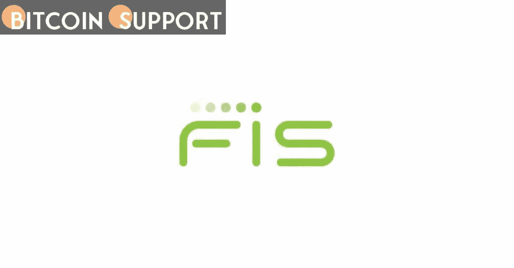

# 全球支付公司 FIS Worldpay 已经加入了 Shyft 的加密合规网络

> 原文：<https://medium.com/coinmonks/fis-worldpay-a-global-payments-company-has-joined-shyfts-crypto-compliance-network-36060453b63f?source=collection_archive---------68----------------------->

**Visit our website:-** [**https://bitcoinsupports.com/**](https://bitcoinsupports.com/)

继上个月 DLA Piper 律师事务所之后，这是第二家加入 Shyft 的重要非加密公司。Shyft 网络是一个数字识别系统，旨在使加密货币行业符合全球反洗钱(AML)标准，该网络与全球最大的支付处理器 FIS 的 Worldpay 合作。

Shyft 的目标是按照金融行动特别工作组(FATF)及其“旅行规则”的要求，使参与加密交易的假名实体(包括交易所、保管钱包和经纪公司)能够相互识别并安全地共享其客户的数据

密码部门对 FATF 的指导方针做出了反应，组建了联盟并启动了技术计划，允许个人身份信息(PII)与超过特定阈值的密码交易一起“旅行”。Shyft 通过利用区块链技术实现了这一目标，并通过与 FIS 的 Worldpay 以及最近的跨国律师事务所 DLA Piper 等重要的非加密公司合作而脱颖而出。据这些公司称，为大多数主要加密货币交易所提供卡到加密处理器服务的 Worldpay 将加入 Shyft 联盟。

**这一切都是为了弥合加密和常规世界之间的鸿沟。Worldpay 将运行 Shyft 网络的部分联盟节点，这些节点认证交易并提供数据归属，以及 Shyft 的“Veriscope”旅行规则解决方案，这是一个位于网络顶部的智能合同层。在一次采访中，Shyft 联合创始人 Joseph Weinberg 评论道，“FIS 和 Worldpay 正在为下一代支付做准备。”“从旅行规则的角度来看，拥有符合法规的数据层变得至关重要，无论是在 stablecoins 中还是在 VASPs 之间。”温伯格认为 FATF 旅行规则是一个更大的分散化身份识别架构的开始，但由 DLA Piper 和 Worldpay 等公司支持的初始阶段主要是招募 VASPs。“这是关于我们如何连接加密和传统世界，”温伯格解释道。“让 DLA Piper 或 Worldpay 这样的机构以我们从未见过的方式交叉验证这些类型的业务，有助于以我们从未见过的方式产生连锁信心。”

**访问我们的网站:-**[**https://bitcoinsupports.com/**](https://bitcoinsupports.com/)

**免责声明:以上为作者观点，不应视为投资建议。读者应该自己做研究。****

> 加入 Coinmonks [电报频道](https://t.me/coincodecap)和 [Youtube 频道](https://www.youtube.com/c/coinmonks/videos)了解加密交易和投资

# 另外，阅读

*   [印度最佳 P2P 加密交易所](https://coincodecap.com/p2p-crypto-exchanges-in-india) | [柴犬钱包](https://coincodecap.com/baby-shiba-inu-wallets)
*   [8 大加密附属计划](https://coincodecap.com/crypto-affiliate-programs) | [eToro vs 比特币基地](https://coincodecap.com/etoro-vs-coinbase)
*   [最佳以太坊钱包](https://coincodecap.com/best-ethereum-wallets) | [电报上的加密货币机器人](https://coincodecap.com/telegram-crypto-bots)
*   [交易杠杆代币的最佳交易所](https://coincodecap.com/leveraged-token-exchanges) | [购买 Floki](https://coincodecap.com/buy-floki-inu-token)
*   [3Commas 对 Pionex 对 Cryptohopper](https://coincodecap.com/3commas-vs-pionex-vs-cryptohopper) | [Bingbon 评论](https://coincodecap.com/bingbon-review)
*   [加密复制交易平台](/coinmonks/top-10-crypto-copy-trading-platforms-for-beginners-d0c37c7d698c) | [如何在 WazirX 上购买比特币](/coinmonks/buy-bitcoin-on-wazirx-2d12b7989af1)
*   [硬币评论](https://coincodecap.com/coinloan-review)|[Crypto.com 评论](/coinmonks/crypto-com-review-f143dca1f74c)
*   [如何在加拿大购买加密货币？](https://coincodecap.com/how-to-buy-cryptocurrency-in-canada)
*   [无聊猿游艇俱乐部(BAYC)评论](https://coincodecap.com/bored-ape-yacht-club-bayc-review)
*   [5 款最佳加密交易终端](https://coincodecap.com/crypto-trading-terminals) | [最佳 DeFi 应用](https://coincodecap.com/best-defi-apps)