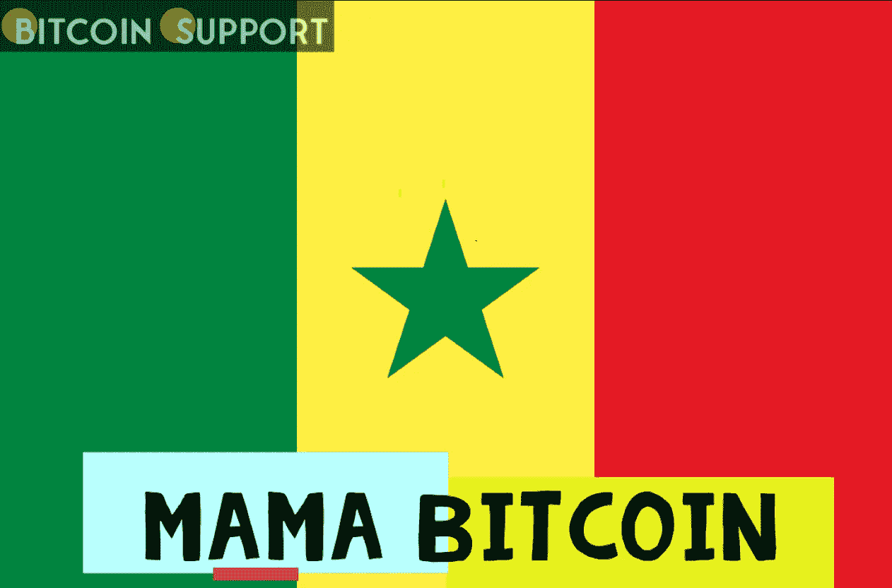
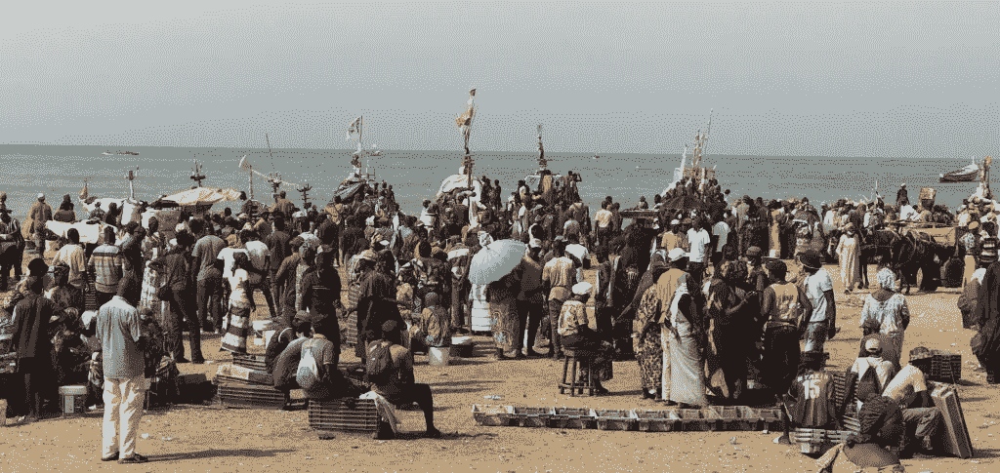
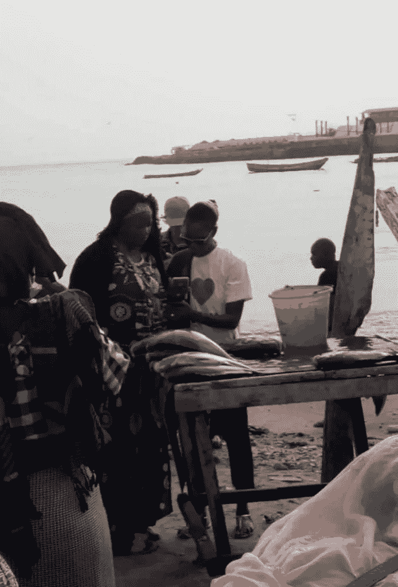

# 用加密货币的妈妈比特币在西非为女性赋权钓鱼

> 原文：<https://medium.com/coinmonks/fishing-for-female-empowerment-in-west-africa-with-cryptocurrencys-mama-bitcoin-5180150f0f99?source=collection_archive---------95----------------------->

**Visit our website:-** [**https://bitcoinsupports.com/**](https://bitcoinsupports.com/)

一名塞内加尔妇女正在用比特币、区块链技术和一个演变成秘密渔业的比特币面包店的概念来增强她的社区。

Mama Bitcoin 是十几岁的塞内加尔比特币制造者 Bineta 使用的别名。她的公司 Bleu comme la mer 是塞内加尔(也可能是整个西非)第一家接受加密货币作为支付手段的公司。此外，她是家里第一个读写能力很好的人。

Mama Bitcoin 来源于她名字的字母，而“Mama”不仅显示了她的母性倾向，还可以激励西非的其他女性参与区块链技术和比特币(BTC)。她解释说:

**“从全球来看，妇女在区块链世界的代表性不足，塞内加尔的情况也是如此。我想让人们了解作为加密货币领域的一名女性是什么样的。”**

比内塔在 2017 年初发现了比特币，这是良好意愿和不协调情况奇怪融合的结果。比内塔渴望在塞内加尔首都达喀尔以南 90 分钟的地方开一家面包店。然而，Bineta 需要资金，以便每天早上向社区提供热巧克力。

**Visit our website:-** [**https://bitcoinsupports.com/**](https://bitcoinsupports.com/)

在西非，为一个商业想法获得银行贷款极其困难，对妇女来说更是如此。比内塔被迫寻找替代方法。在从喀麦隆的一个朋友那里了解到比特币之前，她尝试了一种多级营销(MLM)企业。广泛的调查激起了比内塔的好奇心。她很快得出结论，对她的使命来说，比特币远比一个可能危险的多层次营销计划更重要。到 2017 年年中，妈妈比特币已经吞噬了数小时的法语和英语比特币相关内容，并在可能的情况下进行翻译。

她断定比特币不仅仅是一种“数字增加”技术；它的发展潜力远远超过一个新的村庄面包店:

**“随着我研究得越来越多，我明白了我们多么需要它。这笔钱将有助于解决过多的担忧。比特币不仅是自由的工具，其基础技术，如区块链和去中心化，也将从根本上改变非洲的增长。”**

坠入比特币兔子洞加速了比内塔的意图。这家面包店(用比内塔的话来说，它本来会被称为比特币布朗热里)被放弃了，取而代之的是比特币在西非的前景。

在整个 2017 年的牛市中，随着比特币的增长和价格的提高，她对这个系统的理解也扩大了。

“比特币不单纯是一种不借助银行的自我融资的方法；这是一场技术革命，也是开启塞内加尔增长和发展的一种手段。”

诸如“为什么它如此之大，却很少有塞内加尔人谈论它，为什么媒体回避这一重要问题，为什么塞内加尔不使用这一工具，为什么很少有妇女谈论它？”她的头脑继续旋转。

比内塔立即开始在社交媒体平台上撰写关于比特币的文章，接触塞内加尔比特币和加密货币社区，并重新评估自己的抱负。由于之前的商业经验以及塞内加尔靠近大西洋，比内塔允许自己有更大的梦想。她构想并建立了蓝色海洋公司，一家大型沿海公司。

blue comme la mer 是一个渔业交易平台，将渔民和消费者直接联系起来，省去了中间商。这是塞内加尔第一家接受比特币支付的企业。此外，他们还服用乙醚(ETH)和泰索斯(XTZ)。事实上，妈妈比特币在建立西非 Tezos 社区方面发挥了重要作用。

沙丁鱼、虾、章鱼和鱿鱼——事实上，任何可以从大西洋捕捞的东西——都可以在使用加密货币的平台上购买。比内塔继续说道:

**“使用加密货币支付表明，与普遍看法相反，比特币是一种点对点支付机制，而不是一种投机资产。”**

**Visit our website:-** [**https://bitcoinsupports.com/**](https://bitcoinsupports.com/)

区块链的想法不仅限于加密货币交易。Bineta 的重点是将 Bleu comme la Mer 发展成一个分散的电子商务平台，渔民可以记录他们的捕获量，购买者可以确切地看到在哪里捕获了什么。这个分散式平台不仅寻求简化捕鱼业务，还寻求打击过度捕捞，这是一种在西非水域普遍存在的有害做法。

尽管如此，“塞内加尔人和西非人对比特币相当不信任。”增加女性对加密货币的参与，这是她长期以来的激情项目，仍然是一个长期的挑战。

尽管如此，希望还是存在的。2022 年，在总共 20 名与会者中，有三名女性出席了达喀尔的第一次比特币面对面聚会。这是一个温和但充满希望的开始，毫无疑问，这得益于比特币妈妈的感染力和对加密货币的热情。

**访问我们的网站:-**[**https://bitcoinsupports.com/**](https://bitcoinsupports.com/)

**免责声明:以上为作者观点，不应视为投资建议。读者应该自己做研究。**