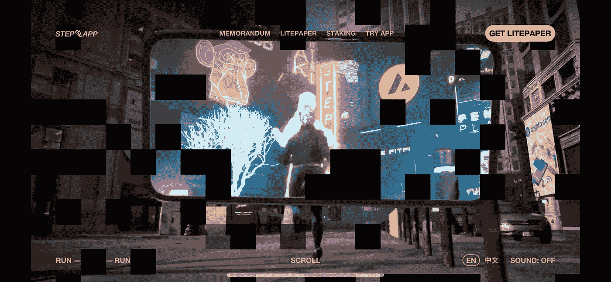
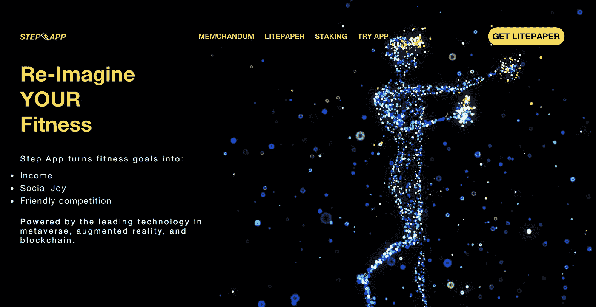
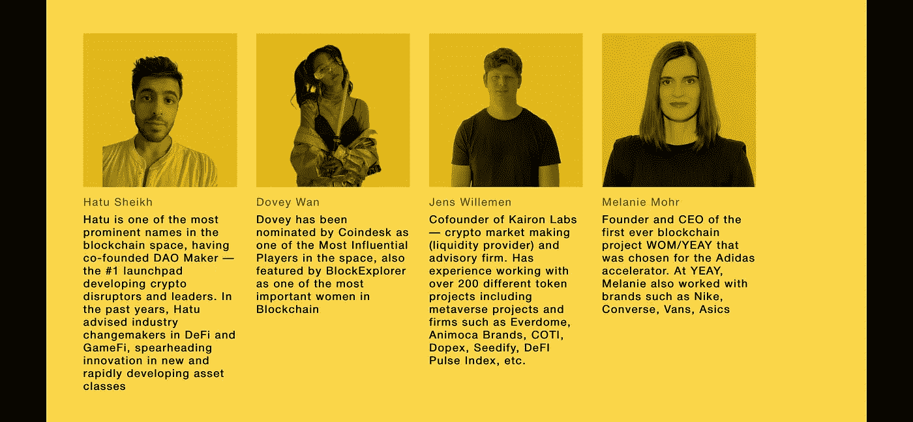
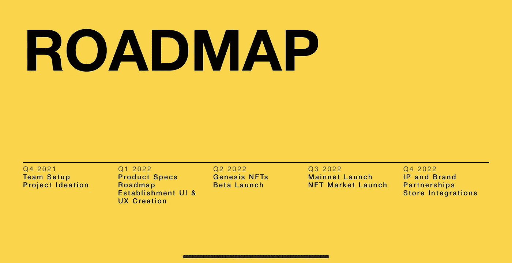
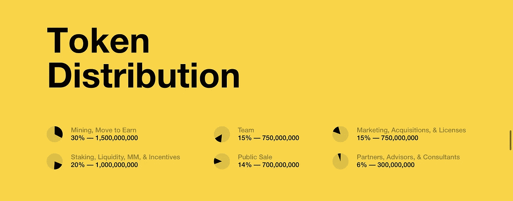
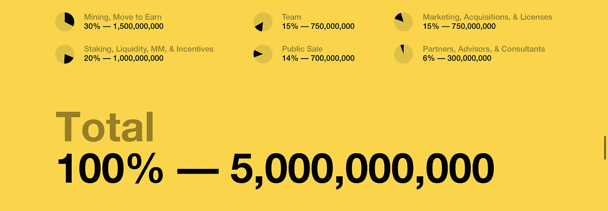
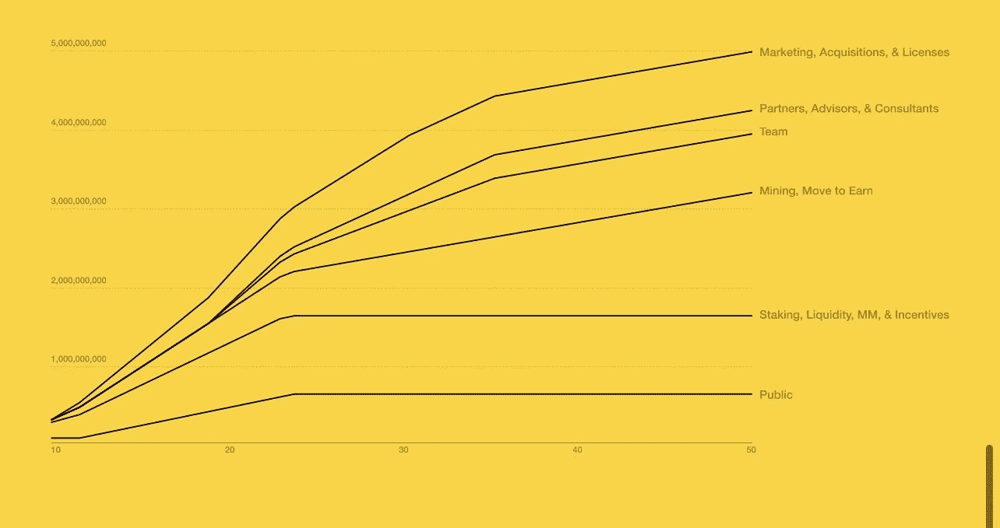

# $FITFI:下一步？

> 原文：<https://medium.com/coinmonks/fitfi-the-next-stepn-7c776f8fa8be?source=collection_archive---------4----------------------->

# CoinDCXpathbreaker

FITFI the STEPN killer?

STEPN 凭借其独特的使用案例，在加密领域获得了巨大的成功和声望。运行&赚。这听起来绝对像是网飞科幻电影中的场景，但我猜这是真实的世界🌍现在，超现实和真实之间只有一线之隔……嗯，这就是 Web3 的进步带给我们的。

Step.App AR demo on their website

看到 STEPN 作为一个项目取得的成功水平，竞争对手不可能落后…输入$FITFI，这是 Step 应用程序项目的本机令牌。

让我们来一次深潜…

**项目** : $FITFI / Step App

## 简介:

引用自报纸:

> “Step App 代币经济包括跑马圈地、加锁、流动性激励、回购、烧钱。这些都是由游戏的额外津贴和游戏经济的价值所带来的需求所驱动的。”

可用的信纸[在这里](https://step.app/litepaper)

**FITFI** 令牌是治理令牌。这些都得益于 **Step App** 生态系统费用。$ **KCAL** 代币将成为游戏内代币，它们将用于购买**运动鞋**。用户将从跑步中赚取$ 14 KCAL。

通过网络的合同地址:

*   **雪崩—合同地址**:0x 714 f 020 c 54 cc 9d 104 b 6 F4 f 6998 c 63 ce 2 a 31d 1888

**合同合法性:**[https://snowtrace . io/address/0x 714 f 020 c 54 cc 9d 104 b 6 F4 f 6998 c 63 ce 2 a 31d 1888](https://snowtrace.io/address/0x714f020C54cc9D104B6F4f6998C63ce2a31D1888)

*   **BNB 智能链—合同地址:**0x 714 f 020 c 54 cc 9d 104 b 6 F4 f 6998 c 63 ce 2 a 31d 1888

**合同合法性:**[https://bscscan . com/address/0x 714 f 020 c 54 cc 9d 104 b 6 F4 f 6998 c 63 ce 2 a 31d 1888](https://bscscan.com/address/0x714f020C54cc9D104B6F4f6998C63ce2a31D1888)

## 项目审计报告:

关于智能合同是否已提交给第三方安全公司进行审计，我找不到任何相关来源。国际海事组织(IMO)的项目看起来不太好

## 独特的卖点:

*   健身经济的 GameFi 元宇宙
*   **move to learn(M2E**):在散步、慢跑或跑步时赢取奖励
*   在生态系统上下注 **NFTs** 来赚取 **LOOTBOX** 奖励
*   项目路线图非常雄心勃勃，目标是实现 1000 万用户
*   多种收入来源维持对社区的奖励支出
*   在生态系统中实现增强现实
*   非常强大的社区
*   这个项目被那些错过了**步骤**的人视为替代

## 项目团队和顾问:

Step.App project Team members

Step.App project Advisors

Step.App project Advisors (cont…)

上面显示的项目团队和顾问的信息看起来很有希望。他们没有包括任何外部来源的链接，如 LinkedIn 来验证真实性。事实上，该团队还没有完全 KYC 或完全 Doxxed，当然对我来说不是一个好兆头，但这也可能是由于该项目是如此非常新。

*   https://www.linkedin.com/in/drandhawa/**总统-达尔潘·兰哈瓦:**

## 合作伙伴和/或风险投资者:

我找不到任何关于风险资本家参与项目初始资金的数据。此外，路线图非常明确地定义了战略合作伙伴关系何时发挥作用。

## 路线图:

2022 年 Q2 奥运会上 **Genesis NFTs** 的启动肯定会产生大量的资本流入。我对此非常有信心，因为我看到了这个项目在加密社区中的受欢迎程度……而且，就像我上面提到的，这是人们正在关注的错过了 STEPN 的项目。

我个人认为，商店整合将是这个项目长期发展的关键。产生持续的充足流动资金，然后维持这种流动资金，以保持回报池的活力，这是这个领域的每个项目都必须应对的问题。

## 令牌组学:

*   **$FITFI** 是步骤的本机令牌。应用生态系统，将用于奖励支出
*   **$KCAL** 是铸造**运动鞋**所需的游戏内代币
*   下注时跑步 **$FITFI** 产生 **$KCAL** 奖励
*   50 亿代币的最大供应量

**$FITFI 代币发布时的分配如下:**

*   30%分配给移动收入
*   20%分配给赌注奖励
*   15%分配给团队
*   15%分配给营销、许可和收购
*   14%分配给代币的公开销售
*   6%给合作伙伴、顾问和咨询人员

简单来说，总供给中只有 21%分配给团队、合作伙伴、顾问和咨询师。这肯定会防止任何错误的行为和转储。

## 归属时间表

*   Litepaper 授权时间表不提供图表时间段的额外信息。

## **项目收入来源:**

*   **游戏收入**:非偷偷购买的微交易手续费
*   **押赌注游戏**:2.5%的费用适用于竞赛游戏(如朋友和家人竞赛)的综合奖励池(仅限押赌注治理代币)
*   **锦标赛**:全球领导委员会，从参与门票销售价格中抽取 5%的费用
*   对 NFT 市场所有 NFT 销售收取 2.5%的费用
*   限量版运动鞋的月度销售将在市场上进行
*   治理社区可以投票烧掉高达 50%的游戏收入作为通货紧缩措施(这太棒了)
*   另外 50%可以作为奖励重新分配给在平台上下注的用户
*   赌注代币有 10 天的赎回期，提前赎回需要支付 12%的较高费用
*   与下注代币相比，流动性提供者代币也支付更大的奖励支出
*   在最低阈值之上下注代币将确保用户最终为所有交易支付降低的费用

## 项目社交媒体链接:

*   **推特**:【https://twitter.com/stepapp】T2
*   【https://t.me/stepappchat】电报 : [电报](https://t.me/stepappchat)
*   **不和**:[https://discord.com/invite/stepapp](https://discord.com/invite/stepapp)
*   **网站**:[https://step.app/](https://step.app/)

## 结论:

我喜欢能够站起来挑战一个已经很好建立的项目的项目。这保持了加密领域的竞争力，也让其他投资者有机会抓住他们错过的机会。没人料到会发生爆炸💣今天，用户每天为步行/跑步等日常活动赚取超过 70 美元。对于小投资者和 if Step 来说，STEPN 已经变得遥不可及。App 可以再创造同样的体验甚至更好，何乐而不为呢？？？？

该项目还旨在将 AR 纳入他们的生态系统，在他们网站的开放中也可以体验到同样的情况。我很好奇是否会通过智能手机来实现增强现实，或者他们计划通过一些专用硬件来实现。

总的来说，这是一个伟大的项目，希望进一步研究并利用它来更好地了解工作部件。

…

非常感谢 [CoinDCX](https://medium.com/u/a30fa2b03c2f?source=post_page-----7c776f8fa8be--------------------------------) 给我这个机会写这么详细的报告，并成为**# coindcxpathbaker**计划的一部分，使我能够与加密领域的每个人分享这样的教育材料。

> 加入 Coinmonks [电报频道](https://t.me/coincodecap)和 [Youtube 频道](https://www.youtube.com/c/coinmonks/videos)了解加密交易和投资

# 另外，阅读

*   [CoinLoan 评论](https://coincodecap.com/coinloan-review) | [YouHodler 评论](/coinmonks/youhodler-4-easy-ways-to-make-money-98969b9689f2) | [BlockFi 评论](https://coincodecap.com/blockfi-review)
*   [XT.COM 评论](https://coincodecap.com/profittradingapp-for-binance) | [币安评论](https://coincodecap.com/xt-com-review)
*   [SmithBot 评论](https://coincodecap.com/smithbot-review) | [4 款最佳免费开源交易机器人](https://coincodecap.com/free-open-source-trading-bots)
*   [比特币基地僵尸工具](/coinmonks/coinbase-bots-ac6359e897f3) | [AscendEX 审查](/coinmonks/ascendex-review-53e829cf75fa) | [OKEx 交易僵尸工具](/coinmonks/okex-trading-bots-234920f61e60)
*   [如何在印度购买比特币？](/coinmonks/buy-bitcoin-in-india-feb50ddfef94) | [瓦济克斯评论](/coinmonks/wazirx-review-5c811b074f5b)