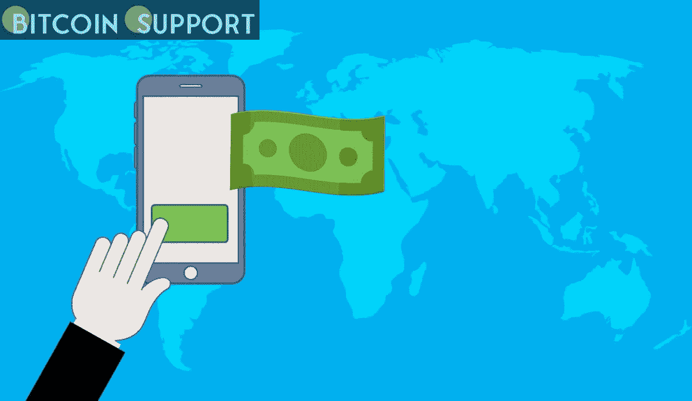

# 作为 CBDC 的替代品，美国国会正在研究电子现金，它可以用来代替现金

> 原文：<https://medium.com/coinmonks/fitting-the-bill-the-us-congress-is-considering-e-cash-as-a-possible-replacement-for-cbdc-f182d69f470?source=collection_archive---------24----------------------->

**Visit our website for full blog:-**[**https://bitcoinsupports.com/fitting-the-bill-the-us-congress-is-considering-e-cash-as-a-possible-replacement-for-cbdc/**](https://bitcoinsupports.com/fitting-the-bill-the-us-congress-is-considering-e-cash-as-a-possible-replacement-for-cbdc/)

From fiat banknotes to fractional reserve banking, the United States’ understanding of what constitutes money has evolved over time. However, is the time right for electronic cash?

President Joe Biden of the United States of America issued an executive order on March 11 encouraging the Federal Reserve to continue research into a possible US central bank digital currency, or CBDC.

The order emphasised that the market capitalization of digital assets exceeded $3 trillion in November, with Bitcoin (BTC) accounting for more than half of the total value of all cryptocurrency and peaking at more than $60,000 — up from just $14 billion five years ago. For comparison’s sake, the US money supply (M1) was $20.345 trillion in the same month.

On March 28, Congressman Stephen Lynch, who chairs the Financial Technology Task Force, introduced the Electronic Currency and Secure Hardware Act, which would develop “an electronic version of the United States dollar for use by the American public.” How does this project fit within the existing CBDC frameworks in the United States?

**Is Lynch’s electronic cash considered a CBDC or not?**

Surprisingly, the experts tasked with developing the concept assert that it is not a true CBDC because it would be issued by the US Treasury rather than the US Federal Reserve, the country’s central bank system.

Rohan Grey, an assistant law professor at Willamette University’s College of Law who assisted in the draught of Lynch’s bill, stated in an interview that the Fed lacks the statutory authority and capacity to establish a CBDC. Rather than that, he characterised the digital dollar as something that replicates the privacy, anonymity, and transactional freedom associated with physical cash.

He noted that it would not use a centralised ledger (as most proposed CBDCs do) or a distributed ledger (as crypto does), but would instead rely on its hardware to maintain its security and integrity. Beyond that, Grey believes that empowering the Fed to conduct electronic surveillance of digital currency is a bad idea due to the risk of infringing on users’ privacy. He positioned e-cash as a third alternative to account-based CBDCs and cryptocurrency that addresses privacy and surveillance concerns.

**Isn’t online banking sufficient?**

Senator Elizabeth Warren, a crypto critic, argued last summer that there was no need for digital money because US currency can already be accessed digitally. Lynch’s proposal reflects a shift in the Democratic party’s perspective. What draws him in?

Money transfers via online apps or debit card payments are common in Europe, China, and other parts of the world. While these are available in the United States, they serve as a supplement to the older “legacy” system of paper checks. While individual use of personal paper checks has decreased significantly over the last two decades, the US government and businesses continue to use them to send money.

This complicates matters for the millions of adults who are “unbanked” or “underbanked”: those who lack a bank account and frequently rely on high-cost check-cashing services. Many believe that these additional costs are excessive or disproportionately high, given that these services are deemed critical by the least economically resilient segment of the population. Numerous US politicians are concerned about economic inequality, particularly in the aftermath of the 2008 financial crisis and, more recently, the 2020 riots.

Additionally, when Americans pay with credit cards or digital platforms, retailers are required to pay third-party fees, which has a negative effect on the cash economies of poorer and immigrant-dominated communities. Small businesses, landlords, and freelancers frequently rely on paper checks.

Additionally, sending paper checks entails unacceptable lag times for their transfer, receipt, and processing. In the United States, there are thousands of banks, whereas in Canada, only five banks serve the majority of residents. This means that the costs associated with bank-to-bank transfers are essentially unavoidable when sending money.

Typically, the United States Bureau of Engraving and Printing (which is part of the Treasury Department) prints banknotes that are then circulated by the United States Federal Reserve. All banknotes in the United States are referred to as Federal Reserve Notes. The proposed digital currency would also be issued by the Treasury Department, but it is unclear what role the Federal Reserve would play. Because the proposed money would be introduced experimentally, there would almost certainly be a cap on its issuance, ensuring that it would have little effect on M1.

**The Federal Reserve’s perspective**

While the Treasury is subject to the executive branch of government, the Federal Reserve enjoys some autonomy. Jerome Powell, chairman of the Federal Reserve, chairs the board of governors, who are appointed by the president and confirmed by the Senate in a similar fashion to judges, except that judges may be appointed for life, whereas Fed governors serve for 14 years.

Following the Fed’s January white paper on the issuance of a CBDC, not all governors were enthusiastic about the idea. Powell argued for caution last summer and lobbied Congress for new CBDC legislation.

Randal Quarles, a Fed governor and vice chair for supervision, last year described the benefits of a CBDC as “unclear” and the risks as “significant and concrete.”

“Bitcoin and its ilk will, therefore, almost certainly remain a risky and speculative investment rather than a revolutionary mode of payment, and they are therefore highly unlikely to undermine the role of the US dollar or necessitate a CBDC response,” Quarles said in an address to the Utah Bankers Association, later clarifying that he was speaking for himself and not the Fed.

Powell, on the other hand, took a more proactive approach to stablecoin regulation.

“We have a fairly robust regulatory framework in place for bank deposits and money market funds, for example. That is not true for stablecoins,” Powell stated during a July congressional hearing. “If they are to become a significant part of the payments universe — which we believe crypto assets will not be, but stablecoins may — we will need an appropriate regulatory framework, which we currently lack.”

Representative Trey Hollingsworth and Senator Bill Hagerty introduced the Stablecoin Transparency Act on March 31, which would require stablecoins to be backed by government securities with a maturity of less than 12 months or domestic dollars and require stablecoin issuers to publicly disclose audited reports of reserves executed by third-party auditors.

**Visit our website for full blog:-**[**https://bitcoinsupports.com/fitting-the-bill-the-us-congress-is-considering-e-cash-as-a-possible-replacement-for-cbdc/**](https://bitcoinsupports.com/fitting-the-bill-the-us-congress-is-considering-e-cash-as-a-possible-replacement-for-cbdc/)

**All debts, public and private**

One significant distinction between prospective electronic cash and the United States dollar is that the latter is universally accepted. If the price of e-cash is pegged to the dollar, many people will simply refuse to accept it, preferring to obtain traditional USD. In the past, such pegs have left central banks vulnerable to speculators.

During the American Civil War, the United States’ fiat currency encountered its first roadblock when people overwhelmingly preferred gold and silver coins to printed money, causing price fluctuations. The United States eventually returned to gold and silver coinage.

Over a century later, the French government under Charles de Gaulle succeeded in breaking the Bretton Woods-established fixed exchange rate of $35 per ounce between US dollars and gold, and in the 1990s, billionaire investor George Soros “broke the Bank of England” by betting heavily on the United Kingdom’s inability to maintain Sterling’s peg to European currencies in the run-up to the euro’s introduction.

This partially explains why proponents of electronic cash are so concerned with making it as similar to existing US currency in circulation as possible.

**Oranges and apples**

If e-cash becomes widely adopted and passes the experimental stage, it may necessitate a fundamental shift in the nature of financial regulation in the United States. Notably, it would obviate the need for traditional retail banking by making funds storage and transfer a public service rather than a fee-based one. Federal monetary policy was designed around the concept of managing the economy through commercial banks, which helps to explain certain central bankers’ reluctance, such as Quarles.

Much depends on the volume of e-cash generated. Central bankers make one valid point: stablecoins have increased the transactional value of cryptocurrency for those whose primary interest is in sending money rather than investing. Legislators stand to lose a great deal and gain little if they risk introducing a national e-currency that fails to function, particularly in an inflationary economy.

**访问我们的网站获取完整博客:-**[**https://bitcoinsupports . com/fitting-the-bill-the-us-congress-is-considering-e-cash-as-a-possible-replacement-for-cbdc/**](https://bitcoinsupports.com/fitting-the-bill-the-us-congress-is-considering-e-cash-as-a-possible-replacement-for-cbdc/)

**免责声明:以上为作者观点，不应视为投资建议。读者应该自己做研究。**

> 加入 Coinmonks [电报频道](https://t.me/coincodecap)和 [Youtube 频道](https://www.youtube.com/c/coinmonks/videos)了解加密交易和投资

# 另外，阅读

*   [3 商业评论](/coinmonks/3commas-review-an-excellent-crypto-trading-bot-2020-1313a58bec92) | [Pionex 评论](https://coincodecap.com/pionex-review-exchange-with-crypto-trading-bot) | [Coinrule 评论](/coinmonks/coinrule-review-2021-a-beginner-friendly-crypto-trading-bot-daf0504848ba)
*   [莱杰 vs n 格拉夫](/coinmonks/ledger-vs-ngrave-zero-7e40f0c1d694) | [莱杰纳诺 s vs x](/coinmonks/ledger-nano-s-vs-x-battery-hardware-price-storage-59a6663fe3b0) | [币安评论](/coinmonks/binance-review-ee10d3bf3b6e)
*   [Bybit Exchange 审查](/coinmonks/bybit-exchange-review-dbd570019b71) | [Bityard 审查](https://coincodecap.com/bityard-reivew) | [Jet-Bot 审查](https://coincodecap.com/jet-bot-review)
*   [3 commas vs crypto hopper](/coinmonks/3commas-vs-pionex-vs-cryptohopper-best-crypto-bot-6a98d2baa203)|[赚取加密利息](/coinmonks/earn-crypto-interest-b10b810fdda3)
*   最好的比特币[硬件钱包](/coinmonks/hardware-wallets-dfa1211730c6) | [BitBox02 回顾](/coinmonks/bitbox02-review-your-swiss-bitcoin-hardware-wallet-c36c88fff29)