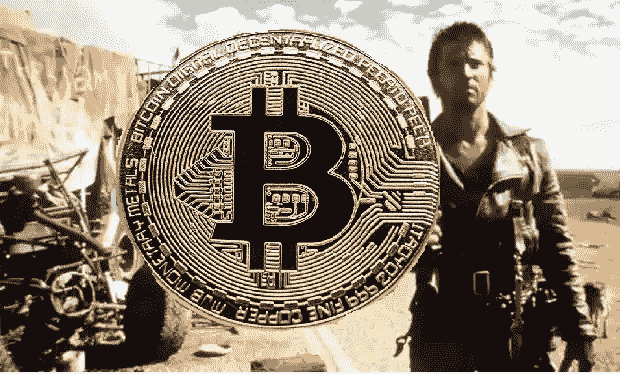

# 反对加密货币的五大理由

> 原文：<https://medium.com/coinmonks/five-arguments-against-cryptocurrency-ca315b2ca55b?source=collection_archive---------1----------------------->

## 为什么密码技术支持者设想的世界是反乌托邦而不是乌托邦

加密货币对世界如此有害，如果让加密货币得以存在的基础技术——未经许可的区块链——从未被发明出来，那会更好。以下是我证明这一点的五个论据。

## 1.)加密回报基于纯粹的推测

人们购买加密货币的唯一原因是打算以后以更高的价格出售给其他人。

其他金融资产可能也是如此，例如，一名员工可能购买苹果公司的股票，并打算在退休后出售。或者，同样的苹果股票可能被一家投资银行购买，该银行使用算法来利用股价的短期波动。

然而，如果股票市场关闭，并保持关闭 100 年，购买和持有苹果股票仍将是一项有吸引力的投资。这是因为，我们可以根据苹果和其他公司(如 Phizer 或 Palmolive)生产的商品和服务，独立于它们在金融市场上的价格，对它们的股票进行估值。

对于比特币或以太坊等加密货币来说，情况并非如此，因为它们没有令人信服的用例。在比特币实施十年后，网络处理速度仅为每秒 7 次交易，而以太坊和 Doge coin 的每秒 30 次交易也好不到哪里去。相比之下，Visa 每秒处理 1700 笔交易，并声称其处理能力高达 2400 笔。只有 10%的比特币交易具有经济意义(根据 NBER 研究公司的数据)。

加密交易速度慢，成本高，并且消耗大量能量。这扼杀了密码被消费者采用并成为真正货币的任何机会。

甚至像金条或一位著名艺术家的油画这样的资产也有用例，因为它们对某些人产生了有价值的东西。

## 2.)密码赋予坏演员权力

对于我的第二个论点，我必须承认我在第一个论点中没有完全诚实。

有一群人从比特币中获得了巨大的效用。
想象你是一名恶意软件罪犯。你的计划是将恶意软件植入一家大公司的 IT 系统，关闭其运营，然后要求付款来修复攻击。只有一个问题，无论你要求什么报酬，当局都会找到你。如果你要求电子转账，这些资金可以被追踪，但同样接受实物现金将是一个复杂而有风险的操作。罪犯甚至求助于礼品卡。

当然，比特币提供了完美的解决方案。

现在，如果这一理论是正确的，我们应该预计比特币的流行将推动这些勒索软件攻击的大幅增长。

这正是所有报告表明勒索软件攻击的频率和规模大幅飙升的情况，攻击者总是要求以加密货币支付。

这确实凸显了加密的问题，不仅 8850 亿的加密市场没有产生任何有形的价值，而且它还是一个关闭生产商品和服务的公司的工具。

总的来说，crypto 具有通常与秘密银行业务相关的所有问题。银行保密制度允许银行通过与纳粹、毒枭、杀人不眨眼的盗贼甚至是不纳税的人合作而获利。幸运的是，近几十年来，银行保密制度开始慢慢倒退，但是加密迷对保密和分散化的坚持将所有的进步置于危险之中。

## 3.)上述问题源于加密的基本目标以及如何使用区块链来实现这些目标

你可能会想，虽然这些点是真正的问题，但它们不是加密货币的必然结果。也许有了更好的设计和实现，我们就可以拥有密码，而不需要所有的骗局、欺诈性电子垃圾和破坏气候的能源使用。

为了说明为什么这是错误的，我们需要更多地了解加密货币运动的基本目标，以及他们如何利用技术来实现这些目标。

比特币的设计于 2008 年以笔名中本聪(Satashi Nakamoto)发表。全球金融危机刚刚发生，人们对银行和政府等机构的信任度降至历史最低点，这是有充分理由的。

理解加密货币的一个关键词是信任。通常，当你进行金融交易时，你会依赖银行作为中介。即使只是把你的钱存在银行里也是一种信任的行为。这不是一件小事，因为在现代存款保险制度(由政府运营的制度)出现之前，当储户所依赖的银行破产时，储户亏损是很常见的。即使只是把现金藏在床垫下，也会让你受制于美联储控制通胀的承诺。整个货币体系依赖于像银行和政府这样的大型非个人机构。

比特币和其他加密技术的倡导者认为所有这些都是一个问题。他们的目标很激进。他们想创建一个不依赖这些机构的新金融体系。除此之外，他们还希望金融交易完全不需要第三方参与。这就是“去中心化金融”和“无信任交易”这些流行词汇背后的含义

密码爱好者认为他们有一个技术解决方案可以实现这一愿景。解决方案被称为工作证明。

简而言之，加密货币不能只是奖励给任何人，需要有一个障碍来阻止任何一个人控制整个加密网络。所以新的比特币是在解决复杂数学问题的基础上授予的。提供工作证明的完整解释需要比本文所允许的范围更多的细节。

重要的是，它让比特币像去中心化货币一样发挥了应有的作用。但这付出了巨大的代价。速度慢、成本高和能源浪费是工作证明的结果。比特币网络需要矿工使用越来越强大的计算能力来完成工作证明。如果没有这一要求，单个实体将很容易伪装成大量假名身份，并获得对整个比特币的控制权。这种策略被称为西比尔攻击。作为对这些 sybil 攻击的防御，工作证明是必要的。

其他解决方案，如股权证明，也有问题。股权证明根据每个人拥有的现有货币数量按比例分配投票权。例如，如果我们将同样的原则应用于美元，富人和外国政府对美国政府经济政策的控制将远远超过他们目前享有的任何影响力。

因此，总而言之，加密货币速度慢、成本高且浪费资源，因为它们基于区块链技术。当技术专家谈论用链条移动东西时，他们是不是意味着未来也应该是缓慢而昂贵的？这只可能是我，但我认为技术是为了让事情变得更好，而不是更糟。或者，对于密码支持者来说，匿名和不受政府约束的回报是值得的，不管我们其他人为此付出什么代价？

## 4.)中介其实挺好的

中介不错。那么什么是中介呢？

我们可以把经济想象成一个巨大的个人和组织网络，所有的个人和组织都在相互交易。任何促进或使这种交易更容易的组织都是中介。

以纽约证券交易所为例。为了上市，公司需要满足上市要求。政府也可以通过实施法规来发挥作用。

这个自由市场资本主义的象征不仅仅是一个蛮荒的西部，那里的机构和人们可以随心所欲地进行交易。相反，它依赖于一套复杂的规章制度来有效运作。上市股票之所以是有吸引力的投资，部分原因在于，保证公司将遵守这些规则会为投资者创造额外价值。更多的贸易发生是因为中间商而不是更少。

当两家公司一起达成协议时，它们不仅仅依赖于握手协议。他们将签署一份合同。在这样做的时候，他们依靠法律制度来保证遵守合同。如果没有法治这样的制度，资本主义的生产率将会低得多。

因为加密依赖于技术而不是信任，所以如果出现问题，没有后援可以依靠。不出所料，crypto 已经成为黑客、骗子和小偷的天堂。在任何情况下，人们经常最终依赖于第三方，比如加密交换。这些交易所长期以来都有被黑客攻击和滥用权力的记录。

## 5.)建立值得信任的制度是进步的源泉

Crypto 最初是作为一种摆脱美元及其对政府依赖的方式而被推广的。我们需要了解政府对美元有什么权力，它用这种权力做好事还是坏事？

通过联邦储备系统，政府控制利率，利率本质上是货币的价格——你需要支付多少来获得贷款。它利用这一权力来平衡价格稳定和充分就业这两个相互竞争的优先事项。这可不是小事，因为在 20 世纪 30 年代，整整三分之一的劳动力失业了。像土耳其这样的国家目前正遭受毁灭性的恶性通货膨胀。即使是 2008 年的金融危机也没有造成与 20 世纪 30 年代相同规模的失业。这表明，尽管臃肿且不受监管的金融部门在本世纪初贪婪地追逐利润和风险，但美联储系统至少在一定程度上有效地履行了监管宏观经济的职责。

法定货币和现代中央银行体系无疑是金本位制的巨大进步。金本位制伴随着持续的经济危机，也延长了大萧条。宏观经济也可能受到经济上不重要的影响，如实物黄金的实际可用性，除非这一点得到控制。

另一个主要的说法是政府已经在金融系统中通过要求人们纳税。当然没有人喜欢这样。但是我们真的认为如果没有政府强迫人们为学校、医院、某种司法系统等等买单，这个世界会变得更好吗？政府甚至资助了大多数新的救命药物和革命性技术，如触摸屏和互联网。

归根结底，我们今天在世界上看到的所有进步都是建立值得我们信任的机构的结果。今天的世界比历史上任何时候都更加丰富和人道。如果有问题的话，那就是由于不平等和滥用权力，这些收益没有得到足够公平的分配。

但是这些问题以前已经解决过了。不是试图逃离现代世界。而是由普通人一起工作，一起建设。滥用种族主义，集中的经济权力和贫困是反击组织，建立机构，将站在一个大的金钱和它对政府的影响的抗衡力量。

如果银行能让经济崩溃，那么银行在过去是受到监管和控制的。1933 年通过格拉斯-斯蒂格尔法案后，美国在 50 多年里没有发生重大金融危机。这一时期包括了其历史上最快速的经济增长。只是在金融家和经济学家说服政府废除这些法规之后，金融危机才作为一种常规事件重新出现。

加密货币只不过是一种逃避现实的幻想，以避免建设一个更加公平的世界的真正挑战。Crypto 未能成功防止滥用和诈骗，这与华尔街曾经做过的任何事情都不相上下。

## 作者指出

这篇文章在很大程度上依赖于三个来源，我推荐你阅读，你会想要更多的细节

大卫·罗森塔尔[的博客，https://blog.dshr.org/2022/02/ee380-talk.html](https://blog.dshr.org/2022/02/ee380-talk.html)
的推特，科里·多克托罗[https://twitter.com/doctorow/status/1493288001107021826](https://twitter.com/doctorow/status/1493288001107021826)
的文章，丽贝卡·m·布拉斯皮斯
[https://repository.law.umich.edu/cgi/viewcontent.cgi?的《密歇根科技法律评论》article = 1242&context = mttlr](https://repository.law.umich.edu/cgi/viewcontent.cgi?article=1242&context=mttlr)

> 加入 Coinmonks [电报频道](https://t.me/coincodecap)和 [Youtube 频道](https://www.youtube.com/c/coinmonks/videos)了解加密交易和投资

# 另外，阅读

*   [印度最佳 P2P 加密交易所](https://coincodecap.com/p2p-crypto-exchanges-in-india) | [柴犬钱包](https://coincodecap.com/baby-shiba-inu-wallets)
*   [八大加密附属计划](https://coincodecap.com/crypto-affiliate-programs) | [eToro vs 比特币基地](https://coincodecap.com/etoro-vs-coinbase)
*   [最佳以太坊钱包](https://coincodecap.com/best-ethereum-wallets) | [电报上的加密货币机器人](https://coincodecap.com/telegram-crypto-bots)
*   [交易杠杆代币的最佳交易所](https://coincodecap.com/leveraged-token-exchanges)
*   [最佳加密分析或链上数据](https://coincodecap.com/blockchain-analytics) | [Bexplus 评论](https://coincodecap.com/bexplus-review)