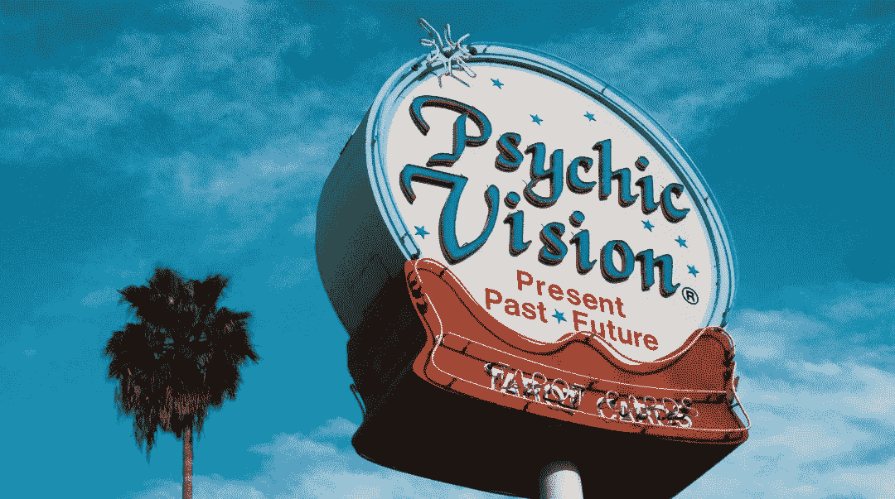

# 我在 2022 年押下重注的五种加密资产

> 原文：<https://medium.com/coinmonks/five-crypto-assets-im-betting-big-on-in-2022-83893a5ecdf0?source=collection_archive---------2----------------------->

## 另外五个是我为我 72 岁的母亲投资的

Image: PixTeller

> 我们的理智不是预言家，当我们的幻想是预言家的时候——威廉·莎士比亚

# 嘿，妈妈，你想买密码吗？

假期期间，我让我 72 岁的母亲对加密投资产生了兴趣。至少可以说，这次经历很有启发性。我的妈妈非常精通金钱，而 T2 非常愚蠢(爱你妈妈！).在金钱方面，她是一个谨慎小心的投资者。她喜欢房地产，并且在这个领域做得很好。就金融技术而言，她开支票。她亲自去银行。她需要书面笔记来在电脑上查看电子邮件。而且，现在她也有了一个体面的包包:以太坊( [ETH](https://coinmarketcap.com/currencies/ethereum/) )、波尔卡多特( [DOT](https://coinmarketcap.com/currencies/polkadot-new/) )、Chainlink ( [LINK](https://coinmarketcap.com/currencies/cardano/) )、Cardano ( [ADA](https://coinmarketcap.com/currencies/cardano/) )、Avalanche ( [AVAX](https://coinmarketcap.com/currencies/avalanche/) )。

至于我，我要走一条稍微不同的路。从 2021 年开始，我持有大约 12 种不同的加密资产。在我的核心投资之外，我有一些规模不错的头寸，以及一些相对较小的头寸。我和他们相处得还不错，但为了 2022 年，我决定扔掉这些东西。今年，我的投资重点完全集中在我的核心资产上:声纳( [PING](https://coinmarketcap.com/currencies/sonar/) )、Near Protocol ( [NEAR](https://coinmarketcap.com/currencies/near-protocol/) )、Terra ( [LUNA](https://coinmarketcap.com/currencies/terra-luna/) )、Polygon ( [MATIC](https://coinmarketcap.com/currencies/polygon/) )和币安币( [BNB](https://coinmarketcap.com/currencies/binance-coin/) )。

## 未来如此光明，我必须戴上墨镜

在我讲述如何为我(和我妈妈)选择资产之前，让我先解释一下为什么我对 2022 年如此乐观。我先引用一句我喜欢的 2020 年福布斯的话:

> “两年后，zcash 的价值为零，”三岁的专注于隐私的密码货币公司的 Kyle Samani 说。目前，zcash 的交易价格为 66 美元

对于那些不知道的人来说，凯尔·萨马尼是 Multicoin Capital 的管理合伙人。我绝对同意多金的[核心论点](https://multicoin.capital/thesis/)。然而，萨马尼在《福布斯》上的预测也完全错误。截至本文撰写之时，zCash 的股价目前约为 150 美元。关键是，密码预测和孕育它们的呼吸一样有价值。

尽管如此，我仍然认为有很大的理由保持乐观。首先，主流加密意识有了巨大的提高。从 2021 年初开始，关于密码的信息在[爆炸。然而，到 2021 年底，只有 16%的美国人拥有](https://www.theblockcrypto.com/data/alternative-crypto-metrics/social)[购买、出售或交易](https://www.pewresearch.org/fact-tank/2021/11/11/16-of-americans-say-they-have-ever-invested-in-traded-or-used-cryptocurrency/)加密资产。

## 互联网，那东西还在吗？

相比之下，这与互联网在 1996 年的家庭采纳率大致相同。商业互联网的早期看起来非常愚蠢。例如，主流互联网的采用仍然看起来像[这个](https://www.youtube.com/watch?v=A81IwlDeV6c&t=392s)。现在，对于那些不记得的人来说，在 1996 年，感觉就像每个人都在谈论一个叫互联网的疯狂新事物。

但是，就像今天的密码一样，连接有一个相当高的技术障碍。美国在线(AOL)和 Compuserve 等公司简化了流程。对用户体验的改进紧随其后。现在差不多 30 年过去了，上网并不比设置电视难。易用性的提高推动了互联网连接在全球的爆炸性采用。我认为同样的事情也会发生在密码上。当然，我可能错了，但我(和 chain analysis)[不这么认为](https://blog.chainalysis.com/reports/2021-global-crypto-adoption-index/)。

我认为使加密应用与互联网发展方式截然不同的是加密全球化的速度。世界大部分地区用了近 15 年时间才在互联网连接方面赶上美国。Chainalysis 的方法有点不可靠，但它指出了非常重要的一点，即全球加密的采用正呈指数增长。如果你看看 Chainalysis 的数据，它显示了新兴市场非常不同的使用案例。我将引用[报道](https://blog.chainalysis.com/reports/2021-global-crypto-adoption-index/):

> 许多新兴市场面临货币大幅贬值，迫使居民在 P2P 平台上购买加密货币，以保护自己的储蓄。这些地区的其他人使用加密货币进行国际交易，要么用于个人汇款，要么用于商业用途，如购买商品以进口和销售。这里提到的许多新兴市场限制了居民可以携带出境的本国货币数量。加密货币为这些居民提供了一种规避这些限制的方式，以便他们能够满足自己的金融需求。

如果美国经济衰退，这些用例中有哪一个听起来是有益的？或者，如果通货膨胀持续上升？或者美国实施资本管制或贸易限制？还是银行(再次)倒闭？如果遗留的金融体系真的开始崩溃(再次)，当一个全球性的、去中心化的、大体上自治的货币体系离我们只有几下鼠标的距离时，有多少人会坐视他们的钱化为乌有？同样，如果*不是一场金融灾难，一切都保持良好运转，那么什么会阻止加密技术的发展呢？*

这就是我看好 crypto 的原因。意识的大幅提升。指数级的全球采用，无论是在制度上，还是在全球南部。在不发达和腐败的经济体中非常清晰的使用案例。而且，这些用途也可以很好地转化为发达经济体市场严重崩溃时可能出现的情况。而且，如果 T4 没有崩盘，那么就没有什么会阻碍增长。这还没提到几周前令人惊讶的热烈而模糊的国会听证会。

## 一切都在方法中。或者，那是处决吗？

对于 2022 年，我决定稍微改变一下我的投资方式。我的投资组合中约有 60%是贝莱德的 ETF。其余的都是加密的。我通常使用一种伪[技术/基本面分析](/coinmonks/crypto-investing-how-to-dyor-1e6dabdb1de9)来指导我的秘密投资。今年，我将关注点缩小到少数几个项目上。在假期中，我意识到在“用例”类型的项目上下注对我来说太挑剔了。

但是，我也想到，在秘密生态系统中建立强大、自信的头寸更符合我的投资风格。我能做的最好的加密生态系统类比是操作系统和软件。在这个类比中，像以太坊、Polkadot 或 Near 这样的项目就像操作系统。生活在这些链条上的所有项目就像软件一样。

有大量不同的 PC 和移动操作系统。可供选择的“主要”操作系统不止一个。同样，我相信各种加密生态系统有很大的发展和繁荣空间。我可以想象一个未来，以太坊拥有像 Windows 一样的市场份额，索拉纳拥有像 Linux 一样的市场份额，Near 拥有像苹果一样的市场份额…或者类似的东西。

当然，这些链中的一些可能会像黑莓操作系统或 T2 掌上操作系统那样结束。然而，早期投资黑莓和 Palm 的人也赚了很多钱。我们还需要几年的时间才能弄清楚各种加密生态系统中的哪一个将成为基础。就像操作系统一样，我认为各种各样的区块链会偏爱某些类型的使用和用户。

想象一下，如果你是一个[电脑游戏玩家](https://store.steampowered.com/hwsurvey/Steam-Hardware-Software-Survey-Welcome-to-Steam)，大约 98%的人使用 Windows。但是如果你是一名软件开发人员呢？Windows 大约占 45%，Mac OS 占 27%，Linux 紧随其后，占 26%。移动用户？安卓和苹果 iOS 分别约为 75%至 25%。我想你明白了。我想说的是，如果你在 1996 年投资了黑莓、Palm、微软、苹果和诺基亚，你可能会在你的私人飞机上读到这篇文章。

现在，想象一下，如果你试着挑选哪些软件、游戏和/或应用程序是赢家或输家，你会做得多好。这是一个更难的提议。我知道这个类比并不完美，但我希望它能让人理解这个想法。关键是，就像今天开发的各种区块链一样，我讨论的大多数操作系统都工作得很好。

而且，就像今天的区块链一样，这些操作系统各有优缺点。花了十年左右的时间才真正开始找到最佳解决方案。但是如果你一直投资其中的任何一个，你可能会做得很好。我认为同样的事情也将适用于各种区块链项目，无论是索拉纳，以太坊，卡尔达诺，或其他东西。

## 婴儿潮、加密和小狗

这就是为什么我建议我妈妈投资以太坊、波尔卡多特、Chainlink、Cardano 和 Avalanche。我基本上选择了那些项目，就像有人可能从一窝小狗中挑出小狗一样。现在，这些项目是最大的，最健康的。他们每个人都有自己的怪癖和癖好，但在大多数情况下，他们看起来相当健康。当然，就像一只看起来健康的小狗一样，Cardano 或 Ethereum(或其他什么)可能会生病或死亡。

我仍然认为它们是相对安全的赌注。我警告过我妈妈，这些项目绝对会泡汤。我不认为他们会，但我也没想出如何预测未来。我不持有它们，因为我认为它们的增长潜力低于我关注的项目。但是，我也认为它们的风险较低。

至于我在 2022 年的包，我会用声纳，近，多边形，月球和 BNB。公平地说，声纳更像是一个“软件”，而不是一个区块链生态系统。这只是一个我坚信的项目。NEAR 和 Polygon 感觉有点像区块链的 iOS 和 Android。初级开发人员的入职流程干净、简单、直接。网络速度很快，而且有丰厚的回报。

Polygon 更大，有点沉闷，有点“狂野西部”。但它通常是有效的，而且每天都在变大。我可以很容易地看到 Polygon 在下一年攫取和 Solana 一样多的市场份额。至于露娜，我认为他们的 Terra 稳定硬币解决方案绝对会爆炸。已经是真的了。那里也有一些稳定的赌注机会。

最后，在 BNB，我买了很多币安智能连锁项目。因此，我广泛使用了链条。它不是最便宜也不是最快的，但在这两方面都绝对合理。这个空间得到了广泛的开发，尽管混杂着一堆垃圾。我仍然认为它是以太坊的合法竞争对手，我看好它的未来。

整件事情的一个巧妙之处在于，明年的这个时候，我将看到我的投资建议发挥得有多好。我给妈妈的“保守”加密投资建议和我自己的“直觉”投资，哪个回报更高？我希望我们俩都醒了很多！我们两个也可能会输很多。不管怎样，我认为这将是激动人心的一年。另外，现在我可以和我妈妈谈论加密，她的眼睛不会马上呆滞。

我知道现在有很多 FUD。美联储会加息吗？股市会崩盘吗？比特币会崩盘吗？肯定有警告信号。也有大量的理由保持乐观。今年，我一反常态地乐观。空气中有些东西让我觉得 2022 年对 crypto 来说会很棒。我期待着明年重温这个投资实验，看看我是不是对的。手指交叉！

你觉得我的选择怎么样？欢迎发表评论，我有兴趣听听你的想法。

> 加入 Coinmonks [电报频道](https://t.me/coincodecap)和 [Youtube 频道](https://www.youtube.com/c/coinmonks/videos)了解加密交易和投资

## 也阅读

*   [加拿大最好的加密交易机器人](https://blog.coincodecap.com/5-best-crypto-trading-bots-in-canada) | [赌注加密](https://blog.coincodecap.com/staking-crypto)
*   [如何在印度购买比特币？](/coinmonks/buy-bitcoin-in-india-feb50ddfef94) | [WazirX 评论](/coinmonks/wazirx-review-5c811b074f5b)
*   [最佳网上赌场](https://blog.coincodecap.com/best-online-casinos) | [硬件钱包](/coinmonks/hardware-wallets-dfa1211730c6)
*   [如何在 WazirX 上购买柴犬(SHIB)币？](https://blog.coincodecap.com/buy-shiba-wazirx)
*   [比特币主根](https://blog.coincodecap.com/bitcoin-taproot) | [排名前 6 的比特币信用卡](/coinmonks/bitcoin-credit-card-bc8ab6f377c6)
*   [最佳免费加密信号](https://blog.coincodecap.com/free-crypto-signals) | [YoBit 评论](/coinmonks/yobit-review-175464162c62) | [Bitbns 评论](/coinmonks/bitbns-review-38256a07e161)
*   [huo bi 的加密交易信号](https://blog.coincodecap.com/huobi-crypto-trading-signals) | [BitMEX 评论](https://blog.coincodecap.com/bitmex-review)
*   [7 个最佳零费用加密交换平台](https://blog.coincodecap.com/zero-fee-crypto-exchanges)
*   [分散交易所](https://blog.coincodecap.com/what-are-decentralized-exchanges) | [比特 FIP](https://blog.coincodecap.com/bitbns-fip) | [Pionex 审查](https://blog.coincodecap.com/pionex-review-exchange-with-crypto-trading-bot)
*   [用信用卡购买密码的 10 个最佳地点](https://blog.coincodecap.com/buy-crypto-with-credit-card)
*   [OKEx 评论](/coinmonks/okex-review-6b369304110f) | [Kucoin 交易机器人](/coinmonks/kucoin-trading-bot-automate-your-trades-8cf0ca2138e0) | [期货交易机器人](/coinmonks/futures-trading-bots-5a282ccee3f5)