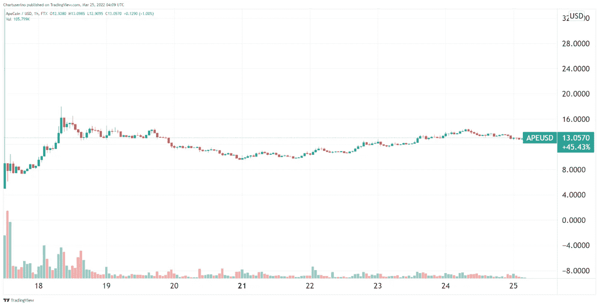
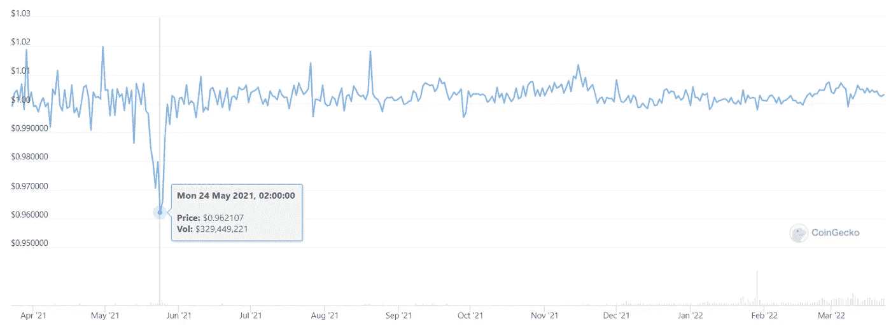
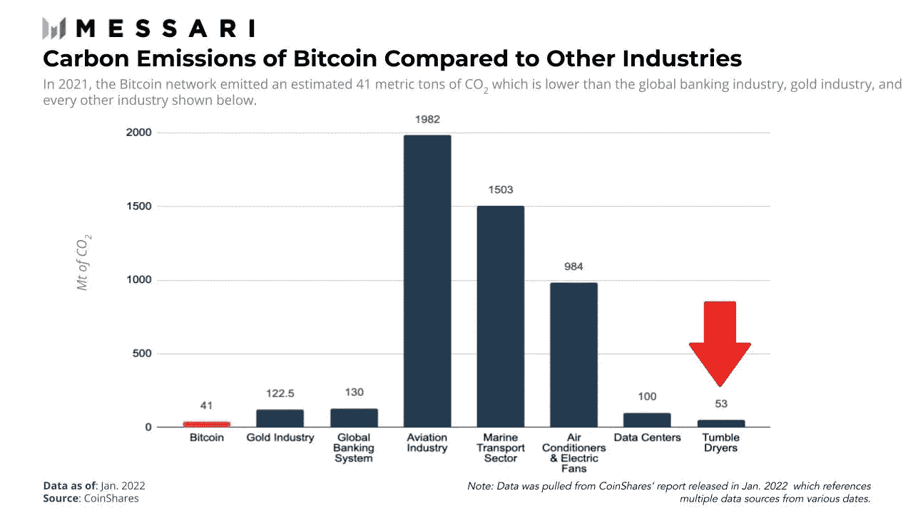
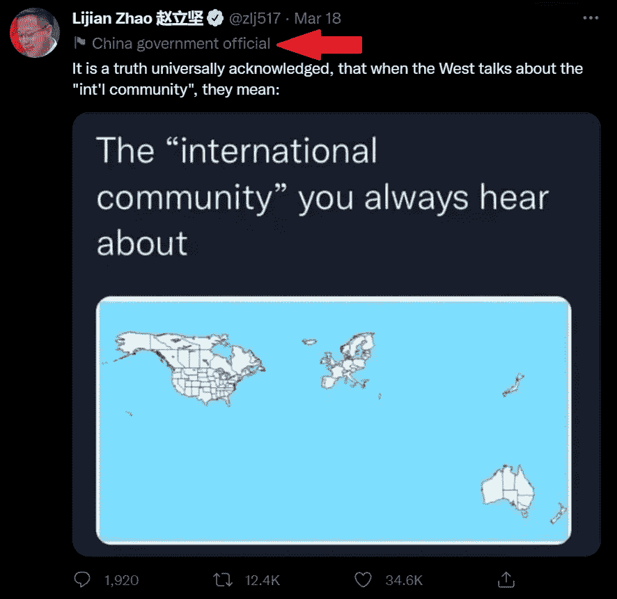
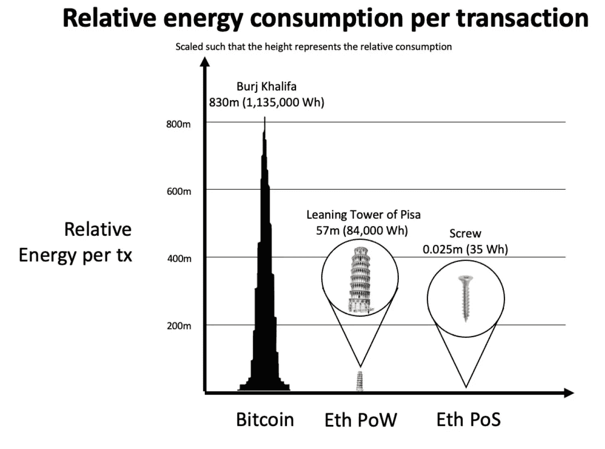
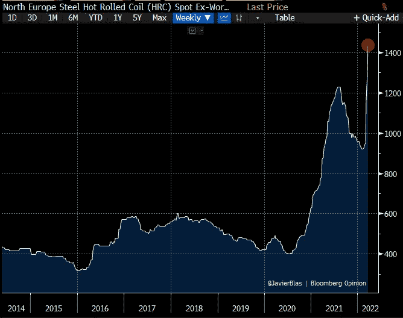

# 五分钟金融:APE 收益现可与比特币、TERRA 的 BTC 标准、加密能源上下文相媲美

> 原文：<https://medium.com/coinmonks/five-minute-finance-ape-gains-now-rival-bitcoins-terra-s-btc-standard-crypto-energy-context-a2598608db6?source=collection_archive---------58----------------------->

# 5 分钟的金融时事通讯——解释发生了什么，为什么。

# 让我们看看这周发生了什么:

*   猿类引领 Web3 冲锋——挑战 Meta？
*   Terra 的比特币标准
*   以太坊即将在绿门的另一边合并
*   拜登承认“新世界秩序”:BTC 在哪里？
*   参议员伊丽莎白·沃伦介绍了含有大量密码含义的法案

# ApeCoin 突出 Web3 轮廓

*   宇迦实验室如何在一年内成为 40 亿美元的 Web3 媒体公司 **(** [**链接**](https://tokenist.com/how-yuga-labs-became-a-4b-web3-media-company-in-a-year/?utm_source=getresponse&utm_medium=email&utm_campaign=five_minute_finance&utm_content=%E2%9C%8B%205MF%3A%20Ape%20Gains%20Now%20Rival%20Bitcoin%27s%2C%20Terra%27s%20BTC%20Standard%2C%20Crypto%20Energy%20Context) **)**
*   ApeCoin 正在用数十亿美元奖励无聊的 Ape 内部人士 **(** [**链接**](https://qz.com/2145867/apecoin-has-padded-the-pockets-of-bored-ape-insiders/?utm_source=getresponse&utm_medium=email&utm_campaign=five_minute_finance&utm_content=%E2%9C%8B%205MF%3A%20Ape%20Gains%20Now%20Rival%20Bitcoin%27s%2C%20Terra%27s%20BTC%20Standard%2C%20Crypto%20Energy%20Context) **)**

# 炒作+排他性+慷慨的空投=忠诚度

事实证明，与拥有古怪的猿类 NFTs 相比，成为比特币最大化主义者就相形见绌了。尽管在 BTC 不到 100 美元的时候，比特币创造者引领了拥有区块链资产的概念，但我们现在看到，独家访问、品牌和 web3 插件带来的财富堪比比特币 100 美元到 43，000 美元的利润率。

宇迦实验室创建了无聊猿游艇俱乐部(BAYC)作为种子超现实。这意味着，虚构的猿传说是关于未来的百万富翁挂在他们的沼泽俱乐部，获得了他们的财富，因为他们早期的 NFT 投资。快进到在线亚文化时代，猿类开启了对事件和社交网络的访问，我们看到了自我实现的预言。

那些去年 4 月以 0.08 ETH(当时 190 美元)购买 Apes 的人，现在可以指望 103 ETH 的平均底价了(约 3.2 万美元)。最贵的猿(#8817)在苏富比拍出 340 万美元。

*无聊猿#8817。图像鸣谢:* [*索斯*](https://metaverse.sothebys.com/natively-digital/lots/bored-ape-8817?utm_source=getresponse&utm_medium=email&utm_campaign=five_minute_finance&utm_content=%E2%9C%8B%205MF%3A%20Ape%20Gains%20Now%20Rival%20Bitcoin%27s%2C%20Terra%27s%20BTC%20Standard%2C%20Crypto%20Energy%20Context) *。*

宇迦实验室现在价值 40 亿美元，拥有 web3 扩张所需的雄厚资金。在 a16z 的带领下，我们已经筹集了 4.5 亿美元，我们可以期待看到一系列的区块链游戏和一个被称为 *Otherside* 的全新元宇宙平台。

Otherside 放弃了排他性，并致力于长期的开源扩张，允许其他 NFT 项目参与进来。这被许多人认为是对 Meta(脸书)在元宇宙获得垄断地位的计划的直接打击。最近推出的 ApeCoin 将成为宇迦实验室的区块链娱乐帝国的支柱。仅在最初几分钟，仅在币安，它就获得了 4200 万美元的交易量。

【2022 年 3 月下旬 APE/美元价格走势。图片信用: [*交易视图*](https://www.tradingview.com/?utm_source=getresponse&utm_medium=email&utm_campaign=five_minute_finance&utm_content=%E2%9C%8B%205MF%3A%20Ape%20Gains%20Now%20Rival%20Bitcoin%27s%2C%20Terra%27s%20BTC%20Standard%2C%20Crypto%20Energy%20Context) *。*

随着未来四年 10 亿枚代币的逐步解锁，ApeCoin 可能会在每一次新的宇迦实验室活动、merch 和 NFT 空投以及 P2E 游戏发布会上飙升。目前无聊，狗窝，突变 NFT 持有者是第一批获得数千猿硬币，填补了他们(已经过满)的口袋。

教训？秘密投资者喜欢特定的项目、排他性和炒作。Dogecoin 已经证明了这一点，尽管它的基本面比任何合法的数字资产都要差得多。我们现在在 Ape NFTs 和 ApeCoin 上看到的是，同样的公式得到了简化和“专业化”。

反过来，这个生态系统将比狗迷因硬币有更大的长期耐力。

# 加密初始:用分散黄金支持分散稳定币

*   Terra 1 . 25 亿美元的 BTC 收购如何验证比特币标准 **(** [**链接**](https://tokenist.com/how-terras-125m-btc-buy-validates-the-bitcoin-standard/?utm_source=getresponse&utm_medium=email&utm_campaign=five_minute_finance&utm_content=%E2%9C%8B%205MF%3A%20Ape%20Gains%20Now%20Rival%20Bitcoin%27s%2C%20Terra%27s%20BTC%20Standard%2C%20Crypto%20Energy%20Context) **)**
*   Terra 的 LUNA 停留在接近 100 美元 ATH，目前有 26 亿美元+TVL**(**[**链接**](https://tokenist.com/terras-luna-stays-close-to-100-ath-with-26b-tvl-so-far/?utm_source=getresponse&utm_medium=email&utm_campaign=five_minute_finance&utm_content=%E2%9C%8B%205MF%3A%20Ape%20Gains%20Now%20Rival%20Bitcoin%27s%2C%20Terra%27s%20BTC%20Standard%2C%20Crypto%20Energy%20Context) **)**

# Terra 正在帮助比特币标准的诞生吗？

宇迦实验室通过直接、集中的方式积累了 40 亿美元的财富。相比之下，比特币通过成为比特币——一种无主的、分散的资产——建立了 8350 亿美元的市值。虽然不像华丽的猿和 P2E 游戏那样令人兴奋，但这是建立一个加密大厦的良好基础。

Terra 正在这个基础上再加一层，利用比特币巨大的分散足迹来支撑其稳定的货币 TerraUSD (UST)。尽管 UST 作为一枚算法硬币在市场压力下已经表现出了非凡的稳定性，但 Terraform Labs 没有给任何机会。

在 2021 年 5 月市场高度波动期间，TerraUSD 从 1:1 的挂钩汇率短暂跌至 0.96 美元，但很快回升。图片来源:[*coin gecko*](https://www.coingecko.com/?utm_source=getresponse&utm_medium=email&utm_campaign=five_minute_finance&utm_content=%E2%9C%8B%205MF%3A%20Ape%20Gains%20Now%20Rival%20Bitcoin%27s%2C%20Terra%27s%20BTC%20Standard%2C%20Crypto%20Energy%20Context)*。*

Terra 专注于建立一个廉价而快速的全球支付系统，其计划的一部分是成为区块链版的 Visa，计划提供价值 100 亿美元的 BTC，作为应对潜在市场波动的储备。这与 1944 年至 1971 年支撑美元的金本位制惊人地相似。

人们不禁要问，如果美国没有放弃硬黄金支持，比特币会不会成为央行的对手？央行是产生 30 万亿美元国债的实体，也是我们正在目睹的 40 年高通胀的部分原因。

打翻了牛奶之后，Terra 展示了游戏的下一阶段。通过为 2500 万客户提供服务的 CHAI 支付应用，以及淘汰传统储蓄账户的高收益锚协议，Terra 的生态系统展示了金融 2.0。这不是一场零和游戏，而是一场与区块链先驱比特币相互关联的游戏。

在某种程度上，就像第二层**可扩展性**解决方案增加以太坊的吞吐量一样，区块链也是如此，比如 Terra 是比特币的第二层**目的**解决方案。因此，双方都受益，Terra 首次以 1.25 亿美元收购 BTC，帮助比特币上涨了 5.2%。

[**享受 5MF？点击转发给三个朋友。**](mailto:info@tokenist.com?subject=Check+this+out+&body=I%E2%80%99ve+been+reading+Five+Minute+Finance,+and+I+know+you%E2%80%99d+enjoy+it+too.+It%E2%80%99s+a+weekly+email+that+covers+the+most+important+trends+in+finance.+I+learn+something+new+every+time+I+read+it!+Check+it+out+here:+https://tokenist.com/newsletter/?utm_source=email_gr_btn)

# 以太坊即将打破能源密集型枷锁

*   如果以太坊 2.0 少消耗 99.98%的能量，机构会跳进去吗？ **(** [**)链接**](https://tokenist.com/if-ethereum-2-0-consumes-99-98-less-energy-will-institutions-jump-in/?utm_source=getresponse&utm_medium=email&utm_campaign=five_minute_finance&utm_content=%E2%9C%8B%205MF%3A%20Ape%20Gains%20Now%20Rival%20Bitcoin%27s%2C%20Terra%27s%20BTC%20Standard%2C%20Crypto%20Energy%20Context) **)**
*   以太坊的区块链正接近一个巨大的转折点，可能会推动以太的市值超过比特币的 **(** [**链接**](https://fortune.com/2022/03/23/ethereum-merge-bitcoin/?utm_source=getresponse&utm_medium=email&utm_campaign=five_minute_finance&utm_content=%E2%9C%8B%205MF%3A%20Ape%20Gains%20Now%20Rival%20Bitcoin%27s%2C%20Terra%27s%20BTC%20Standard%2C%20Crypto%20Energy%20Context) **)**

# 以太坊变绿时会翻转？

尽管比特币不像实物现金那样匿名，但它在主流媒体上的曝光却是洗钱和犯罪。然而，随着时间的推移，统计数据清楚地表明，与正规的、有凭证的银行洗钱相比，比特币的非法使用可以忽略不计。人们只需看看瑞士瑞信银行历史上最近被指控的 1000 亿美元的非法资金流入。

在 2010 年代末，比特币的洗钱污点有了一个新伙伴——能源使用。当然——比特币的工作证明共识机制是资源密集型的，但还有额外的背景。毕竟，如果没有媒体对滚筒式干衣机的邪恶的长篇大论，为什么要有对比特币的邪恶？通往财务自由的道路没有早点拿到干衣机重要吗？

*附加语境下的比特币能耗。图片来源:* [*梅萨里*](https://messari.io/article/how-bitcoin-is-improving-the-environment?utm_source=getresponse&utm_medium=email&utm_campaign=five_minute_finance&utm_content=%E2%9C%8B%205MF%3A%20Ape%20Gains%20Now%20Rival%20Bitcoin%27s%2C%20Terra%27s%20BTC%20Standard%2C%20Crypto%20Energy%20Context)

以太坊也因其能源消耗而受到密切关注。为了与日益增长的竞争对手竞争，以太坊即将推出的 2.0 升级版区块链将增强其对机构投资者的吸引力。再也不会出现夸张的标题说“以太坊网络用的电和 x 国一样多”。

以太坊 2.0 计划使用交易的**经济验证**而不是比特币的计算验证，预计将减少 99.98%的能源足迹。反过来，企业媒体将无法像攻击埃隆·马斯克购买价值 15 亿美元的比特币那样攻击以太坊投资者。当他们最终迫使他出手时，马斯克取消了特斯拉的比特币支付，这在很大程度上引发了 2021 年的加密崩溃。

这是否意味着一场以太坊-比特币之争即将到来？与比特币的固定供应量相比，以太坊的通货膨胀率仍然是个问题。然而，自从去年 8 月 EIP-1559 以来，以太坊网络使用得越多，它从流通中分离出来的代币就越多。这个燃烧机制已经去掉了[200 万 ETH](https://watchtheburn.com/?utm_source=getresponse&utm_medium=email&utm_campaign=five_minute_finance&utm_content=%E2%9C%8B%205MF%3A%20Ape%20Gains%20Now%20Rival%20Bitcoin%27s%2C%20Terra%27s%20BTC%20Standard%2C%20Crypto%20Energy%20Context) 。

随着以太坊越来越接近比特币的稀缺水平，以及其近 3000 个 dApps，以太坊肯定会进一步增长。然而，鉴于比特币越来越多地被用作美国财政部的储备资产，它不太可能失去数字黄金的品牌。

最终，比特币和以太坊是两个非常不同的网络，有着非常不同的使用案例。把苹果比作橙子，其实和比特币、以太坊的对比要近得多。任何关于 BTC-ETH“轻率”的讨论都倾向于忽略这一点。

# 新的货币秩序会如何影响比特币？

*   多 CBDC 平台可能成为新的国际结算标准 **(** [**)链接**](https://tokenist.com/multi-cbdc-platform-could-be-the-new-international-settlement-standard/?utm_source=getresponse&utm_medium=email&utm_campaign=five_minute_finance&utm_content=%E2%9C%8B%205MF%3A%20Ape%20Gains%20Now%20Rival%20Bitcoin%27s%2C%20Terra%27s%20BTC%20Standard%2C%20Crypto%20Energy%20Context) **)**
*   大卫·吴(David Woo)就为什么美国的 CBDC 会给比特币带来大麻烦 **(** [**链接**](https://www.theblockcrypto.com/post/138817/david-woo-on-why-an-american-cbdc-could-be-big-trouble-for-bitcoin?utm_source=getresponse&utm_medium=email&utm_campaign=five_minute_finance&utm_content=%E2%9C%8B%205MF%3A%20Ape%20Gains%20Now%20Rival%20Bitcoin%27s%2C%20Terra%27s%20BTC%20Standard%2C%20Crypto%20Energy%20Context) **)**

# 拜登泄露了 NWO 的秘密

本周一，在商业圆桌会议办公室，拜登总统大声说出了与俄罗斯-乌克兰战争有关的“新世界秩序”，成为头条新闻。

*“现在是事情发生转变的时候。我们将——将会有一个* ***新的世界秩序*** *出现，我们必须领导它。我们必须团结自由世界的其他国家来这样做。”*

事实上，在金融制裁中，能源独立的俄罗斯已经将其石油和天然气出口以卢布而不是美元结算。因此，俄罗斯能够严重削弱西方的制裁。在一年的时间尺度上，制裁似乎是卢布价值的一个软肋。

*美元/卢布价格，2021 年 3 月—2022 年 3 月。图片信用:* [*交易查看*](https://www.tradingview.com/?utm_source=getresponse&utm_medium=email&utm_campaign=five_minute_finance&utm_content=%E2%9C%8B%205MF%3A%20Ape%20Gains%20Now%20Rival%20Bitcoin%27s%2C%20Terra%27s%20BTC%20Standard%2C%20Crypto%20Energy%20Context) *。*

此外，西方对一切照旧的背离，正让中国和印度重新考虑它们对石油美元的依赖。这些是拜登的“新世界秩序”正在形成的断层线。

*图片来源:* [*推特*](https://twitter.com/zlj517/status/1504599052868255744?utm_source=getresponse&utm_medium=email&utm_campaign=five_minute_finance&utm_content=%E2%9C%8B%205MF%3A%20Ape%20Gains%20Now%20Rival%20Bitcoin%27s%2C%20Terra%27s%20BTC%20Standard%2C%20Crypto%20Energy%20Context)

问题是，在这个“新的世界秩序”中，像比特币这样的无国界、无国家资产的位置在哪里？

从国际清算银行(BIS)领导的邓巴项目可以清楚地看出，多个 CBD 可以在一个统一的平台上共享。这些央行数字货币将摆脱 SWIFT 的低效率，在这种情况下，跨境支付既昂贵又耗时。反过来，法定货币将与比特币之类的货币看齐，提供一个无摩擦的全球支付网络。

这对比特币来说少了一个好处。下一个是大的。美国银行(Bank of America)前高管大卫吴(David Woo)从来就不是比特币的反对者。他认为比特币是货币世界秩序的替代物。

然而，随着世界似乎进入冷战 2.0 模式，吴认为西方对比特币的态度将类似于中国推出 CBDC 时的态度。如果你还记得的话，正是这种立场(或镇压)导致了中国的[比特币矿工外流](https://tokenist.com/the-exodus-of-crypto-miners-from-china-is-bullish-news/?utm_source=getresponse&utm_medium=email&utm_campaign=five_minute_finance&utm_content=%E2%9C%8B%205MF%3A%20Ape%20Gains%20Now%20Rival%20Bitcoin%27s%2C%20Terra%27s%20BTC%20Standard%2C%20Crypto%20Energy%20Context)，将 BTC 的 hashrate 参与率从 70%以上降至 40%以下。

吴宇森认为，新的冷战会加大赌注。迄今为止，美国对比特币采取了温和的态度，似乎没有站在银行业一边。由于需要支撑其潜在的法定数字货币，比特币可能会被摆上砧板。

那时，矿工和密码交易所会逃到哪里去呢？

# 意外地，俄罗斯和乌克兰的冲突打开了加密打击的大门

*   为什么沃伦参议员意图良好的加密制裁法案会削弱该行业 **(** [**链接**](https://tokenist.com/why-sen-warrens-well-intended-crypto-sanctions-bill-could-cripple-the-industry/?utm_source=getresponse&utm_medium=email&utm_campaign=five_minute_finance&utm_content=%E2%9C%8B%205MF%3A%20Ape%20Gains%20Now%20Rival%20Bitcoin%27s%2C%20Terra%27s%20BTC%20Standard%2C%20Crypto%20Energy%20Context) **)**
*   参议院民主党人呼吁针对加密和制裁的紧急法案 **(** [**链接**](https://www.cato.org/blog/senate-democrats-call-emergency-act-target-crypto-sanctions?utm_source=getresponse&utm_medium=email&utm_campaign=five_minute_finance&utm_content=%E2%9C%8B%205MF%3A%20Ape%20Gains%20Now%20Rival%20Bitcoin%27s%2C%20Terra%27s%20BTC%20Standard%2C%20Crypto%20Energy%20Context) **)**

# 伊丽莎白·沃伦提出的法案对美国的加密技术意味着什么

两周前，联邦调查局局长克里斯托弗·雷(Christopher Wray)表示，加密货币远远不足以绕过对俄罗斯的制裁。毕竟，光是比特币基地的分析工具就能让加密交易比现金流更透明。然而，这对伊丽莎白·沃伦来说还不够。

沃伦对任何不是中央银行成果的东西都持批评态度，他提出了一项加密法案，该法案将广泛定义“显著和实质性”支持逃避制裁的行动。这种模糊和解释性的定义是书中最古老的立法伎俩。

如果通过，新法案甚至会将开源软件带入危险之中。例如，一个人可以在不知道开发者的情况下，使用钱包或区块链网络向俄罗斯公民发送密码。太糟糕了，这些软件资产将被标记为教唆犯罪，引发严重的处罚。

此外，该法案将根据《国际紧急经济权力法》赋予总统超级权力，任意阻止任何交易。如果这听起来很熟悉，加拿大总理特鲁多调用了类似的超级权力，[冻结了那些敢于发表“不可接受的观点”的加拿大人的账户。](https://tokenist.com/big-banks-in-canada-face-outage-day-after-emergency-declared/?utm_source=getresponse&utm_medium=email&utm_campaign=five_minute_finance&utm_content=%E2%9C%8B%205MF%3A%20Ape%20Gains%20Now%20Rival%20Bitcoin%27s%2C%20Terra%27s%20BTC%20Standard%2C%20Crypto%20Energy%20Context)

参议员沃伦的法案可能是美国加密类似事情的开端。

# 本周推特

> *石油巨头埃克森美孚的#比特币采矿试点计划可能很快会扩展到阿根廷、尼日利亚& Germany⚡️*
> 
> *该采矿项目于 2021 年 1 月在北达科他州启动，每月提供约 1800 万立方英尺的天然气，否则这些天然气将被浪费掉(燃烧掉)🔥*

[**@ sophiamzaller**](https://twitter.com/sophiamzaller/status/1507061166211833867?utm_source=getresponse&utm_medium=email&utm_campaign=five_minute_finance&utm_content=%E2%9C%8B%205MF%3A%20Ape%20Gains%20Now%20Rival%20Bitcoin%27s%2C%20Terra%27s%20BTC%20Standard%2C%20Crypto%20Energy%20Context)

> *印度告诉一个强大的跨党派英国代表团不要再来了。预计他们会就印度与俄罗斯的关系对印度进行说教。*
> 
> 与此同时，中国外交部长王毅今天将抵达印度。
> 
> *西方与其他国家之间的裂痕越来越大。*

[@ RnaudBertrand](https://twitter.com/RnaudBertrand/status/1506903640463843334?utm_source=getresponse&utm_medium=email&utm_campaign=five_minute_finance&utm_content=%E2%9C%8B%205MF%3A%20Ape%20Gains%20Now%20Rival%20Bitcoin%27s%2C%20Terra%27s%20BTC%20Standard%2C%20Crypto%20Energy%20Context)

> *爆料:俄罗斯同意用#比特币支付天然气——国会能源委员会主席🇷🇺*

[**@ BitcoinMagazine**](https://twitter.com/BitcoinMagazine/status/1507006732546936840?utm_source=getresponse&utm_medium=email&utm_campaign=five_minute_finance&utm_content=%E2%9C%8B%205MF%3A%20Ape%20Gains%20Now%20Rival%20Bitcoin%27s%2C%20Terra%27s%20BTC%20Standard%2C%20Crypto%20Energy%20Context)

> *合并将:*
> 
> *以太坊的能量消耗降低约 99.95%*
> 
> *将以太坊的发行量从大约 540 万以太网/年降至大约 50 万以太网/年*
> 
> *提供约 5–15%的股权转让年利率(因为交易费用将由股东支付)*
> 
> 合并不会降低交易费用。L2s 和 EIP-4844 会处理的。

[**@伪神**](https://twitter.com/pseudotheos/status/1505907092762218497?utm_source=getresponse&utm_medium=email&utm_campaign=five_minute_finance&utm_content=%E2%9C%8B%205MF%3A%20Ape%20Gains%20Now%20Rival%20Bitcoin%27s%2C%20Terra%27s%20BTC%20Standard%2C%20Crypto%20Energy%20Context)

> *今日图表:欧洲钢材价格飙升至历史新高，基准热轧卷板交易价格超过每吨 1541.20 美元。除了化肥价格的飙升，这是大宗商品市场的另一个角落，很少有人给予足够的关注，但它会咬人。*

[**@JavierBlas**](https://twitter.com/JavierBlas/status/1505494530778353668?utm_source=getresponse&utm_medium=email&utm_campaign=five_minute_finance&utm_content=%E2%9C%8B%205MF%3A%20Ape%20Gains%20Now%20Rival%20Bitcoin%27s%2C%20Terra%27s%20BTC%20Standard%2C%20Crypto%20Energy%20Context)

# 加入五分钟金融时事通讯。

[Sign up here — it’s free.](https://tokenist.com/newsletter/?utm_source=getresponse&utm_medium=email&utm_campaign=thetokenist&utm_content=%E2%9C%8B%20FMF%3A%20BoA%20Readying%20for%20BTC%2C%20Pot%20Goes%20Federal%2C%20More%20Inflation)

[t.me/thetokenist](http://t.me/thetokenist?utm_source=getresponse&utm_medium=email&utm_campaign=thetokenist&utm_content=%E2%9C%8B%20FMF%3A%20BoA%20Readying%20for%20BTC%2C%20Pot%20Goes%20Federal%2C%20More%20Inflation)

[twitter.com/thetokenist](https://twitter.com/thetokenist)

> 加入 Coinmonks [电报频道](https://t.me/coincodecap)和 [Youtube 频道](https://www.youtube.com/c/coinmonks/videos)了解加密交易和投资

# 另外，阅读

*   [币安 vs FTX](https://coincodecap.com/binance-vs-ftx) | [最佳(SOL)索拉纳钱包](https://coincodecap.com/solana-wallets)
*   如何在 Uniswap 上交换加密？ | [A-Ads 评论](https://coincodecap.com/a-ads-review)
*   [加密货币储蓄账户](/coinmonks/cryptocurrency-savings-accounts-be3bc0feffbf) | [YoBit 评论](/coinmonks/yobit-review-175464162c62)
*   [Botsfolio vs nap bots vs Mudrex](/coinmonks/botsfolio-vs-napbots-vs-mudrex-c81344970c02)|[gate . io 交流回顾](/coinmonks/gate-io-exchange-review-61bf87b7078f)
*   [CoinFLEX 评论](https://coincodecap.com/coinflex-review) | [AEX 交易所评论](https://coincodecap.com/aex-exchange-review) | [UPbit 评论](https://coincodecap.com/upbit-review)
*   [AscendEx 保证金交易](https://coincodecap.com/ascendex-margin-trading) | [Bitfinex 赌注](https://coincodecap.com/bitfinex-staking) | [bitFlyer 点评](https://coincodecap.com/bitflyer-review)