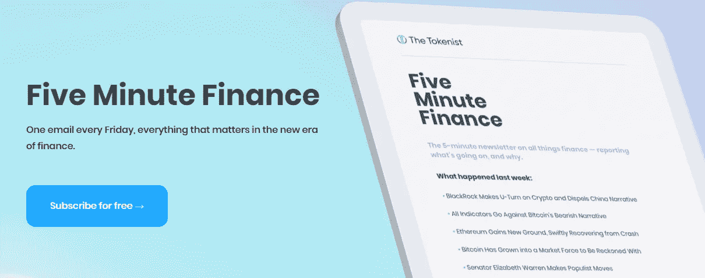

# 五分钟财经:摄氏温度下降，经济学家认为经济衰退，BTC 接近底部？

> 原文：<https://medium.com/coinmonks/five-minute-finance-celsius-meltdown-economists-see-recession-btc-bottom-close-95ff1b013a1e?source=collection_archive---------17----------------------->

# 5 分钟的金融时事通讯——解释发生了什么，为什么。

# 让我们看看这周发生了什么:

*   美联储积极加息 75 个基点:衰退？
*   技术数据显示，BTC 底部即将到来
*   最新的 DeFi 熔化解释
*   似曾相识:创的 USDD 稳定币不稳定了
*   比尔·盖茨，前技术梦想家，关于加密和非功能性加密技术

# 耶伦表示衰退“不太可能”，但经济学家不同意

*   68%的经济学家认为美国将在 2023 年进入衰退:英国《金融时报》调查 **(** [**链接**](https://tokenist.com/68-of-economists-believe-us-will-enter-a-recession-by-2023-ft-survey/) **)**
*   随着 0.75%的加息似乎很明显，贝莱德计划让市场进一步下跌 **(** [**链接**](https://tokenist.com/blackrock-plans-for-markets-to-dip-more-as-0-75-rate-hike-seems-evident/) **)**

# 跟上抑制通货膨胀的步伐

必须通过大幅提高利率来应对严重的通货膨胀。这是美联储本周三做出的决定，没有人感到意外。在继续努力取消其疯狂印钞的过程中，美联储将利率上调了 0.75%，这是自 1994 年以来的最高增幅。

然而，通货膨胀率和 1981 年一样高，而不是 1994 年。出于这个原因，美联储的目标是坚持进一步加息:到 2022 年底达到 3.4%，到 2023 年达到 3.8%。与过去两年寻求廉价资本的许多公司享受的接近零的利率相比，或者与抵押贷款买房的新业主相比，这一利率似乎很高。

然而，美联储的目标利率与之前利用利率对抗通胀的尝试并不一致:

在 1980 年，需要 19%的通货膨胀率(绿色)才能战胜 14%的通货膨胀率(红色)。同样，在 1990 年，需要 8.5%的利率才能降低 6%的通胀率。图片来源:[*fred.stlouisfed.org*](https://fred.stlouisfed.org/graph/?g=1ED0)

这只是为什么这么多人相信衰退即将来临的部分原因。我们正目睹经济活动减少、招聘冻结和裁员，以及支出和借贷减少。

在这场混乱中，财政部长耶伦继续用奇怪的声明令人惊讶。不到两周前，她对 NYT 说“没有迹象表明衰退正在酝酿中”。

本·伯南克在 2007 年 3 月说过类似的话:

我们都记得结果如何。

根据英国《金融时报》的一项调查，68%的经济学家现在认为衰退即将到来，从 2023 年开始。从好的方面来看，衰退是扑灭通胀火焰的一种方式，即所谓的硬着陆。

毕竟，如果等式中需求方的经济活动减少，供应价格就会因为过剩而下降。问题是，这导致了另一波财富输血。例如，加息会推高抵押贷款利率，这可能导致数百万人被抵押贷款市场挡在门外。

加息将使住房市场需求减少 36%。图片来源:

[@ EricFinnigan](https://twitter.com/EricFinnigan/status/1536410487654535168)

同样，人们为了生存而负债，仅 1.1 万亿美元的信用卡债务就证明了这一点。

但请记住——耶伦表示，没有任何迹象表明这里出现了衰退。

# 比特币的底部——十年来最紧迫的问题

*   随着比特币跌破 23000 美元 **(** [**链接**](https://tokenist.com/microstrategy-mstr-down-24-as-bitcoin-dips-below-23000/) **)**
*   萨尔瓦多 FM 称 BTC 损失 4000 万美元不真实，因为他们没有卖出任何硬币 **(** [**链接**](https://tokenist.com/el-salvadors-fm-says-40m-btc-loss-not-real-as-they-havent-sold-any-coins/) **)**

# 比特币超卖，但恐惧的力量是不可预测的

众所周知，微策略商业情报公司(MicroStrategy business intelligence)的负责人迈克尔·塞勒(Michael Saylor)用诗意的语言描绘了比特币的某种图景。他的公司是少数几个将所有赌注都押在比特币上的公司之一，甚至用 BTC 作为债务抵押，购买更多的 BTC。

总体而言，Saylor 的公司积累了 129218 个比特币，平均价格约为 3 万美元，此外，三个月前还获得了 BTC 支持的 2.05 亿美元贷款。所有这些都意味着，在 40 亿美元的比特币暴跌中，MicroStrategy 现在损失了 10 亿美元，因为比特币徘徊在 2 万美元左右。

面对这些强劲的逆风，塞勒一如既往地坚定不移。他对追加保证金的担忧不以为然，并保证 MicroStrategy 在 BTC 支持的贷款上超额抵押了 10 倍，因此在不得不采取更多债务之前，价格必须低于 3500 美元。本周，他进一步强调了比特币的基本面是如何保持不变的:

“比特币是唯一的数字稀缺性，由世界上最安全的计算机网络支持，满足了每个人对长期价值储存的基本需求。”

当与美联储对货币供应的操纵形成对比时，人们肯定会看到这种说法的真实性。美联储对货币供应的操纵经常扰乱市场信号。然而，很容易看出比特币最近的表现是如何吸引负面媒体的，因为 BTC 可能正接近历史上最糟糕的季度表现。

*2022 年，Q2 比特币价格将下跌 50%。图片来源:*

*尽管如此，在 2 万至 2.1 万美元的价格区间，不到一半的 BTC 持有者仍在盈利范围内。*

*对相对强弱指数(RSI)的分析清楚地表明，比特币和以太坊一样被超卖。这意味着比特币正在接近底部。但是——比特币目前的价格走势很大程度上是受目前宏观经济因素的影响——而不是基本面或与比特币本身相关的技术数据。*

*剩下的就是意愿和视角的问题了。比特币诞生于美国上一次经济衰退。那么，BTC 在第一次衰退中会有什么表现呢？我们可能很快就会知道了。*

*[**享受 5MF？点击转发给三个朋友。**](mailto:info@tokenist.com?subject=Check+this+out+&body=I%E2%80%99ve+been+reading+Five+Minute+Finance,+and+I+know+you%E2%80%99d+enjoy+it+too.+It%E2%80%99s+a+weekly+email+that+covers+the+most+important+trends+in+finance.+I+learn+something+new+every+time+I+read+it!+Check+it+out+here:+https://tokenist.com/newsletter/?utm_source=email_gr_btn)*

**

# *熊市撕裂了相互杠杆化的赌注*

*   *三箭资本的资不抵债传闻引发了更多类似地球崩溃的恐惧 **(** [**链接**](https://tokenist.com/three-arrows-capitals-insolvency-rumors-sparks-more-terra-like-meltdown-fears/) **)***
*   *利多以 6%的折扣买入乙醚(StETH)交易，因 ETH 较 ATH 下跌 77%**(**[**链接**](https://tokenist.com/lidos-staked-ether-steth-trading-at-6-discount-as-eth-down-77-from-ath/) **)***

# *一厢情愿，贪婪，还是无能？*

*当前的市场崩溃将在未来几年被参考。尽管美联储的货币政策是主要导火索，但它造成的市场压力暴露了 DeFi 的漏洞。自 2009 年比特币推出以来的十年里，加密市场相当简单(与今天相比)。有加密货币、投机和现货交易。*

*在新的十年开始之际，这转移到以太坊提供借贷的 dApps 衍生产品市场的诞生。新的 DeFi 生态系统的核心是*赌注*——这一过程(表面上)相当于将钱存入高收益储蓄账户，但智能合同将这些资金借给其他借款人，而不是银行。*

*当然，DeFi staking 提供了比传统银行高得多的利率，0.06%比 8%的 APY 和以上。这既是一种激励，也是一个陷阱。dApps 开始相互竞争，提供不可持续的高收益，以实现过快增长。Terra 在崩溃前提供了 19.5%的收益率。*

*类似地，在暂停所有账户交易以保留其“提款义务”之前，Celsius 提供了两位数的收益率。发生了什么事？*

*事实证明,《大空头》的迈克尔·伯里去年在推特上写道:*

**“当密码从数万亿下跌，或迷因股票从数百亿下跌，主流损失将接近国家的规模(……)。如果你不知道加密的作用有多大，那你就对加密一无所知"**

*他一年前在那里所说的话是指相互依赖的赌注。为了让贷款平台产生有吸引力的收益率，它们必须从某个地方支付这些收益率。Celsius [依靠 stETH](https://tokenist.com/celsius-withdrawals-stay-blocked-for-5th-day-as-clients-fear-losing-all-funds)来完成这项工作。*

**

*Celsius Network 是 stETH 最大的利益相关方。图片来源: [*推特*](https://twitter.com/home)*

*最重要的是，DeFi 贷款平台相互持股。从摄氏温度到地球温度，反之亦然。随后，Terra 在维持其算法稳定性方面遇到了麻烦。不再有来自 Terra 的收获。440 亿美元的市场余波+大型科技股抛售对 crypto 的影响导致以太坊本身受到抑制，ETH 较其 ATH 下跌 77%。对 stETH gains 说再见吧，因为它甚至[失去了 6%的以太坊挂钩](https://tokenist.com/lidos-staked-ether-steth-trading-at-6-discount-as-eth-down-77-from-ath/)。*

*加密对冲基金 3AC 依靠 Terra 和 stETH 获得投资者回报，现在面临 4 亿美元的亏损。随着基金[未能满足贷款人的保证金要求](https://www.ft.com/content/126d8b02-f06a-4fd9-a57b-9f4ceab3de71)，这种可能性似乎越来越大。反过来，这代表了另一种抑制性抛售力量。简而言之，DeFi 平台依赖高收益来刺激增长，但未能采取措施在市场极度低迷的情况下支撑其储备。*

*鉴于这样的环境，一些人问是否很多加密围绕着[庞氏骗局](https://tokenist.com/at-what-point-can-cryptocurrencies-be-considered-ponzi-schemes/)。说到底，这些平台不就是靠无止境的用户增长，让金字塔的底层不断膨胀吗？这将是从混乱中得出的错误结论。*

*我们正在见证 DeFi 成长的烦恼(它们是*非常*痛苦的)。DeFi 行动迅速，打破常规——以流动性提供者为代价，利用贪婪。*

*正如我们所知，这无疑是 DeFi *的终结。但这并不意味着 DeFi 不能以更现实的方式反弹，这种方式仍然提供比 TradFi 更好的机会。**

**

# *创的稳定问题*

*   *创道储备动用$2B 在市场崩溃时保护稳定的货币 **(** [**链接**](https://tokenist.com/tron-dao-reserve-deploys-2b-to-protect-stablecoin-as-market-crashes/) **)***
*   *TRON 的 USDD 币仍然稳定在 1 美元以下，尽管$2B 注资 **(** [**链接**](https://cryptobriefing.com/trons-usdd-stablecoin-still-below-1-despite-2b-cash-injection/) **)***

# *似曾相识:TRX 代替了露娜，USDD 代替了 UST*

*会不会是？Terra 的 UST 崩溃后这么快又有一个算法稳定失败了？如果你上个月一直在关注 5MF，你一点也不会感到惊讶。类似于 Terra 的成立，TRON 网络作为以太坊的智能合约区块链替代品推出。*

*就像 Terra 一样，TRON 推出了自己的算法稳定币 USDD，被自己的 TRX 令牌过度限制。TRON 创始人孙正义[说](https://tokenist.com/tron-dao-reserve-deploys-2b-to-protect-stablecoin-as-market-crashes/):*

**“USDD 不一样。一方面，USDD 的稳定是由它与 TRX 挂钩来支撑的，这吸收了短期波动；另一方面，来自创道储备的高流动性十亿美元储备资产将迅速稳定 USDD 的价格，抵御全行业的极端波动。”**

*你猜对了，一个几乎相同的场景展开了。极端的市场压力推翻了稳定的货币联系汇率。创试图用 20 多亿美元的外汇储备来捍卫与 USDD 的联系汇率，但没有成功。虽然稳定币没有像泰拉的 UST 币那样崩溃，但它的稳定性并没有激发人们对未来使用的信心。*

**

**USDD 的稳定已经动摇，引起了关注和干预的热潮。图片信用:* [*交易视图*](https://www.tradingview.com/) *。**

*目前，投资者坚持传统的挂钩稳定债券，由 100%可赎回现金储备支持。它们可能由公司控制，这削弱了 DeFi 中的“De ”,但它们继续激发信心。*

*由 Circle 和比特币基地管理的 USDC 是最受监管的稳定的银行之一，有 540 亿美元的流通量。有趣的是，这比整个 DeFi 市场 387 亿美元的 TVL 要高得多。*

*昨天，为了进一步巩固其稳定的跟踪记录，Circle 宣布为欧元区发行欧元硬币(EUROC)。欧元也将被完全保留，但使用欧元而不是美元。Silvergate 银行将是主要的托管人，也是 FDIC 担保的 Saylor 银行用于 Microstrategy 的 2.05 亿美元 BTC 支持的贷款。*

*看起来，银行会在一段时间内继续使用数字资产。也许，下一轮的算法稳定会吸取教训。与此同时，投资者更喜欢确定性，而不是不稳定的创新。*

**

# *比尔·盖茨提出了加密和非加密技术*

*   *比尔·盖茨说加密和非功能性加密是“100%基于大傻瓜理论” **(** [**链接**](https://www.cnbc.com/2022/06/15/bill-gates-says-crypto-and-nfts-are-based-on-greater-fool-theory.html) **)***

# *Internet Explorer 的创造者没有踏上互联网的下一个进化阶梯*

*比尔·盖茨被广泛认为是一个有远见的人。1995 年大卫·莱特曼秀上有一段盖茨的经典 YouTube 视频。*

*莱特曼向盖茨询问互联网，盖茨将其描述为“下一个大事件”，解释了它(当时)的一些功能。*

*莱特曼说他听说一场棒球比赛可以在电脑上转播。听到这样的消息，他的反应是，“‘收音机’有印象吗”？*

*当莱特曼继续用许多其他方式取笑互联网和计算机时，人群大笑起来。*

*盖茨看到并理解了当时大多数人甚至无法想象的事情。*

*谈到加密和 NFTs，盖茨现在说“我不做多或做空这些东西”。本周二在 TechCrunch 的演讲中，比尔·盖茨进一步透露，cryptos 和 NFT 都是“大傻瓜理论”的基础。*

*是的，比尔，我们明白了。NFTs 有点忘乎所以了。我们都能看到这一点。*

*但在一个日益数字化的世界里，没有任何放缓的迹象，非专利技术可以提供与数字稀缺性和独特性相关的所有权。这样的功能目前还不可用。*

*随着 Meta(脸书)等科技巨头花费数十亿美元建造元宇宙，我们的数字世界即将发生变化。盖茨帮助创造的同一个世界。*

*很难想象这个数字世界在不提供数字资产所能提供的好处的情况下会如何发展。*

# *本周推特*

> *今天标准普尔 500 超过 90%的股票下跌。*
> 
> *这是过去 7 天里的第 5 次了。*
> 
> *自 1928 年以来，没有任何先例。这是历史上最具压倒性的销售展示。*

*[@ jasongoepfert](https://twitter.com/jasongoepfert/status/1537530936786567169)*

> *最大的加密风险投资公司之一:*
> 
> *三箭资本。*
> 
> *他们已经资不抵债了。*
> 
> *潜在的 180 亿美元的管理，这可能是灾难性的加密。*
> 
> *这是正在发生的事情和可能的后果的时间表:*

*[**@ thedefedge**](https://twitter.com/thedefiedge/status/1537465349976694786)*

**

> *当前的 [#BTC](https://twitter.com/hashtag/BTC?src=hashtag_click) 卖方交易量已经超过了 2018 年熊市卖方交易量在 200 周 MA 的水平*

*[**@rektcapital**](https://twitter.com/VivekGRamaswamy/status/1537230709646954498)*

> *如果人们知道通货膨胀的正确定义，他们就会明白它的由来。政府将通货膨胀重新定义为“价格上涨”，而不是最初定义的“货币供应的扩张”，这样公众就不会意识到是政府制造了通货膨胀。*

*[**@PeterSchiff**](https://twitter.com/PeterSchiff/status/1536879484510543874)*

**

> *这次房产泡沫比 2008 年大吗？是的。*
> 
> *2008 年:价格比平均工人收入高 8.0 倍*
> 
> *2022 年:增长 8.5 倍*
> 
> *价格/收益告诉你你的房产市场被高估/低估了多少。这个例子使用了 Phoenix。*
> 
> *系好安全带。买入机会来了。*
> 
> *#房屋倒塌*

*[**@ nicgger Li 1**](https://twitter.com/nickgerli1/status/1535286075035369474)*

# *加入五分钟金融时事通讯。*

**

*[Sign up here — it’s free.](https://tokenist.com/newsletter/?utm_source=getresponse&utm_medium=email&utm_campaign=thetokenist&utm_content=%E2%9C%8B%20FMF%3A%20BoA%20Readying%20for%20BTC%2C%20Pot%20Goes%20Federal%2C%20More%20Inflation)*

**

*[t.me/thetokenist](http://t.me/thetokenist?utm_source=getresponse&utm_medium=email&utm_campaign=thetokenist&utm_content=%E2%9C%8B%20FMF%3A%20BoA%20Readying%20for%20BTC%2C%20Pot%20Goes%20Federal%2C%20More%20Inflation)*

**

*[twitter.com/thetokenist](https://twitter.com/thetokenist)*

> *加入 Coinmonks [电报频道](https://t.me/coincodecap)和 [Youtube 频道](https://www.youtube.com/c/coinmonks/videos)了解加密交易和投资*

# *另外，阅读*

*   *[加密副本交易平台](/coinmonks/top-10-crypto-copy-trading-platforms-for-beginners-d0c37c7d698c) | [五大 BlockFi 替代方案](https://coincodecap.com/blockfi-alternatives)*
*   *[CoinLoan 审核](https://coincodecap.com/coinloan-review)|[Crypto.com 审核](/coinmonks/crypto-com-review-f143dca1f74c) | [火币保证金交易](/coinmonks/huobi-margin-trading-b3b06cdc1519)*
*   *[Bybit vs 币安](https://coincodecap.com/bybit-binance-moonxbt)|[stealth x 回顾](/coinmonks/stealthex-review-396c67309988) | [Probit 回顾](https://coincodecap.com/probit-review)*
*   *[顶级付费加密货币和区块链课程](https://coincodecap.com/blockchain-courses)*
*   *[CBET 评论](https://coincodecap.com/cbet-casino-review) | [库科恩 vs 比特币基地](https://coincodecap.com/kucoin-vs-coinbase) | [拜比特 vs 比特币基地](https://coincodecap.com/bybit-vs-coinbase)*