# 五分钟金融:加密的雷曼时刻，CPI 在衡量通货膨胀时遗漏了什么，等等

> 原文：<https://medium.com/coinmonks/five-minute-finance-cryptos-lehman-moment-what-cpi-misses-in-measuring-inflation-more-d9d5a814e35d?source=collection_archive---------15----------------------->

# 5 分钟的金融时事通讯——解释发生了什么，为什么。

# 让我们看看这周发生了什么:

*   7 天内，超过 3400 亿美元从加密市值中抹去
*   8.3%的通胀率，但 CPI 衡量通胀的准确度有多高？
*   UST 和卢娜:加密的雷曼时刻
*   EA 与国际足联分手，股价下跌 18%
*   比特币基地因“恶意”做市受到审查

# 底部下面有底部吗？

*   MicroStrategy 年初至今下跌 46%，如果 BTC 跌破 21k 美元 **(** [**链接**](https://tokenist.com/microstrategy-down-46-ytd-will-get-margin-called-if-btc-falls-below-21k/) **)** ，将被追加保证金
*   股票暴跌之后，股市市值下降了 1440 亿美元 **(** [**链接**](https://tokenist.com/crypto-market-cap-down-144b-after-stocks-plunge/) **)**

# 解释了加密崩溃

自上周五以来，加密市场已经损失了大约 20%的价值。总计 3400 亿美元，比以太坊目前的市值(2500 亿美元)高出 35%。虽然每个人都会把 UST /卢娜的传奇作为原因，但也有其他因素在起作用。

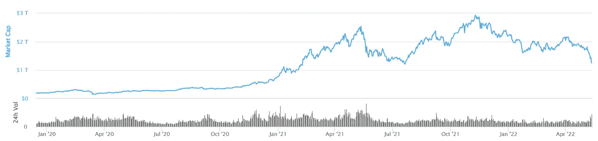

*1.2 万亿美元的总加密市值回到了自 2021 年 7 月以来的最高水平。图片来源:*[*coinmarketcap.com*](https://coinmarketcap.com/charts/)

crypto 漂浮在一个什么样的池子里才会发生如此严重的排水？

让我们继续这个类比(和我在一起)。想象一下，一个奥林匹克规模的美元池，其中漂浮着一个(小得多的)加密池。在过去的两年里，美元池被淹没到了巨大的比例，导致了极高的水位，即通货膨胀。因此，稀释的美元不断失去其购买力，导致人们认为一个单独的加密池会更稳定。

然而，世界上的一切都直接或间接地在美元池中浮动，包括加密，甚至中国的出口导向型经济。当美联储介入并开始抽干资金池以对抗通胀时，会发生什么？所有其他市场都开始与之齐平。我们现在看到的是全面排水。

毕竟，美元池的完全枯竭意味着当前世界经济秩序的终结。此外，其他法定货币将在美元之前灭亡，正如美元强势指数(DXY)的疯狂上涨所证明的那样。

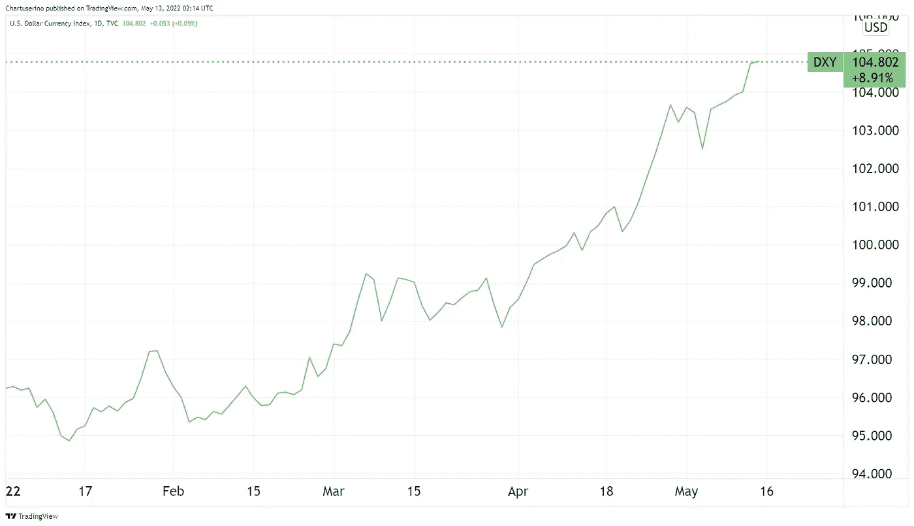

相对于欧元和日元等其他货币，DXY 处于 20 年高点。图像信用:交易视图。

对于许多进入加密池的投资者来说，他们觉得进入美元池作为一个不那么危险的容器更舒服。反过来，它们会向弱势手(短期持有者)发出信号，让他们也这么做，从而引发投资者跳出幼稚的加密池。这是否意味着，即使像迈克尔·塞勒这样的隐鲸也会因为销售压力而被冲走？他们会因为自己的销售压力而完全耗尽密码库吗？

不太可能。尽管 MicroStrategy 的首席财务官表示，如果比特币跌破其实现价格(低于 2.1 万美元)，他们的 BTC 支持贷款可能会被追加保证金，但 Saylor 后来声称，底部必须非常浅，低于每 BTC 3562 美元。随着冲洗的继续，强有力的手牢牢抓住，收拾那些跳出去的人的烂摊子。

继续液体主题，比特币的液体供应变化转为负值。这不仅预示着历史背景下的牛市转折，而且与之前相比，盈利能力的损失并没有那么严重。

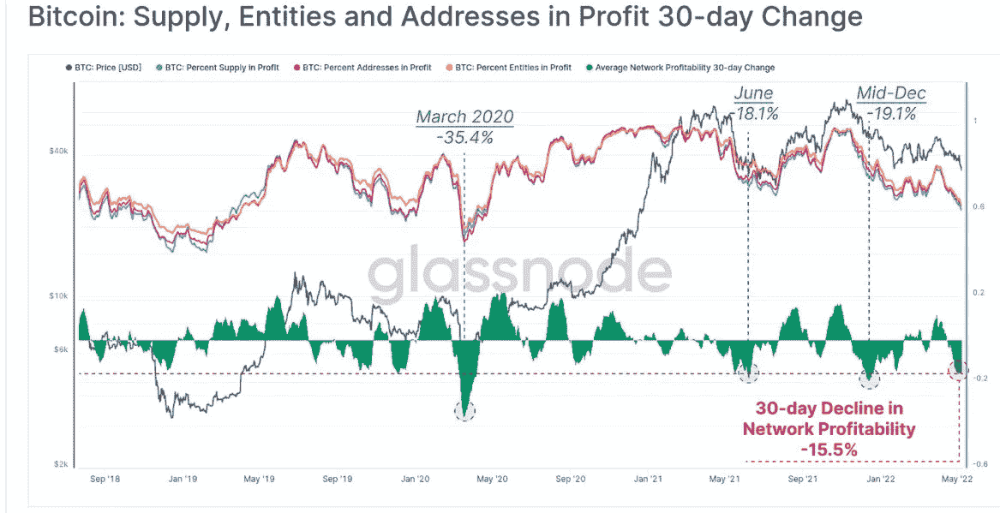

*图片来源:glass node via*[*Twitter*](https://twitter.com/Bullfighterr)

教训？如果你过早地跳进更大的池子里，你会被淋湿的。

[**享受 5MF？点击转发给三个朋友。**](mailto:info@tokenist.com?subject=Check+this+out+&body=I%E2%80%99ve+been+reading+Five+Minute+Finance,+and+I+know+you%E2%80%99d+enjoy+it+too.+It%E2%80%99s+a+weekly+email+that+covers+the+most+important+trends+in+finance.+I+learn+something+new+every+time+I+read+it!+Check+it+out+here:+https://tokenist.com/newsletter/?utm_source=email_gr_btn)

# CPI 是衡量通货膨胀的准确指标吗？

*   美国年通胀率降至 8.3%，但低于预期 **(** [**链接**](https://tokenist.com/us-annual-inflation-lowers-to-8-3-but-falls-short-of-expectations/) **)**
*   美国期货因通胀担忧下跌；美元收益:市场回绕 **(** [**链接**](https://finance.yahoo.com/news/stocks-pressured-risks-elevated-inflation-222502067.html) **)**

# 用不同的标准衡量不同的时期

衡量美元购买力损失的最常见方法是通过消费者价格指数(CPI ),该指数是由调查人员到各家各户记录他们的支出来计算的。一个更广泛的指标是个人消费支出(PCE)，它考虑了广泛的支出，通常由美联储使用。

4 月份，CPI 固定在 8.3%，而 PCE 达到了 6.6%。CPI 7 个月来首次下降，但考虑到 CPI 在 3 月份达到 8.5%的峰值，降幅并不大。在得出任何结论之前，我们首先要问这个通货膨胀数字是如何计算出来的。

*根据 CPI，自美联储去年取消令人尴尬的“暂时”一词以来，通货膨胀率翻了一倍多。图片来源:*【TradingEconomics.com】

*2021 年底，美国统计局对如何计算通胀进行了[政策转变](https://tokenist.com/inflation-rate-weighting-shakeup-announced-after-39-year-high-reached/)，以使其更加准确。接下来的问题是，如果指标发生了变化，是否可以追溯应用？如果答案是否定的，那么谈论通货膨胀达到 40 年来的最高点，一个用不同的标准计算的时期，有意义吗？*

*这些统计技巧(计算更新)并不新鲜。2011 年 4 月，美国消费者新闻与商业频道报告称，用旧的方法来衡量，通货膨胀率实际上接近 10%。也就是说，目前的通胀率很可能已经达到了两位数。市场对最新通胀报告的反应似乎就是如此。*

*报告发布后，标准普尔 500、纳斯达克 100 指数、道琼斯工业平均指数和摩根士丹利资本国际世界指数均下跌。投资者预计美联储将进一步加息，因为小幅加息不太可能持续抑制通胀。从历史的角度来看，情况肯定不是这样。*

*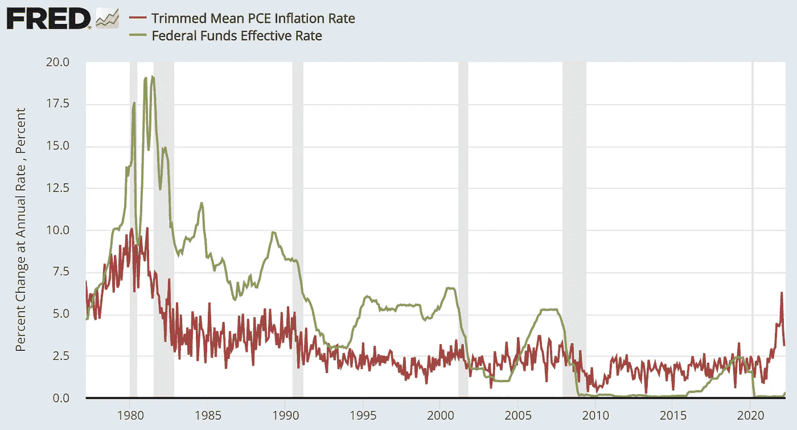*

**从历史上看，为了抑制通货膨胀(红线)，利率(绿线)必须远高于 PCE。图片来源:*[*fred.stlouisfed.org*](https://fred.stlouisfed.org/)*

*不管通货膨胀实际上在哪里，这里有一些好消息。如果我们很快就会看到衰退，那将是政府引发的衰退。当谈到衰退教科书时，这是最好的一种——它通常表明美联储将引导我们走向软着陆。让我们希望是这样。*

**

# *UST 揭露算法稳定性的主要弱点*

*   *世界上最稳定的货币(USDT)已经跌破了 1 美元的汇率*
*   *卢娜在权道赞同拯救 UST 的提议后跌破 1 美元 **(** [**链接**](https://www.cnbc.com/2022/05/12/tether-usdt-stablecoin-drops-below-1-peg.html) **)***

# *并非所有稳定的硬币都是生而平等的*

*正如人们会通过长时间运行最密集的应用程序来对新计算机进行压力测试一样，加密崩溃测试虚拟生态系统。*

*随着比特币基础变得脆弱，有两家公司未能经受住审查。有趣的是，他们都是稳定的同事——USDT 和 UST——一个是资产支持的，另一个是算法支持的。第一个是泰瑟 USDT，是最大和最古老的稳定币，由 84%的“现金和其他等价物”支持，比 2019 年的 [74%](https://www.coindesk.com/markets/2019/04/30/tether-lawyer-admits-stablecoin-now-74-backed-by-cash-and-equivalents/) 有所改善。如果这听起来很可疑，那是因为确实如此。*

*在恐慌性抛售市场导致银行挤兑的情况下，这些等价物是否具有足够的流动性，符合 1:1 准备金支持的条件，这可能很快就会被稳定货币法规草案所要求？USDT 失去 1 美元兑 0.95 美元的汇率机制，表明情况并非如此。*

*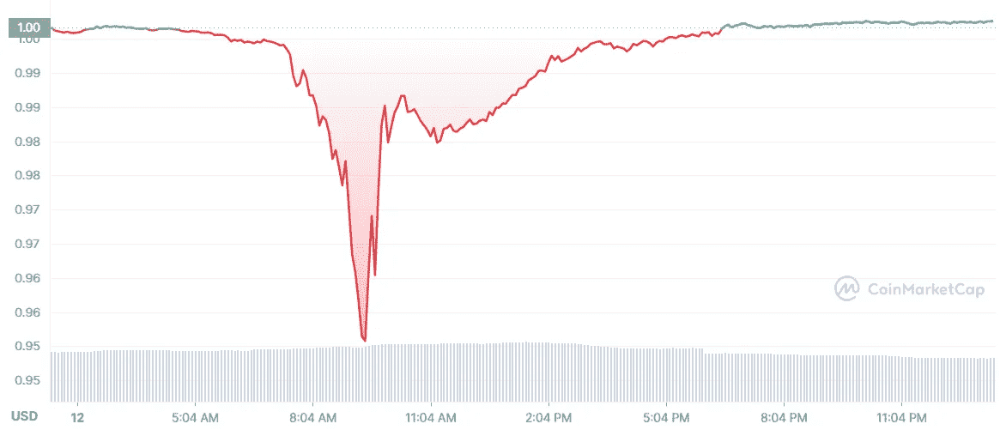*

*在抛售高峰期间，泰瑟·USDT 稳定了股价。图片来源:【CoinMarketCap.com】*

**然而，暂时的钉住汇率制的丧失表明 USDT 得到了支持，但立即收回储备需要时间。对于 Terra 的 UST/露娜生态系统来说就不一样了，它在本周遭受了彻底的崩溃。**

**UST——一种算法稳定币——不再作为稳定币发挥作用，因为它已经失去了与美元的挂钩，达到了令人吃惊的 0.17 美元。同样，Terra 的 UST stablecoin 从上周的 186 亿美元市值跌至不到 20 亿美元。**

**目前，Luna Foundation Guard (LFG)正试图通过向场外交易公司发放 BTC 贷款(价值 7.5 亿美元)来积极捍卫其与 UST 的联系汇率。**

**这还没有导致复苏，自上周以来，Terra 生态系统的原生密码 LUNA 的价值下跌了-99.98%。4 月初，LUNA 的市值超过了 410 亿美元。截至 5 月 13 日，这个数字还不到 2.45 亿美元。**

**Terra 的验证器[现在已经多次停止其区块链](https://www.coindesk.com/business/2022/05/13/terra-validators-halt-blockchain-for-second-time-to-plot-next-steps/)来计划下一步。**

**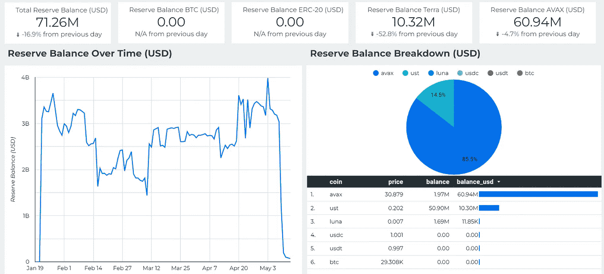**

***更糟糕的是，世界上最大的交易所，币安，停止了 UST 和卢娜的交易。图片来源:*【LFG.org】**

***有人猜测，对冲基金卷入了继以太坊(Ethereum)之后曾经是第二大智能合约生态系统的死亡螺旋。Gemini exchange [否认了这些暗示其向贝莱德和 Citadel Securities 提供 10 万 BTC 的指控。](https://twitter.com/Gemini/status/1524428615844339718)***

***然而，即使邪恶的力量正在酝酿，他们也是自然的经济代理人。因此，这里最重要的洞见是，像算法稳定圈这样的猎物还没有进化出足够的防御能力。***

***最后，这不是 Terraform Labs 第一次失败的 stablecoin 竞技表演。据报道，创始人 Do Kwon 推出了之前的算法 stable coin[Basis Cash(BAC)](https://www.coindesk.com/tech/2022/05/11/usts-do-kwon-was-behind-earlier-failed-stablecoin-ex-terra-colleagues-say/)。它在 2021 年初失败了，类似于 UST 现在的失败。***

******

# ***美国视频游戏行业整合***

*   ***艺电终止与国际足联的合作:股价下跌 18%年初至今 **(** [**链接**](https://tokenist.com/ea-discontinues-partnership-with-fifa-shares-down-18-ytd/) **)*****
*   ***EA 收入预测失误估计跟随战场翻牌 **(** [**链接**](https://www.bloomberg.com/news/articles/2022-05-10/ea-revenue-forecast-misses-estimates-following-battlefield-flop) **)*****

# ***艺电在巨大的失败中不断挣扎***

***40 年来，电子艺界(EA)一直是视频游戏行业的主流。近几十年来，该公司因吞并小工作室和破坏他们的创意产出而获得了负面声誉。去年，这家视频游戏巨头的净收入为 56.3 亿美元，是迄今为止最成功的财年。***

***然而，在其明星系列游戏《战地 2042》的拙劣发布之后，EA 的股票受到了负面情绪的影响，年初至今下跌了 18%。漏洞百出的混乱只是又一个过早发布的游戏，希望在发布后得到修补。因此，Q2 2022 年调整后的收入将在 12 亿至 15 亿美元之间，低于预测的 14.5 亿美元***

***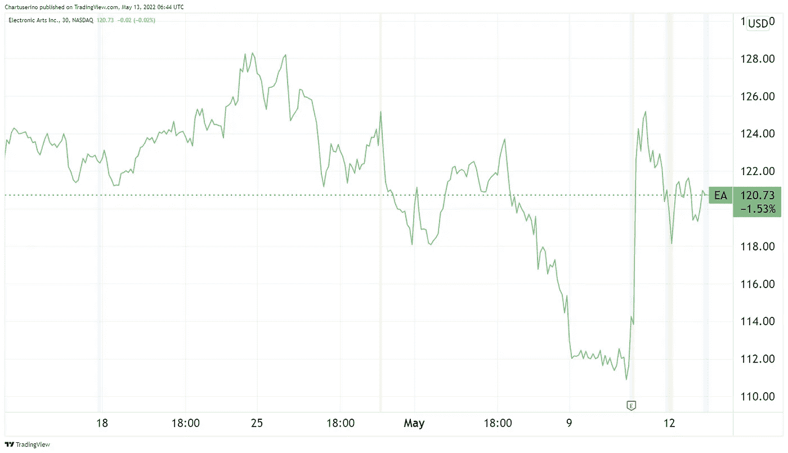***

***随着艺电去年从直播服务中获得了 71%的收入，艺电的投资者本周并没有陷入暂时的低迷。图片来源: [*交易查看*](https://www.tradingview.com/)***

**然而，像艺电这样财力雄厚的公司有许多项目正在进行中。尽管结束了与国际足联特许经营权的历史性和高度盈利的合作关系，但另一家射击游戏 Apex Legends 正在弥补战地的衰落，自 2019 年以来创造了 20 亿美元的收入，填补了 EA 的缺口。**

**与此同时，国际足联正转向区块链整合其未来的游戏项目，暗示其与阿尔格兰德的合作关系。**

**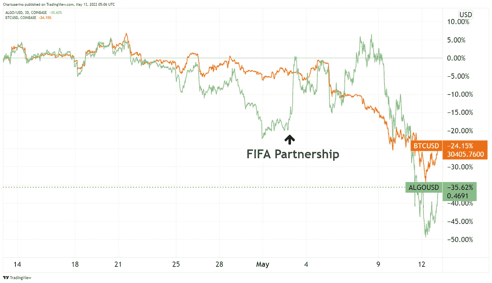**

***ALGO 对宣布与国际足联合作的价格反应。图片信用:* [*交易视图*](https://www.tradingview.com/)**

**通过成为国际足联(FIFA)这样一个享有盛誉的组织的官方区块链平台，ALGO 顶住了熊市，但很快在市场低迷时期加入了比特币的行列。**

****

# **稳定账户和交易所破产方案**

*   **杰克·多西称比特币基地为“赌场”:自 IPO 以来，COIN 的市值下降了 850 亿美元 **(** [**链接**](https://tokenist.com/jack-dorsey-calls-coinbase-a-casino-coins-market-cap-down-85b-since-ipo/) **)****
*   **美国证券交易委员会主席加里·詹斯勒将矛头指向针对客户进行交易的加密交易所 **(** [**链接**](https://techcrunch.com/2022/05/11/sec-securities-and-exchange-commission-gary-gensler-takes-aim-crypto-exchanges/) **)****

# **USDC 稳定币起到了安全港的作用，但能持续多久呢？**

**USDC 是监管最严格、现金支持最稳定的城市之一。因此，在这场加密风暴中，人民币与美元的挂钩仍然稳固。事实上，由于需求增加，它甚至超过了 1:1 的值。**

**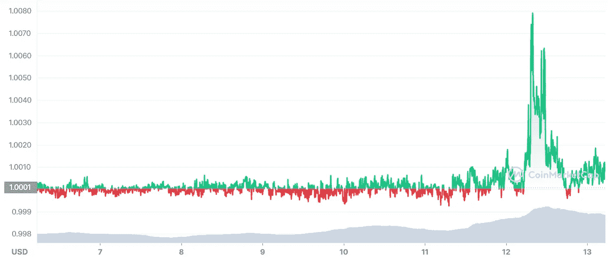**

**USDC 稳定的货币钉住汇率对卖方来说表现过度。图片来源: [*交易查看*](https://www.tradingview.com/)**

**比特币基地(硬币)和 Circle 都维持着 USDC 的健康，这就是为什么当美国最大的加密交易所持续财务出血时，这不是一个好消息。自上市以来，比特币基地的估值下降了 850 亿美元。更令人担忧的是，COIN 的市盈率(P/E)在一年内从 140 降到了 5 以下。**

**当然，由于比特币基地依赖加密货币谋生，其股票随着熊市下跌。然而，COIN 的跌幅甚至超过了 MicroStrategy (MSTR)，后者使用大量比特币储备进行债务杠杆化。**

**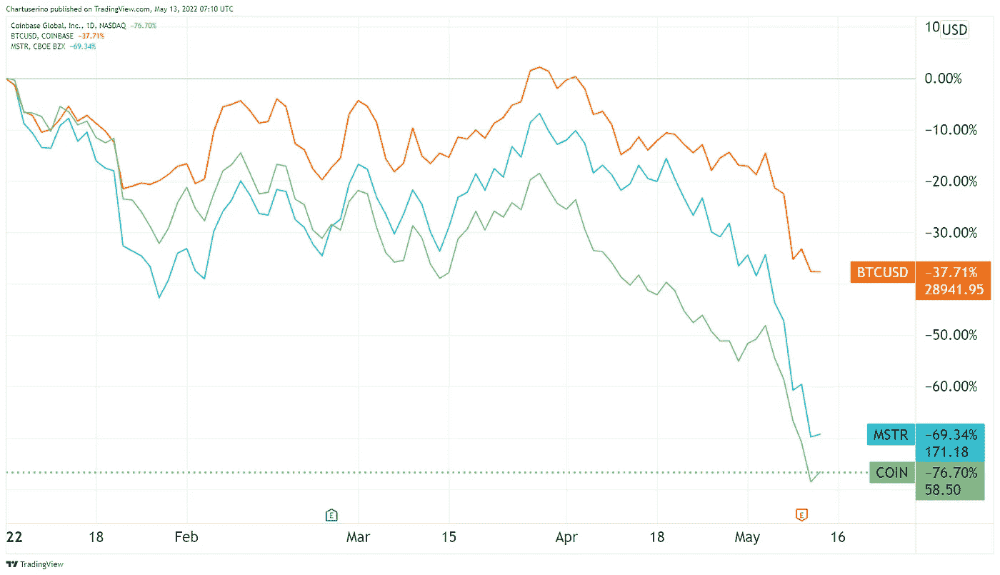**

***微策略(MSTR) vs 比特币(BTC) vs 比特币基地(币)。图片信用:* [*交易视图*](https://www.tradingview.com/)**

**如果出现最坏的情况，比特币基地破产会发生什么？由于新的证券交易委员会披露规则，现在很清楚，比特币基地的破产将导致密码资产的损失。这意味着，加密基金将面临破产程序，届时交易所将利用它们来拯救自己。**

**此外，旧的做市商做法已经悄悄进入了加密领域。美国证交会主席加里·詹斯勒(Gary Gensler)本周二明确表示，由于交易所固有的利益冲突，它们将接受更多审查。毕竟，如果他们从交易中获得费用，然后[抢先销售某些代币](https://tokenist.com/in-response-to-new-insider-trading-allegations-coinbase-to-change-listing-process/)，他们将对自己的客户做市。**

# **本周推特**

**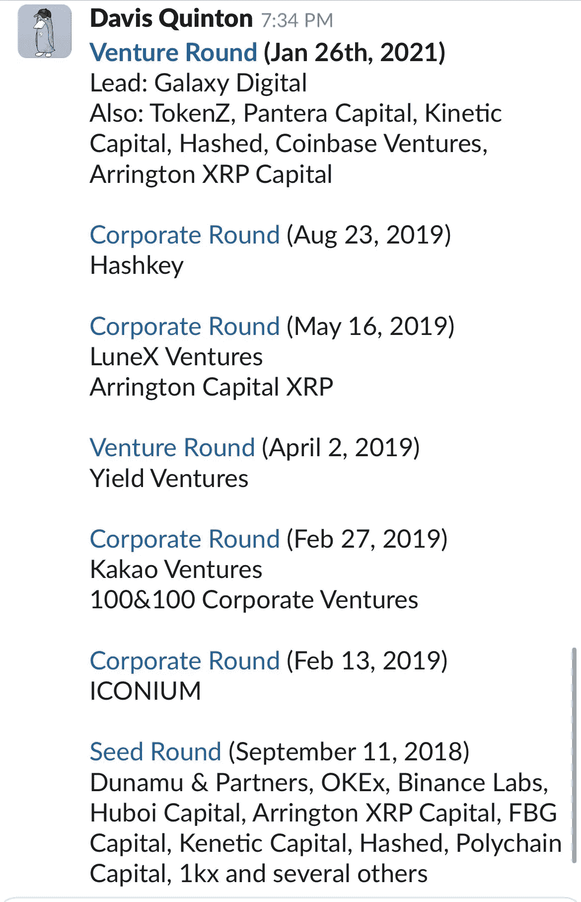**

> **露娜风投的支持者**

**[**@ FintechFrank**](https://twitter.com/fintechfrank/status/1524896697301848079/photo/1)**

> **Terra 区块链被正式停止在 7603700 的街区高度。**
> 
> **在严重的$LUNA 膨胀和攻击成本显著降低之后，Terra 验证者决定停止 Terra 链，以防止治理攻击。**

**[@ terra _ money](https://twitter.com/terra_money/status/1524785058296778752)**

**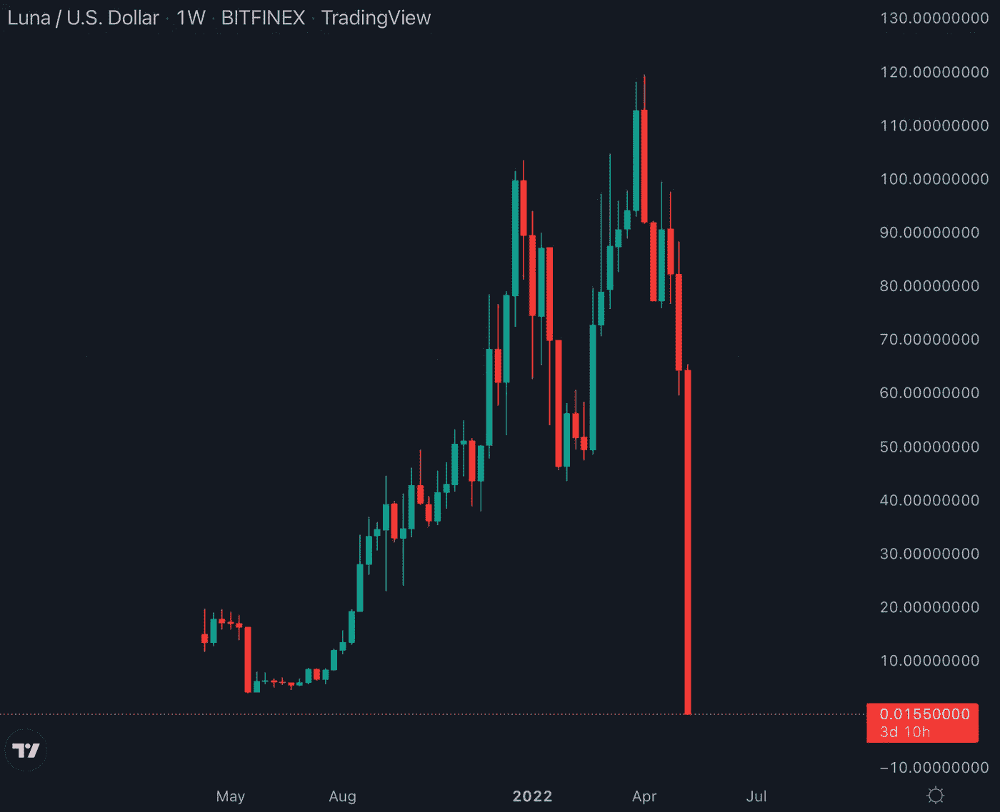**

> **如果你上周在 Luna 投资 10，000 美元，你现在有 2 美元**

**[**@ fintwit _ news**](https://twitter.com/fintwit_news/status/1524760790535921668)**

> **刚刚消息:🇩🇪德国将不对拥有一年后的#比特币和#以太坊销售征税。**

**[@ WatcherGuru](https://twitter.com/WatcherGuru/status/1524862906130743323)**

**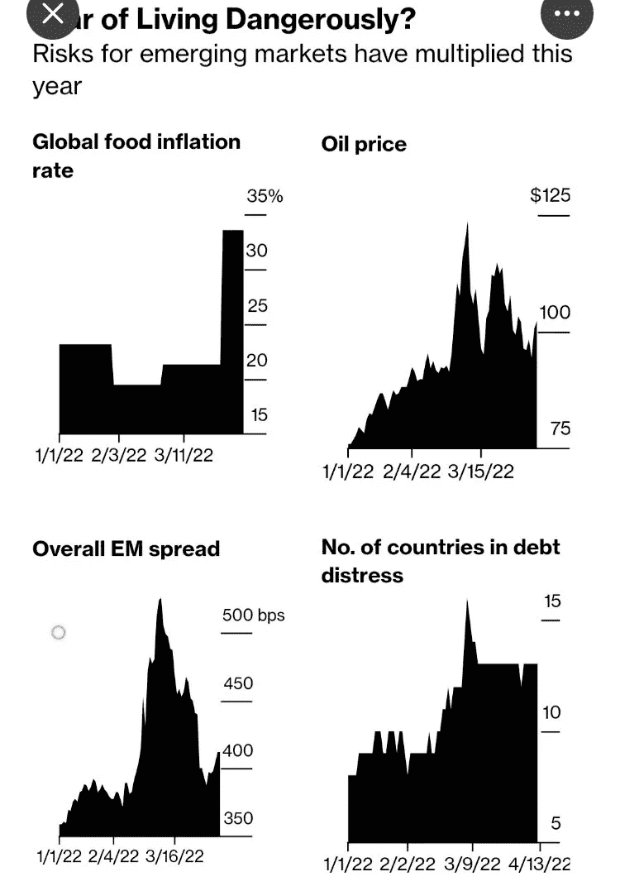**

> **美联储加息和疫情债务增加了低收入国家的风险。有些已经陷入了严重的问题。**

**[**@ heimbergecon**](https://twitter.com/heimbergecon/status/1524643264393093120)**

# **加入五分钟金融时事通讯。**

****

**[Sign up here — it’s free.](https://tokenist.com/newsletter/?utm_source=getresponse&utm_medium=email&utm_campaign=thetokenist&utm_content=%E2%9C%8B%20FMF%3A%20BoA%20Readying%20for%20BTC%2C%20Pot%20Goes%20Federal%2C%20More%20Inflation)**

****

**[t.me/thetokenist](http://t.me/thetokenist?utm_source=getresponse&utm_medium=email&utm_campaign=thetokenist&utm_content=%E2%9C%8B%20FMF%3A%20BoA%20Readying%20for%20BTC%2C%20Pot%20Goes%20Federal%2C%20More%20Inflation)**

****

**[twitter.com/thetokenist](https://twitter.com/thetokenist)**

> **加入 Coinmonks [电报频道](https://t.me/coincodecap)和 [Youtube 频道](https://www.youtube.com/c/coinmonks/videos)了解加密交易和投资**

# **另外，阅读**

*   **[如何在 Uniswap 上交换加密？](https://coincodecap.com/swap-crypto-on-uniswap) | [A-Ads 评论](https://coincodecap.com/a-ads-review)**
*   **[加密货币储蓄账户](/coinmonks/cryptocurrency-savings-accounts-be3bc0feffbf) | [YoBit 审核](/coinmonks/yobit-review-175464162c62)**
*   **[Botsfolio vs nap bots vs Mudrex](/coinmonks/botsfolio-vs-napbots-vs-mudrex-c81344970c02)|[gate . io 交流回顾](/coinmonks/gate-io-exchange-review-61bf87b7078f)**
*   **[CoinFLEX 评论](https://coincodecap.com/coinflex-review) | [AEX 交易所评论](https://coincodecap.com/aex-exchange-review) | [UPbit 评论](https://coincodecap.com/upbit-review)**
*   **[AscendEx 保证金交易](https://coincodecap.com/ascendex-margin-trading) | [Bitfinex 赌注](https://coincodecap.com/bitfinex-staking) | [bitFlyer 审核](https://coincodecap.com/bitflyer-review)**