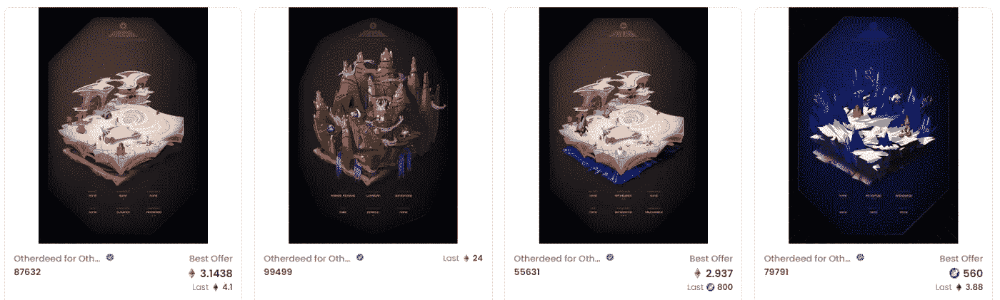
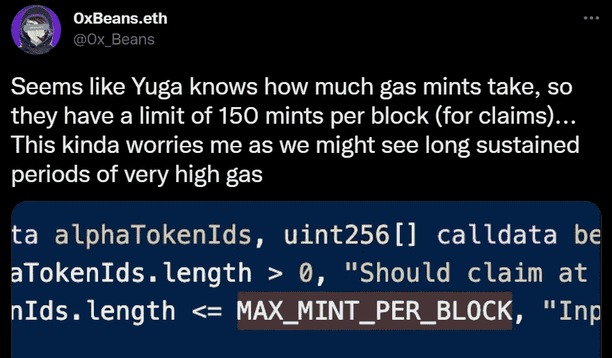
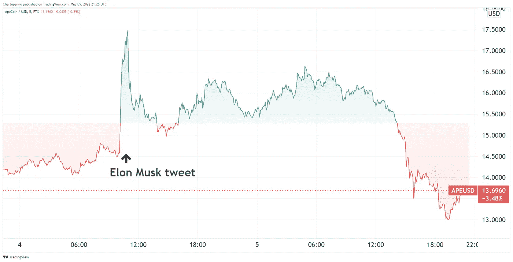
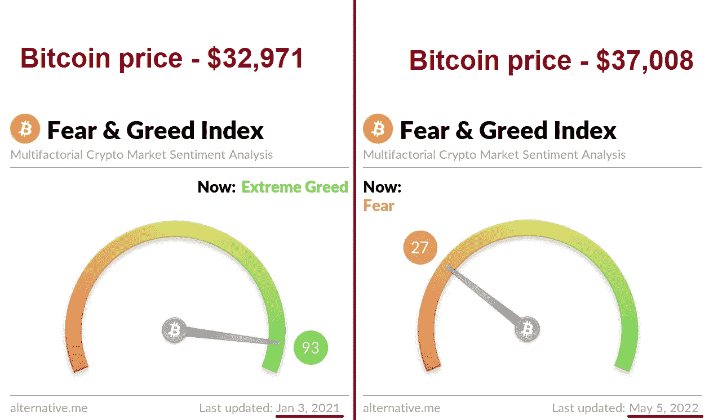
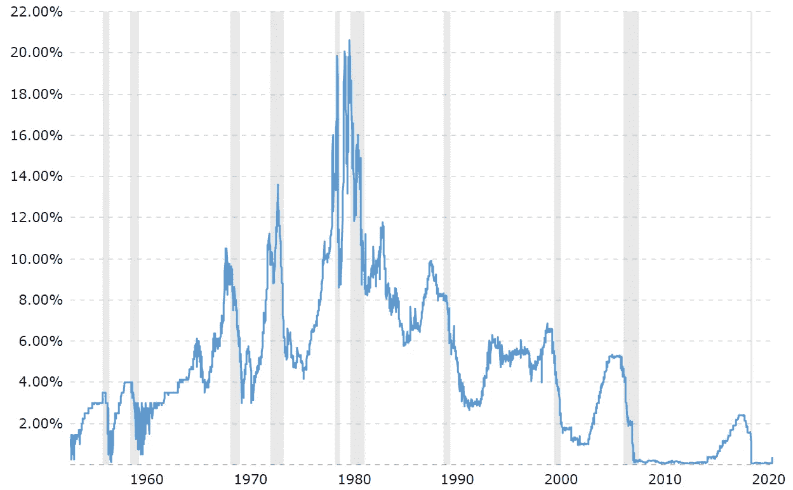
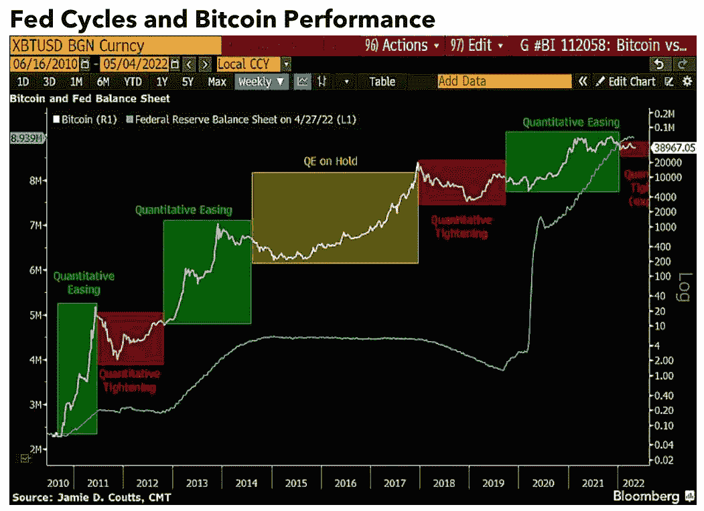
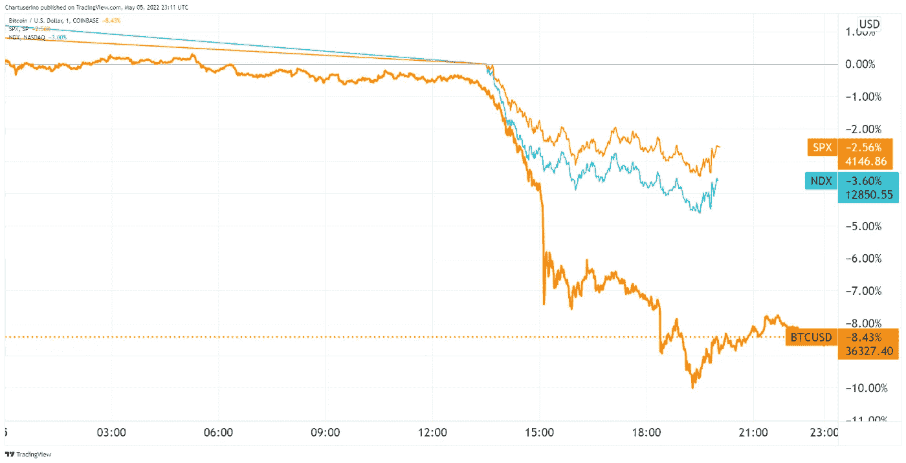
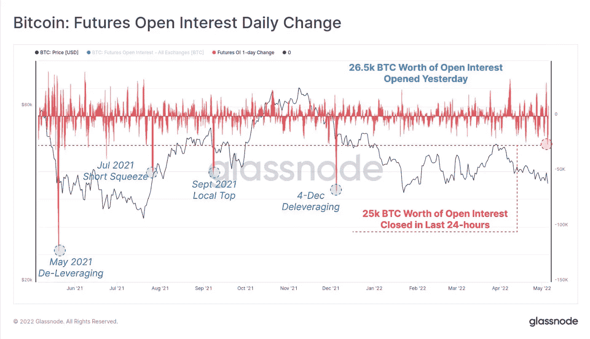
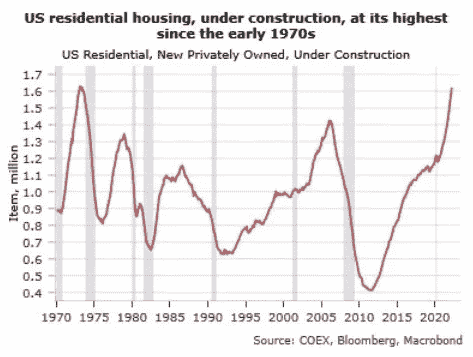

# 五分钟金融:解读周四的下跌，NFT 造币厂花费 1.65 亿美元的费用，BTC 债券适得其反

> 原文：<https://medium.com/coinmonks/five-minute-finance-deciphering-thursdays-dip-nft-mint-costs-165m-in-fees-btc-bonds-backfire-bba04e30f7be?source=collection_archive---------44----------------------->

# 5 分钟的金融时事通讯——解释发生了什么，为什么。

# 让我们看看这周发生了什么:

*   宇迦实验室 NFT 造币厂的天然气费用超过 1.65 亿美元
*   马斯克呼吁 NFTs，但仍导致硬币激增
*   萨尔瓦多火山比特币债券:为时过早？
*   美联储利率:不太好，也不可怕
*   周四的下跌:25，000 BTC 未平仓，已平仓

# 拙劣的编码和缩放:DeFi 采用的教训

*   宇迦实验室为 305 APE 铸造他方 NFTs:社区令牌点击 ATH **(** [**链接**](https://tokenist.com/yuga-labs-to-mint-otherside-nfts-for-305-ape-community-token-hits-ath/) **)**
*   ApeCoin 在与 NFT 造币厂 **(** [**链接**](https://tokenist.com/apecoin-to-integrate-with-polygon-after-causing-ethereums-largest-gas-spike-with-nft-mint/) **)** 引发以太坊史上最大毒气秒杀后与 Polygon 整合

# 人气=流量=买不起的网络

宇迦实验室以一年 40 亿美元的网络 3 公司而闻名。有人说，这种成功是建立在投机性无聊的猿 NFT 基础上的海市蜃楼。然而，在一轮 4.5 亿美元的种子资金后，人们清楚地看到，Apes 只是建立一个热情的在线社区的跳板。

乘着这股能量的东风，宇迦推出了 ApeCoin (APE ),作为即将到来的主要项目— *彼岸*的治理标志。在这款元宇宙/区块链游戏发布之前，宇迦发布了 Otherdeed NFTs，即在*彼岸*的虚拟地块。

Web3 的先驱们争先恐后地在另一边抢占网络土地。图片鸣谢:[*opensea . io*](https://opensea.io/collection/otherdeed?search[sortAscending]=false&search[sortBy]=LAST_SALE_DATE)

公开销售令人震惊。截至 5 月 5 日，Otherdeeds 创造了7.412 亿美元的二级市场总成交量。问题是，60，234 ETH(1.656 亿美元)花在了 ETH 汽油费上。至少可以说，这种市场效率低下的情况是非常罕见的。这就像去找股票经纪人，他们要求 87%的佣金率，而不是 1%。这是以太坊历史上最大的气体高峰。

可以说，这对于 web3 的主流采用来说不是一个好兆头。更糟糕的是，NFT 投机者的雪崩超出了以太坊的处理能力，导致人们监控以太坊交易的主要工具 Etherscan.io 暂时崩溃。

也就是说，为什么会发生这种情况是很清楚的，所以有一个简单的补救措施。首先，宇迦实验室没有从其他智能合同中删除被取消的荷兰拍卖代码。根据一位前比特币基地工程师的说法，过时的法规造成了大量的气体浪费。

第二，以太坊交通负荷的增加增加了汽油费，一如既往。正如智能合同代码所示，宇迦实验室甚至预计到了这一点。

*图片来源:* [*推特*](https://twitter.com/0x_Beans/status/1520456204228521984?ref_src=twsrc%5Etfw%7Ctwcamp%5Etweetembed%7Ctwterm%5E1520456207193960449%7Ctwgr%5E%7Ctwcon%5Es2_&ref_url=https%3A%2F%2Ftokenist.com%2Fapecoin-to-integrate-with-polygon-after-causing-ethereums-largest-gas-spike-with-nft-mint%2F)

为了澄清发生的事情，宇迦实验室[在推特上写道:](https://mobile.twitter.com/yugalabs/status/1520612362986078208)

*“暂时关闭以太坊上的灯，我们很抱歉。很明显，ApeCoin 将需要迁移到自己的链中，以便适当地扩大规模。我们想鼓励道开始朝这个方向思考。”*

可以理解的是，这在社区中引起了一些猜测，认为宇迦糟糕的智能合同是为了最终建立自己的第一层区块链。

无论发生什么，宇迦承诺退还过多的汽油费。在未来，代码审计和不假装以太坊本身是可伸缩的是要记住的重要事情。

[**享受 5MF？点击转发给三个朋友。**](mailto:info@tokenist.com?subject=Check+this+out+&body=I%E2%80%99ve+been+reading+Five+Minute+Finance,+and+I+know+you%E2%80%99d+enjoy+it+too.+It%E2%80%99s+a+weekly+email+that+covers+the+most+important+trends+in+finance.+I+learn+something+new+every+time+I+read+it!+Check+it+out+here:+https://tokenist.com/newsletter/?utm_source=email_gr_btn)

# 埃隆·马斯克在 NFTs 上发表演讲

*   埃隆·马斯克用 BAYC PFP**(**[**link**](https://tokenist.com/elon-musk-mocks-twitters-nft-integration-using-bayc-pfp/)**)**嘲讽 Twitter 的 NFT 整合
*   高盛将 NFTs 探索为金融工具 **(** [**链接**](https://tokenist.com/goldman-sachs-to-explore-nfts-as-financial-instruments/) **)**

# 麝香采摘低垂的 NFT 果实

埃隆·马斯克在许多事情上都非常成功，但成为“关注的焦点”似乎是他的专长。现在，他已经踏上了达成 440 亿美元交易的道路，并成为 Twitter 的老板，他的每条推文都受到了严格审查。本周，马斯克(非常)临时将他的个人资料图片切换到无聊的猿类游艇俱乐部(BAYC)拼贴画，只是为了用“*我不知道……似乎有点可替换*”这句话戳戳 NFT 社区。

一些人跳过鲨鱼，认为光是猿猴的照片就意味着马斯克进入了 NFT 市场。因此，ApeCoin (APE)在几个小时内飙升了 20%。

*埃隆·马斯克无意中让 ApeCoin(猿)暂时逃过了 Otherdeed 笨拙的气体发射。图片来源:* [*交易查看*](https://www.tradingview.com/)

然而，那些一直关注它的人可以看到它的本来面目——嘲笑 NFTs 为“*烦人*”，并将 web3 描绘为“ *bs* ”。马斯克没有看到猿类的网络 3 吗？甚至中国也启动了一个国家支持的 NFT 基础设施，将 NFT 作为数字收据和所有权文件。

举例来说,《南华早报》( SCMP)将一个有 118 年历史的档案标记化，以永久保存区块链的文物。类似地，高盛认为 NFT 是“合适的金融工具”。毕竟，不可替代的智能合约将传统金融合约(期货、债券等)标记化，这有什么不灵活的。)?

对于一个被誉为 IRL 托尼·斯塔克的人来说，马斯克似乎不能从猴子的 jpegs 图片中推断出明显的东西。与此同时，当马斯克再次对 Twitter 与 NFT 的整合表示不满时，币安挺身而出，[承诺投资 5 亿美元](https://twitter.com/binance/status/1522196649816244229)支持马斯克收购 Twitter。

twitter 上任何 NFT 整合的未来现在看起来都很模糊。

# 刀口投资:萨尔瓦多是否走极端了？

*   萨尔瓦多的火山债券无人问津:一些人担心该国濒临违约**(******)****
*   **网络安全专家认为比特币投资是赌博，但这些对冲基金经理不同意 [**(链接)**](https://tokenist.com/cybersecurity-expert-thinks-bitcoin-investing-is-gambling-but-these-hedge-fund-managers-disagree/)**

# **时机不对还是游戏作弊？**

**当萨尔瓦多成为第一个将比特币提升至法定货币地位的国家时，所有人都很高兴(除了 IMF)。不久之后，一项计划出现了，以比特币为掌舵，将这个热带国家重新导向数字未来。具体来说，用比特币火山债券资助一个新的城市区，比特币城。**

**后者只是一种比特币支持的债务，通过 Blockstream 的流动网络分发给投资者。对于债务收购，投资者将在 10 年内获得 6.5%的利息收益率。听起来是个不错的计划，对吧？**

**除此之外，没有投资者即将到来，导致火山债券延期。这很成问题，原因有二:**

*   **萨尔瓦多传统的 8 亿美元债券债务将于明年年初到期，国际货币基金组织紧随其后，惠誉评级降至 CCC(很容易违约)。**
*   **如果萨尔瓦多的比特币实验失败，这将对其他潜在的国家级采纳者产生寒蝉效应。**

**事实上，萨尔瓦多可能会被迫出售其 1，801 BTC 国债，以偿还未偿债务，而不是违约。这本身会给已经处于边缘熊市的加密市场增加抛售压力。更重要的是，密码市场是否足够成熟，足以支撑一个国家级的投资项目？**

**CyberCub 的网络安全专家 Bob Seeman 认为投资比特币就像“*在作弊游戏中赌博*”。然而，许多对冲基金经理、银行和公司却不这么认为。**

**就在昨天，拥有 2800 亿美元资产的全球最大家族银行 LGT 宣布为其在瑞士和列支敦士登的私人客户托管加密货币。**

**同样在 BTC，豪华游艇公司 Prime Experiences 宣布了比特币支付，预计将业务增长 40%。此外，你知道 YouTube 上最受欢迎的 10 集《乔·罗根的经历》有超过 2 . 45 亿的浏览量吗？为什么这很重要？**

**因为昨天，乔说:**

***“我对比特币的看法和我对早期互联网的看法一样。他们(政府)没有预见到它的到来，现在它是一种可行的货币形式——你实际上可以用它买东西。”***

**光是今年这样的例子就太多了，无法计数——比特币正在向大众普及。但模式总是一样的——金融机构解读市场需求，并将其传递给富有的客户。**

**为什么？因为比特币不能被央行篡改。当然，这有时是不稳定的，而不稳定会导致焦虑。虽然比特币的未来仍然未知，但缩小规模往往会平息这些焦虑:**

****

***比特币恐惧&2021 年 1 月与 2022 年 5 月的贪婪指数对比。图片来源:*[*alternative . me*](https://alternative.me/crypto/fear-and-greed-index/)**

****

# **美联储能抑制通货膨胀吗？**

*   **美联储可能加息 0.5%:国际货币基金组织副主席警告通胀可能恶化 **(** [**链接**](https://tokenist.com/fed-likely-to-raise-interest-rate-by-0-5-imf-deputy-warns-inflation-could-get-worse/) **)****
*   **报告显示，尽管加息，比特币的表现仍可能优于股票**

# **鲍威尔正在驾驶一架臃肿的货币飞机；会软着陆吗？**

**想象一下，你需要向某人传达坏消息。你会怎么做？你可以使用的一个技巧是暗示消息比实际情况要糟糕得多。然后，当你传达真正的坏消息时，打击就失去了威力。或者，你可以先说坏消息，但强调事实上更糟糕的事情可能已经发生了。**

**类似的事情发生在本周三美联储的新闻发布会上。美联储主席鲍威尔明确表示，至少在可预见的未来，不会考虑加息 75 个基点。那么真正的坏消息是什么？**

**利率将上升 50 个基点(0.5%)，这是自 2000 年以来最大的一次加息。此外，鲍威尔宣布从 6 月 1 日开始缩减美联储创纪录的 9 万亿美元资产负债表。美联储不会通过积极出售资产来实现这一目标，而是不会在债券到期时购买新的债券来替代它们。**

****

**纵观历史，联邦基金利率显示了经济是如何变得如此脆弱和依赖美联储，以至于即使是微小的利率变动都会引起轩然大波。图片来源: [*宏观趋势*](https://www.macrotrends.net/2015/fed-funds-rate-historical-chart)**

**20 年的高利率会压垮 40 年的高通胀率吗？**

**没人知道。在最好的情况下，预测是“软着陆”。世界最大的商业银行摩根大通的杰米·戴蒙认为经济衰退的可能性为 33%。更好的问题是，这对普通人会有什么影响？**

**加息通过提高信贷成本为过热的经济降温。这意味着更昂贵的信用卡、汽车贷款、抵押贷款等。反过来，更昂贵的借贷激励人们不花不必要的钱，这(理论上)降低了商品的价格。**

**但是，如果对商品和服务的需求减少，这可能会减少就业，使经济陷入隐性衰退，这正是美联储在过去两年向经济注入数万亿美元时试图避免的情况。因此，我们现在正处于*穿针*阶段，介于抑制通胀和防止衰退之间。**

**比特币在这种微妙的平衡中处于什么位置？迄今为止，它表现得像一只增长型科技股，一提到加息就畏缩不前。然而，最近的一份彭博报告显示了一个转折点，最终导致比特币跑赢股市，成为一种避险资产。**

****

***比特币似乎越来越抵制美联储的宽松和紧缩周期，每次都创下新高。来源:* [*彭博情报报告*](https://assets.bbhub.io/professional/sites/10/1808791_CryptoOutlookMay2022.pdf) *。***

**从本质上讲，比特币的新应用渠道不断打开。反过来，这打开了新的资金流，逃离了中央银行的操纵世界。举例来说，土耳其 4 月份的通胀率高达 70%。他们没有美联储，但他们有不受限制的比特币和防篡改的有限货币供应。**

****

# **比特币和股票周四下跌:赌博没有回报**

*   **随着投资者解除高风险押注，比特币跌至 37000 美元以下 **(** [**链接**](https://www.wsj.com/articles/bitcoin-slides-below-37-000-as-investors-unwind-risky-bets-11651776804) **)****

# **杠杆多头立即取消**

**在鲍威尔周三的新闻发布会之后，股票和密码市场都出现了飙升。到了周五，趋势突然发生了转变。比特币跌破 36.5 万美元，较周三下跌 8.4%。同样，标准普尔 500 下跌了 2.56%，而纳斯达克下跌了 3.6%。**

****

***BTC vs S&p500 vs 纳斯达克，镜像信用:* [*交易观点*](https://www.tradingview.com/)**

**此外，似乎并非只有 NFT 的投机者在伺机入市。在周三短暂的反弹期间，期货合约大幅飙升，价值 2.65 万 BTC。到今天(星期五)，几乎所有的赌注都被清算了。**

****

***图片来源:* [*glassnode*](https://glassnode.com/)**

**或许，鲍勃·西曼终究是对的。也许比特币交易是一个被操纵的游戏。也就是说，如果一个人采取投机和杠杆心态，而不是累积心态。**

**还需要记住的是，SEC 主席加里·詹斯勒(Gary Gensler)一直在避免批准单一现货交易 ETF，而是支持基于期货的 ETF。现在，我想我们都同意:是时候推出现货交易的 BTC ETF 了。**

# **本周推特**

****

> **我经常听说美国住房供应非常紧张，因此即使需求下降，一切都会好起来。**
> 
> **在考虑供应时，我建议也包括在建房屋，因为它们最终也会进入市场。**
> 
> **看起来是这样的。**

**[**@MacroAlf**](https://twitter.com/MacroAlf/status/1522243696468627457)**

> **新消息:英格兰银行将利率提高 0.25%至 1%，并警告通货膨胀率可能在年底达到 10%，为 1982 年以来的最高水平。**
> 
> **该银行还警告说，明年经济将会萎缩，这将使英国面临真正的衰退风险。严峻的时代即将到来。**

**[**@PippaCrerar**](https://twitter.com/PippaCrerar/status/1522177703264366592)**

> ***眼下的股市:***
> 
> ***纳斯达克-5.88%***
> 
> ***S & P 500 -4.34%***
> 
> ***道指-3.88%***

**[**@商务**](https://twitter.com/business/status/1522294802984968193)**

> **在过去 25 年中，标准普尔 500 指数期货下跌 3%，10 年期美国国债期货下跌 1%的日子有两天**
> 
> ***👉2008 年 10 月 9 日***
> 
> ***👉2020 年 3 月 18 日***
> 
> ***有人在炸，这是强制平仓。***

**[**@ jasongoepfert**](https://twitter.com/jasongoepfert/status/1522285687566909442)**

> ***鲍威尔只需说 75 个基点不在讨论范围内，就能引发道琼斯指数飙升 932 点，这一事实只能证明股市在会议开始时是多么超卖。股票有史以来最好的日子发生在熊市，而不是牛市。***
> 
> ***采用率在增长，而且还在加速。***

**[**@EconguyRosie**](https://twitter.com/EconguyRosie/status/1522169835203055622)**

# **加入五分钟金融时事通讯。**

****

**[Sign up here — it’s free.](https://tokenist.com/newsletter/?utm_source=getresponse&utm_medium=email&utm_campaign=thetokenist&utm_content=%E2%9C%8B%20FMF%3A%20BoA%20Readying%20for%20BTC%2C%20Pot%20Goes%20Federal%2C%20More%20Inflation)**

****

**[t.me/thetokenist](http://t.me/thetokenist?utm_source=getresponse&utm_medium=email&utm_campaign=thetokenist&utm_content=%E2%9C%8B%20FMF%3A%20BoA%20Readying%20for%20BTC%2C%20Pot%20Goes%20Federal%2C%20More%20Inflation)**

****

**[twitter.com/thetokenist](https://twitter.com/thetokenist)**

> **加入 Coinmonks [电报频道](https://t.me/coincodecap)和 [Youtube 频道](https://www.youtube.com/c/coinmonks/videos)了解加密交易和投资**

# **另外，阅读**

*   **[折叠 App 审核](https://coincodecap.com/fold-app-review) | [Kucoin 交易机器人](/coinmonks/kucoin-trading-bot-automate-your-trades-8cf0ca2138e0) | [Probit 审核](https://coincodecap.com/probit-review)**
*   **[如何匿名购买比特币](https://coincodecap.com/buy-bitcoin-anonymously) | [比特币现金钱包](https://coincodecap.com/bitcoin-cash-wallets)**
*   **[币安 vs FTX](https://coincodecap.com/binance-vs-ftx) | [最佳(SOL)索拉纳钱包](https://coincodecap.com/solana-wallets)**
*   **[比诺莫评论](https://coincodecap.com/binomo-review) | [斯多葛派 vs 3Commas vs TradeSanta](https://coincodecap.com/stoic-vs-3commas-vs-tradesanta)**
*   **[Capital.com 评论](https://coincodecap.com/capital-com-review) | [香港的加密借贷平台](https://coincodecap.com/crypto-lending-hong-kong)**