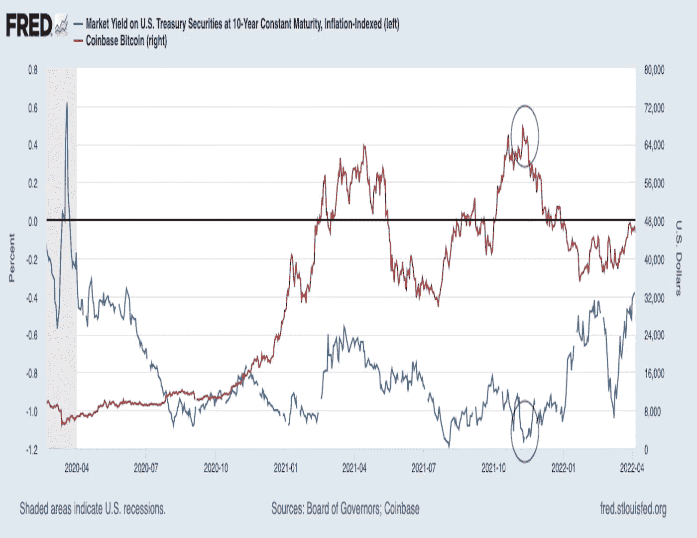
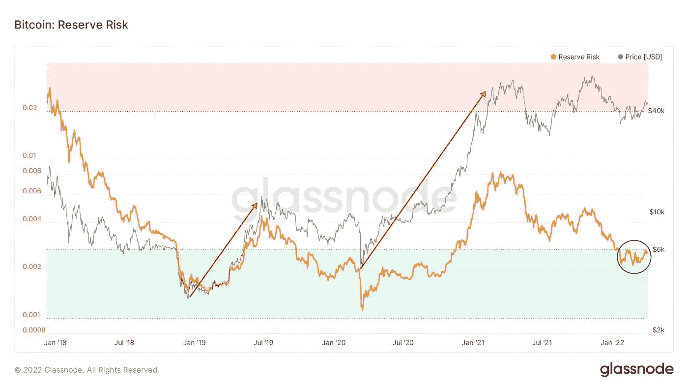
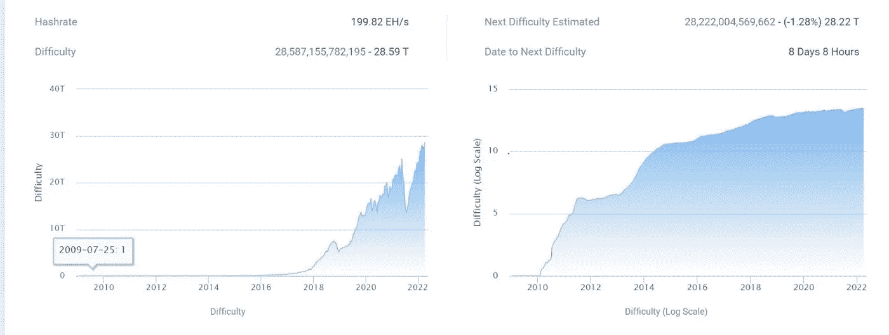
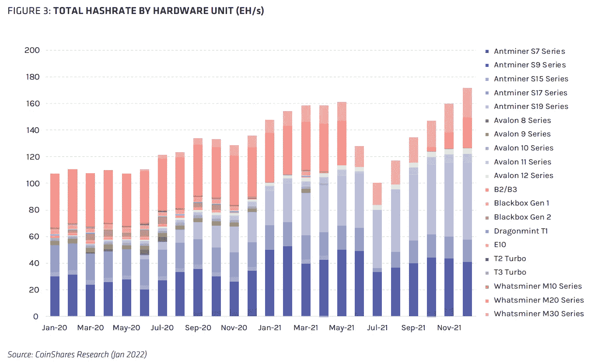
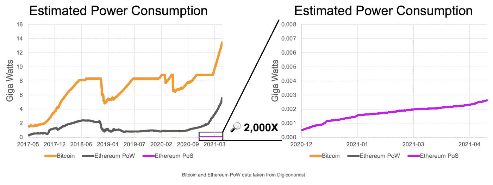
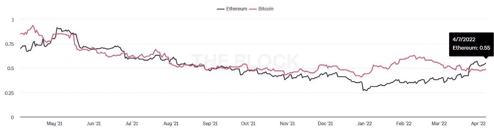
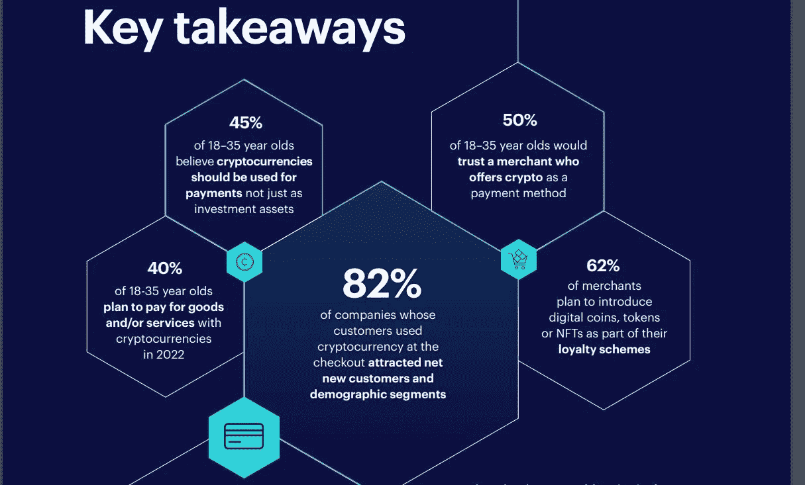
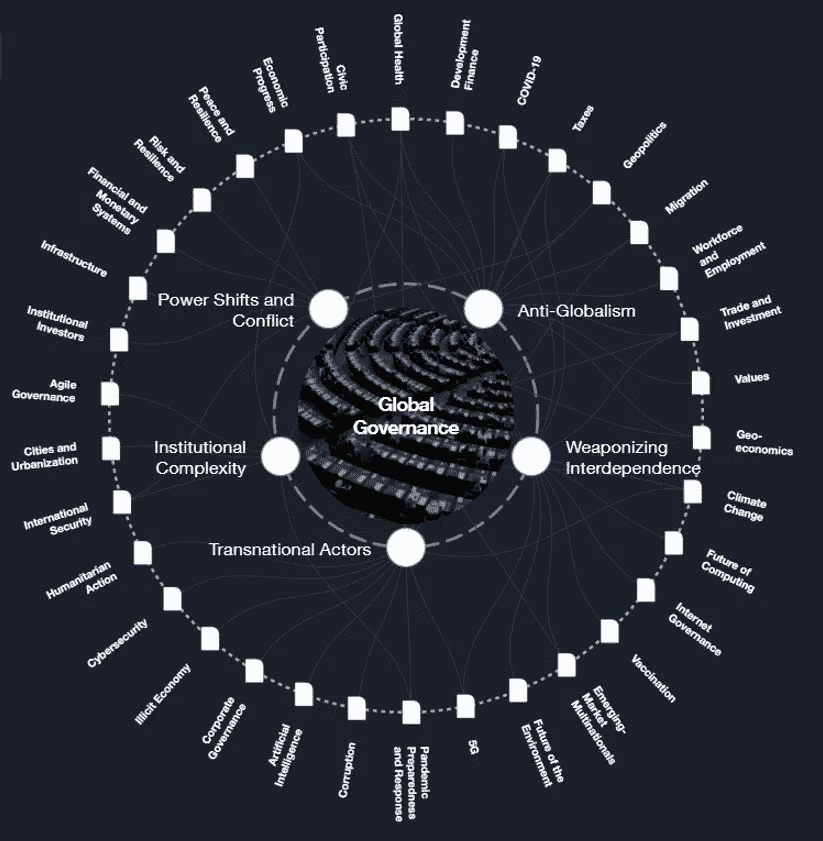
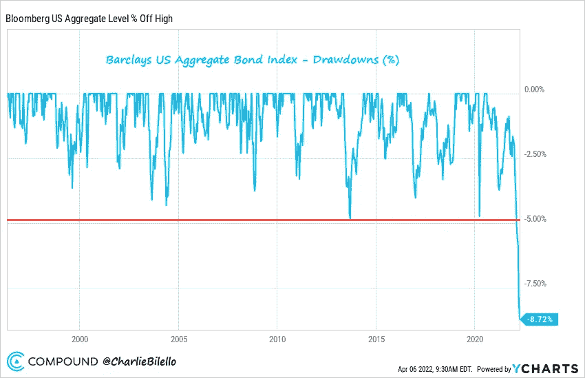
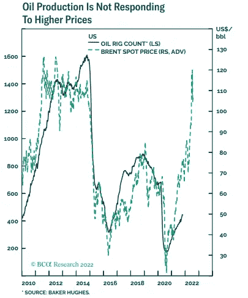

# 五分钟金融:美联储鹰派公羊 BTC，以太坊的 POS 合并，比特币会议

> 原文：<https://medium.com/coinmonks/five-minute-finance-fed-hawk-rams-btc-ethereums-merge-to-pos-bitcoin-conference-636c8cc7eec1?source=collection_archive---------31----------------------->

# 5 分钟的金融时事通讯——解释发生了什么，为什么。

# 让我们看看这周发生了什么:

*   美联储将加息一倍
*   真正入股比特币意味着什么？
*   以太坊的绿色合并
*   来自迈阿密会议的重大加密采用新闻
*   皮帕博士照亮了全球治理

# 随着比特币跌破 45000 美元的关键突破水平，鹰派美联储挫败了比特币的上涨

*   随着美国通胀率达到 7.9% **(** [**链接**](https://tokenist.com/fed-plans-rapid-balance-sheet-reduction-and-interest-hike-as-us-inflation-hits-7-9/) **)** ，美联储计划“快速”削减资产负债表并加息
*   随着美国经通胀调整的债券收益率创下两年新高，观察人士对比特币持谨慎态度 **(** [**链接**](https://www.coindesk.com/markets/2022/04/06/observers-cautious-for-bitcoin-as-us-inflation-adjusted-bond-yield-hits-2-year-high/) **)**

# 美联储进入了边缘地带，把所有人都拉了进来

要想最好地理解世界经济，就要把它视为承载在各国央行的背上。自 C19 事件以来，这种情况变得更加严重，引发了前所未有的货币供应增加，支撑了股市。反过来，在制度性宏观经济层面上，自由市场本身并不存在。

相反，它存在于一个央行气球中。由于它们造成的这种紧密依赖，央行现在处于一种不稳定状态。美联储注入数万亿美元，导致通胀率升至 7.9%，但避免了衰退。然而，为了抑制最初目标仅为 2%的通胀，美联储将不得不进行更快速的加息，加息 50 个基点或 0.5%。这比上个月的[0.25%](https://tokenist.com/federal-reserves-0-25-rate-hike-announces-a-new-era-for-the-us-economy/)翻了一倍，从而变得“鹰派”。

股票市场害怕美联储的鹰派，因为它是在借贷成本低廉的近零利率环境中成长起来的。因此，任何有关加息的言论都会惊吓到广泛的市场。它们提高了信用卡、抵押贷款、公司贷款、汽车贷款等的借贷成本。

这就是为什么德意志银行的经济学家 Matthew Luzzetti 警告说，加息可能会导致经济衰退，尽管这是一个温和的衰退，失业率高达 5%，直到 2024 年。具有讽刺意味的是，这恰恰是美联储一开始试图避免的。那是一些大毒蛇的决策，不是吗？

与此同时，比特币仍然是一种风险资产，因为持有比特币的机构投资者认为它是风险资产。此外，通胀和利率风险都会影响 10 年期美国国债收益率。

***去年 11 月，经通胀调整后的美国 10 年期国债收益率与比特币成负相关。图片鸣谢:fred.stlousfed.org***

由于 10 年期美国国债代表的是美国政府的债务，无风险，投资者倾向于退出风险更高的资产，如科技股或比特币。当被问及 10 年期美国国债何时会成为风险资产的问题时，《彭博》资深编辑约翰·奥特斯(John Authers)基本上是这样回答的:应该已经发生了

最终，所有这些造成了一个恐慌的股票市场，推动比特币和 altcoins 从涨势中下跌。尽管如此，比特币也有自己的看涨图——储备风险。

***比特币:储备风险。图片来源:glass node***

从图表中可以看出，传统的长期持有人信心，以下降的 BTC 供应为代表，而低 BTC 价格等于低储备风险。不考虑暂时的波动，这应该会因通胀压力而加剧，因为它将财富吸引到贵金属和比特币等避险资产中。

# 比特币挖矿在新的世界货币秩序(NWMO)中的位置在哪里？

*   BTC 收购狂潮继续:开采难度盖过 ATH，非流动性供应提示 63% **(** [**链接**](https://tokenist.com/btc-buying-spree-continues-mining-difficulty-eclipses-ath-illiquid-supply-tips-63/) **)**
*   为什么比特币挖矿事关国家安全 **(** [**链接**](https://www.coindesk.com/layer2/2022/04/04/why-bitcoin-mining-is-a-matter-of-national-security/) **)**

# 作为货币油田的绿色比特币矿场

正如上一期时事通讯所预测的那样，俄罗斯的制裁适得其反。不仅俄罗斯卢布恢复到了乌克兰冲突前的水平，而且俄罗斯国库还将从石油和天然气意外收入中获得额外的 3210 亿美元。同时，[一些欧盟国家](https://www.businessinsider.com/hungary-leader-orban-breaks-ranks-eu-pay-russian-gas-rubles-2022-4)准备用卢布支付俄罗斯人的能源产品，这是任何经济体的血脉..

这恰恰表明，最终掌握资源牌才是最重要的。同样，在比特币这样一种无边界、去中心化的加密货币中持有股份，也不是持有比特币本身的问题，而是通过挖矿参与保护其网络。

【BTC.com】*来源:*

*随着 SWIFT 侵蚀其全球相关性，这一资源将变得更加重要。比特币挖矿难度和网络 hashrate 都超过了 ATHs，预示着数字货币储备的新时代..*

*单身公寓矿工被公司化的采矿场远远甩在身后，压榨每一点电力以获得最佳的成本费用比。然而，因为这些大的操作如此明显，所以必须允许它们蓬勃发展。*

**

****比特大陆凭借其 Antminer 系列统治了加密货币开采市场。图片来源:CoinShares Research。****

*中国在推出数字人民币之前与矿商明确划清了界限，使美国成为比特币最大的散列权力持有者。虽然一个国家的哈希速率优势并不妨碍其他国家利用其网络，但它确实确保了其交易及时添加到区块链中。*

*换句话说，北美或朝鲜的比特币矿工最符合公众利益？正如前美联储和美国财政部官员 Zoltan·波扎尔[所说](https://defence.pk/pdf/threads/zoltan-pozsar-we-are-witnessing-the-birth-of-a-new-world-monetary-order.738859/)，新世界军事组织正在筹备中。这是用“外部资金”(黄金、比特币、大宗商品)取代“内部资金”(政府债券)，以支持法定货币。*

*作为一种商品支持的货币，俄罗斯卢布正处于这种转变之中。如果更多的国家离开石油美元生态系统，美元将得到什么支持？背负着 30 万亿美元的国债？*

*[**享受 5MF？点击转发给三个朋友。**](mailto:info@tokenist.com?subject=Check+this+out+&body=I%E2%80%99ve+been+reading+Five+Minute+Finance,+and+I+know+you%E2%80%99d+enjoy+it+too.+It%E2%80%99s+a+weekly+email+that+covers+the+most+important+trends+in+finance.+I+learn+something+new+every+time+I+read+it!+Check+it+out+here:+https://tokenist.com/newsletter/?utm_source=email_gr_btn)*

**

# *合并:随着以太坊变得更加节能，它能翻转比特币吗？*

*   *以太坊的 3000+dapp 为 Crypto 的 Y2K 时刻 **(** [**链接**](https://tokenist.com/ethereums-3000-dapps-prepare-for-the-merge-in-cryptos-y2k-moment/) **)** 的“合并”做准备*
*   *ETH 期权的看跌/看涨比率见顶，暗示比特币在不久的将来可以跑赢以太坊 **(** [**链接**](https://tokenist.com/put-call-ratio-of-eth-options-peaks-suggests-bitcoin-can-outperform-ethereum-in-near-future/) **)***

# *以太坊:金融 2.0 的基础设施走向绿色*

*正如比特币推动了数字资产的概念，以太坊也通过其更灵活的智能合约推动了去中心化金融(DeFi)的概念。虽然比特币拥有自己的升级闪电网络，使交易变得超级便宜和快速，但以太坊即将跨越一个重要的里程碑，即将改变 DeFi 空间。*

*所谓的合并是以太坊将其旧的工作证明网络与新的工作证明网络对接，即利益证明信标链。在预期中，Beacon Chain 已经装满了 1069 万 ETH(343 亿美元)。“赌注”而不是“工作”意味着以太坊将使用经济验证器而不是计算挖掘器。*

*因此，根据以太坊基金会的说法，以太坊的网络准备通过减少 99.98%的能耗来实现完全绿色化。*

**

**形象信用:* [*以太坊基础*](https://blog.ethereum.org/2021/05/18/country-power-no-more/)*

*你可能已经注意到数百个标题中的一个非常关注 BTC/联邦理工学院的能源使用，因为他们选择了一个国家进行比较，以震惊读者。虽然比特币 76%的能量已经来自可再生能源，以太坊的 PoS 转换将戳破这一特殊的担忧气球。*

*这对于环境、社会和治理(ESG)投资者尤其重要，随着时间的推移，他们将成为每个人。尽管这个框架不是由任何政府强加的，但它是由更有影响力的机构强加的——贝莱德，其 10 万亿美元的 AuM 遍布全球。*

*在以太坊合并的预期中，其看跌期权比率以 0.55 超过了比特币，这意味着市场情绪看涨，但比特币情绪甚至更看涨。*

**

****开息看跌/买入比率。图片来源:****

**看涨期权买家相信资产会上涨，而推杆可以以低于当前市场价的价格接受同样的看涨敞口。比率越低，情绪越乐观。**

**过去几个月，比特币获得了一些实质性的支持，MicroStrategy 新收购了 4167 个比特币，Terra 收购了超过 35000 个比特币，以支持其全球支付生态系统。虽然以太坊准备通过 PoS 转换打开投资者的闸门，但只有在没有重大错误和代码漏洞的情况下才会发生。因此，对比特币有所保留。**

****

# **关于如何不做稳定动作的一课**

*   **WAVES CEO 指责对冲基金导致美元下跌 20%，社区分裂 **(** [**链接**](https://tokenist.com/waves-ceo-blames-hedge-fund-for-stablecoin-usdn-losing-20-community-divided/) **)****
*   **Checkout.com 和 Worldpay 承认电子商务对密码和稳定密码的需求 [**(链接)**](https://tokenist.com/checkout-com-and-worldpay-acknowledge-ecommerce-demand-for-crypto-and-stablecoins/)**

# **比特币大会结出了加密果实，但波澜不惊**

**加密技术的采用比以往更快。在周四迈阿密举行的比特币 2022 大会上，Strike 首席执行官杰克·马勒斯(Jack Mallers)宣布了比特币闪电网络的一系列合作伙伴关系。正如 Arbitrum 有助于以廉价和快速的交易扩大以太坊，Lighting Network 对比特币也是如此。**

**全球最大的销售点(POS)供应商 NCR 是 LN 的新成员之一。同样，Shopify 的全球商户网络将与最大的支付提供商之一黑鹰网络(Blackhawk Network)一起进入闪电般快速的比特币生态系统。如果这对你来说还不够乐观，Checkout.com 在同一个会议上发布了一份关于加密应用的报告。**

****

*****来源:揭秘 Crypto:揭示 2022 年支付采用数字货币*** [***报告***](https://www.checkout.com/campaigns/demystifying-crypto) ***。*****

**随着加密帆背后强劲的采用风，支付处理器 Worldpay 宣布与 Circle 合作，使用 USDC stablecoin 进行无国界支付。这是另一个重要的里程碑，因为 stablecoins 对于加密的采用至关重要。它们既可以充当加密货币，也可以充当 CBDC，但既不可编程，也不易变。**

**然而，最不可能被采用的算法稳定币是中微子(USDN)，它已经成为密码领域的一大尴尬。在失去了 30%的与美元挂钩的汇率后，USDN 所在的 Waves 平台的负责人 Sasha Ivanov 指责 FTX 首席执行官 Sam Bankman-Fried 操纵市场。**

**据推测，山姆这样做是通过借用 DeFi 协议，维里斯金融，短波以及发动 FUD 运动，使其成为一个自我实现的预言。作为回报，萨姆驳斥了这些指控，称之为阴谋论。无论情况如何，shorted WAVES 摧毁了其算法稳定的美元，因为它的美元挂钩取决于 WAVES 的代币价格。**

**提议的补救措施是对在 Vires Finance 借入 WAVES 和 USDN 的投资者引入 0.1%的清算率。对于一个应该提供全球支付系统的项目来说，这是非常具体和细致的。想象一下，如果其他 DeFi 平台的每个这样的实例都需要类似的补丁。这听起来既不普遍也不稳定。幸运的是，Terra 的 UST 算法稳定币已经占领了这个市场。**

****

# **当压力来临时，欧盟倾向于屈服**

*   **欧洲争论 CBDC 的隐私威胁随着数字元扩展到中国 23 个城市 **(** [**链接**](https://tokenist.com/europe-debates-cbdcs-privacy-threat-as-digital-yuan-expands-to-23-cities-in-china/) **)****
*   **由于隐私问题增加，欧盟投票追踪所有交易没有最低豁免 **(** [**链接**](https://tokenist.com/no-minimum-exemption-for-crypto-eu-votes-to-track-all-transactions-as-privacy-concerns-mount/) **)****

# **世界政府需要什么样的钱？**

**三月底发生了一件大事。小声说了几十年的话被大声说了出来。在迪拜举行的一年一度的 2022 年世界政府峰会上，我们终于对新的世界货币秩序(NWMO)的样子有了一些官方的澄清。皮帕·马尔姆格伦博士上台解释道:**

***“我们即将抛弃传统的货币和会计制度，而引入一种新的制度。新的会计方法就是我们所说的区块链……它意味着对经济中发生的每一笔交易都有近乎完美的记录。”***

****

*****2022 年世界政府峰会。就连《印第安纳琼斯》和《星球大战》成名的哈里森·福特也是 2019 年世界政府峰会的演讲人。来源:***[***YouTube***](https://www.youtube.com/watch?v=7bTx0sRVfSA)**

**你可能想知道皮帕医生是谁？她不仅是前总统乔治·w·布什的经济特别助理，而且她的父亲是美国总统约翰·肯尼迪、林登·约翰逊、理查德·尼克松和杰拉尔德·福特的高级助手。**

**此外，皮帕博士被世界经济论坛(WEF)提名为明日全球领袖。反过来，很难找到任何不是 WEF 成员的大公司或银行。你看，以“W”和“G”开头的单词正在成为本世纪事态的主要词汇。**

****

*****数字身份和全球治理是世界经济论坛的主要议题。图片来源:*** [***世界经济论坛战略情报***](https://intelligence.weforum.org/)**

**因此，分离不同名称的实体可能不再有意义。一个恰当的例子是，欧洲联盟(欧盟)可能被称为欧盟，但它是更广泛网络的一个分支。金融行动特别工作组(FATF)制定了针对加密交易的严格旅行规则后不到一个月，欧盟也采取了同样的措施。**

**根据提交立法动议的欧盟新提案，所有区块链交易都必须被追踪，交易双方的身份都必须披露。这意味着，如果你要从 Trezor 这样的自托管钱包向比特币基地发送加密货币，交易所必须知道并验证双方的身份，即使发送者不是比特币基地的客户。**

**此外，该规定没有最低交易限额，甚至比韩国最近实施的规定还要严格。最重要的是，看起来数字欧元，一种中央银行的数字货币(CBDC)，正在跟随数字人民币的脚步。这涉及到一定程度的隐私放弃，这可以根据具体情况来控制。**

**这是皮帕博士的新区块链会计的精髓。它不仅仅是一种可编程的货币，而是一种前所未有的工具，用来监督人类的每一项活动。相反，如果每一项人类活动都可以转化为经济活动，那么可编程货币就可以对其进行调整。**

**时间会证明这种调整会带来什么结果。**

# **本周推特**

> **突破:你现在可以用美元支付你的麦当劳。**
> 
> ***或者用任何使用比特币的闪电钱包，让你的餐费成为应税事件。***

**[@ BTCGandalf](https://twitter.com/BTCGandalf/status/1512186181848604682)**

****

> ***美国债券市场目前比 2020 年 8 月的高点下跌了 8.7%，这是我们在过去 25 年中看到的最大调整。在此期间，10 年期美国国债收益率从 0.55%升至 2.54%。***
> 
> ***通过@ycharts 制作图表***

**[@ charliebilello](https://twitter.com/charliebilello/status/1511698694546116609)**

> ***要闻:美国财长耶伦#比特币和加密监管应支持负责任的创新***

**[**@ BitcoinMagazine**](https://twitter.com/BitcoinMagazine/status/1512039548703887371)**

> ***过去几周，以下城市采用了#比特币(以某种形式)***
> 
> ***-秘鲁拉莫利纳***
> 
> ***——瑞士卢加诺***
> 
> ***-洪都拉斯普洛斯佩拉***
> 
> ***-美国亚利桑那州钱德勒***
> 
> ***-美国新罕布什尔州朴茨茅斯***

**[**@ TheCryptoLark**](https://twitter.com/TheCryptoLark/status/1512301964813496320)**

****

> ***一张图中的 ESG。***
> 
> ***原油到月球，石油钻塔计数不跟随。***

**[**@MacroAlf**](https://twitter.com/MacroAlf/status/1512226467693834241)**

# **加入五分钟金融时事通讯。**

****

**[Sign up here — it’s free.](https://tokenist.com/newsletter/?utm_source=getresponse&utm_medium=email&utm_campaign=thetokenist&utm_content=%E2%9C%8B%20FMF%3A%20BoA%20Readying%20for%20BTC%2C%20Pot%20Goes%20Federal%2C%20More%20Inflation)**

****

**[t.me/thetokenist](http://t.me/thetokenist?utm_source=getresponse&utm_medium=email&utm_campaign=thetokenist&utm_content=%E2%9C%8B%20FMF%3A%20BoA%20Readying%20for%20BTC%2C%20Pot%20Goes%20Federal%2C%20More%20Inflation)**

****

**[twitter.com/thetokenist](https://twitter.com/thetokenist)**

> **加入 Coinmonks [电报频道](https://t.me/coincodecap)和 [Youtube 频道](https://www.youtube.com/c/coinmonks/videos)了解加密交易和投资**

# **另外，阅读**

*   **[加拿大最好的加密交易机器人](https://coincodecap.com/5-best-crypto-trading-bots-in-canada) | [库币评论](https://coincodecap.com/kucoin-review)**
*   **[用于 Huobi 的加密交易信号](https://coincodecap.com/huobi-crypto-trading-signals) | [HitBTC 审核](/coinmonks/hitbtc-review-c5143c5d53c2)**
*   **[如何在 FTX 交易所交易期货](https://coincodecap.com/ftx-futures-trading) | [OKEx vs 币安](https://coincodecap.com/okex-vs-binance)**
*   **[OKEx vs KuCoin](https://coincodecap.com/okex-kucoin) | [摄氏替代品](https://coincodecap.com/celsius-alternatives) | [如何购买 VeChain](https://coincodecap.com/buy-vechain)**
*   **[ProfitFarmers 点评](https://coincodecap.com/profitfarmers-review) | [如何使用 Cornix 交易机器人](https://coincodecap.com/cornix-trading-bot)**