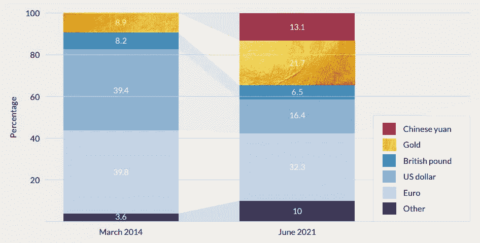

# 五分钟金融:DEFI 的固定利率贷款，BTC 哈希利率 ATH，ARKK 的头号演员

> 原文：<https://medium.com/coinmonks/five-minute-finance-fixed-interest-loans-in-defi-btc-hash-rate-ath-arkks-1-performer-ae43a604d1b2?source=collection_archive---------56----------------------->

# 5 分钟的金融时事通讯——解释发生了什么，为什么。

# 让我们看看这周发生了什么:

*   比特币挖矿需求达到创纪录水平
*   试图进入 DeFi 的固定利率贷款
*   俄罗斯和美国之间的比特币和黄金楔子
*   随着科技股下跌，TSLA 正在支撑 ARKK
*   马斯克收购 Twitter 的细节——以及即时变化

# 比特币的价格走势可能很无聊，但基本面的进展正好相反

*   随着纽约州加密采矿法案的通过，得克萨斯州的暴动计划扩大规模 **(** [**链接**](https://tokenist.com/riot-plans-capacity-extension-in-texas-as-crypto-mining-bill-passes-in-new-york/) **)**
*   中非共和国刚刚批准比特币成为官方货币。萨尔瓦多的经历表明，这可能是一段颠簸的旅程 **(** [**链接**](https://fortune.com/2022/04/28/central-african-republic-approved-bitcoin-official-currency-el-salvador-bumpy-ride/) **)**

# 更环保、更高效的比特币

虽然比特币的价格没有什么令人兴奋的事情发生，但其根本的基本面却并非如此。本周，比特币的散列率达到了历史新高，这意味着比特币网络比以往任何时候都更加安全。

*图片来源:*[*glass node*](https://glassnode.com/)

随着越来越多的采矿力量被接入比特币网络，人们越来越担心比特币对环境的影响，特别是在传统媒体中。然而，最近的[比特币采矿委员会报告](https://bitcoinminingcouncil.com/q4-bitcoin-mining-council-survey-confirms-sustainable-power-mix-and-technological-efficiency/)有助于了解比特币目前的能源消耗情况。虽然比特币开采约占全球能源消耗的 0.16%，但比特币的开采足迹相当于全球碳排放量的 0.08%。

那是因为比特币至少有 [64%](https://www.youtube.com/watch?v=uotDxbKJmlo) 的开采能源来自可再生资源。最重要的是，半导体技术的进步和西化带来了 [63%](https://www.youtube.com/watch?v=uotDxbKJmlo) 的年开采效率。后者将随着 Riot Blockchain 最新的 1.7 GW 扩展到德克萨斯州而得到进一步改善，最初部署的计算能力为 400 MW。

该矿业公司将使用先进的浸入式冷却钻机，提供更低的维护成本和更高的 ASIC 机器预期寿命。当美国最大的石油生产商得克萨斯州正在成为比特币采矿的中心时，纽约州[通过了一项禁止碳基采矿的法案](https://www.nysenate.gov/legislation/bills/2021/A7389)，尽管它仍需签署成为法律。

谈到电力供应，中非共和国是缺乏的。然而，尽管只有 15.5%的电力覆盖率，这个非洲国家还是接受比特币作为法定货币，这是继萨尔瓦多之后第二个这样做的国家。从表面上看，这可能意义不大，但它显示了一个更广泛的趋势。

如果两个国家在半年内整合比特币，10 年后会发生什么？此外，对于像 CAR 这样的国家来说，比特币代表了一个不受通胀和篡改影响的现成货币系统，更不用说反腐败的可审计交易了。也许，未来会出现一个新的首字母缩略词——健全的货币即服务(SMaaS)——作为经济发展的起点。

[**享受 5MF？点击转发给三个朋友。**](mailto:info@tokenist.com?subject=Check+this+out+&body=I%E2%80%99ve+been+reading+Five+Minute+Finance,+and+I+know+you%E2%80%99d+enjoy+it+too.+It%E2%80%99s+a+weekly+email+that+covers+the+most+important+trends+in+finance.+I+learn+something+new+every+time+I+read+it!+Check+it+out+here:+https://tokenist.com/newsletter/?utm_source=email_gr_btn)

# 缓和 DeFi 挥发性

*   复合通货紧缩:Q1 2022 年清算量上升 295%**(**[**链接**](https://tokenist.com/compound-deflates-liquidations-up-295-in-q1-2022/) **)**
*   GainIRS 旨在通过短期或长期利率 **(** [**)链接**](https://cointelegraph.com/news/volatile-interest-rates-may-be-a-thing-of-the-past-thanks-to-this-defi-product) **)** 的代币来解决 DeFi 的波动利率

# 在算法稳定之后，利息对冲令牌

尽管分散金融(DeFi)正试图通过智能合约重建世界现有的银行体系，但波动性仍是一个问题。

当数字资产被用于贷款业务时，事情变得有点复杂。如果一项不稳定的资产被用作贷款的抵押品(通常是稳定的货币)，它不需要太多就可以被清算。这正是 1 月份 wet 波动性所发生的情况:

对于 Q1 2022，复合贷款协议记录了 1.34 亿美元的清算资金。图片鸣谢: [*梅萨里*](https://messari.io/) *。*

此外，与借款相关的利率每月都在变动。这使得长期规划变得困难，无论是在贷款(流动性挖掘)还是借款方面。但是还有一些潜在的解决方法。

目前正在酝酿的一种独特方法来自 iGain IRS(利率合成器)。该协议支持三种稳定的代码:、和戴。为了让 DeFi 站稳脚跟并真正成为主流，模仿传统金融中常见的固定利率贷款非常重要。

虽然仍处于试验阶段，但 iGain 通过其短期和长期代币以及广受欢迎的 DeFi 贷款服务 Aave，使这一点成为可能。例如，对于 Aave 上的稳定币存款，用户可以在 iGain 上购买短期代币[并选择“固定 APY”。](https://igain.finance/irs)

*形象信用:* [*客家财经*](https://www.youtube.com/watch?v=hTcCCh5R_Wo&list=PLx0K5dyntPyXXWknLvjp8idmn9AQTRGL8)

这样，存款就有了对冲。反之亦然。在这两种情况下，短期和长期代币都可以在合约到期前交易。因此，iGain 为套期保值和套利创造了聪明的合约机会。

这种稳定 DeFi 贷款的方法能否流行起来，并激发出类似的解决方案，取决于 DeFi 市场。

# 俄罗斯不断增长的黄金储备将被用来绕过制裁？

*   制裁阻止加密转账后，俄罗斯可能利用非法黄金市场 **(** [**链接**](https://tokenist.com/after-sanctions-block-crypto-transfers-russia-may-use-illicit-gold-markets/) **)**
*   美元“武器化”的意外后果:以下是黄金和比特币如何利用这一时刻 **(** [**)链接**](https://www.kitco.com/news/2022-04-27/Unintended-consequences-of-U-S-dollar-weaponization-here-s-how-gold-and-Bitcoin-utilize-the-moment.html) **)**

# 相反，黄金正在摘下比特币“非法”的桂冠

不幸的是，像战争这样毁灭性的事情的负面影响似乎永远不会结束。乌克兰-俄罗斯战争充分证明了这一点。在首批伤亡人员中，它导致价值 110 亿美元、全长 1234 公里的北溪 2 号俄欧天然气管道被放弃。

结果，欧盟的能源储备继续减少。俄罗斯兑现了切断对不友好国家天然气供应的承诺。波兰和保加利亚本周首当其冲，因为它们拒绝用卢布支付俄罗斯的能源进口，以免违反欧盟制裁。

因此，我们现在看到卢布作为商品支持的货币上涨，而美元也上涨，尽管欧元下跌:

*美元强势指数(DXY)对欧元对卢布。中间的那个处境很困难。图片信用:* [*交易视图*](https://www.tradingview.com/) *。*

此外，就连美国的南部邻国墨西哥也没有参与俄罗斯的制裁，更不用说印度和中国了。即将到来的分歧如此明显，以至于美联储主席杰罗姆·鲍威尔(Jerome Powell)上周在国际货币基金组织和世界银行春季会议上发表了如下言论:

“很明显，[全球化]的速度确实放缓了，而且可能会逆转。你已经看到了关于全球化的问题，围绕乌克兰的这一系列事件肯定有可能导致更加分裂的政治局势和经济局势

逆向全球化为一种无国家货币的存在打开了广阔而肥沃的土壤。比特币不仅能抗通胀，其价值还在于去中心化的网络本身。因此，没有任何实体能够像俄罗斯银行被从 SWIFT 除名那样，与其他方脱离平台。

然而，俄罗斯中央银行(CBR)不喜欢分散货币的概念也是事实。相反，它更愿意交易另一个安全港——黄金。这并不奇怪，因为俄罗斯的黄金产量在过去 20 年中翻了三番，目前占世界总产量的 9%，并持有价值 1400 亿美元的黄金储备。

*俄罗斯 2014 年和 2021 年央行储备对比。* [*资料来源:GI-TOC 报告*](https://globalinitiative.net/wp-content/uploads/2022/04/GITOC-Going-for-Gold-Russia-sanctions-and-illicit-gold-trade.pdf)

虽然比特币交易可以公开追踪，但黄金是一种硬实物资产，更容易用于洗钱和逃避制裁。

谁会想到比特币会变成一个受人尊敬的全球支付系统，而黄金会取代它的位置，成为国际非法金融的一个“肮脏的下腹部”？

# 特斯拉(没错，特斯拉)让凯西·伍德的基金免于彻底破产

*   ARKK 创新基金从 ATH 跌去 65%:特斯拉仍是最大赌注 **(** [**链接**](https://tokenist.com/arkk-innovation-fund-down-65-from-ath-tesla-remains-biggest-bet/) **)**
*   特斯拉在马斯克推特交易融资问题中损失 1260 亿美元 **(** [**链接**](https://finance.yahoo.com/news/tesla-loses-126-billion-value-225849997.html) **)**

# 美联储担心击败创新公司

在埃隆·马斯克(Elon Musk)不得不为他的 Twitter 交易买单后，特斯拉股票暴跌 1260 亿美元。不出所料，投资者猜测他将不得不买入 TSLA 股票，从而形成抛售压力。反过来，他们自己先发制人地制造了抛售压力。

方舟投资基金(ARKK)的凯西伍德(Cathie Wood)在特斯拉 2022 年 Q1 财报发布后出售了 1 亿美元的 TSLA 股票，加剧了这种压力。该公司的每股收益(EPS)超过了预期，与 Q1 2021 相比增长了 246.2%。收入也有所增长，同比增长 80.5%。

因此，可以肯定地说，无论是投机者还是凯西·伍德都没有对特斯拉失去信心。相反，他们只是在重新投入之前进行了一些获利回吐。事实上，在昨日的首次抛售后，TSLA 几乎收复了失地，目前处于更高的低点。

*图片信用:* [*交易查看*](https://www.tradingview.com/)

这也告诉我们，在不利的市场条件下，由于美联储加息，特斯拉与其他成长股和科技股截然不同。尽管它们具有创新潜力，但 ARKK 的投资组合表现糟糕，只有特斯拉和 Pagerduty 在一位数的亏损范围内，而 significance Health 是唯一的积极选择。

*图片来源:* [*雅虎财经*](https://finance.yahoo.com/news/cathie-woods-arkk-is-down-60-from-its-peak-185056213.html)

如果衰退真的即将来临，科技股的情况只会更糟。然而，从我们目前看到的情况来看，TSLA 有望成为科技行业的领导者。

# 马斯克的推特计划

*   在埃隆马斯克收购之前，Twitter 的收入同比增长 16%，达到 12 亿美元 **(** [**链接**](https://economictimes.indiatimes.com/tech/technology/ahead-of-musk-takeover-twitters-revenue-climbs-16-yoy-to-1-20-billion/articleshow/91156022.cms) **)**
*   在埃隆马斯克接管期间，Twitter 的用户数量激增 **(** [**链接**](https://nypost.com/2022/04/28/twitters-user-growth-surges-during-elon-musk-takeover/) **)**

# 马斯克实际上买的是什么？

正如 40 年前巨蟒剧团(Monty Python)的电影《圣杯》(Holy Grail)所表达的那样，“躺在池塘里分发剑的陌生女人不是政府制度的基础”。

同样的格言完美地总结了 Twitter-Musk 的故事情节。人们显然在社交媒体平台上呼吁更多的言论自由。古怪的亿万富翁来了，猛扑下来把他们从公司的限制中解救出来，以满足言论自由的需求。

埃隆·马斯克自己说过，没有言论自由，民主就无法运转，但如果一个系统需要这样的干预，是不是已经太晚了？首先，让我们看看干预需要什么:

*   Twitter 董事会放弃了最初的“毒丸”策略，接受了马斯克 440 亿美元的报价。
*   在接下来的几天里，马斯克出售了价值 40 亿美元的特斯拉(TSLA)股票。他还需要敲定 210 亿美元的现金，其中 125 亿美元以 625 亿美元的 TSLA 股票作为抵押。
*   如果该公司的股票下跌，抵押品将不得不进一步增加，这正是两天前 TSLA 下跌 12%所发生的情况，使特斯拉的市值蒸发了 1260 亿美元。

此外，马斯克正从一个亏损走向另一个亏损。自从 Twitter 在 2013 年 11 月以每股 26 美元的价格上市以来，其股票自 2014 年以来基本持平。

类似地，从 2013 年到 2022 年，Twitter 的净收入一直很糟糕。仅最近两年，Twitter 的净收入在 2020 年比 2019 年减少了-177.48%，在 2021 年到 2020 年减少了-80.5%。

*从 IPO 到 2022 年的季度 Twitter 收入(以十亿计)。图片来源:* [*宏观趋势*](https://www.macrotrends.net/stocks/charts/TWTR/twitter/net-income)

然而，经济激励或预测似乎都不重要。Twitter 作为信息流的重要性如此之大，以至于它几乎没有被视为一个经济实体。

然而，这种情况可能会在 3-6 个月后交易完成时发生变化，得到股东和 SEC 的批准。Twitter 随后将成为一家私人公司，接受一次算法彻底检查，因此它们是开源的，机器人被终止，所有用户都得到认证。

16%的新用户账户的快速增长表明，许多人一直在等待 Twitter 成为一项公益事业。

# 本周推特

> 大规模突发新闻——巴拿马正式通过一项法案，给予#比特币合法地位，并取消所有资本收益。

[**@丹尼斯 _ 波特 _**](https://twitter.com/Dennis_Porter_/status/1519714692893093893)

> 2010 年代，投资者 Bill Hwang(通过他的对冲基金 Archegos Capital)悄悄地积累了美国最大的财富之一。
> 
> 2021 年 3 月，Archegos 发生内爆，黄在两天内损失了 200 亿美元。今天，联邦调查局指控他欺诈(操纵市场)。
> 
> 这是一个疯狂的故事

[**@ trungphan**](https://twitter.com/TrungTPhan/status/1519328053507215363)

> 投资者情绪处于历史性的悲观水平。
> 
> 在 35 年里，只有另外五个星期达到了这个极限:
> 
> 1990 年经济衰退低谷/通货膨胀高峰期间四次。
> 
> 一次是在 2009 年 3 月的底部。

[**@宏指令**](https://twitter.com/MacroCharts/status/1519617418456301568)

> 这是一张最令人担忧的图表，如果不是最令人担忧的话——经济和社会方面。

[@ elerianm](https://twitter.com/elerianm/status/1519337639517855746)

> 断路:
> 
> 俄罗斯央行将允许证券交易所交易#crypto。
> 
> 采用率在增长，而且还在加速。

[**@ CryptoMichNL**](https://twitter.com/CryptoMichNL/status/1519647966356721665)

# 加入五分钟金融时事通讯。

[Sign up here — it’s free.](https://tokenist.com/newsletter/?utm_source=getresponse&utm_medium=email&utm_campaign=thetokenist&utm_content=%E2%9C%8B%20FMF%3A%20BoA%20Readying%20for%20BTC%2C%20Pot%20Goes%20Federal%2C%20More%20Inflation)

[t.me/thetokenist](http://t.me/thetokenist?utm_source=getresponse&utm_medium=email&utm_campaign=thetokenist&utm_content=%E2%9C%8B%20FMF%3A%20BoA%20Readying%20for%20BTC%2C%20Pot%20Goes%20Federal%2C%20More%20Inflation)

[twitter.com/thetokenist](https://twitter.com/thetokenist)

> 加入 Coinmonks [电报频道](https://t.me/coincodecap)和 [Youtube 频道](https://www.youtube.com/c/coinmonks/videos)了解加密交易和投资

# 另外，阅读

*   [Cloudbet 赌场评论](https://coincodecap.com/cloudbet-casino-review) | [点火赌场评论](https://coincodecap.com/ignition-casino-review)
*   [加密套利](/coinmonks/crypto-arbitrage-guide-how-to-make-money-as-a-beginner-62bfe5c868f6)指南| [如何做空比特币](/coinmonks/how-to-short-bitcoin-568a2d0b4ae5)
*   [如何在加拿大购买加密货币？](https://coincodecap.com/how-to-buy-cryptocurrency-in-canada)
*   [无聊猿游艇俱乐部(BAYC)回顾](https://coincodecap.com/bored-ape-yacht-club-bayc-review) | [拜比特 vs 比特币基地](https://coincodecap.com/bybit-vs-coinbase)
*   [5 款最佳加密交易终端](https://coincodecap.com/crypto-trading-terminals) | [最佳 DeFi 应用](https://coincodecap.com/best-defi-apps)