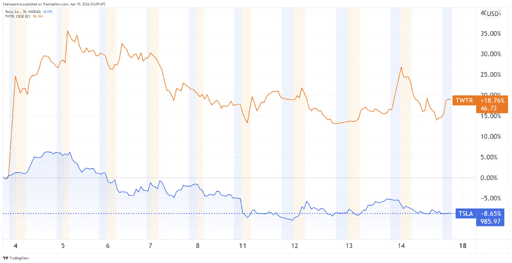
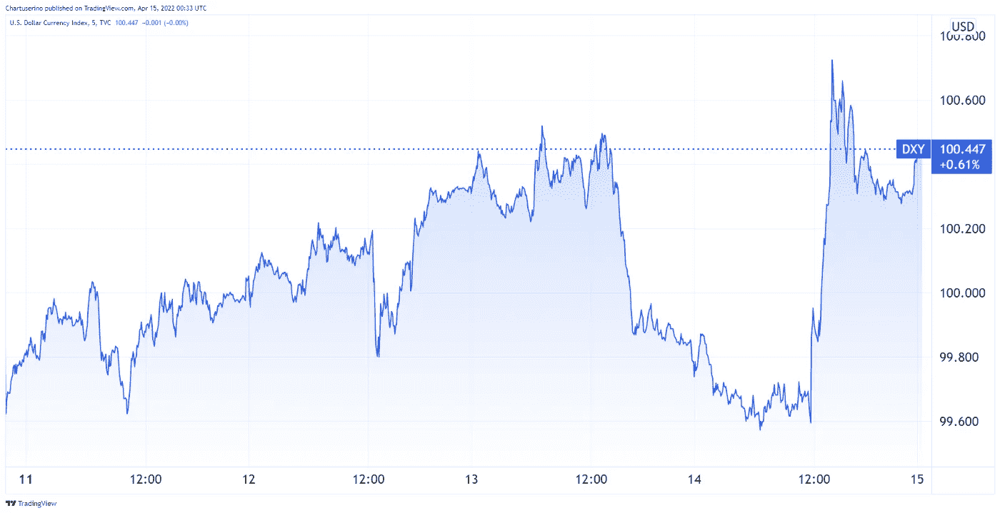
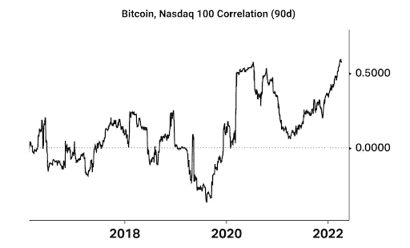
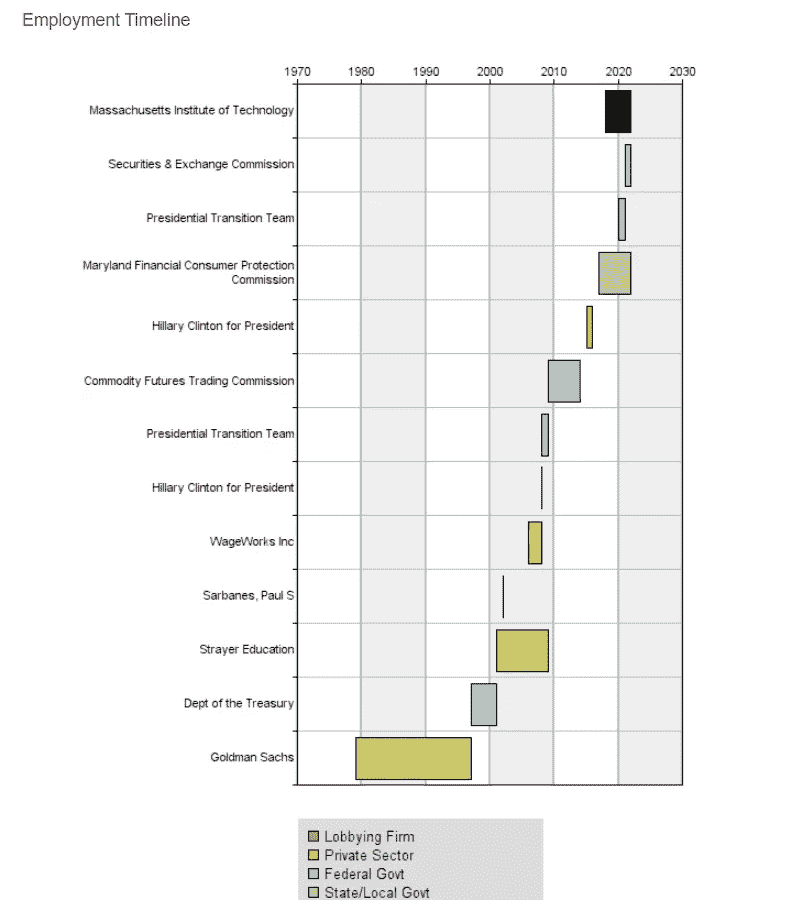
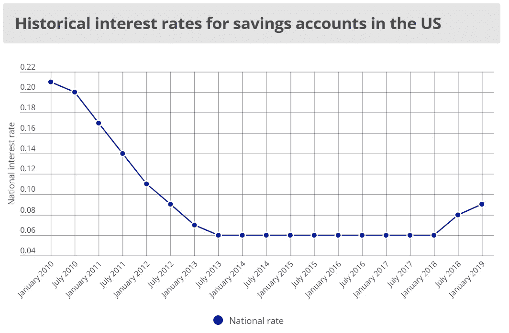
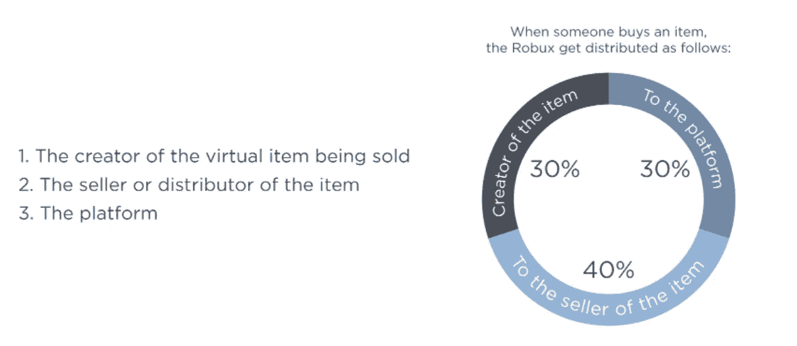
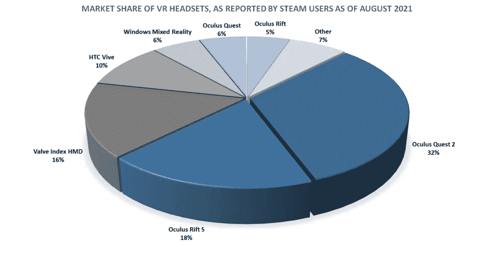
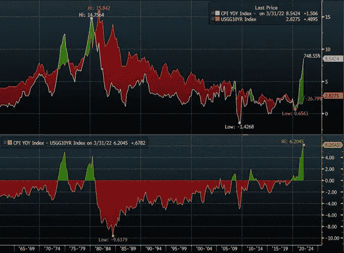

# 五分钟财经:投资者对马斯克 TWITTER 报价的反应，DEFI 收益率在美国遥不可及，更多

> 原文：<https://medium.com/coinmonks/five-minute-finance-investors-react-to-musks-twitter-offer-defi-yields-out-of-reach-in-us-more-545cbdd22ddd?source=collection_archive---------36----------------------->

# 5 分钟的金融时事通讯——解释发生了什么，为什么。

# 让我们看看这周发生了什么:

*   投资者的反应:马斯克试图将 Twitter 私有化
*   为什么美元指数在创纪录的通货膨胀中居高不下
*   对美国投资者来说，低产农业变得更加遥不可及
*   元测试创造者经济，但将采取大块馅饼
*   贝莱德将目光转向 USDC 稳定币

# 埃隆马斯克(Elon Musk)即将改变社交媒体格局吗？

*   埃隆·马斯克(Elon Musk)主动出价 430 亿美元收购 Twitter Private**(**[**)link**](https://finance.yahoo.com/news/elon-musk-makes-43-billion-112726275.html)**)**
*   在延迟提交 SEC 文件赚了 1.56 亿美元后，埃隆·马斯克希望 Twitter 的总部成为一个无家可归者的庇护所

# “Twitter 拥有非凡的潜力。我来开锁。”-马斯克提交给美国证券交易委员会的文件

小说家想不出更好的故事情节了。世界首富手握尖端技术——从电动汽车和太空互联网到火箭和大脑芯片——正准备收购(可以说是)世界上最具影响力的社交媒体平台:Twitter。

这一重大举措的准备工作如下:

*   抱怨 Twitter 抛弃了言论自由，而言论自由是任何民主的重要组成部分。在这些推文中，马斯克在多项民意调查中获得了压倒性的支持。
*   购买 Twitter 9.2%的股份，这使他成为最大的股东。
*   如果没有及时通知 SEC，可能会触犯法律，这是持有一家公司 5%或更高股份时的一项要求。此外，在这 11 天的申报延迟中，他的投资增加了 1.56 亿美元。
*   在本应成为 Twitter 董事会成员的那一天，他拒绝加入董事会，态度发生了 180 度大转弯。
*   调查他的 8000 多万粉丝，Twitter 的旧金山总部是否应该变成一个无家可归者的庇护所，“因为没有人出现”。

最后，正如许多分析师预测的那样，埃隆·马斯克主动出价 430 亿美元，以每股 54.20 美元的价格收购 Twitter。对于 Twitter 向言论自由平台的转型，他计划将其转变为一家私人公司。很难说马斯克是不是刚刚开始了一场竞购战。Elliott Management 的 Paul Singer 可能是除了 Musk 之外 Twitter 最知名的股东，因为 Singer[不赞成 Dorsey](https://www.forbes.com/sites/abrambrown/2020/02/29/twitters-jack-dorsey-has-a-new-nemesis-hedge-fund-billionaire-paul-singer/?sh=1ee854ef27d8) 。事实上，许多人认为辛格对多尔西的辞职和 Twitter 现任首席执行官帕拉格·阿格拉瓦尔负有主要责任。

虽然辛格拥有 43 亿美元的净资产，但他可以引入其他盟友。另一方面，马斯克将不得不出售相当数量的 TSLA 股票，价值约 1700 亿美元，以执行 Twitter 的收购。自 4 月 4 日首次披露以来，我们已经看到特斯拉股票的压力。

*这就好像 TWTR 把 TSLA 当成了跳板。图片信用:* [*交易视图*](https://www.tradingview.com/) *。*

事实上，投资者可能会得出结论，Twitter 的风险将对特斯拉和 SpaceX 产生负面影响，因为马斯克的注意力会被转移。此外，这发生在特斯拉因供应紧张而不得不暂停上海工厂生产的时候。与此同时，在芯片短缺的情况下，德克萨斯州和德国的超级工厂最近也开始运作。

无论如何，自马斯克在 Twitter 上发表言论的前一天以来，马斯克的现金报价对投资者来说有 54%的溢价，自他公开宣布立场的前一天以来有 38%的溢价。

在 [SEC 文件](https://www.sec.gov/Archives/edgar/data/0001418091/000110465922045641/tm2212748d1_sc13da.htm)中，马斯克写道:“我不是在玩你来我往的游戏。我已经直接走到了最后。”他补充道，“如果交易失败……我将需要重新考虑我作为股东的地位。”

过去一年，TWTR 的交易价格在 31.30 美元至 73.34 美元之间。然而，Twitter 昨日收于 45.08 美元。这意味着当日下跌了 1.7%。这种活动表明，投资者对 Twitter 是否会选择接受马斯克的报价持怀疑态度。

截至发稿时，Twitter 正在“考虑”这笔交易。

# 美元贬值了——但同时又坚挺？

*   专家预测美国通胀率将达到 8.5%，2022 年将持续高企 **(** [**链接**](https://tokenist.com/us-inflation-peaks-at-8-5-as-experts-predict-continued-high-rates-for-2022/) **)**
*   美联储的鹰派评论 **(** [**链接**](https://tokenist.com/2-year-high-for-the-dollar-while-crypto-and-tech-stocks-decline-after-feds-hawkish-comments/) **)** 后，美元创下两年新高，而加密和科技股下跌

# 文明 IRL

俄罗斯和美国最大的共同点是什么？他们都是拥有大片土地和巨大能源储备的国家。事实上，尽管俄罗斯是陆地面积最大的国家，但欧盟只有美国的一半大，几乎完全依赖俄罗斯的能源进口。

玩过文明系列(书呆子警报)的人都知道这种情况下会发生什么。任何一方都有几出戏可以演——经济、文化和军事。然而，这些选择对欧盟来说是不可行的，因为美国很久以前就宣称在经济和文化上战胜了它。

在当前的地缘政治游戏中，欧盟不仅被迫通过制裁俄罗斯来制裁自己，还因此推高了美元。相比之下，随着欧元区陷入自己造成的能源危机，欧元让美元成为更好的选择。美元指数(DXY)显示了这种动态，因为它是一种衡量美元与其最大贸易伙伴货币(其中欧元占其权重的 57.6%)相比价值的指标。

*上周，由于疲软的欧盟和鹰派美联储，DXY 超过 100.00，为 2020 年 5 月以来的最高水平。图片信用:* [*交易视图*](https://www.tradingview.com/)

其余的经济动态保持不变:

*   美联储在 2020 年中期为股市提供了一个安全网。
*   因为这个安全网由数万亿新美元组成，它引发了通货膨胀。
*   随着 8.5%的通胀率变得非常明显和沉重，美联储正试图通过提高利率来拆除安全网，从而提高借贷成本。
*   习惯了安全网的股票市场对鹰派的美联储感到恼火。
*   加密货币现在被归入风险更高的科技股，因为两者都处于紧密的下行相关性中。

*比特币获得的机构投资者越多，它作为科技股的表现就越好。来源:* [*科伊芬*](https://www.koyfin.com/)

最后，回答名义上的问题，这就是成为全球储备货币的意义。国内经济政策的后果可以转嫁给欧盟等合作伙伴。如果没有他们来提振美元，情况将会更加混乱。

[**享受 5MF？点击转发给三个朋友。**](mailto:info@tokenist.com?subject=Check+this+out+&body=I%E2%80%99ve+been+reading+Five+Minute+Finance,+and+I+know+you%E2%80%99d+enjoy+it+too.+It%E2%80%99s+a+weekly+email+that+covers+the+most+important+trends+in+finance.+I+learn+something+new+every+time+I+read+it!+Check+it+out+here:+https://tokenist.com/newsletter/?utm_source=email_gr_btn)

# 有没有为我们这些农民敞开的大门？

*   随着摄氏温度停止“赚取” **(** [**链接**](https://tokenist.com/defi-yield-farming-further-out-of-reach-for-us-investors-as-celsius-halts-earn/) **)**
*   Terra 的锚协议在 Polkadot DeFi Hub Acala 上启动 **(** [**链接**](https://www.coindesk.com/tech/2022/04/13/terras-anchor-protocol-to-launch-on-polkadot-defi-hub-acala/) **)**

# 美国未经认证的投资者与其他人之间的差距扩大了

在公共话语中，一个奇怪的现象发生了。当某件事显而易见且真实时，它不太可能随着时间的推移而重复，因为它不会构成“新奇感”。因此，这个主题慢慢失去了兴趣。

许多话题都通过这种方式从公众的聚光灯下消失了。其中很重要的一个就是“监管俘获”，或者说监管者和业内人士之间的旋转门。一个典型的例子是，现任美国证券交易委员会(SEC)主席加里·詹斯勒(Gary Gensler)职业生涯的大约一半时间都在从事高盛银行家的工作。

证交会主席加里·詹斯勒的旋转门看起来像什么。图片来源:【OpenSecrets.org】

*现在，作为证交会主席，他确保银行业不会过时。你可能已经注意到了，把钱存在银行里没什么意义，因为利率微乎其微。储蓄账户的平均利率目前为 0.06%，而“高收益”账户的利率高达 0.5%。*

**

*自 2008 年全球金融危机以来，利率一直保持平稳。图片来源:[*Finder.com*](https://www.finder.com/)*

*今年 2 月，BlockFi 同意向 SEC 支付 1 亿美元的和解金，此前它提供了一个收益率高达 8.5%的真正高收益账户，主要用于稳定的硬币存款。这笔巨额罚款是事实上的监管，告诉其他区块链平台停止服务，否则将面临同样的后果。像时钟一样，Nexo 在同一个月停止了他们的高收益“赚取”服务。*

*快进到本周，另一个大的 DeFi 玩家倒闭了，总价值超过 200 亿美元的 Celsius Network 被锁定(TVL)。SEC 迫使 Celsius hand 将美国投资者排除在外，除非他们的最低年收入达到 20 万美元或净资产超过 100 万美元。尽管一些美国立法者认为证券交易委员会违反了法律，但该机构正在系统地切断比传统银行更具吸引力的服务供应。*

*请记住——美国证券交易委员会提出这样的规定是为了“保护投资者”。虽然由于其固有的*风险*，未经认证的投资者通常无法获得私募股权、风险资本或收益农业产品，但未经认证的投资者可以购买州彩票，购买刮刮卡，甚至在拉斯维加斯的牌桌上赌上他们的全部房屋净值。(好吧—咆哮结束)*

*DeFi 依赖于一个集中的频谱，BlockFi 则相对于 Terra 的锚协议处于更集中的一端。如果你认为 8.5%比 0.5%高，Anchor 协议提供了高达 20%的收益率，每 7 秒钟支付一次。Anchor 通过 Terra 的本地 LUNA 令牌和其算法 stablecoin UST 之间的相互作用使这一点得以持续，Yield Labs 在[中对此进行了详细解释。](https://twitter.com/YieldLabs/status/1455526945182076937)*

*由于其受欢迎程度为 Anchor 注入了 147 亿美元，该协议继续…锚定更多的区块链网络。雪崩之后，波尔卡多特在它的阿卡拉副链上招待了 dApp。此外，尽管 Anchor 矿床没有 FDIC 保险，Terra 已经开发了自己的[臭氧协议](https://ozone.riskharbor.com/)作为分散保险范围。到目前为止，投资者选择保护 1.6489 亿美元总覆盖能力中的 3520 万美元。*

*最后，Anchor 可能很快会涉足更大的领域——无摩擦的可替代劳动力市场。Terra 的创始人道权提出了一个道库系统，人们可以通过这个系统购买人们的“生产时间”。反过来，这些甚至可以用作借款的抵押品。如果这一愿景全面实现，不仅银行会过时，现有的公司结构本身也会过时。*

**

# *Meta(脸书)将从虚拟资产销售中抽取 47.5%的分成*

*   *Meta 的地平线世界将比 OpenSea，LooksRare **(** [**链接**](https://tokenist.com/metas-horizon-worlds-will-cost-creators-19x-more-than-opensea-looksrare/) **)** 花费创作者 19 倍以上*
*   *虚拟社交平台“Rec Room”月活跃 VR 用户达到 300 万 **(** [**链接**](https://www.roadtovr.com/rec-room-monthly-active-vr-users-3-million-peak/) **)***

# *费用真的太高了吗？*

*Meta 对引发负面反应并不陌生，但本周的反应比往常更加一致地负面。尽管仍处于推广阶段，Meta 的地平线世界的元宇宙平台将收取虚拟资产销售额的 47.5%。*

*世界构建是一项非常繁琐的工作，因为虚拟世界需要最终反映物理世界，甚至是远程沉浸式的，或者值得进行 VR 体验。出于这个原因，即使像 Meta 这样的巨头也选择了分配创建虚拟资产的任务。Roblox 和分散的土地采用了类似的方法。*

*Meta 的收费比他们高吗？对一个分散的市场来说，它当然是。OpenSea 和 LooksRare 都为 NFT 的销售提供不到 3%的市场费用。然而，Roblox 更类似于 Horizon Worlds，因为它们都是提供内容创建工具和托管的硬件平台。*

**

*Roblox 使地平线世界的费用增加了 22.5%。图片来源:[【developer.roblox.com】T21](https://developer.roblox.com/en-us/)*

*然后，就是 VR 元素。在 2014 年以 20 亿美元的价格从帕尔默·卢奇(Palmer Luckey)手中收购 Oculus 之后，Meta 完全主导了 VR 头戴设备市场。*

**

**形象代言人**

*事实上，Meta 的 Oculus VR 统治了娱乐室玩家，他们至少使用其中的一半。就像 Horizon Worlds 一样，Rec Room 有一个游戏创作工具集，但是没有定价结构。正因如此，Rec Room 大幅增长，从 2021 年初的 100 万月活跃用户(MAUs)增长到本月的 300 万。相比之下，Horizon Worlds 落后于 30 万用户。*

*那么 Meta 的地位如何呢？如果 Meta 购买 Rec Room 来清理空间，我们是否会看到另一个平台统治，这一次是 VR 元宇宙？虽然 Meta 财大气粗，但它目前的形式不太可能真正起飞并成为下一个大事件。就用户体验而言，各种强度级别的晕动病率仍然很高。*

*如果这个问题得不到解决，双子座和宇迦实验室正在构建的其他 metaverses 可能会更容易与之交互。同样，他们对待价格的态度几乎肯定不会如此强硬，也不会有脸书品牌的包袱在背后拖着。*

**

# *只有 Stablecoins 可以付费使用*

*   *加密市场的状况:用户将其视为一种投资，而不是一种支付方式 **(** [**)链接**](https://tokenist.com/the-state-of-the-crypto-markets-users-see-it-as-an-investment-instead-of-a-payment-method/) **)***
*   *贝莱德和富达为 Circle 旗下 USDC stable coin**(**[**链接**](https://www.prnewswire.com/news-releases/circle-announces-400m-funding-round-301523647.html) **)***

# *如果大多数用户不将硬币移出交易所，他们会介意像 CBDCs 那样的监控硬币吗？*

*退一步说，这十年的开端很糟糕。然而，用分散金融(DeFi)来平衡竞争环境的潜力从未如此之大。根据 S&P 全球市场情报公司的 451 研究，最能感受到这一机会的一代是千禧一代，其次是 z 世代。他们都有三分之一使用过加密货币，而婴儿潮一代只有 6%。*

*一个更有趣的发现是，加密货币主要被用作增长投资工具。在使用加密货币的人中，只有 33%的人倾向于出售加密货币，而只有 19%的人将加密货币用作支付。然而，对于普遍更了解网络安全的年轻一代来说，大多数人在第一次购买数字资产时从未将它们移出交易所。*

*似乎便利胜过了成千上万篇关于私人钥匙和硬件钱包的文章。钱包开发者似乎还需要更加努力，让非托管钱包更加用户友好。谈到不使用密码作为支付的原因，关键问题是交易的终结性和波动性。*

*前者消除了欺诈情况下退款的可能性，而易失性使它们不适合日常商业使用。这就是 Circle 的 USDC stablecoin 可能证明自己领先的地方。虽然有许多稳定的投资者，但没有多少人与世界上最大的资产管理公司贝莱德(BlackRock)有如此密切的关系，贝莱德管理着近 10 万亿美元的资产。*

*贝宝联合创始人彼得·泰尔将贝莱德首席执行官拉里·芬克列为比特币的敌人之一。然而，芬克正在积极寻求区块链的所有东西，包括稳定的硬币和令牌化的资产。然而，他对这些资产的愿景是在环境、社会和治理框架下的。*

*然而，这也不是加密社区应该接受的东西，[根据泰尔在比特币 2022 迈阿密会议上的大胆评论](https://cryptoslate.com/peter-thiel-calls-out-btcs-enemies-at-bitcoin-2022-in-miami/):*

**(ESG 是)一个命名敌人的工厂……当你想到 ESG 时，你应该想到中国共产党。”**

*在他的结束语中，泰尔指出，这个国家是由巴菲特、芬克和其他参与“愚蠢的美德信号”的人组成的老年政府管理的，他们利用 ESG 作为命名敌人的幌子。*

# *本周推特*

> **CPI 和 10 年期国债收益率之间的利差达到历史最高水平**

*[**@**](https://twitter.com/WClementeIII/status/1514694277686775819)**wclementeii***

**

> **如果你在美国以 10 倍的价格卖出了一辆“元 NFT”**
> 
> **30% = 3 ETH →元费**
> 
> **17.5% = 1.75 ETH →地平线世界费用**
> 
> **5.25 税前 ETH**
> 
> **28% = 1.47 ETH →美国税收**
> 
> **3.78 税费后 ETH**
> 
> **62.2% →税费**
> 
> **37.8% →你**
> 
> *这是假设 0%的创作者版税！*

*[**@阿什拉斯**](https://twitter.com/AsherahEth/status/1514308562931142656)*

> *通货膨胀实际上是一种隐性税收。人们储蓄的钱被剥夺了一部分购买力，这部分购买力被悄悄地转移给了发行新货币的政府。*

*[**@ Thomas sowell**](https://twitter.com/ThomasSowell/status/1514290748493123587)*

> *根据美国政府和其他机构的说法，Ronin 漏洞是由一个名为 Lazarus 的朝鲜黑客组织实施的。😮*

*[**@ p2e news official**](https://twitter.com/P2ENewsOfficial/status/1514663077219737606)*

> *爆料:随着@elonmusk 提出收购@Twitter 的剩余股份，一位法律消息人士告诉@FoxBusiness @SECGov 和@TheJusticeDept 已经对主要涉及@Tesla 的大量马斯克监管问题展开了他所称的“联合调查”。*

*[**@ CGasparino**](https://twitter.com/CGasparino/status/1514560918000185347)*

# *加入五分钟金融时事通讯。*

**

*[Sign up here — it’s free.](https://tokenist.com/newsletter/?utm_source=getresponse&utm_medium=email&utm_campaign=thetokenist&utm_content=%E2%9C%8B%20FMF%3A%20BoA%20Readying%20for%20BTC%2C%20Pot%20Goes%20Federal%2C%20More%20Inflation)*

**

*[t.me/thetokenist](http://t.me/thetokenist?utm_source=getresponse&utm_medium=email&utm_campaign=thetokenist&utm_content=%E2%9C%8B%20FMF%3A%20BoA%20Readying%20for%20BTC%2C%20Pot%20Goes%20Federal%2C%20More%20Inflation)*

**

*[twitter.com/thetokenist](https://twitter.com/thetokenist)*

> *加入 Coinmonks [电报频道](https://t.me/coincodecap)和 [Youtube 频道](https://www.youtube.com/c/coinmonks/videos)了解加密交易和投资*

# *另外，阅读*

*   *[币安 vs FTX](https://coincodecap.com/binance-vs-ftx) | [最佳(SOL)索拉纳钱包](https://coincodecap.com/solana-wallets)*
*   *[比诺莫评论](https://coincodecap.com/binomo-review) | [斯多葛派 vs 3Commas vs TradeSanta](https://coincodecap.com/stoic-vs-3commas-vs-tradesanta)*
*   *[Capital.com 评论](https://coincodecap.com/capital-com-review) | [香港的加密借贷平台](https://coincodecap.com/crypto-lending-hong-kong)*
*   *如何在 Uniswap 上交换加密？ | [A-Ads 评论](https://coincodecap.com/a-ads-review)*
*   *[WazirX vs CoinDCX vs bit bns](/coinmonks/wazirx-vs-coindcx-vs-bitbns-149f4f19a2f1)|[block fi vs coin loan vs Nexo](/coinmonks/blockfi-vs-coinloan-vs-nexo-cb624635230d)*