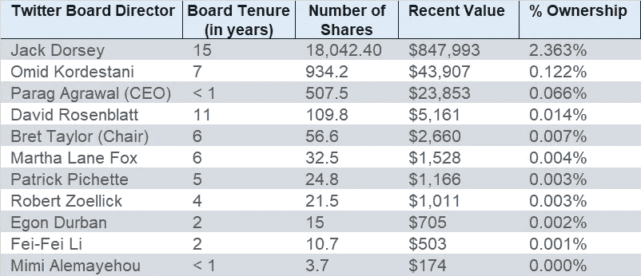
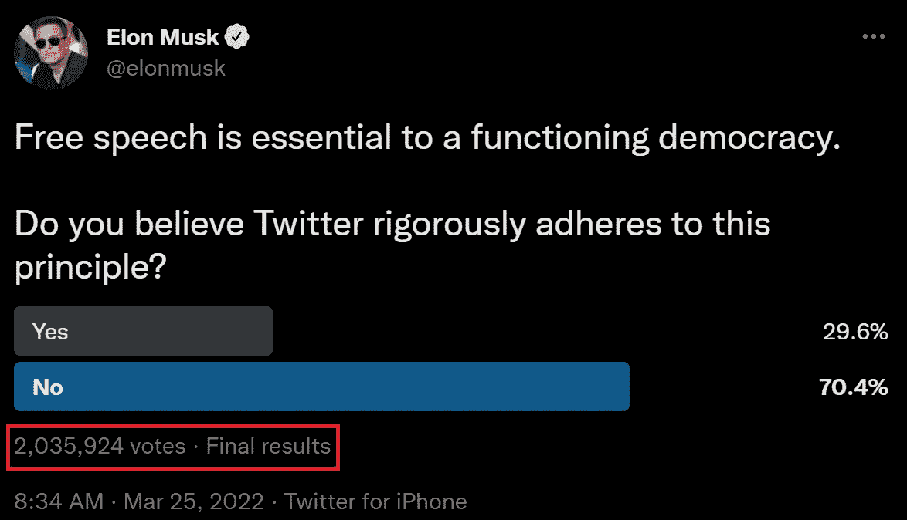
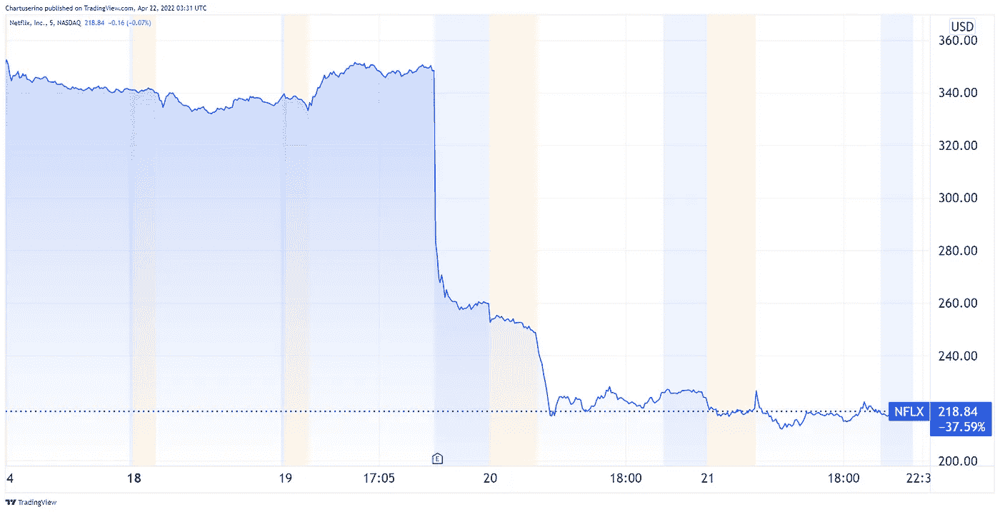
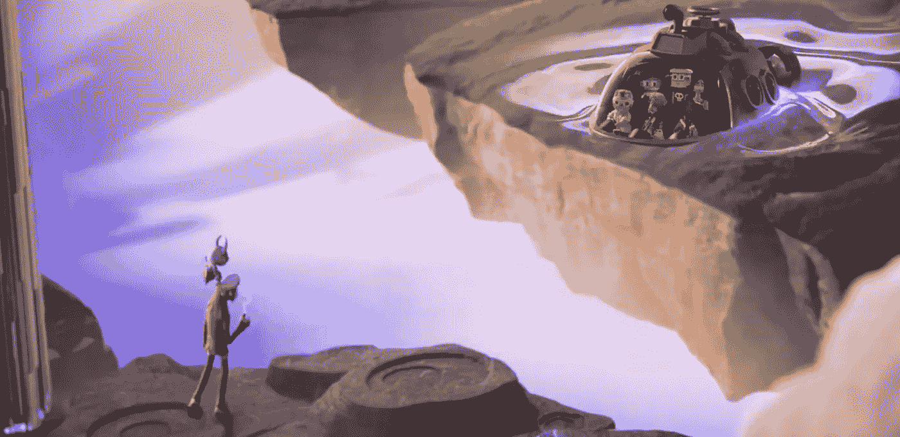
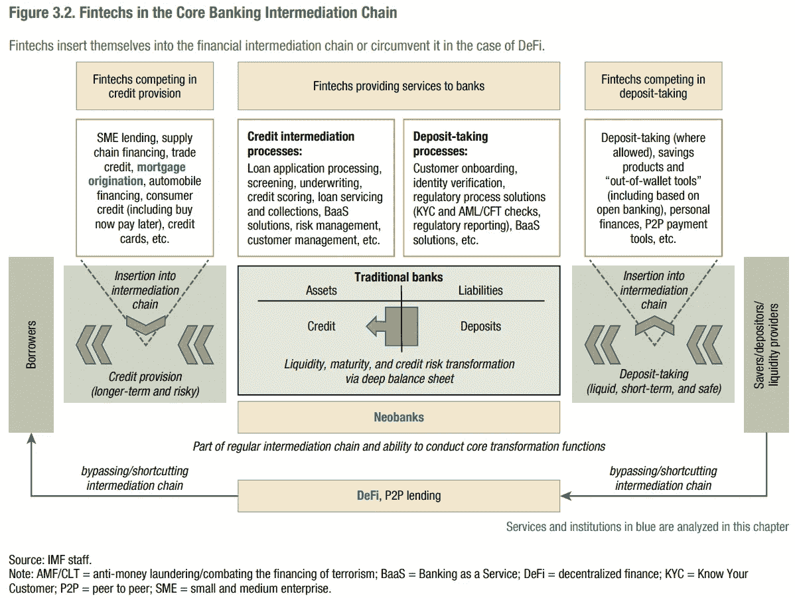
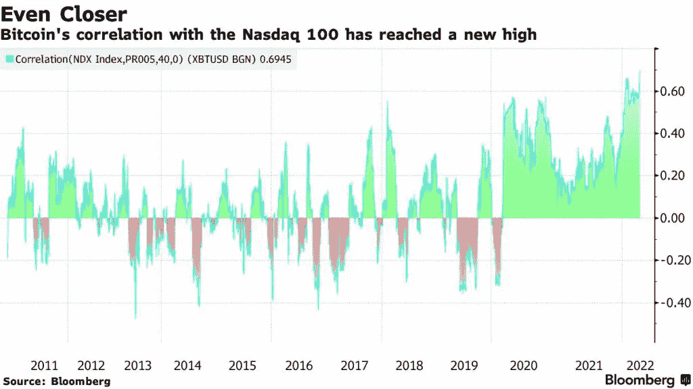
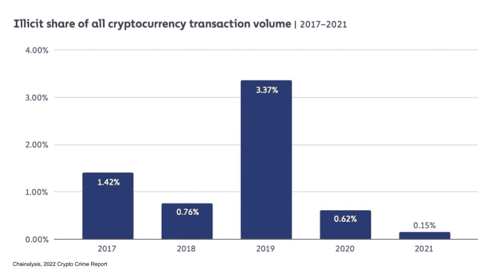
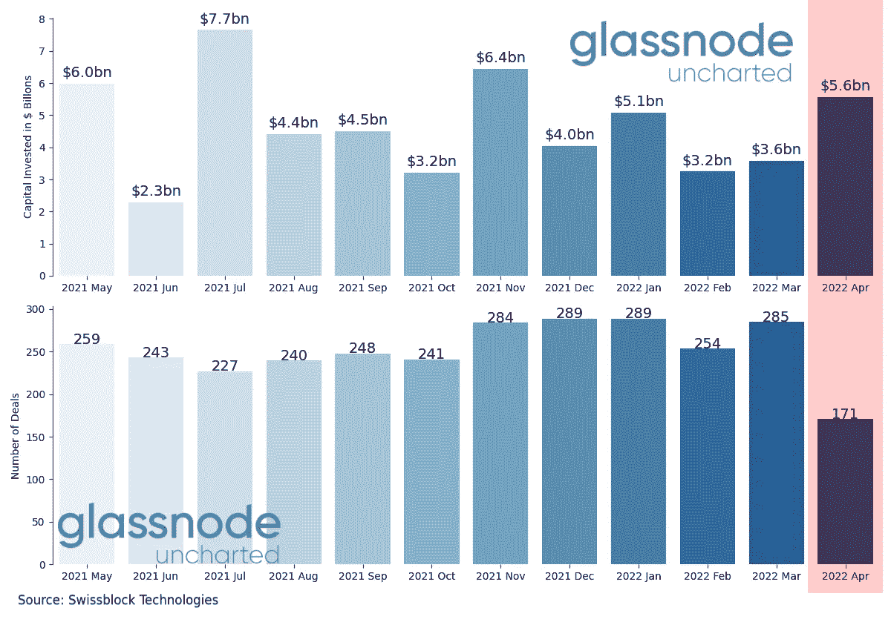
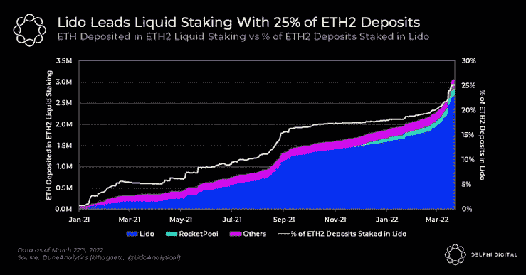

# 金融五分钟:以色列增加人民币储备，为什么 APECOIN 激增，网飞崩溃

> 原文：<https://medium.com/coinmonks/five-minute-finance-israel-adds-yuan-to-reserves-why-apecoin-surged-netflix-crash-e74fc065b739?source=collection_archive---------29----------------------->

# 5 分钟的金融时事通讯——解释发生了什么，为什么。

# 让我们看看这周发生了什么:

*   马斯克试图收购 Twitter 的最新消息
*   随着业务退出增长阶段，网飞股票暴跌
*   全新 ApeCoin 速度过去分散的土地，沙盒
*   由于 DeFi 令银行尴尬，国际货币基金组织建议资本管制
*   以色列增加人民币外汇储备

# Twitter 董事会似乎仍然坚决反对马斯克的收购

*   州长德桑蒂斯支持马斯克的推特出价，州养老基金拥有 946960 股 **(** [**链接**](https://tokenist.com/gov-desantis-supports-musks-twitter-bid-state-pension-fund-owns-946960-shares/) **)**
*   杰克·多西:推特董事会“一直是公司的功能障碍” **(** [**链接**](https://www.marketwatch.com/story/jack-dorsey-twitter-board-consistently-been-the-dysfunction-of-the-company-11650298956) **)**

# "埃隆·马斯克的推特传奇是资本主义失控了."《经济学人》

Twitter-Musk 传奇仍在继续。许多人一致反对马斯克的收购，不是从投资者的角度，而是出于对“非常真实的社会层面的伤害，如骚扰、错误信息和对精神健康的负面影响”的担忧。

如果按照经济学教科书来看，像 Twitter 这样市值 359.5 亿美元的大公司，会欢迎一个出价远高于市值 430 亿美元的投资者。然而，相反的事情发生了:

*   由于对 Twitter 对待言论自由的方式感到不满，埃隆·马斯克购买了 Twitter 9.1%的股份。
*   然而，马斯克需要至少 15%的股份才能真正影响公司的政策。
*   更棘手的是，如果马斯克加入 Twitter 董事会，他永远不会拥有超过 14.9%的流通股。

这导致马斯克出价 430 亿美元收购整个公司并将其私有化，因此他可以在没有董事会的情况下影响变革。如果发生这种情况，由 11 名成员组成的董事会将不再以现金和股票奖励的形式集体获得 290 万美元的薪酬。

有趣的是，除了最初的创始人杰克·多西之外，董事会成员持有的 TWTR 股份少之又少:

*形象代言人*

正是从这个被剥离的位置，他们可以触发所谓的“毒丸”战略。通常情况下，董事会成员有法定的信托义务为他们的股东服务。这将意味着以溢价将该公司出售给马斯克。然而，他们还有一个来自 1985 年特拉华州最高法院判例的法律选择。

这种“毒丸”让他们能够通过稀释埃隆马斯克的股份来抵制收购。这怎么可能？给予 Twitter 股东支付 210 美元购买价值 420 美元 Twitter 股票的权利。

当董事会成员认为稀释股票比收购更有利于股东时，这种可能性是由特拉华州最高法院设计和批准的。当然，就像任何编入法律的东西一样，这可能会被颠倒过来，以达到相反的目的。

然而，问题的关键不在于法律细节。相反，它正在使用书中的每一个技巧来防止 Twitter 落入某个在言论自由的保护伞下开创了整个事情的人的手中。虽然董事会声称为了公司的利益而部署毒丸，但绝大多数用户已经认为 Twitter 作为一个社交媒体平台是失败的。

*图片来源:* [*推特*](https://twitter.com/elonmusk/status/1507259709224632344)

杰克·多西已经对他将互联网集中到如此严格的程度表示了遗憾:

*“将发现和身份集中到公司确实损害了互联网。”*

不管你喜不喜欢，Twitter 的处境显然已经成为一个政治问题。佛罗里达州州长罗恩·德桑蒂斯直言不讳，将推特董事会形容为正统观念的执行者。

截至目前，马斯克似乎正在召集支持者，直接从股东手中收购 Twitter。马斯克正在获得一些支持——正如我们从州长德桑蒂斯那里看到的那样，他的养老基金拥有近 100 万股 TWTR 股票。

我们仍然不知道 Twitter 的未来会怎样，因为尘埃仍在落定。

# 网飞走出增长阶段进入巩固阶段

*   网飞上个季度失去 20 万用户，股价下跌 28%盘前 **(** [**链接**](https://tokenist.com/netflix-lost-200k-users-last-quarter-stock-down-28-pre-market/) **)**
*   网飞估计有 1 亿家庭共享密码，并暗示一场全球性的打击行动即将来临

# 网飞即将测试其用户群的忠诚度

网飞股市本周跌下了众所周知的悬崖，跌幅高达-37.59%。事实证明，向股东承诺一件事，然后兑现相反的承诺，并不是一个合理的商业策略。这家视频流媒体巨头预测，在 Q1 2022 年期间，用户数量将增加 250 万。

*图片信用:* [*交易视图*](https://www.tradingview.com/)

相反，网飞报告称净用户减少了 20 万。更糟糕的是，该预测现在已经转变为可怕的模式——预计在随后的 2022 个季度将再损失 200 万用户。这种低迷有很多原因。仅乌克兰与俄罗斯的冲突就导致了 70 万用户的损失。

迪士尼+、AppleTV+、HBOMax 和 Hulu 的竞争也在不断升级。也许，甚至最大的因素是如何看待这种服务。在 8.5%的疯狂通胀和拜登总统本人宣布的食品短缺的经济环境下，人们不会很容易将流媒体服务视为奢侈品。

此外，网飞的价值主张已经通过密码共享问题(我发誓，我不是其中的一部分)得到了清晰的体现。该公司估计，全球至少有 1 亿个家庭共享账户，其中美国和加拿大占 30%。在其成长阶段，网飞容忍密码共享，但随着最近的股灾，这个时代似乎即将结束。

如果网飞坚持到底，在分享账户时将人们拒之门外，这个平台的真正价值就会显现出来。这是一个不可阻挡的视频流巨头，还是人们会像来时一样容易离开？

[**享受 5MF？点击转发给三个朋友。**](mailto:info@tokenist.com?subject=Check+this+out+&body=I%E2%80%99ve+been+reading+Five+Minute+Finance,+and+I+know+you%E2%80%99d+enjoy+it+too.+It%E2%80%99s+a+weekly+email+that+covers+the+most+important+trends+in+finance.+I+learn+something+new+every+time+I+read+it!+Check+it+out+here:+https://tokenist.com/newsletter/?utm_source=email_gr_btn)

# 另一方面炒作推动宇迦实验室在元宇宙游戏的顶端

*   以 46 亿美元的价格，ApeCoin 的市值现在已经超过了分散土地和沙盒 **(** [**链接**](https://tokenist.com/at-4-6b-apecoins-marketcap-is-now-larger-than-decentraland-and-the-sandbox/) **)**
*   Meta Quest Gaming Showcase 上公布的每一款 VR 新游戏 **(** [**链接**](https://www.techradar.com/news/every-new-vr-game-announced-at-the-meta-quest-gaming-showcase) **)**

# 猿视野中的元宇宙

元宇宙到底是什么？

有人说这与社交有关，因为它让你可以轻松地按照自己的方式出去玩，包括你的虚拟角色是什么样子。其他人说这是一种逃避现实的方式，因为你可以在“现实生活”中做一些太危险、不可能或代价太高的事情。

虽然我们距离深入元宇宙还有几年时间，但毫无疑问，大量资金正在涌入这个虚拟生态系统。Axie Infinity 是先锋，在像菲律宾这样的国家，它将战术战斗与 P2E 游戏捆绑在一起，成为全职收入来源。

作为概念的证明，Axie Infinity 表现非常出色，在 2021 年创造了 13 亿美元的收入。反过来，宇迦实验室放出猿类，从区块链游戏/元宇宙馅饼中分得一杯羹，开始了一轮 4.5 亿美元的融资。ApeCoin (APE)将从 Otherside 开始，将所有宇迦项目的游戏/元宇宙活动令牌化。

除了这里展示的一个动画预告片之外，关于游戏将会如何进行还不太清楚。图片来源: [*推特*](https://twitter.com/yugalabs/status/1505014986556551172)

与此同时，Meta(脸书)在其 30 分钟的 Meta Quest 游戏展示中展示了 12 款新的 VR 游戏。可以说，开发时间短的游戏只能提供快速的街机般的体验。

然而，虽然元游戏可能很多，但没有一个是区块链游戏。因此，用户仍然没有能力将游戏与加密货币/NFT 交易合并。有一种硬币叫做脸书元宇宙(FACEMETA)，但它几乎肯定是一个骗局。在放弃 Diem stablecoin 之后，Meta 似乎正在寻求“ [Zuck Bucks](https://tokenist.com/zuck-bucks-could-be-metas-second-attempt-at-a-centralized-digital-currency/) ”来推动其元宇宙项目。

然而，据《金融时报》报道，这也不太可能是区块链的资产。相反，Meta 将把代币锁定在其平台上，使其成为一种标准的游戏内货币，类似于 Roblox 的 Robux 或堡垒之夜的 V-Bucks。这些不是可交换的加密货币，而是符合该词原意的游戏内代币。

那么，元宇宙的狂热爱好者们又该何去何从呢？要么受制于元规则，其虚拟资产销售大幅削减 47.5%，要么受制于开放的猿类平台。由于 ApeCoin 已经发展得比分散土地和沙盒更大，因此似乎不缺乏对更开放方法的需求。

# 由于 DeFi 令银行尴尬，国际货币基金组织建议资本管制

*   UST 67%的需求来自于主播协议:Stablecoin 现在第三大 **(** [**链接**](https://tokenist.com/67-of-usts-demand-comes-from-anchor-protocol-stablecoin-now-3rd-largest/) **)**
*   DeFi 和 FinTech 可能挑战传统中介:IMF 报告 **(** [**链接**](https://tokenist.com/defi-and-fintech-could-challenge-traditional-intermediaries-imf-report/) **)**

# 主播成为高产农业的新国王

CBDCs 和 stablecoins 有明显的区别。但是实际上，stablecoins 是 CBDCs-lite。尽管美联储没有直接控制与美元挂钩的稳定货币，但它们是美元在区块链空间的镜子。

美联储很清楚这一点，因为它注意到一年内稳定的 500%的货币市场增长。现在市场规模达到 1867 亿美元，stablecoins 显示了人们真正想要的东西:

*   无摩擦、无边界支付，全天候可用。
*   价格稳定与秘密波动相反。
*   高利率收益。

CBD 旨在实现前两个目标。然而，第三个特征不太可能来自于依赖商品的发展中国家。毕竟几十年来都不是这样。

*图片来源:* [*内幕*](https://www.businessinsider.com/personal-finance/average-money-market-interest-rate)

稳定货币是 CBDCs 和加密货币的混合体。具体来说，TerraUSD (UST)在 Terra 的锚协议上有高达 20%的利率收益。只需将 UST 存入锚中，你就可以成为流动性提供者，获得传统金融无法想象的收益。

这部分是因为前两个 stablecoin 功能的需求高于可用供应。进而导致异常收益率。

出于这个原因，自 2021 年初以来，算法担保的 UST 增长了近 100 倍，现在成为第三大稳定币，市值 179 亿美元。

可以预见的是，其中 125 亿美元的需求来自高收益债券。虽然如此高的收益率是否能长期持续值得怀疑，但卢纳护卫基金会(Luna Guard Foundation)正继续用大量比特币支持 UST 的抵押品。目前，Terra(在 LFG 的监管下)持有 42，530 股 BTC，价值约 17 亿美元。

与此同时，国际货币基金组织(IMF)将这种对央行的庇护视为一种责任。虽然基金组织认识到，像 Terra 这样的 DeFi 平台消除了对大量中介的需求，但它也认为消除这一链条是一个更大的弱点。

*图片来源:* [*IMF 金融稳定报告*](https://www.imf.org/en/Publications/GFSR/Issues/2022/04/19/global-financial-stability-report-april-2022)

国际货币基金组织在其报告中得出结论，由于直接监管 DeFi 极其困难，因此可以通过控制集中交易所和稳定的货币来实现。

这里有什么外卖？很明显，国际货币基金组织认识到了 DeFi 的一些重要好处。但出于监管的考虑，可以有把握地认为，资本管制最终会以某种方式进入这个领域。

# 随着以色列增加人民币，全球储备货币正在发生变化

*   德国商业银行申请本地加密许可证 **(** [**链接**](https://www.coindesk.com/business/2022/04/21/germanys-commerzbank-applies-for-local-crypto-licence-report/) **)**
*   以增加人民币储备至 2060 亿美元为‘哲学’改变 **(** [**链接**](https://finance.yahoo.com/news/israel-adds-yuan-206-billion-093856435.html) **)**

# 人民币在央行储备中的受欢迎程度将会上升

整个 2022 年，比特币投资者不断失望。价格疯狂上涨的日子似乎已经过去了。虽然有一些时期触及 45000 美元的区域，但 BTC 价格一直回落到 40000 美元或更低。对这种停滞的解释依然坚定不移。

比特币可能是加密系统的木星，但美联储是货币系统的太阳。因此，比特币受到美联储货币紧缩政策的威胁，就像它对科技成长股有抑制作用一样。

机构比特币投资者增加了其对美联储货币政策的脆弱性，比特币与股票的高度相关性就证明了这一点。图片来源: [*彭博*](https://www.bloomberg.com/)

然而，如果对欧洲美元体系的信任在俄罗斯制裁的反效果中减弱，它们会去哪里？以色列央行正在进行一项根本性的转变，即多元化投资人民币。中国有史以来第一次增持了价值 40 亿美元的人民币，约占其 2，060 亿美元外汇储备的 2%。

同样，以色列的欧元份额从 30%下降到 20%，为十年来最低。尽管美元仍占 61%的主导地位，但也低于此前 66.5%的货币组合。如果这引发了信心蒸发的趋势，那么 10 年后欧元将何去何从？

或许，变成比特币。由于没有任何央行干预其供应，许多投资者将其视为可行的通胀对冲。比起一个没有国家的比特币，欧洲人和美国人会更信任中国人吗？德国第二大商业银行德国商业银行(CBK)无疑给了我们一个线索。

CBK 不仅准备提供加密货币交易和托管服务，而且该银行本身也部分归政府所有。如果申请通过，它将为超过 1880 万个私人账户和超过 70，000 个企业客户打开加密之门。换句话说，它将进入价值数万亿美元的资金池。

# 本周推特

> 特斯拉仍持有 1.26 亿美元比特币

[**@ BTC _ 档案**](https://twitter.com/BTC_Archive/status/1517063311325597696)

> 尽管最近的一份报告发现非法活动占加密量的 0.15%，但国际货币基金组织仍坚持更严格的标准。
> 
> 此外，不要忘记反洗钱政策仅影响了 0.05%的犯罪资金。
> 
> 这似乎更多的是为了控制而不是阻止犯罪。

[**@samcallah**](https://twitter.com/samcallah/status/1517170948482363392)

> Justin Sun 将模仿 Terra 推出一种算法稳定的货币 USDD，并筹集 100 亿美元的准备金，TRON DAO Reserve 将将其基本无风险利率设定为每年 30%。

[**@ Wu 区块链**](https://twitter.com/wublockchain/status/1517124429737648129)

> 2022 年 170 亿美元的 VC #Cryptos 投资和+1k 交易。今年的交易规模中值最高，为 450 万美元
> 
> 资本正流入#BTC 和#替代硬币，为强劲复苏做准备。👉[https://bit.ly/37OG5ka](https://bit.ly/37OG5ka)

[**@Negentropic_**](https://twitter.com/Negentropic_/status/1517194786670796801)

> 一种自我强化的网络效应正在迅速将越来越多的股份注入利多。

[**@LynAldenContact**](https://twitter.com/LynAldenContact/status/1516467952807301123)

# 加入五分钟金融时事通讯。

[Sign up here — it’s free.](https://tokenist.com/newsletter/?utm_source=getresponse&utm_medium=email&utm_campaign=thetokenist&utm_content=%E2%9C%8B%20FMF%3A%20BoA%20Readying%20for%20BTC%2C%20Pot%20Goes%20Federal%2C%20More%20Inflation)

[t.me/thetokenist](http://t.me/thetokenist?utm_source=getresponse&utm_medium=email&utm_campaign=thetokenist&utm_content=%E2%9C%8B%20FMF%3A%20BoA%20Readying%20for%20BTC%2C%20Pot%20Goes%20Federal%2C%20More%20Inflation)

[twitter.com/thetokenist](https://twitter.com/thetokenist)

> 加入 Coinmonks [电报频道](https://t.me/coincodecap)和 [Youtube 频道](https://www.youtube.com/c/coinmonks/videos)了解加密交易和投资

# 另外，阅读

*   [OKEx vs KuCoin](https://coincodecap.com/okex-kucoin) | [摄氏替代品](https://coincodecap.com/celsius-alternatives) | [如何购买 VeChain](https://coincodecap.com/buy-vechain)
*   [币安期货交易](https://coincodecap.com/binance-futures-trading)|[3 comas vs Mudrex vs eToro](https://coincodecap.com/mudrex-3commas-etoro)
*   [如何购买 Monero](https://coincodecap.com/buy-monero) | [IDEX 评论](https://coincodecap.com/idex-review) | [BitKan 交易机器人](https://coincodecap.com/bitkan-trading-bot)
*   [CoinDCX 评论](/coinmonks/coindcx-review-8444db3621a2) | [加密保证金交易交易所](https://coincodecap.com/crypto-margin-trading-exchanges)
*   [红狗赌场评论](https://coincodecap.com/red-dog-casino-review) | [Swyftx 评论](https://coincodecap.com/swyftx-review) | [CoinGate 评论](https://coincodecap.com/coingate-review)