# 五分钟金融:泄露的 TERRA 聊天记录，比特币的衰退测试，NFTS 一文不值？

> 原文：<https://medium.com/coinmonks/five-minute-finance-leaked-terra-chat-logs-bitcoins-recession-test-nfts-worthless-3efd90bacd9b?source=collection_archive---------36----------------------->

# 5 分钟的金融时事通讯——解释发生了什么，为什么。

# 让我们看看这周发生了什么:

*   白宫:全体人员齐心协力对抗通货膨胀
*   为什么比特币要发挥全部潜力需要教育
*   Terra 的崩溃:内部聊天记录泄露
*   大多数 NFT“毫无价值”,但他们不会去任何地方
*   欧佩克+将增加石油产量

# 拜登-鲍威尔-耶伦会议:为什么如此重要

*   拜登总统与美联储主席鲍威尔会面，通胀仍是当务之急 **(** [**链接**](https://tokenist.com/president-biden-and-fed-chair-powell-meet-as-inflation-remains-top-priority/) **)**
*   首席执行官们警告说，美国家庭正在以惊人的速度消耗储蓄，并可能在几个月内耗尽

# 如果美联储错误计算了“暂时性”通胀，我们能相信“软着陆”的预测吗？

在虚构的沙丘宇宙中，“谁控制了香料，谁就控制了宇宙。”这个原则准确地解释了我们的世界，在这里“香料”是金钱，“宇宙”是经济。在《沙丘》,香料让超光速(FTL)旅行成为可能，而在我们的(世俗)世界，金钱让贸易成为可能。

鉴于货币控制所蕴含的巨大责任，美联储独立于美国政府制定并实施货币政策。原因很重要:否则，美国总统(任期四年)可以为了短期利益而改变货币政策，以提高他们的评级，从而增加他们成功连任的机会。然而，短期利益往往会带来毁灭性的长期弊端，这对货币和消费者都是不利的。

这就是为什么本周的鲍威尔-拜登-耶伦峰会如此重要。随着拜登总统的支持率现在达到 39%，他不得不控制通货膨胀，因为关于衰退的谈论仍在幕后隐现。过去两年，美联储和欧洲央行(ECB)都注入了数万亿美元/欧元来提振经济:

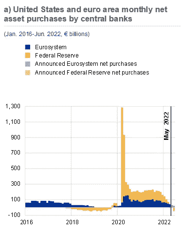

*图片信用:* [*欧洲央行*](https://www.ecb.europa.eu/pub/financial-stability/fsr/html/ecb.fsr202205~f207f46ea0.en.html)

这一结果是可以预见的，因为美国通胀率比美联储 2%的目标高出了 3—4 倍。此外，欧盟的情况也不乐观。欧盟的经济引擎德国的通货膨胀率为 7.9%，是自 20 世纪 70 年代以来的最高水平。随着[俄国继续切断对拒绝用卢布付款的国家的天然气供应，预计情况只会变得更糟。](https://www.businessinsider.com/russia-cut-natural-gas-to-germany-shell-refused-ruble-payment-2022-6)

尤其不和谐的是美国财政部长耶伦在峰会后的声明。她说:“*当时我对通胀将走的道路*判断错误。(提醒一下，这是美国财政部长和鲍威尔的前任在讲话)。毫无疑问，耶伦的情况极其怪异。毕竟，毕业于耶鲁大学的耶伦在发表那些“暂时性通胀”言论时只是少数。

美元历史上最大的货币供应量增加不应该降低美元的购买力，从而引发通货膨胀？

不管怎样，美联储现在正在采取措施，试图纠正我们目前的状况。随着美联储开始缩减其 8.9 万亿美元的资产负债表，我们可以预计 6 月份将有更多加息。

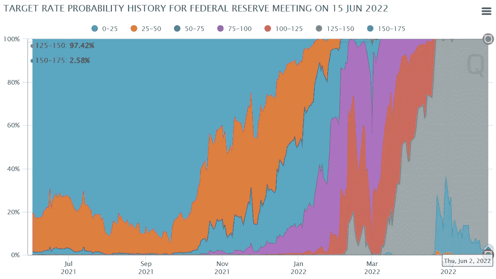

*6 月加息概率在 97.42% 125–150 个基点(1.25–1.5%)图像信用:* [*CME 集团*](https://www.cmegroup.com/trading/interest-rates/countdown-to-fomc.html) 。

这无疑会使消费者和企业贷款更加昂贵，而此时个人储蓄率正处于 4.4%的 14 年低点。换句话说，高通胀+高支出的组合导致消费能力下降，伴随着经济降温。这就是为什么人们越来越担心经济衰退即将来临。

# 比特币能解读货币市场信号吗？

*   长期衰退对比特币意味着什么？ **(** [**链接**](https://tokenist.com/what-would-a-long-lasting-recession-mean-for-bitcoin/) **)**
*   比特币的采用很大程度上取决于增加的知识 **(** [**链接**](https://block.xyz/2022/btc-report.pdf) **)**

# 比特币的衰退测试可能即将到来

在央行的世界里，很容易理解一项全新资产的价值会变得模糊不清。当美联储走上通过缩减资产负债表来提高利率的道路时，我们现在看到了这一点。所有那些依赖廉价资本的公司都在承受损失，因为美联储需要给经济降温。

比特币这样的替代品呢？比特币不受制于不断变化的货币政策，而是依靠人们通过算法强制执行的政策来理解其价值，这种政策不可能在一夜之间改变。

当然——所有这些听起来都很棒。但是——比特币出现在 2009 年，就在大萧条结束的时候。

由于这个原因，比特币未经测试，因此很难对未来的衰退做出正确的预测。2020 年 2 月至 3 月出现了一次小型衰退。在这两个月里，比特币从 8800 美元涨到 6500 美元，最终收于近 3 万美元。然而，增长型科技股遵循了类似的路径，比特币自年以来与纳斯达克 100 指数的高度相关性就证明了这一点。

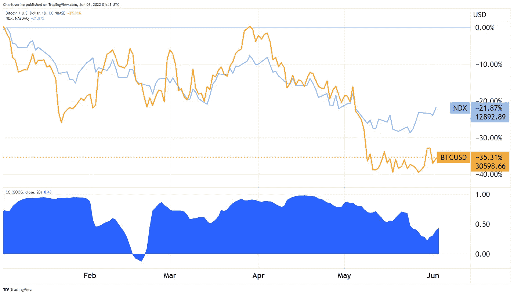

*BTC 和 NDX 之间的相关性基本上接近其最大值 1。图片来源:* [*交易视图*](https://www.tradingview.com/)

所以比特币的*感知*才是关键因素。它会被视为科技股，类似于收益率更高的黄金，还是会与比特币最初的愿景相一致——成为央行的替代品？而且，有多少人会采用比特币？

如果世界在微观战略层面采用比特币，并使用其闪电网络进行支付，美联储的优势似乎会消失。但是，对比特币的认知可能永远达不到这样的程度。

Block(前 Square)最近的一份报告深入探讨了围绕比特币当前看法的情绪。首先，处于收入低端的人往往不太看好比特币的前景。

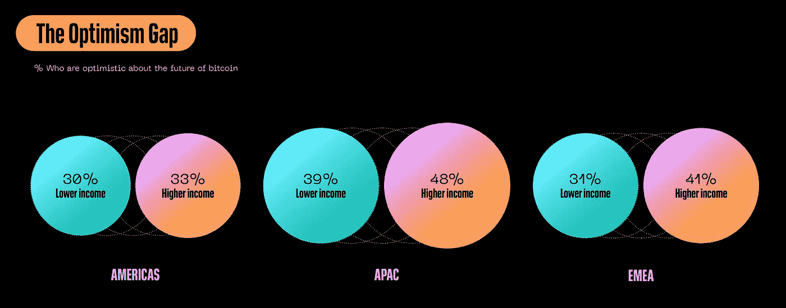

*图片来源:*[*block . XYZ*](https://block.xyz/2022/btc-report.pdf)

这很有意义，因为他们没有打错电话的奢侈。此外，乐观主义的力量从何而来？当然，来自知识，因为它孕育自信。缺乏知识仍然是阻碍比特币被广泛采用的主要原因。

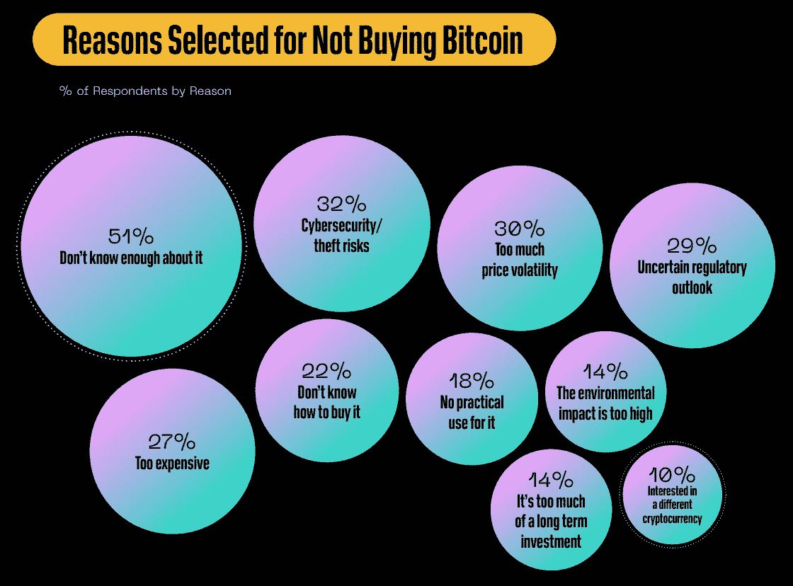

*图片来源:*[*block . XYZ*](https://block.xyz/2022/btc-report.pdf)

有了足够的知识，其他的理由就可以被侵蚀掉。比如“太贵”一旦理解了比特币的相对定价和单位分配就失去了动力。

最后，这都是关于感知和框架。没有正确的知识，人们会受到任何流行的和“容易理解”的看法的影响。

[**享受 5MF？点击转发给三个朋友。**](mailto:info@tokenist.com?subject=Check+this+out+&body=I%E2%80%99ve+been+reading+Five+Minute+Finance,+and+I+know+you%E2%80%99d+enjoy+it+too.+It%E2%80%99s+a+weekly+email+that+covers+the+most+important+trends+in+finance.+I+learn+something+new+every+time+I+read+it!+Check+it+out+here:+https://tokenist.com/newsletter/?utm_source=email_gr_btn)

# Terra 的多层骗局正在剥离

*   纳西姆·塔勒布称卢娜是一个庞氏骗局，将杜康比作伯尼·麦道夫 **(** [**链接**](https://tokenist.com/nassim-taleb-calls-luna-a-ponzi-scheme-compares-do-kown-to-bernie-madoff/) **)**
*   Terra Validator 泄密聊天揭示团队如何应对 UST 危机 **(** [**链接**](https://tokenist.com/terra-validator-leaks-chat-revealing-how-team-responded-to-ust-crisis/) **)**

# 泰拉的纸牌屋

当我们对 Terra 的衰落了解得越来越多时，情况变得越来越糟糕。《黑天鹅》(The Black Swan)一书的作者纳西姆·塔勒布(Nassim Taleb)探讨了稳健和脆弱的概念，他直截了当地说，权道是庞氏骗局艺术家伯尼·麦道夫(Bernie Madoff)的加密版。

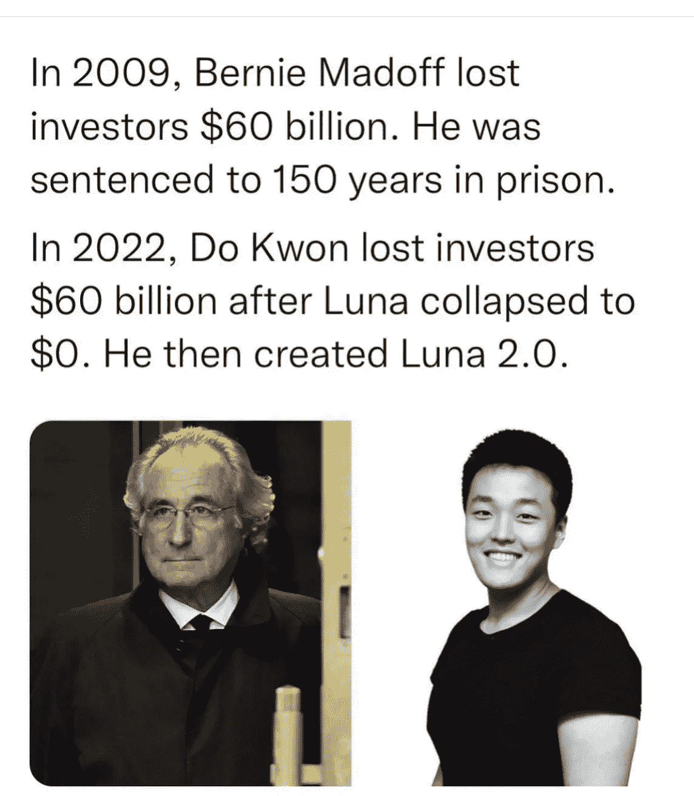

*图片来自* [*推特*](https://twitter.com/) *。*

权和麦道夫都依靠扩大金字塔的底部来使它不倒塌。同样，两者都造成了高达 650 亿美元的财富损失。关键的不同之处在于，权依靠区块链的新奇感和渴望来实现它:

*   不是我，市场波动太大了！
*   不是我，算法稳定币是实验性的！
*   第一个 stablecoin Basis Cash (BAC)也失败了没关系。第三次是一种魅力！

说到透明度，一份所谓的 Terraform Labs(TFL)电报聊天记录本周被泄露。它显示了露娜崩溃期间发生的绝对混乱。没有人知道发生了什么事。

现在，又出现了一系列针对道权和泰拉的指控。最初泄露聊天记录的人声称 Kwon 和 Terra 以多种方式误导了他们的社区，包括:

*   谎称不知道即将到来的特拉区块链暂停，这与卢娜验证钱包转移不一致。
*   谎称约 30 亿美元的 UST 抵押品被用作钉住防御。相反，在挂钩崩溃后，这些资金被用作救助资金。
*   谎称发布新“黎明计划”的报告，为此 TFL 成员每月给自己 300 万 LUNA。
*   关于手机应用 Chai 的用户群撒谎。
*   关于露娜基金会守卫钱包使用权的谎言。不仅多重签名钱包不受 7 名 LFG 导演控制，而且只有权一人未经投票就清空了最后的卢娜/UST 硬币。

最重要的是，安全公司 BlockSec 最近披露并证实，Terra 的镜像协议 dApp 有一个重大漏洞。自 2021 年 10 月以来，这一代码漏洞造成了 9000 万美元的资金损失，直到上周才被 [BlockSec](https://twitter.com/BlockSecTeam/status/1530865203029499905) 曝光。事实上，BlockSec 证实了 FatManTerra 自己在这件事上的发现。

尘埃仍在沉降，而且可能会持续相当长一段时间。但有一点是清楚的:如果 Terra 要生存下去，Do Kwon 和 TerraForm 实验室还有很多清理工作要做。

# NFTs:不可持续的虚拟价值？

*   索拉纳的 NFT 市场变得拥挤:6 个卖家对应一个买家 **(** [**链接**](https://tokenist.com/solanas-nft-market-gets-crowded-6-sellers-for-every-buyer/) **)**
*   币安高管警告称，大多数非职能部门没有长期价值 **(** [**链接**](https://tokenist.com/binance-exec-warns-most-nfts-have-no-long-term-value/) **)**

# 不要把创造膨胀和 NFT 空间本身混为一谈

可以理解的是，NFT 经历了怀疑周期。对于门外汉来说，挂在低处的果子真的很便宜——“猿画的价格和一栋豪宅一样高？！“我们真的走到了文明的尽头，”。

这就是低挂水果通常被拽的方式。然而，这种观点遗漏了一点，那就是我们社会交往的很大一部分已经转移到了网络空间。网络空间的迁移意味着什么？

人们需要辨别他们的在线角色，就像他们在现实世界中一样。毕竟，整个行业和品牌存在的唯一目的就是将一个人与另一个人区分开来。Twitter 的“蓝色支票”本身就充分说明了社会地位信号和虚拟资产所有权的重要性。

作为独一无二且可验证的数字资产，非功能性数字技术完美地满足了这种本能需求。然而，迁移网络空间的道路充满了陷阱。最常见的情况是，它们以模仿者的身份出现，充斥着 NFT 市场，卖家远远多于买家，索拉纳就是这种情况。

众所周知，仅宇迦实验室的猿类就繁殖了数百只其他猿类。

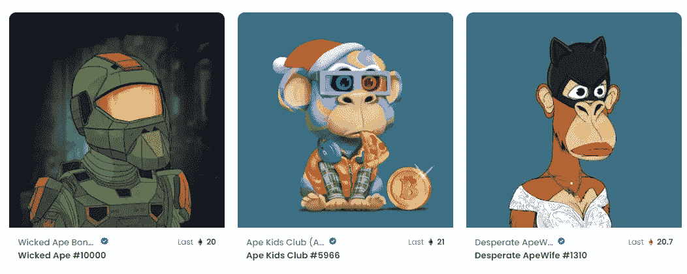

在这一点上，另一次猿类收集就像另一次日出一样确定无疑。图片来源: [*OpenSea*](https://opensea.io/)

这些项目背后的创作者并没有像宇迦实验室的另一边一样开发区块链游戏/元宇宙平台。这将增加它们的效用和长期价值。相反，他们希望依靠 NFT 的大肆宣传和盲目投机来快速获利。

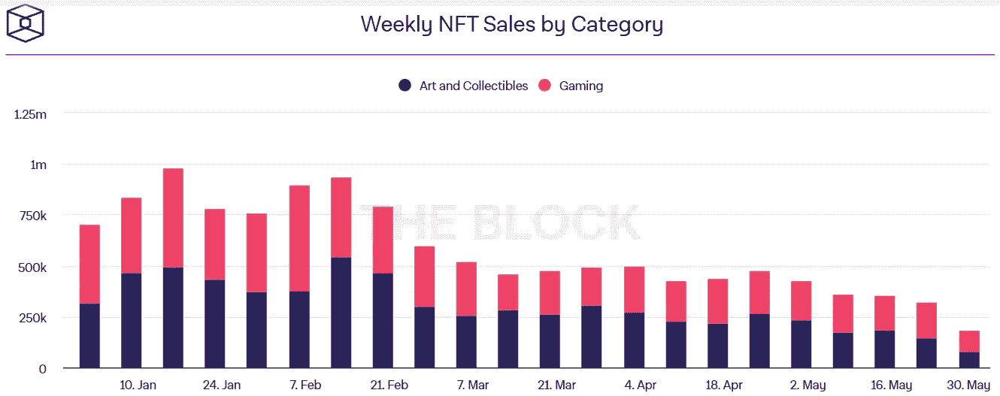

*与去年不同的是，2022 年迄今 NFT 的销售未能幸免于加密市场的低迷。图像来源:* [*区块*](https://www.theblockcrypto.com/)

总之，很难不同意这位币安高管所说的“大多数非功能性交易毫无价值”。大多数非功能性交易确实会归零，因为大多数都是机会主义垃圾。但这并不意味着 NFT 市场不会扩张。

非功能性食物对于造币厂来说是相当可行的。因此，企业家可以涌入市场，从炒作中获利。这种不平衡产生了一种错觉，即 NFT 作为一个整体注定要失败。

# 欧佩克+提高石油产量

*   随着俄国战争搅乱全球能源市场，欧佩克+提高产量的速度超过预期
*   石油输出国组织的石油交易太少，来不及降价 **(** [**链接**](https://www.barrons.com/articles/opec-oil-deal-russia-prices-51654184477) **)**

# 全世界都感受到了俄罗斯的制裁

由 24 个石油资源丰富的国家组成的欧佩克+将在拜登总统访问沙特阿拉伯之前增加石油产量，7 月和 8 月将日产量增加 648，000 桶，占全球石油需求的 0.7%。

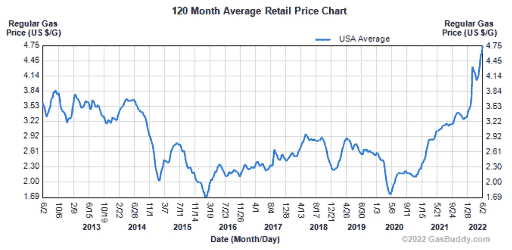

由于俄罗斯入侵乌克兰，美国的天然气价格达到了 20 多年来的最高水平，平均每加仑 4.7 美元。图片来源:

*不要与由 14 个国家组成并成立于伊拉克的经典石油输出国组织相混淆，欧佩克+还有另外 10 个非石油输出国组织国家，俄国是这些国家中最大的产油国。在这一点上，世界上大部分地区都感受到了俄罗斯制裁不可避免的影响，因为俄罗斯卢布已经成为 2022 年表现最佳的货币。*

*克罗地亚(北约成员国)总统米拉诺维奇最近[指出](https://www.euractiv.com/section/politics/short_news/russia-sanctions-not-functioning-croatian-president-warns/)同样:*

*俄罗斯没有感受到金融冲击，当它感受到的时候，战争就结束了。但代价将由欧洲公民支付，普京将保持他自鸣得意的笑容，石油和天然气将会流向其他地方，因为需求很高*

*谈到石油需求，石油输出国组织最近将 2022 年的全球需求预测下调了 21 万桶/日。这是因为它还将全球经济增长预测从 3.9%下调至 3.5%。*

*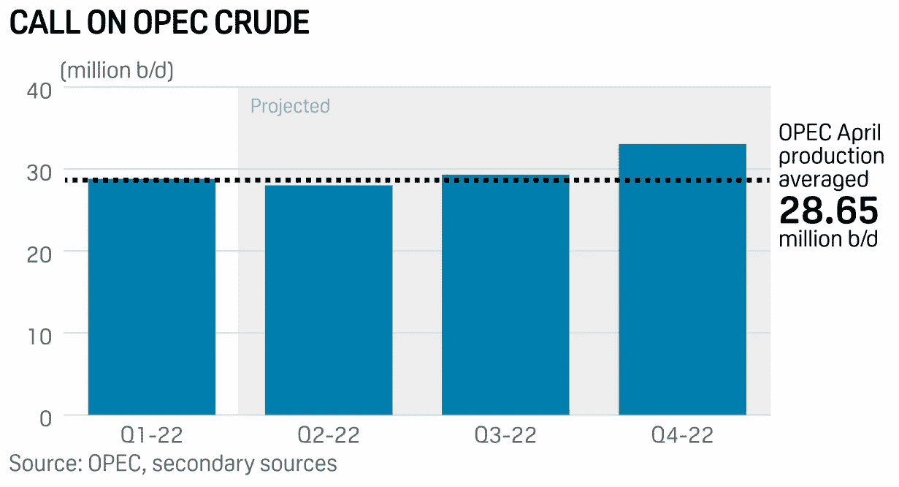*

**图片来源:* [*S & P 全局*](https://www.spglobal.com/commodityinsights/en/market-insights/latest-news/oil/051222-opec-cuts-oil-demand-forecast-but-sees-bigger-market-share)*

*同样，根据 [EIA](https://www.eia.gov/petroleum/production/) 的数据，3 月份美国国内石油产量增长超过 3%，为 2021 年 11 月以来的最高水平。考虑到所有这些推动供应的因素，我们今年可能会看到天然气价格下降。*

*也就是说，由于供应滞后，天然气价格可能会先涨后跌。摩根大通分析师认为，到 8 月份，这一数字将飙升 37%。不管是哪种情况，压低天然气价格，以及美联储缩减资产负债表规模，对于抗击通胀都至关重要。*

*一旦拜登总统定于 6 月份访问沙特阿拉伯，情况将变得更加明朗。*

# *本周推特*

*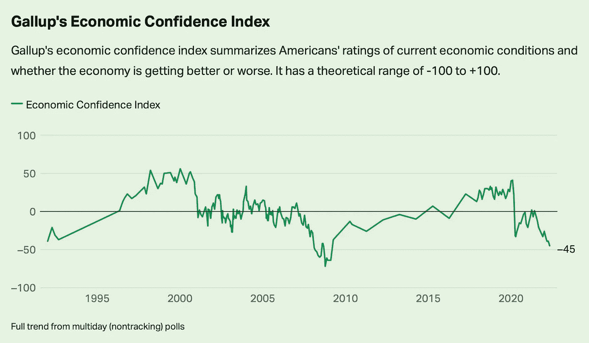*

> *来自@Gallup 的经济信心指数现在低于 2020 年的 COVID 衰退，尽管还没有下降到 GFC 的水平。*

*[**@ LizAnnSonders**](https://twitter.com/LizAnnSonders/status/1531956367258443776)*

> *完美风暴正在袭击欧洲*
> 
> *-作为商品净进口国受到挤压，经济梦游般地陷入衰退*
> 
> *-强大且不断扩大的通胀压力*
> 
> *——被迫为德国和意大利制定相同的货币政策*
> 
> *最重要的是:我们掌握在拉加德手中。*

*[**@MacroAlf**](https://twitter.com/MacroAlf/status/1532338241222938625)*

*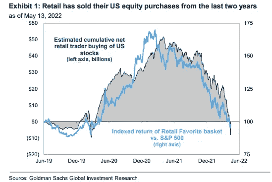*

> *零售部门已经出售了过去两年购买的所有美国股票——高盛*

*【T4**@ MikeZaccardi***

*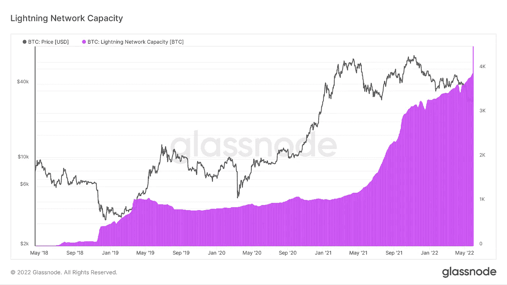*

> *尽管最近价格下跌，比特币闪电网络容量继续推升至历史新高。*
> 
> *尽管仍处于起步阶段，比特币的 L2 仍在持续增长；允许 BTC 作为交换媒介进行扩展。*

*【T8**@ wclementeii***

> *人们对#比特币感到困惑的一个主要原因是，他们正在为向具有强大网络效应的新兴货币体系的过渡定价。通过一个失败的例子。*
> 
> *以#比特币定价——所有价格都会随着时间的推移而下降。*

*[**@JeffBooth**](https://twitter.com/JeffBooth/status/1532332935570829312)*

# *加入五分钟金融时事通讯。*

**

*[Sign up here — it’s free.](https://tokenist.com/newsletter/?utm_source=getresponse&utm_medium=email&utm_campaign=thetokenist&utm_content=%E2%9C%8B%20FMF%3A%20BoA%20Readying%20for%20BTC%2C%20Pot%20Goes%20Federal%2C%20More%20Inflation)*

**

*[t.me/thetokenist](http://t.me/thetokenist?utm_source=getresponse&utm_medium=email&utm_campaign=thetokenist&utm_content=%E2%9C%8B%20FMF%3A%20BoA%20Readying%20for%20BTC%2C%20Pot%20Goes%20Federal%2C%20More%20Inflation)*

**

*[twitter.com/thetokenist](https://twitter.com/thetokenist)*

> *加入 Coinmonks [电报频道](https://t.me/coincodecap)和 [Youtube 频道](https://www.youtube.com/c/coinmonks/videos)了解加密交易和投资*

# *另外，阅读*

*   *[BigONE 交易所评论](/coinmonks/bigone-exchange-review-64705d85a1d4) | [电网交易 Bot](https://coincodecap.com/grid-trading)*
*   *[氹欞侊贸易评论](https://coincodecap.com/anny-trade-review) | [CoinSpot 评论](https://coincodecap.com/coinspot-review)*
*   *[新加坡十大最佳加密交易所](https://coincodecap.com/crypto-exchange-in-singapore) | [购买 AXS](https://coincodecap.com/buy-axs-token)*
*   *[投资印度的最佳加密软件](https://coincodecap.com/best-crypto-to-invest-in-india-in-2021) | [WazirX P2P](https://coincodecap.com/wazirx-p2p)*
*   *[西班牙 5 大最佳文案交易平台](https://coincodecap.com/copy-trading-spain)*
*   *[Pionex 双投](https://coincodecap.com/pionex-dual-investment) | [AdvCash 审核](https://coincodecap.com/advcash-review) | [秉持审核](https://coincodecap.com/uphold-review)*