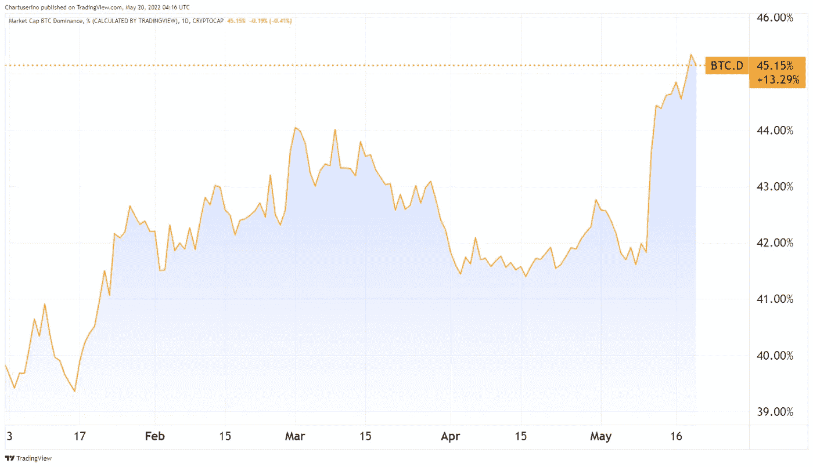
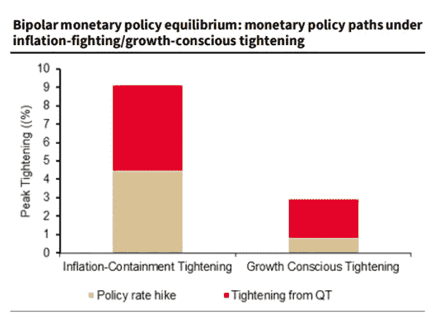
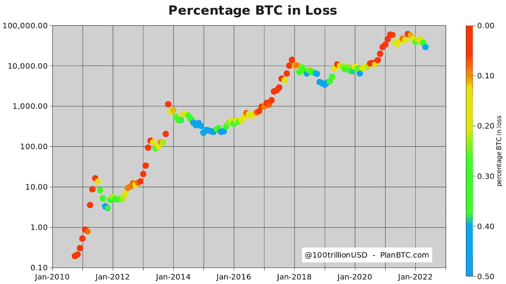
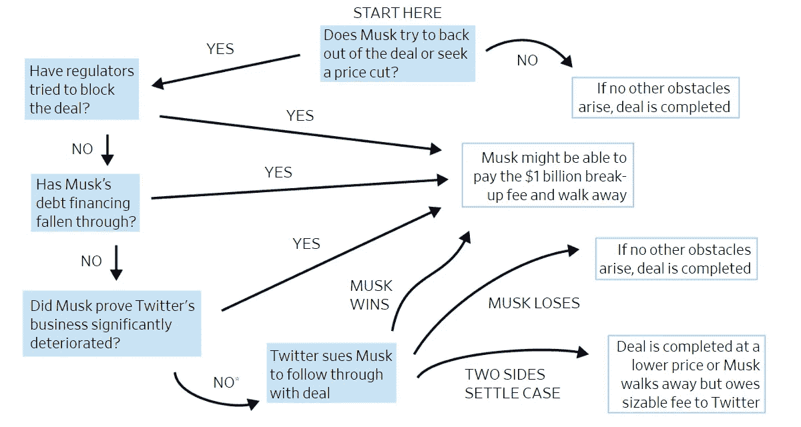
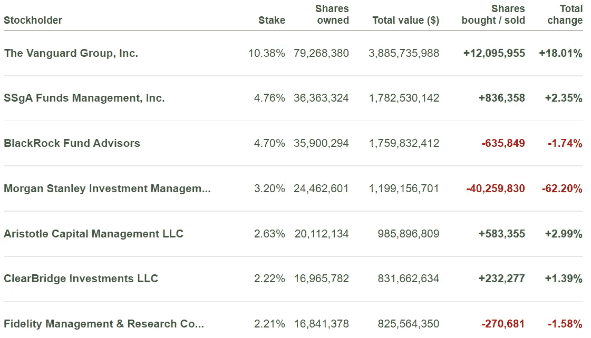
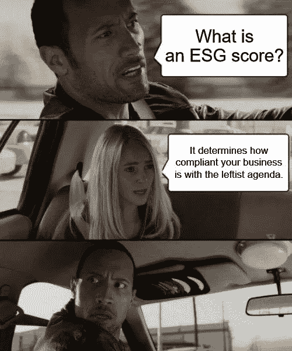
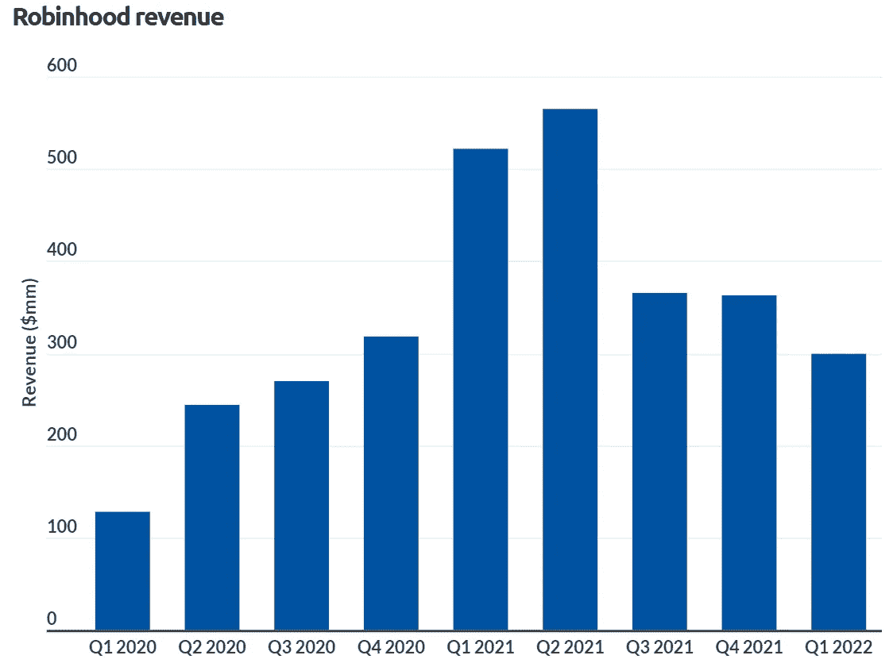
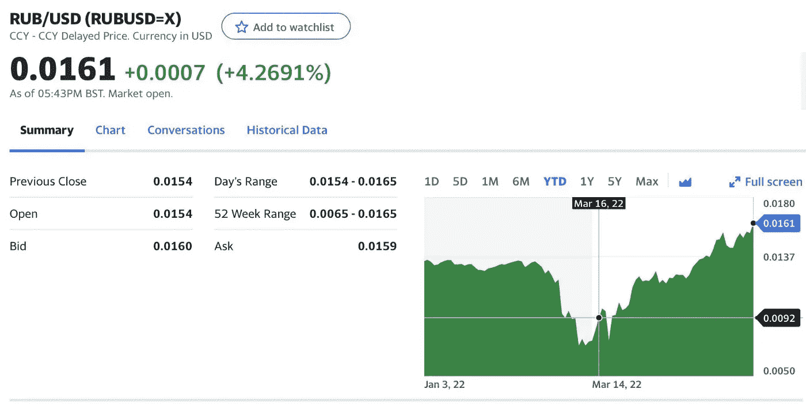

# 五分钟金融:罗宾汉的 DEFI 钱包将支付您的煤气费，ESG 觉醒，等等

> 原文：<https://medium.com/coinmonks/five-minute-finance-robinhoods-defi-wallet-will-pay-your-gas-fees-esg-awakening-more-84f96b530bf0?source=collection_archive---------26----------------------->

# 5 分钟的金融时事通讯——解释发生了什么，为什么。

# 让我们看看这周发生了什么:

*   比特币的加密市值优势得到提升
*   美联储的机动领域有多大？
*   Twitter 和 ESG:同一关系的两面
*   梅尔文资本关闭；散户熊出现了
*   罗宾汉将开创“免费”钱包体验

# 比特币重新获得加密优势

*   Terra 崩塌后韩国发射探测器；CEO 召见 **(** [**)链接**](https://tokenist.com/south-korea-launches-probe-after-terras-collapse-ceo-summoned/) **)**
*   随着加密市场萎缩至 1.3 万亿美元，比特币的统治地位达到年度高点 **(** [**链接**](https://tokenist.com/bitcoin-dominance-at-yearly-high-as-crypto-market-shrinks-to-1-3t/) **)**

# 五月的 Terra 恐怖周刷新了比特币的统治地位

尽管美联储量化紧缩(QT)带来了负面压力，比特币仍稳定在 3 万美元范围内。然而，在这个熊市停滞期，比特币正在夺回自己的统治地位。2020 年底，比特币占所有加密货币总市值的 70%。

随着以以太坊为首的智能合约平台开始大量生产 dApps，这种情况突然发生了变化，在接下来的一年中创造了 2230 亿美元的 DeFi 市场。由于加密市场的多元化，2022 年 1 月，比特币的主导地位触及低点，约占加密总市值的 40%。然而，在当前的熊市中，比特币的主导地位急剧上升。

*年初至今比特币统治地位图表。图片来源:* [*交易查看*](https://www.tradingview.com/)

这与 Terra 的清算周相吻合。第二大智能合约生态系统像岩石一样坠落，损失了 99.99%的价值(在一个多月的时间里抹去了 400 亿美元)。无论是 LUNA 还是比特币抵押品都无法捍卫 UST 的联系汇率制度，LFG 最终卖出了几乎所有的 8 万枚比特币。

Terra 的 400 亿美元的死亡螺旋占据了整个加密市场的 15-20 %,但它也重振了对 OG 数字资产的信心，增强了其统治地位。现在显而易见，为什么人们不希望在数字资产中增加额外的复杂性。

在事故发生后，随着韩国监管机构展开正式调查，我们还没有了解到有趣的细节。毕竟，这个曾经的高端加密项目对至少 20 万韩国投资者产生了负面影响。与此同时，Terra 的创始人权道(Do Kwon)提出了经典的解决方案——硬分流。

正如以太坊在 2016 年硬分叉以追回被盗资金，创建以太坊经典一样，跆拳道的目标是将 Terra 硬分叉为 Terra 经典。新的旧令牌将被称为 Luna Classic (LUNC)，与新的 Terra 链共存，但没有其毁灭性的 UST 算法 stablecoin via anchor 协议。

不管接下来发生什么，比特币正在接近整个加密市值的 50%。Web3 和智能合约平台准备颠覆现有的 Web2 平台，但它们的基础技术比比特币“简单”但安全可靠的编码实践要复杂得多。可以肯定的是，随着 Web3 的成长、成熟和发展，只会有更多的动荡。

[**享受 5MF？点击转发给三个朋友。**](mailto:info@tokenist.com?subject=Check+this+out+&body=I%E2%80%99ve+been+reading+Five+Minute+Finance,+and+I+know+you%E2%80%99d+enjoy+it+too.+It%E2%80%99s+a+weekly+email+that+covers+the+most+important+trends+in+finance.+I+learn+something+new+every+time+I+read+it!+Check+it+out+here:+https://tokenist.com/newsletter/?utm_source=email_gr_btn)

# 美联储的 QT 正在重新设定比特币的价格，但超过 50%的 BTC 持有者获利

*   随着市场对 QT **(** [**链接**](https://tokenist.com/correlation-between-crypto-and-stocks-volatility-grows-as-markets-react-to-qt/) **)** 的反应，加密和股票波动性之间的相关性也在增加
*   如果软着陆不可能，美国利率可能升至 9.25%:SocGen**(**[**链接**](https://tokenist.com/us-interest-rate-could-be-hiked-to-9-25-if-soft-landing-not-possible-gensoc/) **)**

# 轻柔的地毯拉扯与粗暴的飞机坠毁

在美联储最新的杂耍行动中，美联储正在慢慢地为市场准备着陆。由于美联储主席杰罗姆·鲍威尔(Jerome Powell)被赋予了如此大的权力，他的每句话都会像昔日的国王一样受到审查。在上周的采访中，他指出，最好的情况是“软着陆”，即使这样也可能超出美联储的控制。

当飞机隐喻被用于整个经济时，这真的不是一个好现象。飞机着陆时会发生很多事情。它可能会断成两半并爆炸，或者我们可能仅仅是 T21 在这个过程中失去几个轮子。

在这两种情况中，最激烈的一种是滞胀——当失业率和通货膨胀率都很高时，经济失去了动力。在更为正直的一端，随着几个轮子飞起来，在没有衰退的情况下消除了通货膨胀。这家法国银行的研究团队，兴业银行的 Quant Research，将可用的货币期权以图表的形式表现出来。

*图片来源:法国兴业银行 Quant Research*

左侧代表美联储量化宽松(QE)的逆转，即量化紧缩(QT)。这仅仅意味着美联储正在将其庞大的资产负债表从目前的 8.5 万亿美元降至 2020 年前的 3.9 万亿美元。通过这样做，它使得美元更加稀缺，从而提高利率并压低通胀。

用飞机来比喻，这一举措还会揭开股市的面纱，因为它已经非常熟悉由近零利率驱动的廉价资本。接下来的问题是，地毯应该被拉多远，拉多快？SocGen 建议，加息 9.5%才能真正有效地抑制通胀，而加息幅度只有这个数字的一半左右，仍能促进股市增长。

根据市场下滑的严重程度，我们可能会以衰退或滞胀告终。在中间地带，市场暂时处于低迷状态，人们的手在不停地拍打以保持平衡。话虽如此，[甚至埃隆·马斯克](https://www.businessinsider.com/elon-musk-says-us-in-recession-will-get-worse-2022-5)也认为衰退将持续 18 个月。

无论未来如何，央行的混乱正在重新设定比特币的价格。受到惊吓的投资者和短期持有者正在撤离。反过来，近 60%的 BTC 持有者仍然盈利，没有屈服于恐惧引发的抛售。

*尽管比特币价格下跌，超过 50%的 BTC 持有者仍然获利。图片来源:*[*PlanBTC.com*](https://planbtc.com/)

比特币稳定在 3 万美元左右，这意味着更多的强手在坚持。最终，这使得比特币对当前和未来的央行举措更具弹性。

# 马斯克对 Twitter 的收购会失败吗？

*   埃隆·马斯克搁置 Twitter 交易，特斯拉股价暴跌 **(** [**链接**](https://tokenist.com/elon-musk-puts-twitter-deal-on-hold-as-tesla-shares-plunge/) **)**
*   埃隆·马斯克的 Twitter 交易将何去何从，流程图 **(** [**)链接**](https://www.wsj.com/articles/where-elon-musks-twitter-deal-could-go-from-here-a-flowchart-11652961695) **)**

# 处于 Nexus 网络中心的 ESG

任何社会的权力关系都在很大程度上受到金融机构和媒体的影响。它们之间存在相互反馈，因为前者可能拥有后者。埃隆马斯克(Elon Musk)以 440 亿美元收购 Twitter，似乎打破了这种关系。

然而，马斯克必须利用他的特斯拉股票的健康状况来促成这笔交易。自从他在 4 月中旬提出这一提议以来，通过提供 62.5 亿美元的保证金贷款，特斯拉的股票下跌了约 30%。牢记这一点，马斯克正在拓宽他的选择。

取决于马斯克的债务融资动态如何发展，Twitter 交易可能会成功，也可能会失败。图片来源: [*华尔街日报*](https://www.wsj.com/articles/where-elon-musks-twitter-deal-could-go-from-here-a-flowchart-11652961695)

更大的问题是，nexus 能施加什么样的压力让马斯克不拥有 Twitter？那些关注去年 5 月加密市场崩盘的人可能还记得凯蒂·伍兹(Cathie Woods)的猜测，可能是贝莱德(BlackRock)促使马斯克公开谴责比特币是肮脏的，因为它消耗能量。

这将是同样的 10 万亿美元膨胀的贝莱德，拥有大量 Twitter 股份，连同其相互关联的资产管理公司 Vanguard 和其他基金。

*Twitter 的主要股东。图片来源:money.cnn.com*

它们的统一共性是推动 ESG——环境、社会和治理。这种模糊的评级框架是没有政府的政府，因为它标志着金融实体的好孩子行为。PayPal 的联合创始人彼得·泰尔在今年的比特币迈阿密大会上称 ESG 为“为敌人命名的仇恨工厂”。

最近，CFTC 董事长罗斯丁·贝南(Rostin Behnam)在本周举行的政治可持续发展峰会上抨击了比特币挖矿，这就是他的意思。一个负责保护公众免受期货和商品交易欺诈的机构成立了一个气候风险小组，你会感到惊讶吗？

或者说，在所有公司中，埃克森美孚是评级最高的 ESG 公司之一，而特斯拉本身[甚至没有进入 S & P 500 的 ESG 指数？一家电动汽车公司被从名单中除名，而排放大量碳的埃克森公司却被誉为环境、社会和治理奖得主，这有意义吗？](https://twitter.com/elonmusk/status/1526958110023245829)

马斯克当然不这么认为，根据他的推文:

*图片来源:埃隆马斯克的* [*推特账号*](https://twitter.com/elonmusk/status/1526961753619369987/)

优先考虑 ESG 和可持续消耗能源显然是一件好事。

但是，当埃克森美孚被标准普尔 500 的 ESG 指数评为全球十大 ESG 公司，而化石燃料行业最大的贷款人摩根大通也在该指数中，但特斯拉除外时，人们很难认真对待世界上“ESG”的实际概念。

# 梅尔文资本关闭，但零售也做得不好

*   雷伊·达里奥对冲基金买入 GME 和 Q1 AMC 股票 2022 **(** [**链接**](https://tokenist.com/ray-dailos-hedge-fund-bought-gme-and-amc-shares-in-q1-2022/) **)**
*   GameStop 血洗后 Melvin Capital 取消重塑计划 **(** [**链接**](https://www.marketwatch.com/story/melvin-capital-which-took-a-bath-on-gamestop-and-meme-stocks-to-close-funds-11652913330) **)**

# 普洛特金关门，迪亚洛收购 AMC 和 GME 股票

上个月，我们报道了 GameStop short squeeze 传奇的主要反面角色之一 Melvin Capital 正在进行重组。那个故事情节现在已经无效了。由于对 GameStop 的做空失败，该公司损失了 68 亿美元，累计亏损高达 54.5%。

似乎没有任何实质性的人支持梅尔文的裁员计划。Gabe Plotkin 在 2022 年累计额外亏损后，突然宣布永久关闭。随着该基金的消亡，普洛特金将在 5 月 31 日前赎回至少 50%的投资者现金，其余部分在 6 月 30 日前赎回。

GameStop 做空后，Melvin Capital 的回报再也没有恢复。图片来源: [*彭博*](https://www.bloomberg.com/news/articles/2022-05-18/gabe-plotkin-s-melvin-capital-to-wind-down-funds-after-losses) *。*

与此同时，GameStop 本月下跌了 30%，每周都在下跌。然而，这并不值得大书特书，因为整个零售市场正在暂停。沃尔玛(WMT)、百思买(BBY)和塔吉特(TGT)，市值 4150 亿美元，也是市场低迷的一部分。

零售业这个月整体表现不佳。图片来源: [*交易查看*](https://www.tradingview.com/)

考虑到我们当前的环境，这并不奇怪。我们正面临着几十年来最高的通胀率，俄罗斯在乌克兰的战争继续产生深远的影响，美联储的 QT 正在使资本更加昂贵。尽管如此，布里奇沃特对冲基金的亿万富翁雷伊·达里奥似乎认为人们会通过电子游戏和电影来逃避他们的痛苦。

该基金在 2021 年第一季度购买了超过 4000 股 GME 股票，以及超过 21000 股 AMC 股票。然而，与 Bridgewater 持有的价值近 250 亿美元的其他股票相比，Bridgewater 对 meme 股票的投入只是雷达上的一个光点。与 2018 年 3 月相比，该基金目前在 GME 的股份也微不足道，当时它持有 310 万股 GME 股票。

# 罗宾汉将进入 Web3/DeFi 竞技场

*   罗宾汉的 DeFi 钱包提供自由交易，但可能使用有争议的 PFOF 模式 **(** [**链接**](https://tokenist.com/robinhoods-defi-wallet-to-offer-free-trades-but-may-use-controversial-pfof-model/) **)**
*   Crypto.com 在显示错误价格后撤销卢娜交易 **(** [**链接**](https://tokenist.com/crypto-com-reverses-luna-trades-after-displaying-wrong-price/) **)**

# 即将推出的最受欢迎的无气钱包

每个系统都有它的优点和缺点。随着 Terra 的崩溃，集中交易所(CEXes)的一个弊端被曝光。Crypto.com 开始逆转涉及在特定时间框架内被错误定价的 LUNA 令牌的交易。

这个硬币肯定有两面:好处是存在一个集中的实体，可以试图纠正错误。缺点是用户有可能因为过度统治的中央实体而牺牲他们自己的自主权。虽然 CEX 是一个更方便的交易平台，通常具有更好的流动性，但没有任何交易可以通过 DEX 逆转，也不太可能出现定价错误。

此外，交易者可以使用非托管钱包来访问 DEXes，而不是依赖 CEXes 的托管钱包来保存你的私钥。如果第三方拥有您的私钥，您是否真正拥有资产？

我们现在在非保管钱包领域看到了一些非常有趣的事情:随着收入下降和用户增长，Robinhood 开始利用 DeFi。实现这一目标的最佳方式是成为下一个 MetaMask，拥有超过[2100 万](https://earthweb.com/metamask-statistics/)用户的最受欢迎的钱包。截至今年 3 月，罗宾汉已经拥有[2280 万](https://www.statista.com/statistics/822176/number-of-users-robinhood/#:~:text=Number%20of%20users%20of%20Robinhood%202014%2D2022&text=The%20number%20of%20users%20grew,as%20of%20second%20quarter%202021.)的认证用户，因此这是一次很好的匹配，以支撑日益减少的收入数字。

过去两年罗宾汉的收入。请注意，刺激措施促进了增长。图片来源:[*businessofapps.com*](https://www.businessofapps.com/data/robinhood-statistics/)

正如人们对这个零佣金先锋的期望一样，罗宾汉正在以无汽油交易的形式完善自己的业务。问题是，为了让罗宾汉支付你的汽油费，经纪人可能会依靠第三方流动性提供商来获得最佳的代币交换价格，并从中获得一定的回报。

这听起来对订单流支付(PFOF)是否熟悉，同样的商业模式引发了[数十起集体诉讼](https://tokenist.com/robinhood-now-faces-49-lawsuits-after-trading-restrictions/)并侵蚀了平台的声誉？尽管如此，区块链的交易在透明度方面比股票市场超前好几光年，所以这可能没多大关系。

如果新的 web3 钱包一切顺利，Robinhood 可能会在用户涌向新钱包和推广 DEXes 的同时结束一个坚实的兑换弧。

# 本周推特

> 美国市场正在发生一些有趣的事情。
> 
> 迈克尔·布里在苹果公司(AAPL)有一大笔空头头寸，这一消息于昨天曝光。沃伦·巴菲特最近也买入了更多的苹果股票。
> 
> 股票今天从+3%涨到了-2%。这是典型的牛市对熊市。

[**@abhymurarka**](https://twitter.com/abhymurarka/status/1527375993832255493)

> *80+的稳定密码面临最艰难的时刻*
> 
> 为了避免犯错误，你应该理解#stablecoin
> 
> *一个关于稳定型🧵的线程*

[**@ coin 98 洞察**](https://twitter.com/Coin98Insights/status/1526817015671197697)

> *《大功告成》*
> 
> *卢布现处于 4 年高点*

[**@ JordanSchachtel**](https://twitter.com/JordanSchachtel/status/1527329977695252481)

> *通货膨胀:*
> 
> *印度:7.79%，8 年来最高。*
> 
> *巴西:12.1%，26 年来最高。*
> 
> 美国:8.3%，为 1981 年以来最高。
> 
> 欧元区:7.5%，创历史新高。
> 
> 英国:7%，为 1992 年以来最高。
> 
> 土耳其:70%，为 2002 年以来最高。
> 
> 斯里兰卡:30%，为 1948 年以来最高
> 
> 德国:7.4%，为 1981 年以来最高

[@ askan shul](https://twitter.com/AskAnshul/status/1527247343187558400)

> *2022 年市场崩盘简单解释*
> 
> *(用模因和图形解释)*

🧵

[@ shivsakhuja](https://twitter.com/shivsakhuja/status/1526500880026963970)

# 加入五分钟金融时事通讯。

[Sign up here — it’s free.](https://tokenist.com/newsletter/?utm_source=getresponse&utm_medium=email&utm_campaign=thetokenist&utm_content=%E2%9C%8B%20FMF%3A%20BoA%20Readying%20for%20BTC%2C%20Pot%20Goes%20Federal%2C%20More%20Inflation)

[t.me/thetokenist](http://t.me/thetokenist?utm_source=getresponse&utm_medium=email&utm_campaign=thetokenist&utm_content=%E2%9C%8B%20FMF%3A%20BoA%20Readying%20for%20BTC%2C%20Pot%20Goes%20Federal%2C%20More%20Inflation)

[twitter.com/thetokenist](https://twitter.com/thetokenist)

> 加入 Coinmonks [电报频道](https://t.me/coincodecap)和 [Youtube 频道](https://www.youtube.com/c/coinmonks/videos)了解加密交易和投资

# 另外，阅读

*   [Bookmap 评论](https://coincodecap.com/bookmap-review-2021-best-trading-software) | [美国 5 大最佳加密交易所](https://coincodecap.com/crypto-exchange-usa)
*   最佳加密[硬件钱包](/coinmonks/hardware-wallets-dfa1211730c6) | [Bitbns 评论](/coinmonks/bitbns-review-38256a07e161)
*   [新加坡十大最佳加密交易所](https://coincodecap.com/crypto-exchange-in-singapore) | [购买 AXS](https://coincodecap.com/buy-axs-token)
*   [红狗赌场评论](https://coincodecap.com/red-dog-casino-review) | [Swyftx 评论](https://coincodecap.com/swyftx-review) | [CoinGate 评论](https://coincodecap.com/coingate-review)
*   [投资印度的最佳密码](https://coincodecap.com/best-crypto-to-invest-in-india-in-2021)|[WazirX P2P](https://coincodecap.com/wazirx-p2p)|[Hi Dollar Review](https://coincodecap.com/hi-dollar-review)
*   [加拿大最佳加密交易机器人](https://coincodecap.com/5-best-crypto-trading-bots-in-canada) | [KuCoin 评论](https://coincodecap.com/kucoin-review)