# 五分钟金融:航海家的麻烦，为什么卢布创下 7 年新高，更多

> 原文：<https://medium.com/coinmonks/five-minute-finance-voyagers-troubles-why-the-ruble-hit-a-7-year-high-more-dffc78d1f096?source=collection_archive---------47----------------------->

# 5 分钟的金融时事通讯——解释发生了什么，为什么。

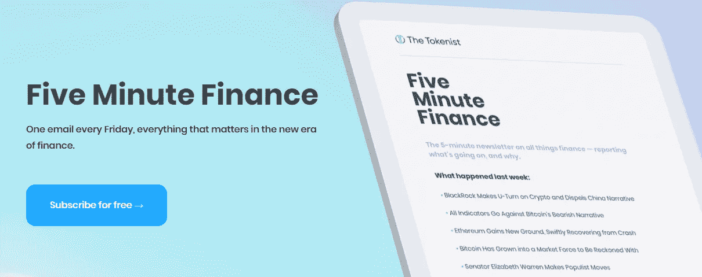

# 让我们看看这周发生了什么:

*   地球融化带来的永无止境的辐射
*   俄罗斯卢布坚挺但经济疲软
*   索伦德和“分权民主”的问题
*   衰退:从模糊的可能性到可能
*   SEC 对比特币投机的热爱

# 航海家数码是最新一个遭受分散加密传染的公司

*   航海家数字猛跌上三箭曝光，分析师降级 **(** [**)链接**](https://finance.yahoo.com/news/voyager-digital-requests-loan-repayment-115810503.html) **)**
*   CEL 触及 1.5 美元但“空头挤压”收益很快被抹去 **(** [**链接**](https://tokenist.com/cel-hits-1-5-but-short-squeeze-gains-quickly-wiped-out/) **)**

# 从空杯子倒到期待的手中

当形势好的时候，投资者通常会承担更多的风险。他们看到他们的朋友吹嘘从“只涨不跌的石头”中获得的收益，最新的 NFT 不仅仅是一个模糊的 jpeg，或者 BTC 如何在轨道上达到 10 万美元。当你看到其他人都赢了，很自然的就会想加入进来，也分一杯羹。

众所周知，这方面的最新迭代涉及 Terra (LUNA)。Terra 通过其锚定协议(现已死亡)获得的 19.5% APY 对许多人来说太好而无法抗拒。毕竟，美国储蓄账户的全国平均 APY 约为 0.06%。

不幸的是，消极的后果仍然存在。从坟墓中，Terra (LUNA)仍然伸出冰冷的死手，试图将 VC 资本拉下来。三箭资本公司(Three Arrows Capital)对 LUNA 的敞口为 2 亿至 4.5 亿美元。截至 4 月份，3AC 估计拥有 100 亿美元的加密资产，这一数字自那时以来已大幅下降。

特别是，年初至今，以太坊下跌了近 70%，也拖累了 staked Ethereum (stETH)。3AC 和 Celsius Network 都依赖 stETH 来获取客户的收益。一个是对冲基金(3AC)，另一个是贷款平台(Celsius)，但这两个平台实际上都已倒闭。

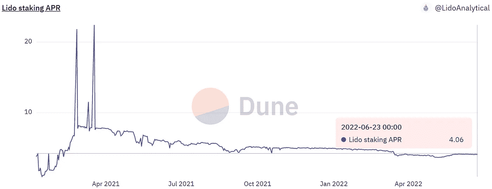

*以太坊的流动赌注在过去一年里产生了持续 4–5%的年利率，甚至比表现最好的银行储蓄账户还要高得多。图片来源:* [*沙丘分析*](https://dune.com/LidoAnalytical/Lido-Finance-Extended)

最近，崩溃打击了 Voyager Digital，一家为大约 350 万用户提供加密交易平台的上市公司。Voyager 在 3AC 的敞口包括 15，250 个比特币(3.7 亿美元)，以及 USDC 的 3.5 亿美元。在撰写本文时，Voyager 将每日提款限制在 1 万美元。

虽然 3AC 和 VOYG 的救助协议正在进行中，但 Celsius 社区试图通过 CEL 令牌制定自己的救助协议。作为 Celsius 网络的治理令牌，CEL 今年贬值了-75%。然而，一些交易者有一个聪明的想法——为什么不制定一个 GameStop 场景，而是为 crypto？

当人们做空 CEL 时，其他人可以通过设置 100 美元的限价单来反击。这一策略最初奏效了，将 CEL 价格推高了 50%。但是这种成功是短暂的。CEL 现在预计年初至今亏损-75%,而不是挤压前的-90%。

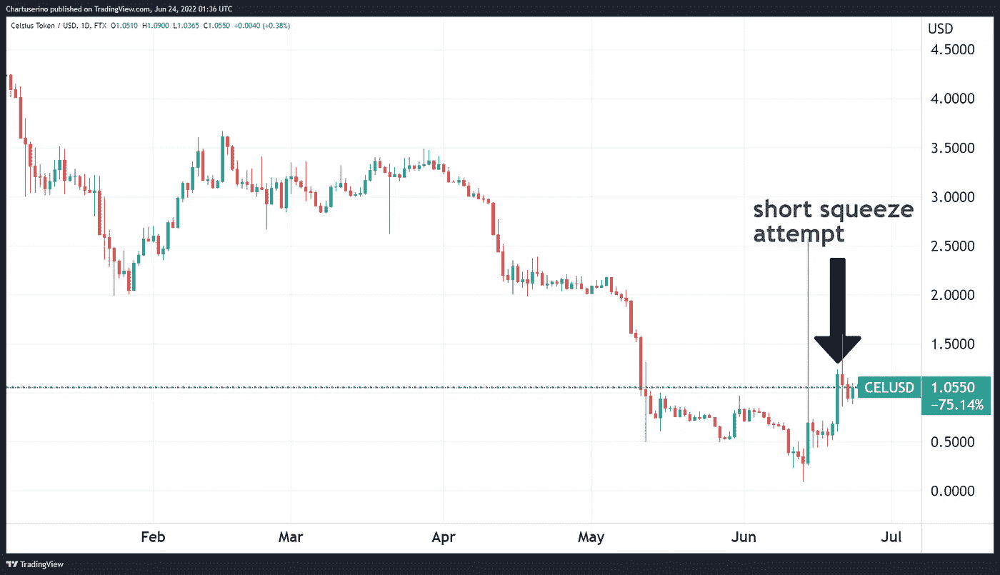

自从五月份 Terra (LUNA)崩溃后，CEL 的日子就不好过了。图片来源: [*交易查看*](https://tradingview.com/)

然而，此举确实为 Celsius 赢得了一些时间，在它自己的流动性枯竭之际，寻求新的风险投资资金供应。流入 crypto 的风险资本在 5 月份下降了 38 %( T7 ),从历史高点明显下降。然而，人们对 Web3 和 DeFi 的兴趣仍在飙升。仅在过去一周，就有 8 . 52 亿美元被投入到加密项目中。

然而，熊市显然暴露了其流动性的脆弱性。可能很难(或不可能)在任何时候都确保客户全部提款的资金，但相互过度下注和过度暴露显然不是确保 DeFi 可信度的途径。

TradFi 面临着类似的现实。在美国，商业银行只需要保留 10%的客户存款。他们可以自由出租剩下的。大多数账户都有高达 25 万美元的 FDIC 保险，这提供了信任和安全——这显然是 DeFi 所缺乏的。

# 为什么俄罗斯卢布创 7 年新高？

*   卢布兑美元创 7 年新高对俄罗斯来说是个问题 **(** [**链接**](https://tokenist.com/the-ruble-hitting-a-7-year-high-against-usd-is-a-problem-for-russia/) **)**
*   俄国希望卢布固定而不破坏通货膨胀目标 **(** [**链接**](https://www.bloomberg.com/news/articles/2022-06-21/russia-debates-ruble-fix-without-dismantling-inflation-targeting#xj4y7vzkg) **)**

# 潜在的欧盟能源危机与俄罗斯经济

俄罗斯是陆地面积最大的国家，拥有过剩的自然资源，这是完全合理的，使其成为天然气/石油出口的皇室。如今，欧盟在很大程度上依赖俄罗斯的资源，而制裁极大地限制了这些资源流入欧盟，欧洲的天然气和石油前景令人担忧。

多年来，德国一直在拆除其核设施。作为欧盟的经济引擎，德国来了个 180 度大转弯:它现在正准备实行天然气配给和紧急重启肮脏的煤电。奥地利和荷兰也加入了煤炭复兴的行列。

德国公用事业公司 RWE 的负责人 Markus Krebber 表示，如果俄罗斯的天然气供应被切断，今年冬天欧盟的团结将面临巨大压力。他预测欧盟各成员国在分享能源方面会出现“混乱”。克莱伯[说](https://www.ft.com/content/7826bf60-8d33-4c69-9191-e8f1eafd59d8):

*“我真正担心的是，如果我们不在这种情况发生之前解决问题，欧洲的团结将面临巨大压力。”*

那么，如果各国再次转向煤炭，还有谁生产煤炭呢？惊喜惊喜:俄罗斯。事实上，俄罗斯是世界第三大煤炭出口国:

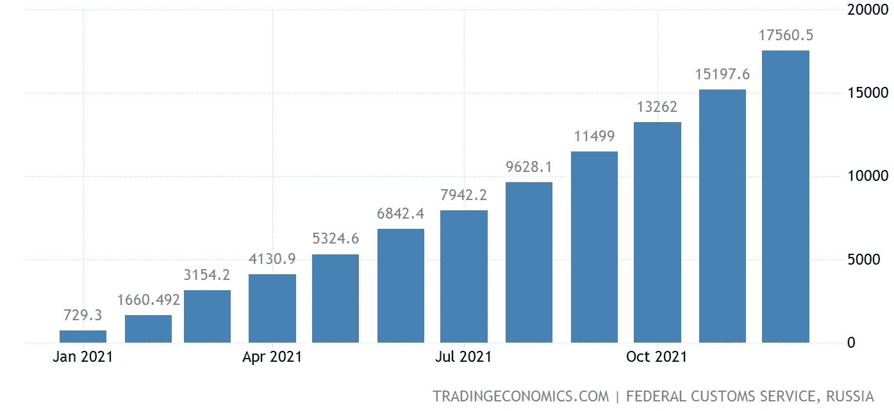

*2021 年俄罗斯煤炭出口量，单位为百万公吨。接下来我们会看到以卢布计价的煤炭吗？图片来源:* [*交易经济学*](https://tradingeconomics.com/russia/exports-of-coal-cmlv)

在欧盟试图解决自身潜在能源危机的背景下，俄罗斯卢布正在飙升。事实上，它对美元的汇率达到了 7 年来的最高点:

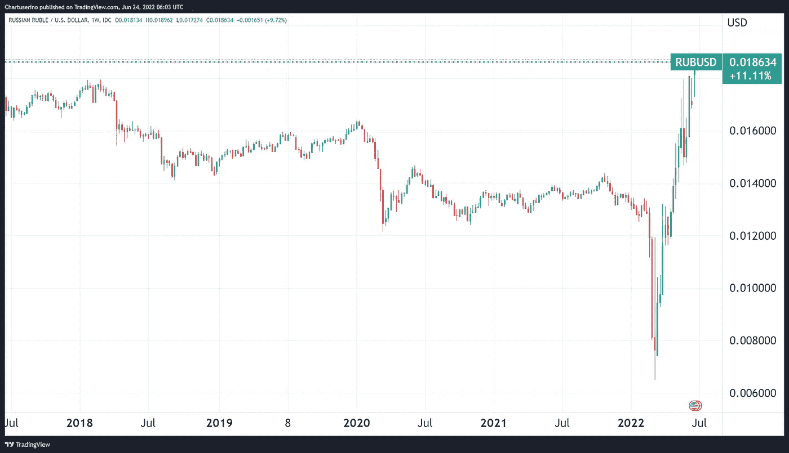

*卢布对美元。图片信用:* [*交易查看*](https://tradingview.com/) *。*

鉴于针对俄罗斯的众多制裁，这是如何发生的呢？

嗯，制裁俄罗斯的国家只占世界人口的 16%。世界三分之二的人口生活在一个拒绝因乌克兰战争谴责俄罗斯的国家。

其中有两个大玩家——中国和印度。仅中国现在从俄罗斯购买的石油就比从沙特阿拉伯购买的多。因此，俄罗斯卢布兑美元汇率达到了 7 年来的最高水平。

然而，对经济来说，不仅仅是强势货币。尽管卢布实际上已经成为一种基于大宗商品的货币，但它的强势对出口导向型经济体来说是一个负面因素。毕竟，如果本国货币走强，这将刺激来自弱势货币的廉价进口。

但是，俄罗斯现在发现自己处于一个干涸的西方进口/投资区。反过来，这减少了经济产出，导致通货膨胀超过经济增长。

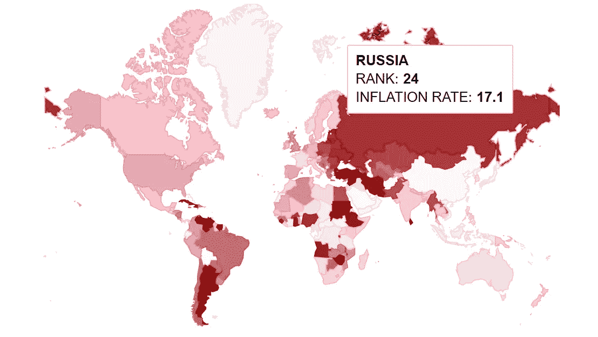

*俄罗斯的通胀率排在第 24 位，为 17.1%。图片信用:* [*交易经济学*](https://tradingeconomics.com/country-list/inflation-rate) *。*

因此，我们看到强势货币会进一步抑制经济增长，因为它会抑制出口。在正常情况下，俄罗斯强劲的卢布会降低通胀，但前提是经济快速增长。

简而言之:俄罗斯的货币看起来不错，但其经济却不怎么样。正如欧盟依赖俄罗斯的能源供应一样，俄罗斯经济也依赖欧盟作为其能源的买家。

谁更需要谁？这正是正在上演的。

[**享受 5MF？点击转发给三个朋友。**](mailto:info@tokenist.com?subject=Check+this+out+&body=I%E2%80%99ve+been+reading+Five+Minute+Finance,+and+I+know+you%E2%80%99d+enjoy+it+too.+It%E2%80%99s+a+weekly+email+that+covers+the+most+important+trends+in+finance.+I+learn+something+new+every+time+I+read+it!+Check+it+out+here:+https://tokenist.com/newsletter/?utm_source=email_gr_btn)

# 当分散的民主变成无政府的暴政

*   Solend 和 Mango Markets 联手处理 Whale 的 2.07 亿美元债务 **(** [**链接**](https://finance.yahoo.com/news/solend-mango-markets-team-handle-111321387.html) **)**
*   索伦德不冻结巨鲸的 2.16 亿美元账户后，此举被指责为“DeFi 的对立面” **(** [**链接**](https://thedefiant.io/solend-whale-proposals-freeze-account/) **)**

# 降低风险的“去中心化”运动——但也打破所有财务惯例

想象一下这个理想的场景。你找到一个你真正喜欢的区块链项目，然后你完全模仿它的首次上市。你甚至达到*鲸鱼*的地位。随着时间的推移，项目按照其路线图进行，代币大幅升值。

有了新发现的金融实力，你现在想抵押这些资产来获得大笔贷款。但是，其他代币持有者有不同的想法。他们投票给自己紧急权力接管你的帐户。

这听起来像是一个严肃的金融体系吗？

好吧，一个几乎相同的场景在索伦德上演，索拉纳的借贷协议就像 Aave 之于以太坊。一只拥有 570 万索尔的鲸鱼用资金做抵押，借了 1.5 亿美元的 stablecoins。

如果追加保证金，这只鲸鱼将严重影响索伦德，因为保证金总额相当于其 TVL 的四分之一。

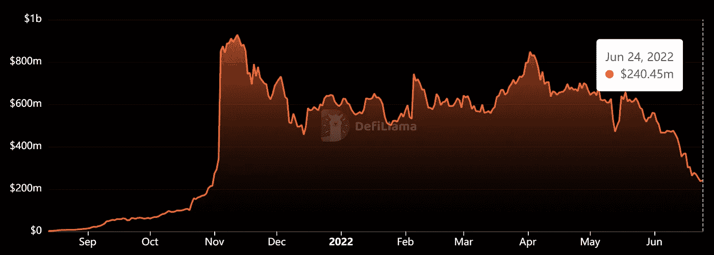

自 5 月份以来，熊市在一个月内清算了索伦德 65%的 TVL。图片来源: [*不毛*](https://defillama.com/protocol/solend)

有些人可能会说，“这是一个去中心化的协议，人们决定以去中心化的方式来拯救协议，使其免于级联清算”。问题是，这就像银行董事会介入并宣布:

听着，银行批准了你的信用，但我们不喜欢你用它来做什么，所以我们要接管你的整个账户，好吗？谢谢。

不，严格来说你没有做任何违法的事。这只是其中的风险。

即使在 TradFi 中，也必须有法院命令才能查封某人的银行账户并控制资金。

看到他们将失去作为贷款平台的所有信誉，索伦德放弃了紧急冻结权。现在，他们正在考虑设置一个账户限额，以便超过 5000 万美元的借入头寸被逐步平仓。

事实证明，无论治理象征与否，良好的声誉风险比区块链金融的前沿更具有公平吸引力。

# “为什么通货膨胀是一件好事”很快变得令人不快

*   强劲的消费支出可以防止衰退但是疫情的储蓄耗尽 **(** [**链接**](https://tokenist.com/strong-consumer-spending-can-prevent-recession-but-pandemic-savings-exhausted/) **)**
*   美联储官员开始拥抱衰退的可能性 **(** [**链接**](https://finance.yahoo.com/news/federal-reserve-officials-start-to-embrace-the-possibility-of-a-recession-195057641.html) **)**

# 准备好接受衰退提示

你有没有注意到一种主流的报道模式？当事情不好时，传统媒体首先否认，通常是通过“事实核查”。然后，坏事被承认存在但只是被‘夸大’了。然后，坏事变成[其实是好事](https://www.cnn.com/2021/12/01/economy/inflation-good-bad-winners-losers/index.html)。

这是去年通货膨胀后的叙述。就连财政部长耶伦也先是称通胀担忧是没有根据的，然后是短暂的，然后是“我错了”。这种现象的重复似乎也将随着经济衰退而继续，但时间范围要短得多。

以下是美联储主席杰罗姆·鲍威尔昨天在众议院金融服务委员会作证时的一些要点:

*   “我们的实时判断……被证明是不正确的。”
*   "事后看来，美联储低估了通货膨胀率。"
*   "美国正走在一条不可持续的财政道路上."
*   “我们的意图是实现软着陆，但实现软着陆的道路变得越来越具有挑战性。”

在用通常的“可能避免”说辞表达了对衰退的担忧后，这种可能性的窗口似乎几乎没有打开。

从好的方面来看，经济衰退(硬着陆)实际上是一件好事，因为它降低了通货膨胀。随着经济产出的减少和失业率的上升，这抑制了需求，降低了价格。目前的失业率仍保持在 3.6%，但如果超过 4%，这将标志着转向硬着陆。

# 做空对加密有好处吗？

*   对第一个做空比特币的 ETF 的需求升温:推出后第二天就交易了 3500 万美元 **(** [**链接**](https://tokenist.com/demand-for-the-first-short-bitcoin-etf-heats-up-35m-traded-on-day-after-launch/) **)**
*   卖空者正在大肆做空加密股票 **(** [**链接**](https://www.bloomberg.com/news/articles/2022-06-21/short-sellers-having-a-field-day-betting-against-crypto-stocks#xj4y7vzkg) **)**

# 更多的工资进入加密市场

周二，ProShares 推出了另一款投机机器，并获得了美国证券交易委员会(SEC)的批准。这次是为了做空比特币。

此前，ProShares 和其他 ETF 专家推出了比特币多头期货基金，作为投资者间接押注比特币价格走势的一种方式。在开创性的 ProShares 做空比特币策略(BITI)推出后，它获得了令人印象深刻的流量——超过 87 万股(价值 3500 万美元)在第一天交易。

问题是，为什么美国证券交易委员会批准投机一个简单的现货交易 ETF，让投资者直接接触比特币？证交会的工作不是提供金融稳定和消费者保护吗？

虽然将 BTC 期货交易所交易基金作为一种选择是好的，但优先考虑这些投资工具极大地打开了价格操纵的空间。美国证券交易委员会必须知道，国际清算银行(BIS)是一个非常强大和有影响力的组织，它就比特币期货交易所交易基金发布了以下[说明](https://www.bis.org/publ/qtrpdf/r_qt2112t.htm):

*“比特币 ETF 可能会放大价格的波动性，* ***如果基金在期货市场的份额较大，会给投资者带来风险*** *。经验表明，基于期货的 ETF 可以* ***加剧价格波动*** *并制造额外的波动……*

这听起来对消费者不太友好。这听起来确实像是美国证交会试图阻止现货交易的比特币交易所交易基金，直到华尔街同胞对比特币持有量感到膨胀。

2022 年，数字资产卖空者的平均回报率已经达到 130%，相比之下，汽车和软件市场的回报率为 50%。有趣的是，高盛还指出，现在的做空活动比过去 25 年都多。

# 本周推特

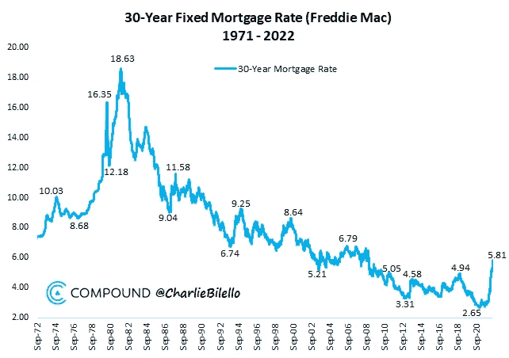

> 美国 30 年期抵押贷款利率升至 5.81%，为 2008 年 11 月以来的最高水平。去年，该指数跌至 2.65%的历史低点。
> 
> 过去 6 个月抵押贷款利率飙升 2.76%，是自 1981 年以来最大的 6 个月涨幅。

[**@ charliebilello**](https://twitter.com/charliebilello/status/1539976260180377601)

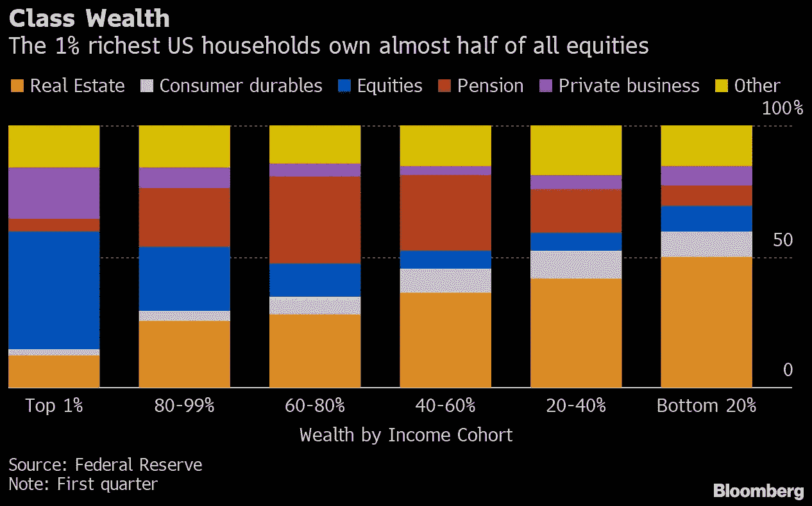

> 根据美联储的数据，在 2012 年第一季度，最富有的 1%的美国人持有几乎一半的公司股票和共同基金股份……在底层 1/5 的家庭中，大约一半的财富由皇家 estate⁦持有
> 
> @彭博

[**@ LizAnnSonders**](https://twitter.com/LizAnnSonders/status/1539931949229170688)

> 年初至今，加密经纪商 Voyager Digital 的股价下跌了 94%
> 
> 该公司宣布，向加密对冲基金 3AC 提供的 6.5 亿美元贷款可能面临违约，据报道，3AC 面临破产风险。

[**@thetokenist**](https://twitter.com/thetokenist/status/1540006077181624320)

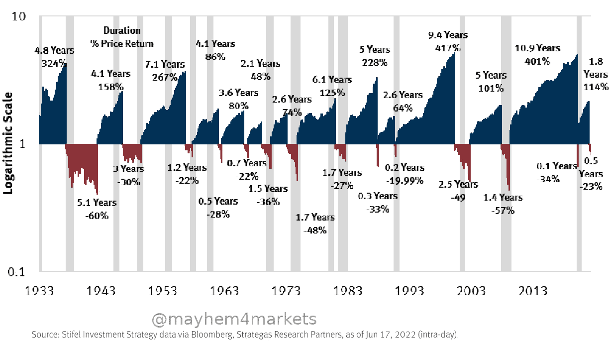

> 大萧条以来的牛市和熊市。🐂🧸

[@ mayhem markets](https://twitter.com/PeterSchiff/status/1536879484510543874)

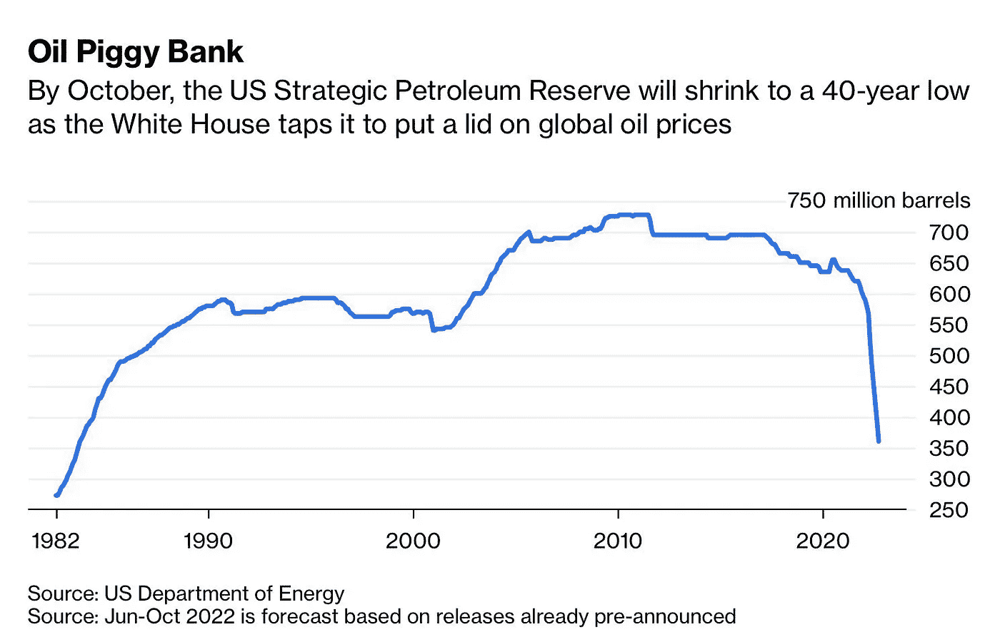

> 专栏:美国不能永远使用其战略石油储备:这是一个有限的储备，以对抗潜在的无限流量短缺
> 
> 更令人担忧的是，它消耗石油储备的速度甚至比图表看起来还要快

[**@ Javier blas**](https://twitter.com/JavierBlas/status/1537692522381729793)

# 加入五分钟金融时事通讯。

[Sign up here — it’s free.](https://tokenist.com/newsletter/?utm_source=getresponse&utm_medium=email&utm_campaign=thetokenist&utm_content=%E2%9C%8B%20FMF%3A%20BoA%20Readying%20for%20BTC%2C%20Pot%20Goes%20Federal%2C%20More%20Inflation)

[t.me/thetokenist](http://t.me/thetokenist?utm_source=getresponse&utm_medium=email&utm_campaign=thetokenist&utm_content=%E2%9C%8B%20FMF%3A%20BoA%20Readying%20for%20BTC%2C%20Pot%20Goes%20Federal%2C%20More%20Inflation)

[twitter.com/thetokenist](https://twitter.com/thetokenist)

> *加入 Coinmonks* [*电报频道*](https://t.me/coincodecap) *和* [*Youtube 频道*](https://www.youtube.com/c/coinmonks/videos) *了解加密交易和投资*

# 另外，阅读

*   [有哪些交易信号？](https://coincodecap.com/trading-signal) | [Bitstamp vs 比特币基地](https://coincodecap.com/bitstamp-coinbase) | [买索拉纳](https://coincodecap.com/buy-solana)
*   [密码交易机器人](/coinmonks/crypto-trading-bot-c2ffce8acb2a) | [维护审查](https://coincodecap.com/uphold-review)
*   [如何给 MetaMask 钱包添加 Arbitrum？](https://coincodecap.com/how-to-add-arbitrum-to-metamask-wallet)
*   [KuCoin vs 北海巨妖 vs BitYard](https://coincodecap.com/kucoin-vs-kraken-vs-bityard)
*   [最适合加密交易的 VPN](https://coincodecap.com/best-vpns-for-crypto-trading)
*   [ProfitFarmers 回顾](https://coincodecap.com/profitfarmers-review) | [如何使用 Cornix Trading Bot](https://coincodecap.com/cornix-trading-bot)
*   [西班牙 5 大最佳文案交易平台](https://coincodecap.com/copy-trading-spain)
*   [Pionex 双重投资](https://coincodecap.com/pionex-dual-investment) | [AdvCash 审查](https://coincodecap.com/advcash-review)