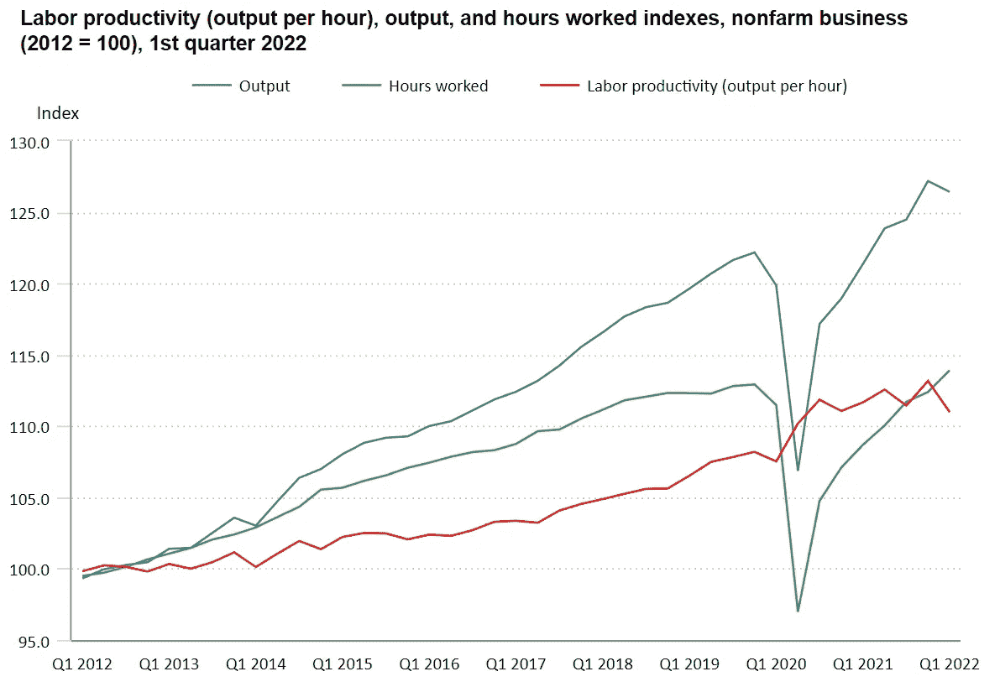
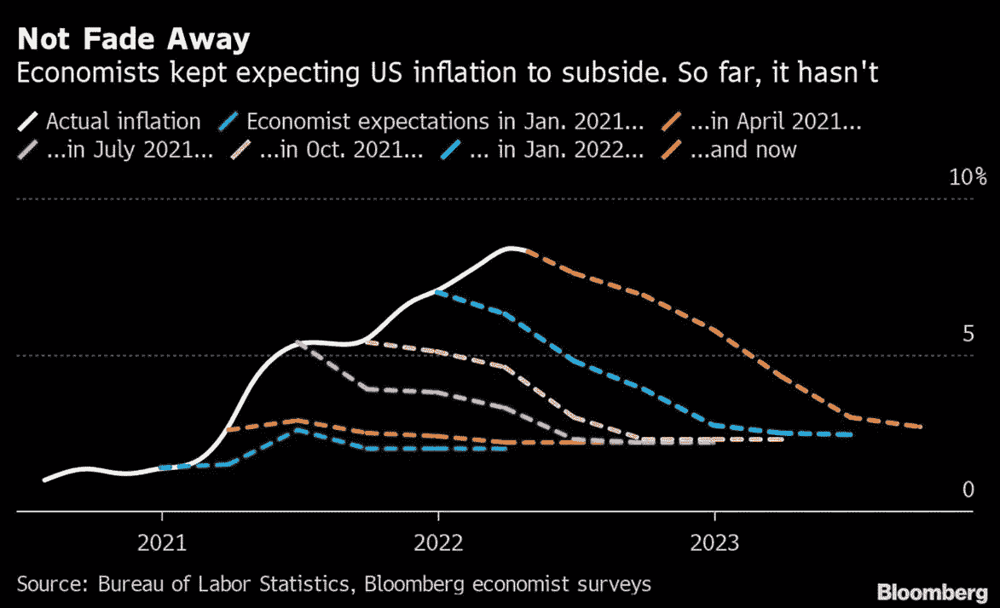
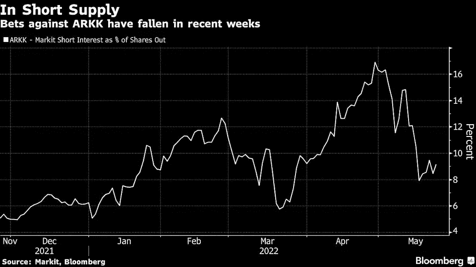
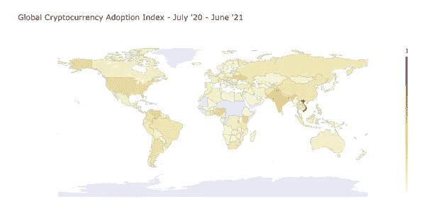
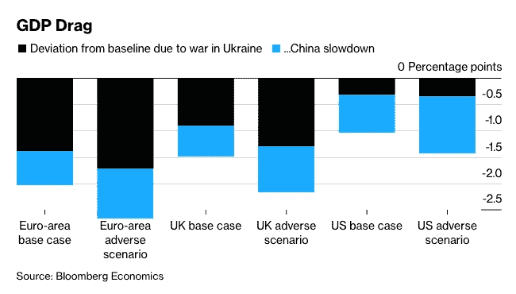
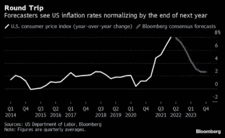
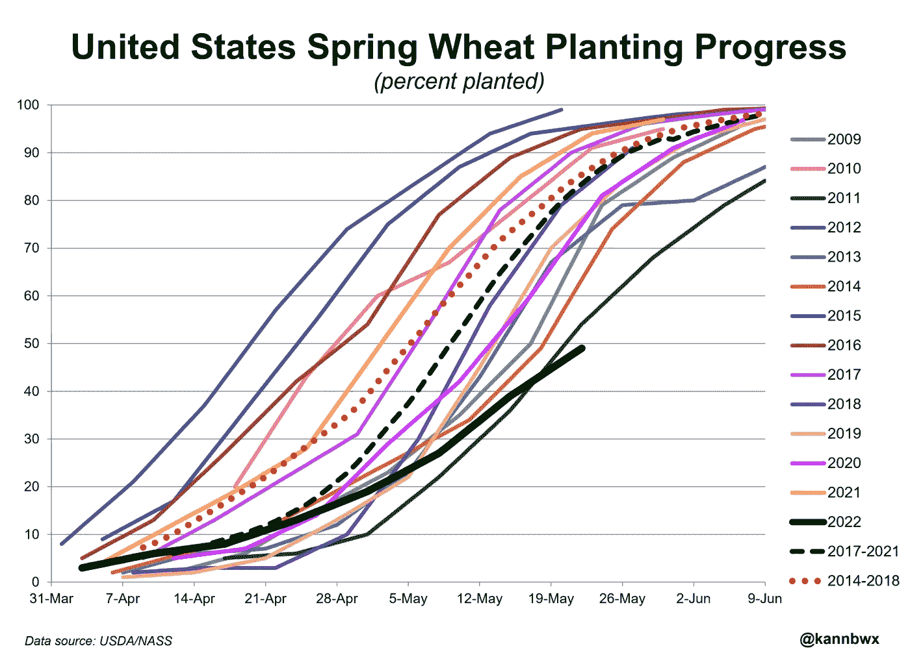

# 五分钟金融:为什么摩根大通说 BTC 被低估了 28%，TERRA 2.0 解释，更多

> 原文：<https://medium.com/coinmonks/five-minute-finance-why-jpmorgan-says-btc-is-undervalued-by-28-terra-2-0-explained-more-bbc344d3d3db?source=collection_archive---------36----------------------->

# 5 分钟的金融时事通讯——解释发生了什么，为什么。

# 让我们看看这周发生了什么:

*   摩根大通称 BTC 被低估
*   发生了什么:Terra 2.0 解释
*   年初至今，ARKK 下降了 55%,但 2022 年仍有 15 亿美元的资金流入
*   更多关于 CBDCs 的讨论:它们将如何影响加密的采用？
*   ESG 能对加密资产友好吗？

# 随着美联储继续以创纪录水平加息，摩根大通称 BTC 被低估了 28%

*   随着交易员评估美联储会议纪要 **(** [**)链接**](https://www.coindesk.com/markets/2022/05/26/bitcoin-sees-weakness-at-29k-as-traders-assess-fed-minutes/) **)** ，比特币在 29K 美元处看到了弱点
*   美联储纪要显示，加息幅度将超过市场预期 **(** [**链接**](https://www.cnbc.com/2022/05/25/fed-minutes-may-2022.html) **)**

# 比特币对美联储的反应结束了吗？

新冠肺炎疫情和随后的全球封锁给经济带来了前所未有的沉重打击。紧随其后，国际货币基金组织估计全球 GDP 出现了自 20 世纪 30 年代大萧条以来的最大跌幅，为 3.9%。

世界仍在试图弥补这一损失。根据劳动生产率衡量，Covid 锁定破裂在经济生产率下降方面最为明显:

一级防范禁闭锁定了经济。图片来源: [*美国劳工统计局*](https://www.bls.gov/)

这是通货膨胀的核心原因，美联储 4.6 万亿美元的资产负债表的增加大大加剧了通货膨胀。Covid lockdowns 不仅削弱了全球总供给，还摧毁了全球脆弱的准时制(JIT)供应链，永久性地破坏了全球经济的生产能力。

换句话说，教科书式的通胀情景发生了——美联储的激进货币供应产出超过了实际经济产出。然而，这一教科书式的教训似乎避开了大多数经济学家。毕竟，他们对通胀率的预期一直是错误的。

*图像功劳:* [*彭博*](https://www.bloomberg.com/)

如果你认为这很糟糕，国际货币基金组织自己[得出结论](https://t.co/1OXYUZWOox)经济学家只预测了 153 次衰退中的 5 次。似乎同样错误的经济学派也在美联储盛行。

这令人不安，因为从根本上说，美联储是一台信息洗牌机，货币就是信息。因为它不是一个巨型工厂，美联储不能通过印钞来解决供应端危机。

它能做的是通过提高利率和减少资产负债表来扭转损害，从而使经济与现实重新接轨。美联储的 QE 逆转只会增加资本成本，降低经济增长。这一点在 Q1 2022 年劳动生产率下滑中已经可见一斑。

尽管如此，最新的联邦公开市场委员会会议(美联储会议纪要)显示，如果有任何抑制通胀的机会(提到 60 次)，就必须违背市场情绪。这意味着从“中性”到“增长受限”的转变。反过来，这意味着更积极和更频繁地提高借款利率，达到 50 个基点(0.5%)，这是自 2000 年以来[最大的单月加息。](https://www.conference-board.org/blog/global-economy/FOMC-May-2022#:~:text=FOMC%20participants%20voted%20unanimously%20to,rate%20hike%20seen%20since%202000.)

这可能会发生，也可能是美联储像以前多次做的那样“只说不做”。毕竟，如果美联储将收购的资产重新注入经济，它可能会扩大赤字支出，再次引发通胀。

在这一市场调整中，比特币保持在 3 万美元区间内。每当施加新的抛售压力时，强手就会介入，把 BTC 从弱手手中抢走。而且，作为一种既不是股票也不是房地产的资产，比特币可以作为一种更能抵御美联储压力的替代品。

在周三给客户的报告中，摩根大通正是这么做的。这家全球最大的银行不仅指出，比特币被低估了 [28%](https://www.forbes.com/sites/ninabambysheva/2022/05/25/jpmorgan-says-bitcoin-is-undervalued-by-28-says-cryptocurrencies-are-now-its-preferred-alternative-asset/?sh=7e9e4cae1d70) ，而且在房地产和股票市场的“潜在滞后重新定价”中，比特币更受青睐。当然，这种重新定价首先只能作为美联储政策的副产品出现。

众所周知，摩根大通首席执行官杰米·戴蒙之前曾[称](https://tokenist.com/heres-how-popular-finance-experts-have-flip-flopped-on-bitcoin/)比特币为“骗局”，称其“一文不值”。天哪，时代变了。

# Terra 2.0 能在没有稳定币的情况下成长吗？

*   Terra 将于 5 月 27 日启动新的区块链，将放弃 UST **(** [**)链接**](https://tokenist.com/terra-to-start-new-blockchain-on-27th-may-will-abandon-ust/) **)**
*   通过空投、上市、回购、烧钱等方式换回“Terra 2.0 复兴计划” **(** [**链接**](https://cointelegraph.com/news/exchanges-back-terra-2-0-revival-plan-via-airdrops-listing-buyback-and-burning) **)**

# 现在什么将区分 Terra？

Terra 的崩溃并不是野蛮的 Bitfinex 黑客行为，这种行为最终导致了大部分资金的恢复。相反，Terra 在 UST 算法稳定币实验的重压下崩溃了。恢复资金的路径则遵循一条不同的弧线，在这条弧线上，Terra 将需要重复其先前的增长。

Do Kwon 的提案[以管理投票为特色，社区通过了该提案。65.5%的投票支持该提案，20%弃权，13.2%投“否决”，0.33%投“不”。](https://station.terra.money/proposal/1623)

“Terra 生态系统复兴计划”将在没有 TerraUSD (UST)算法稳定币的情况下发生，因为 Terra 的新区块链排除了它。

Terra 2.0 将不得不在没有稳定币的情况下到期。提醒一下，Terra 的整个增长故事都是由 UST 支撑的，因为这个网络被认为是 Visa 的加密版——通过稳定账户的廉价和即时支付。

没有人知道之前的成功是否会跟随 Terra 2.0。尽管如此，那些参与其崩溃的生态系统的人确实有机会通过新的代币分配来弥补他们的损失:

*   30%捐给社区团体
*   碰撞前 LUNA 持有者的 35%
*   10%给崩溃后的 LUNA 持有者
*   15%给崩盘后的 UST 持有者
*   10%用于锚定 UST 桩

新令牌将根据授权模型分发，令牌将定期接收，以防止立即转储。

以下是 Terra 2.0 的预期实现方式:

*   旧的(现存的)特拉区块链将被重新命名为特拉经典。所有当前的月神令牌将成为 LUNC。
*   新的区块链将使用“Terra”这个名字，新的代币将被称为 LUNA。
*   新的月神令牌将空投给 LUNC 和 UST 持有者。

这种转变类似于以太坊的 hardfork，它在 2016 年创造了以太坊经典。虽然 Terra 的举动类似于一个硬叉子，但 Terra 开发商已经澄清，Terra 2.0 将构成一个全新的独立的区块链，而不是一个硬叉子。

Terra 的新网络预计将于 5 月 27 日上线。

Terra 生态系统在其快速增长期吸引了大量开发者，并试图留住他们以拯救社区。但是，所有这一切都回避了一个问题——如果社区中的大部分人都支持 APY 通过锚协议向 UST 持有者提供的不可持续的 20%,而且这已经过时了，那么谁还会留下来，为什么？

目前，令人鼓舞的是，所有主要交易所——币安、北海巨妖、库科恩、FTX 和其他交易所——都在参与 Terra 的迁徙复兴。

[**享受 5MF？点击转发给三个朋友。**](mailto:info@tokenist.com?subject=Check+this+out+&body=I%E2%80%99ve+been+reading+Five+Minute+Finance,+and+I+know+you%E2%80%99d+enjoy+it+too.+It%E2%80%99s+a+weekly+email+that+covers+the+most+important+trends+in+finance.+I+learn+something+new+every+time+I+read+it!+Check+it+out+here:+https://tokenist.com/newsletter/?utm_source=email_gr_btn)

# 对 ARKK 的短期兴趣减少:这意味着什么

*   渴望做空卡西伍德的阿克克下跌的速度几乎和基金一样快 **(** [**链接**](https://finance.yahoo.com/news/desire-short-cathie-woods-arkk-141157125.html) **)**
*   尽管表现不佳，但韩国资本流入仍保持强劲:2022 年迄今为 15 亿美元 **(** [**链接**](https://tokenist.com/arkk-inflows-stay-strong-despite-underperformance-1-5b-in-2022-so-far/) **)**

# 投资者信念的力量得到了回报

成长型资产需要什么？廉价资本。美联储通过量化紧缩(QT)实现了什么，逆转了 QE？它通过提高利率来增加资本成本。

这种动态是 Cathie Wood 的 ARKK 基金自去年 12 月以来下跌 60%的罪魁祸首。2020—2022 年间，随着美联储空投数万亿美元“刺激”经济，ARKK 成为了一颗冉冉升起的新星。

伍德利用这一优势，投身于拥有从人工智能到基因编辑等尖端技术的公司。

ARKK 空头利息占股份的百分比。图片来源: [*彭博*](https://www.bloomberg.com/)

仅这一未来前景就培养了一批忠诚的投资者，在 2022 年期间保持了 15 亿美元的净流入。此外，77 亿美元的基金似乎已经触底，空头大幅减少。那些押注 ARKK 下跌的人在 4 月份有 17%的立足点，5 月份降至 9.2%。

我们在这里看到了什么？尽管市场持续低迷，坚定的 ARKK 投资者仍在惊吓做空者。一些人认为这表明我们正在接近底部。但是，现在还早。

# CBDC 阴影笼罩着 Crypto 的采用率

*   SWIFT 可以利用 CBDCs 改善跨境支付 **(** [**)链接**](https://tokenist.com/swift-could-use-cbdcs-to-improve-cross-border-payments/) **)**
*   美联储调查:2021 年 12%的美国成年人持有密码 [**(链接)**](https://finance.yahoo.com/news/fed-survey-12-us-adults-150031486.html)

# 加密技术的采用可能达到 CBDC 上限

如果有什么不同的话，Terra 的迅速崛起和衰落显示了对无国界支付的高需求。那些便宜的、24/7 的、接近即时的，并且不会受到退款欺诈的保护。没有几个选项符合这个要求。除了即将到来的中央银行数字货币。

CBDCs 会打乱很多事情，包括世界上最大的支付全球网络 SWIFT。事实上，万事达首席执行官迈克尔·米巴赫并不认为 SWIFT 会在 5 年内存在。或者，至少不是以目前的形式作为世界金融动脉。

为了不被完全淘汰，SWIFT 正在探索多 CBDC 跨境转账。想象一下，把数字欧元和人民币一起寄到中国。由于与法国凯捷的合作，SWIFT 提议的网络将有助于以自动和无摩擦的方式转换 CBDCs。

对用户来说，这意味着转账不会花费太多。更重要的是，这种系统将取代目前几家银行长期合作执行单一跨境交易的繁琐方法。总的来说，这是便利的顶峰的秘诀，是采用的最大驱动力。

*虽然从 2020 年 7 月到 2021 年 6 月，全球加密采用率跃升了 880%,但引入 CBDCs 后，加密采用率会有什么变化？图片来源:*[*chain analysis*](https://blog.chainalysis.com/reports/2021-global-crypto-adoption-index/)*。*

问题是，当 cbdc 被部署来实际拦截 cbdc 的采用时，加密的采用会达到高水平吗？毕竟，[加拿大银行账户冻结](https://tokenist.com/big-banks-in-canada-face-outage-day-after-emergency-declared/)清楚地勾勒出一个未来，当你实际上不拥有银行或交易所托管的资产时，这意味着什么。

美联储对 1.1 万人的年度调查显示，2021 年，12%的美国成年人持有加密资产。更能说明问题的是，只有 3%的人将它们用于支付，而其余的人将它们用作投资。在这 3%的人中，13%没有银行账户，而将加密资产视为投资的人都有银行账户。

调查表明，加密可能会巩固作为一个利基市场。提出非保管钱包、隐私币和原子互换的采用曲线和好处都很好。但是，在一天结束时，数量最多和最小的公分母可能不关心学习，因为 CBD 被放在前面和中心。

# ESG 能对加密资产友好吗？

*   美国证交会处理“绿洗” **(** [**)链接**](https://tokenist.com/bny-mellon-unit-fined-1-5m-for-esg-misstatement-as-sec-deals-with-greenwashing/) **)** ，BNY 梅隆银行因 ESG 错报被罚款 150 万美元
*   ESG 研究显示比特币采矿有潜力在 2045 年消除 0.15%的全球变暖，声称没有其他技术能做得更好 **(** [**链接**](https://news.bitcoin.com/esg-study-shows-bitcoin-minings-potential-to-eliminate-0-15-of-global-warming-by-2045-claims-no-other-technology-can-do-better/) **)**

# 贝莱德是 ESG 的舞会国王

用贝莱德首席执行官、自我认可的 ESG 领袖拉里·芬克的话说，环境、社会和公司治理投资产生了巨大的资金流。具体来说，从 2019 年的 1 万亿美元到 Q1 2022 年的 2.7 万亿美元。

然而，投资者突然喜欢上环境、社会和公司治理是因为环保意识的提高，还是因为不这样做会限制他们的融资渠道？将特斯拉从 S&P ESG 指数中剔除无疑表明了后者。

这是一个和时间一样古老的故事——创建清单和判断标准来抑制不受欢迎的行为。然后，为了推动一个不同的议程并在竞争中领先，排除其他超出原始标准的人。人们可能喜欢 ESG 中的可持续发展，但没有什么是 ESG 不能包含的。

说到底，这三个词包含了人类存在的全部。因此，尽管美国证券交易委员会(SEC)因 BNY 梅隆银行“绿色清洗”其投资组合而对其进行了罚款，但很难对 ESG 方案进行标准化。如果有什么不同的话，无论最终的标准是什么，这笔罚款都可能成为进入 ESG 阵营的进一步激励。

比如，我们可能最终陷入加密货币被视为反社会的境地，这是欧洲央行行长克里斯蒂娜·勒加德(Christine Legarde)的观点。

“我非常谦卑地估计，它一文不值，”

另一方面，由于比特币已经吸引了许多投资者，谁说它不能在 ESG 下折叠？Geneious 的丹尼尔·巴顿(Daniel Batten)的最新报告表明，比特币矿工可能被用来捕获全球碳排放量的 5.32%。

此外，由于液体冷却和计算的进步，比特币网络的消费水平在 Q1 2022 年已经下降了 25%。虽然绿色和平组织可能会要求比特币接受类似以太坊的待遇，以变成股权凭证，但这不是一个好主意。

由于不依赖创始人和利益相关者的善意，比特币的工作证明是唯一独立于利益相关者阴谋的货币网络。这就是勒加德认为它“一文不值”的原因吗？在克劳斯·施瓦布的利益相关者资本主义的世界里，这种资本主义旨在传递“你将一无所有而快乐”，对他们来说，这确实一文不值。

# 本周推特

> *S & P 500 一年最差开局的前 100 天:*
> 
> *1。1932 年:-36%*
> 
> *2。1940 年:-26%*
> 
> *3。1970 年:-22%*
> 
> *4。当前:-17%*
> 
> *5。1939 年:-13%*
> 
> *6。1962 年:-13%*
> 
> *我们迎来了历史上第四糟糕的年初，但 VIX 低于 30 美元。*
> 
> VIX 说恐慌还没有到来，想象一下它什么时候到来。

[**@ kobeisisletter**](https://twitter.com/KobeissiLetter/status/1529589627551567872)

> *根据彭博经济公司的最新研究，俄国入侵乌克兰和中国新的疫情封锁的双重危机加剧了通货膨胀并损害了经济增长，从而动摇了世界经济的复苏*

[**@商务**](https://twitter.com/business/status/1529684273116196865)

> *彭博收集的经济学家的一致估计显示，预计到 2023 年底，CPI 将回落至近 2%*

[**@ LizAnnSonders**](https://twitter.com/LizAnnSonders/status/1529778442320990209)

> 亿万富翁比尔·米勒:“#比特币是世界上唯一一种供给不受需求影响的经济实体。”👏

🧵

[@ BitcoinMagazine](https://twitter.com/BitcoinMagazine/status/1529875153139679234)

> 美国春播小麦的播种速度是 20 多年来最慢的，截至周日仅完成了 49%。该日期的平均值为 83%。明尼苏达州只有 11%的种植率，而平均水平为 90%。北达科他州平均 27%对 80%。这两个州种植了美国三分之二的农作物。

[**@ kannbwx**](https://twitter.com/kannbwx/status/1528832246936920065)

# 加入五分钟金融时事通讯。

[Sign up here — it’s free.](https://tokenist.com/newsletter/?utm_source=getresponse&utm_medium=email&utm_campaign=thetokenist&utm_content=%E2%9C%8B%20FMF%3A%20BoA%20Readying%20for%20BTC%2C%20Pot%20Goes%20Federal%2C%20More%20Inflation)

[t.me/thetokenist](http://t.me/thetokenist?utm_source=getresponse&utm_medium=email&utm_campaign=thetokenist&utm_content=%E2%9C%8B%20FMF%3A%20BoA%20Readying%20for%20BTC%2C%20Pot%20Goes%20Federal%2C%20More%20Inflation)

[twitter.com/thetokenist](https://twitter.com/thetokenist)

> 加入 Coinmonks [电报频道](https://t.me/coincodecap)和 [Youtube 频道](https://www.youtube.com/c/coinmonks/videos)了解加密交易和投资

# 另外，阅读

*   [我的加密副本交易经验](/coinmonks/my-experience-with-crypto-copy-trading-d6feb2ce3ac5) | [AAX 交易所评论](/coinmonks/aax-exchange-review-2021-67c5ea09330c)
*   [Bybit 融资融券交易](/coinmonks/bybit-margin-trading-e5071676244e) | [币安融资融券交易](/coinmonks/binance-margin-trading-c9eb5e9d2116) | [Overbit 审核](/coinmonks/overbit-review-9446ed4f2188)
*   [有哪些交易信号？](https://coincodecap.com/trading-signal) | [比特斯坦普 vs 比特币基地](https://coincodecap.com/bitstamp-coinbase)
*   [10 本关于加密的最佳书籍](https://coincodecap.com/best-crypto-books) | [英国 5 个最佳加密机器人](https://coincodecap.com/uk-trading-bots)
*   [ko only 回顾](https://coincodecap.com/koinly-review) | [Binaryx 回顾](https://coincodecap.com/binaryx-review)|[Hodlnaut vs CakeDefi](https://coincodecap.com/hodlnaut-vs-cakedefi-vs-celsius)
*   [40 个最佳电报频道](https://coincodecap.com/best-telegram-channels) | [1xBit 回顾](https://coincodecap.com/1xbit-review) | [Keevo 钱包回顾](https://coincodecap.com/keevo-wallet-review)
*   [如何在印度购买以太坊？](https://coincodecap.com/buy-ethereum-in-india) | [如何在币安购买比特币](https://coincodecap.com/buy-bitcoin-binance)