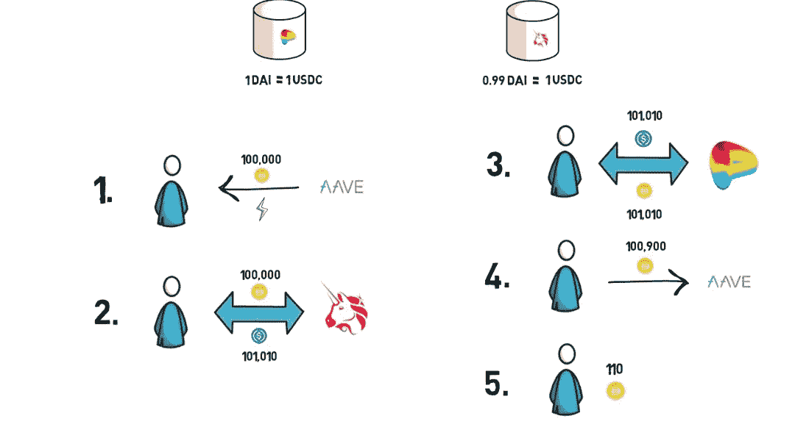
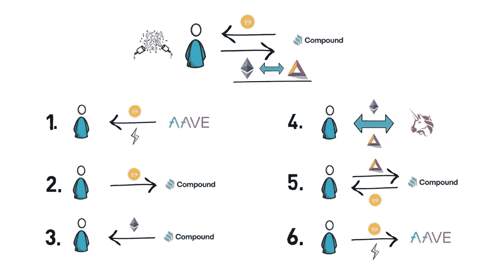
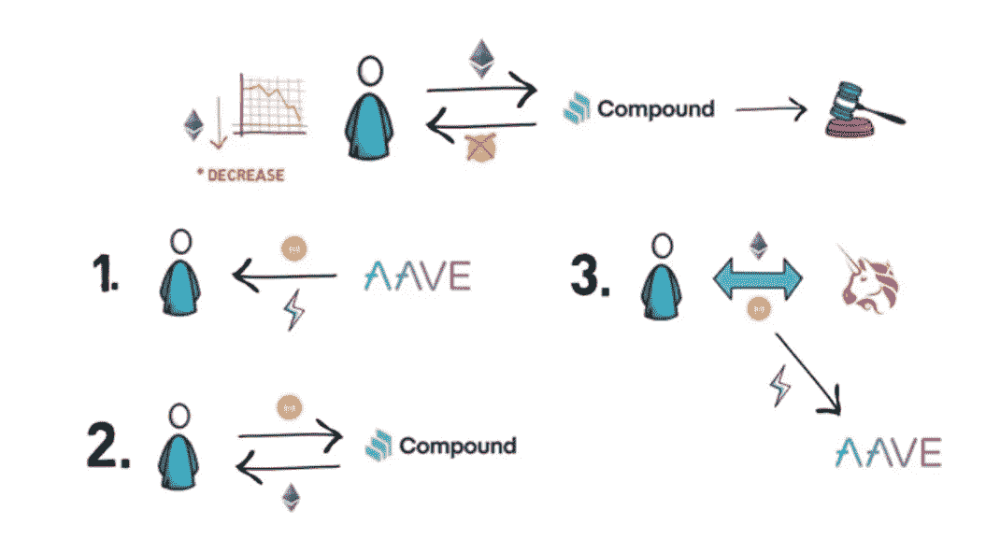

# 闪贷解释

> 原文：<https://medium.com/coinmonks/flash-loans-explained-2055dff1f297?source=collection_archive---------7----------------------->

Source: Binance Academy

闪贷是在同一笔交易中借和还的贷款。借款人不需要提供收入证明、储备或抵押品等常规要求。

通过在 DeFi 交易中使用智能合约，这种形式的借款是可能的。智能合同规定了快速贷款的规则。它通常要求借款人在交易完成前偿还全部贷款金额。

如果违反了这条规则，智能合同将自动撤销交易，贷款将被取消，就像从未发生过一样。

快速贷款通常在几秒钟或几分钟内发生。这就是他们如何提供无担保贷款，因为借款人必须立即归还全部借款。

从相关的角度来说，想象一下从银行贷款购买一项资产，你需要在几分钟内偿还全部贷款。

听起来不切实际，甚至不可能。

然而，闪贷在 DeFi 中非常有用。它有三个主要的使用案例:套利、抵押品互换和自我清算。

**套利**

套利是指一种资产在不同市场的即时交易，以从该资产上市价格的微小差异中获利。交易者倾向于在各种密码交易所之间移动，以寻找各种密码资产价格的微小差异。

例如，想象一下 BTC/USDT 在币安的交易价格是 39131.26 美元，而同一个 BTC/USDT 在 Bitfinex 的交易价格是 39120.00 美元。相差 11.26 美元。交易者可以在 Bitfinex 上买入 BTC，在币安上卖出，每卖出一个 BTC，获利 11.26 美元。这个例子使用集中式加密交换，然而，这同样适用于分散式交换(DEx ),如 dYdX、UniSwap、PanCakeSwap 等。快速贷款被用于利用 dex 的价格套利，这是因为它们的即时性及其在整个区块链的适用性。

Source: Finematics via Youtube

这是一个人利用 Curve 和 UniSwap 进行价格套利的例子。

在这里，戴/USDC 在 Curve 上的交易价格是 1 美元，而戴/USDC 在 UniSwap 上的交易价格是 0.99 美元。

交易者可以通过以下方式利用快速贷款来利用这一机会(如上所示):

1.  从 Aave 拿 10 万戴的闪贷
2.  在 UniSwap 上用 100，000 戴换 101，010 USDC
3.  将 101，010 USDC 换成曲线上的 101，010 戴
4.  偿还所借的 100，000 DAI 加上 0.09%的手续费，总共为 100，900 DAI
5.  留着 110 戴当利润。

**抵押品互换**

这涉及到用于支持用户贷款的抵押品从一种资产到另一种资产的快速互换。

这有助于 DeFi 用户交换他们最初在 DeFi 贷款平台上提供的抵押品。

Source: Finematics via Youtube

在这个例子中，一个人使用他们的 ETH 作为在复合贷款平台上从戴处获得的贷款的抵押品，并且他们想要用 ETH 交换 BAT。

用户可以通过以下方式使用快速贷款将 ETH 换成 BAT(如上所示):

1.  以戴在 Aave 的闪贷为例
2.  用戴来偿还复利贷款
3.  取回你用作抵押品的 ETH
4.  在 UniSwap 上用 ETH 换 BAT
5.  存 BAT 作抵押在戴安大院贷款
6.  以 DAI 加 0.09%的费用向 Aave 偿还贷款

**自行清算**

在 DeFi 中，贷款有清算罚款或费用，根据平台的不同，目前在 3%到 15%之间。

当用作抵押品的资产价格低于某个预定点时，就会发生 DeFi 清算。这通常是为了防止抵押品价值过低而无法支付所借贷款的情况。

在抵押品的价值达到清算点的情况下，智能合同出售加密资产来偿还债务。用户丢失资产并被收取费用。

DeFi 用户可以使用快速贷款进行自我清算，以偿还贷款并收回用作抵押的资产，从而避免被清算和支付费用。

Source: Finematics via Youtube

在本例中，用户从 Compound 获得了一笔以 ETH 为抵押的 DAI 贷款。ETH 的价格正在下降并接近清算水平，a 通过以下方式获得快速贷款以避免被智能合同清算:

1.  从 Aave 借了一笔贷款
2.  用戴来偿还复利贷款
3.  取回你用作抵押品的 ETH
4.  用以太网交换 UniSwap 上的戴
5.  以 DAI 加 0.09%的费用向 Aave 偿还贷款

这些是最常见的快速贷款的使用案例，还有更多有待发现。这些用例应该如何有用的快速贷款在 DeFi。然而，闪贷经常受到攻击。这些被称为快速贷款攻击。

这种情况发生在借款人能够欺骗贷款人认为贷款已经偿还，即使它没有。DeFi 系统开始开发方法和技术来抵御这些攻击。

**资料来源和参考文献:**

1.  [先睹为快的闪贷](/aave/sneak-peek-at-flash-loans-f2b28a394d62)
2.  [无抵押借几百万？闪贷](https://www.youtube.com/watch?v=mCJUhnXQ76s&t=591s&ab_channel=Finematics) [解释(Aave，dYdX)](https://www.youtube.com/watch?v=mCJUhnXQ76s&t=591s&ab_channel=Finematics)
3.  [DeFi 中的闪贷有哪些？](https://cointelegraph.com/explained/what-are-flash-loans-in-defi)