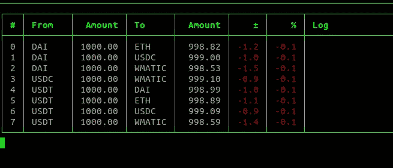

# 多边形上的闪贷机器人第二部分

> 原文：<https://medium.com/coinmonks/flashloan-bot-on-polygon-part-2-3eae0ac33986?source=collection_archive---------1----------------------->

## 一个在多边形上的开源 flashloan bot，带有 1inch API 和 DODO！

console ui of the bot

[闪贷合同故事](/coinmonks/no-flashloan-fee-with-dodo-cc78215d7f93) | [闪贷 Bot 第一部故事](/coinmonks/flashloan-bot-on-polygon-f60fa9ef82e6)

## 摘要

*   分割交易金额可最大限度地降低负面价格影响
*   闪贷合约支持交易金额拆分
*   机器人还是不工作