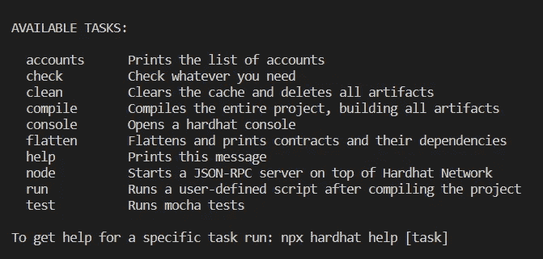
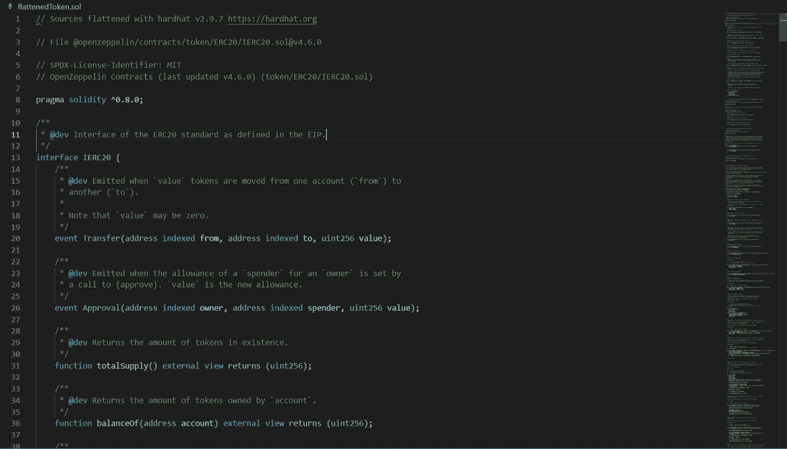

# 使用 HardHat 展平智能合同

> 原文：<https://medium.com/coinmonks/flattening-smart-contracts-using-hardhat-dffe7dbc7b3f?source=collection_archive---------2----------------------->


Photo by [Mohammad Rahmani](https://unsplash.com/@afgprogrammer?utm_source=unsplash&utm_medium=referral&utm_content=creditCopyText) on [Unsplash](https://unsplash.com/s/photos/programming-code?utm_source=unsplash&utm_medium=referral&utm_content=creditCopyText)

通常，在编写智能合同时，我们会使用第三方库。一个例子是使用 OpenZeppelin 库创建 ERC20 或 ERC721 令牌。部署后，建议在网络的某个块资源管理器中验证和发布合同。

在以太坊网络的情况下，默认的块浏览器是 [etherscan.io](http://etherscan.io) 。bscscan.com 的[就是币安智能连锁的](http://bscscan.com)。一般来说，块浏览器有一个 API，允许用户直接从 IDE(或框架)中验证和发布契约，但通常需要事先在块浏览器中注册。

另一种验证方法是复制并粘贴契约代码，但是这需要复制并粘贴整个契约，包括导入的库。将契约扁平化是必不可少的，也就是将所有的依赖关系聚集在一个文件中。

在本文中，我们将看到如何使用 HardHat 来实现这一点。例如，让我们使用 OpenZepellin 库创建一个 ERC20 令牌契约。我们首先创建一个新项目:

```
$ npx hardhat
```

之后，控制台上会出现一个警告，警告必须安装一些库。您需要执行以下命令:

```
$ npm install --save-dev "hardhat@^2.9.0" "@nomiclabs/hardhat-waffle@^2.0.0" "ethereum-waffle@^3.0.0" "chai@^4.2.0" "@nomiclabs/hardhat-ethers@^2.0.0" "ethers@^5.0.0"
```

安装后，当您再次运行“npx hardhat”时，控制台上会显示一个命令列表，如下图所示:



注意，其中一个选项是“**展平**”，这将是我们将运行的展平合同的命令。现在让我们导入 OpenZepellin 库，如下所示:

```
$ npm install @openzeppelin/contracts
```

在*合同*文件夹中，让我们创建一个名为*令牌的新合同。Sol* 。代码如下所示。

```
pragma solidity ^0.8.7;  
import "@openzeppelin/contracts/token/ERC20/ERC20.sol"; contract Token is ERC20 {      
   constructor(uint256 initialSupply) ERC20("Flattened","FLAT") {
      _mint(msg.sender, initialSupply);     
   }      
}
```

令牌的“基础”在 *ERC20.sol* 文件中，该文件又导入其他文件。如果想把完整的合同放在一个文件夹里，就必须把它展平。为此，我们使用以下命令。

```
$ npx hardhat flatten ./contracts/Token.sol > flattenedToken.sol
```

将生成完整的扁平契约，其输出将位于名为 *flattenedToken.sol* 的文件中。如果*合同*文件夹包含单个合同，即您想要展平的合同，执行代码可以忽略您想要展平的文件。也就是说，您可以使用:

```
$ npx hardhat flatten  > flattenedAll.sol
```

然而，如果 *contracts* 文件夹有多个合同，并且您使用了上面的命令，HardHat 会将所有现有的合同合并成一个文件。这可能不是你想要的。

如果您现在检查名为 *flattenedToken.sol* 的文件，您可以看到它包含了 *Token 使用的所有合同。索尔*，正如你在下图中看到的。



部署到网络后，现在只需复制和粘贴此合同，就可以在 block explorer 中对其进行验证和发布。

**感谢阅读！**

> 加入 Coinmonks [Telegram group](https://t.me/joinchat/Trz8jaxd6xEsBI4p) 并了解加密交易和投资