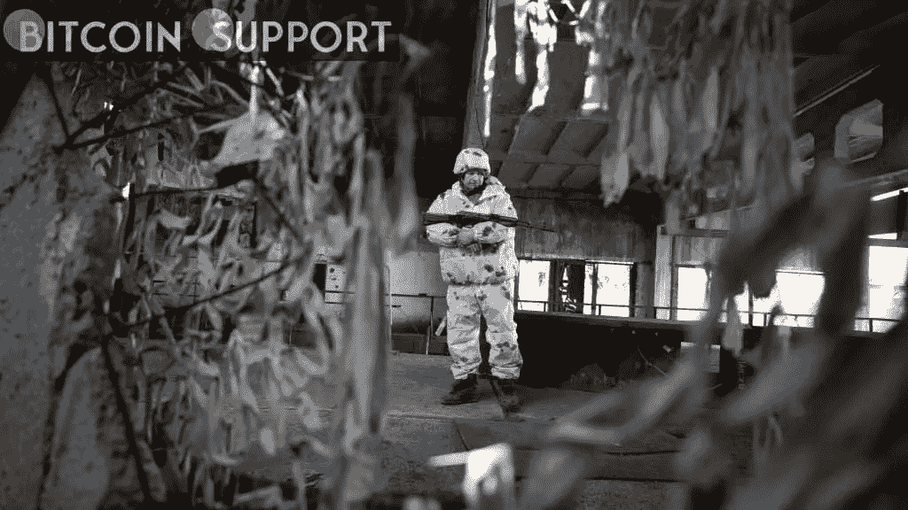

# 在乌克兰入侵之后，Flexpool 暂停了对俄罗斯的所有服务

> 原文：<https://medium.com/coinmonks/flexpool-suspends-all-services-to-russia-following-the-ukraine-invasion-8ba64c34d4c5?source=collection_archive---------36----------------------->

**Visit our website:-** [**https://bitcoinsupports.com/**](https://bitcoinsupports.com/)

该泳池被认为是第一个停止向俄罗斯客户开放的泳池。

继俄罗斯入侵乌克兰之后，全球第五大以太坊矿池 Flexpool 可能成为第一家暂停向俄罗斯用户提供服务的矿池。

**做出这一决定是为了表达对乌克兰的同情。周四晚上，Flexpool 的一位女发言人在公司官方电报频道发布的一条消息中表示:“尽管我们公司有自己的政治观点，但我们通常不参与政治。”。“另一方面，这比政治更重要，比任何人都重要。这是一场有可能毁灭世界的战争。不可否认，它正在夺走整个东欧许多无辜者的生命。”消息称，为了避免从这场危机中获利或间接资助这场危机，pool 将暂停对俄罗斯 IP 地址的所有服务，并向受影响的客户偿还未清余额。消息对由此造成的不便向俄罗斯矿商表示歉意。

根据信息门户 miningpoolstats.com 的数据，按哈希速率计算，Flexpool 是全球第五大以太矿池。在当前的安全危机下，它很可能是第一个限制俄罗斯人进入的。Hiveon 的推特账户上发布了一条声援乌克兰的信息，指出“很难远离乌克兰的悲剧。”然而，没有宣布任何具体的行动，从池。

Reddit 上的用户已经指出，矿工可以通过使用高性能虚拟专用网络(VPN)来规避 Flexpool 的限制。

**访问我们的网站:-**[**https://bitcoinsupports.com/**](https://bitcoinsupports.com/)

**免责声明:以上为作者观点，不应视为投资建议。读者应该自己做研究。****

> *加入 Coinmonks* [*电报频道*](https://t.me/coincodecap) *和* [*Youtube 频道*](https://www.youtube.com/c/coinmonks/videos) *了解加密交易和投资*

# 另外，阅读

*   [Bookmap 评论](https://coincodecap.com/bookmap-review-2021-best-trading-software) | [美国 5 大最佳加密交易所](https://coincodecap.com/crypto-exchange-usa)
*   最佳加密[硬件钱包](/coinmonks/hardware-wallets-dfa1211730c6) | [Bitbns 评论](/coinmonks/bitbns-review-38256a07e161)
*   [新加坡十大最佳密码交易所](https://coincodecap.com/crypto-exchange-in-singapore) | [收购 AXS](https://coincodecap.com/buy-axs-token)
*   [红狗赌场评论](https://coincodecap.com/red-dog-casino-review) | [Swyftx 评论](https://coincodecap.com/swyftx-review) | [CoinGate 评论](https://coincodecap.com/coingate-review)
*   [投资印度的最佳加密软件](https://coincodecap.com/best-crypto-to-invest-in-india-in-2021)|[WazirX P2P](https://coincodecap.com/wazirx-p2p)|[Hi Dollar Review](https://coincodecap.com/hi-dollar-review)
*   [加拿大最好的加密交易机器人](https://coincodecap.com/5-best-crypto-trading-bots-in-canada) | [库币评论](https://coincodecap.com/kucoin-review)
*   [用于 Huobi 的加密交易信号](https://coincodecap.com/huobi-crypto-trading-signals) | [HitBTC 审查](/coinmonks/hitbtc-review-c5143c5d53c2)