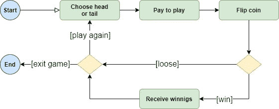

# 在区块链上设计游戏

> 原文：<https://medium.com/coinmonks/flipping-coins-on-algorand-fa3d17e0664f?source=collection_archive---------16----------------------->


Photo by [ZSun Fu](https://unsplash.com/@zisun_word?utm_source=medium&utm_medium=referral) on [Unsplash](https://unsplash.com?utm_source=medium&utm_medium=referral)

区块链世界非常非常庞大，存在数百种不同的区块链，它们具有不同的功能、协议和性能，但今天其中一个引起了我的注意: [Algorand](https://www.algorand.com/) ！

这背后的原因在这里很好的概括了[。](https://developer.algorand.org/docs/get-started/basics/why_algorand/)

所以，我想通过接触代码来更好地理解这个区块链的特性。为了开始这个旅程，我想从一些基本的东西开始，例如:

*   如何连接到区块链节点？
*   我如何签署和发送交易？
*   有哪些工具和库可用？

嗯！为此，还有什么比实现一个游戏更好的呢？

# 游戏

游戏的规则应该尽可能简单，所以我想象玩抛硬币游戏是足够简单的目的。



Game rules

上图显示了游戏规则:

*   要玩，你应该支付一定数量的算法。
*   然后你必须在头和尾之间做出选择。
*   硬币翻转了。
*   如果你赢了，你会得到 Algos，如果你输了，我们还是以前的朋友。

为了使游戏公平，我想将玩游戏的支付金额设置为 0，1 算法，如果你猜对了硬币，将奖金设置为 0，2 算法。

好吧！我的待办事项清单上有什么？

1.  了解支付交易在 Algorand 上的运作方式。
2.  使用哪个可信的随机来源。

# Algorand 上的支付交易

作为游戏的“房子”，万一，我要支付玩家的赢款。这可以在 web 应用程序的后端由一个应该完成这项工作的 Algorand SDK 来完成。

作为游戏的玩家，每次抛硬币之前，我都要付钱。这里假设玩家有一个 Algorand 钱包，上面有一个帐户和 Algos。另一方面，应用程序的前端必须集成钱包的签名功能，以最终完成用户支付。

## 使用 Algorand SDK 支付

Algorand 附带 4 个 SDK:

*   Java 语言(一种计算机语言，尤用于创建网站)
*   java 描述语言
*   去
*   计算机编程语言

我们来做一个很常见的选择: [Javascript SDK](https://developer.algorand.org/docs/sdks/javascript/) 。

这是我在 Algorand 上进行支付交易所需的信息:

1.  一个带有助记种子短语和一些算法的 Algorand 帐户
2.  一种将客户端应用程序连接到 Algorand 网络的方式。

下面是用 Javascript SDK ( [algosdk](https://www.npmjs.com/package/algosdk) )创建 Algorand 帐户的方法:

```
import algosdk from "algosdk";
const myaccount = algosdk.generateAccount();
console.log("Account Address = " + myaccount.addr);
let account_mnemonic = algosdk.secretKeyToMnemonic(myaccount.sk);
console.log("Account Mnemonic = " + account_mnemonic);
```

要在 testnet 上使用 Algos 为帐户提供资金，请将您的地址粘贴到 Algorand 分配器，此处:[https://bank . testnet . Algorand . network/](https://bank.testnet.algorand.network/)。

如果您已经有一个带有助记符种子短语的 Algorand 帐户，这是将其导入代码的方法:

```
const myAccount = algosdk.mnemonicToSecretKey(“MNEMONIC HERE”);
```

## Algod 客户端

将应用程序连接到 algod 区块链的方法是通过 algod 客户端。algod 客户端需要一个有效的 REST 端点地址和一个来自连接到您计划与之交互的网络的 Algorand 节点的有效令牌。

您可以运行您的 Algorand 节点并连接到它，或者使用第三方服务为您运行节点并通过其 API 密钥提供对该节点的访问。

我选择了最后一个选项(在我人生的这个阶段，我不喜欢安装和配置 Algorand 节点)，我在[https://developer.purestake.io/](https://developer.purestake.io/)得到了我的 API 密匙和 API 端点。

现在我们准备实例化一个 Algod 客户端:

```
const algodClient = new algosdk.Algodv2(
  {
    'X-API-Key': “API KEY HERE”
  },
  “API ENDPOINT HERE”,
  ""
);
```

## 发送支付交易

下面的代码获取建议的交易参数，创建一个支付交易，对其进行签名，并将其发送给 Algorand。

```
let params = await algodClient.getTransactionParams().do();
const enc = new TextEncoder();
let note = enc.encode("Win Flip Coin Game");
let txn = algosdk.makePaymentTxnWithSuggestedParams(myAccount.addr, “RECEIVER ADDRESS HERE”, 200000, undefined, note, params);
let signedTxn = txn.signTxn(myAccount.sk);
let txIdResult = txn.txID().toString();
console.log("Signed transaction with txID: %s", txIdResult);
let tx = await algodClient.sendRawTransaction(signedTxn).do();
```

## 钱包集成:如何签署交易

现在我们可以用我们的私钥签署并发送支付交易给 Algorand，但是我们怎么能允许用户在我们的 web 应用程序上做同样的事情呢？当然，我们不能为他签署交易，所以我们必须集成 Algorand 钱包的签署功能。

有很多 Algorand 钱包，但我的注意力被[我的 Algo 钱包](https://wallet.myalgo.com/)吸引住了。它是一个钱包，所有的进程都在浏览器中管理，不需要任何后端服务、扩展或浏览器插件。它使用一个通信桥 javascript 中间件来交换消息，允许事务的安全签名。

这对我来说听起来很新鲜。我想试试！

我们可以通过以下方式检索帐户信息:

```
import MyAlgoConnect from '[@randlabs/myalgo-connect](http://twitter.com/randlabs/myalgo-connect)'
private myAlgoConnect = new MyAlgoConnect();
let accounts = await this.myAlgoConnect.connect({
    shouldSelectOneAccount: true,
    openManager: false
  }
);
```

并以这种方式签署交易:

```
const txn = … //make a transaction as seen before with algosdk
…
const sigTxn = await this.myAlgoConnect.signTransaction(txn.toByte());
…
// send the transaction as seen before with an Algod client
```

这会在新的浏览器选项卡中触发一个弹出窗口，要求用户解锁钱包并输入密码。然后，我的 Algo 钱包将签名功能连接到网络应用程序(更多信息[在此](https://developer.algorand.org/articles/introducing-myalgo-connect/))。

# 随机性的来源

我已经在[讲过如何在区块链上产生随机性，蝙蝠侠在区块链上抛硬币](/@donpablooooo/batman-flips-a-coin-on-blockchain-9d1a818d094e)讲过非决定论如何导致共识失败。这同样适用于 Algorand。如果智能合约在不同节点的执行给出了不同的输出，则块提议永远无法被认证(阅读[algrand Consensus](https://developer.algorand.org/docs/get-details/algorand_consensus/)应该可以更好地澄清问题)。

我讨论了 3 种可能的方法:

*   提交和揭示:在这种情况下，随机性来自“房子”，所以不可能看出掷硬币游戏和“奇偶游戏”之间的区别，
*   可信的 Oracle:同样，在我们的简单场景中，依赖一家公司的 Oracle 或代表我们部署 Oracle 基础架构是过度的，
*   使用块散列:我认为这种方法工作得很好，我们可以通过排除智能契约管理来进一步简化它。你要相信“房子”是公平的。

# 行动中的游戏

在下图中，说明了参与者之间的所有交互。游戏流程分为 3 个阶段:

*   游戏支付
*   抛硬币
*   奖金支票


Game flow

## 游戏支付

玩家将他的钱包连接到网络应用。然后创建 0.1 Algos 的“house”的支付交易，并将其发送到钱包进行签名。钱包要求用户解锁他的钱包。然后，签名的交易被发送到阿尔格兰德区块链。前端接收支付的交易 ID。

## 抛硬币

玩家进行猜测(在本例中是 head)，然后将猜测和支付交易 ID 发送到后端。后端验证向他的地址支付了 0.1 Algos。如果支付是正确的，他得到最后开采的块，并将其发送回前端。玩家现在知道他的猜测被注册到哪个区块，这样，如果他输了，他可以随时检索区块哈希并自己验证游戏的正确性。

后端使用的哈希计算代码如下:

```
function flip(hash) {
  var a = 1, c = 0, h, o;
  if (hash) {
    a = 0;
    for (h = hash.length - 1; h >= 0; h--) {
      o = hash.charCodeAt(h);
      a = (a << 6 & 268435455) + o + (o << 14);
      c = a & 266338304;
      a = c !== 0 ? a ^ c >> 21 : a;
    }
  }
  var result = a % 2;
  return result;
}
```

## 奖金支票

在后台，后端等待下一个块，当它准备好了，计算它的散列来验证玩家下注的结果。如果玩家赢了，向玩家的钱包支付 0.2 阿尔戈斯。

# 演示

Vercel 上有一个演示应用程序，地址:[https://algorand-flip-coin.vercel.app/](https://algorand-flip-coin.vercel.app/)

要玩它，你需要一个[我的算法钱包](https://wallet.myalgo.com/access)账户，里面有一些算法。

不要担心，该应用程序生活在 Algorand 测试网，你不会失去 Algos 无论如何。

演示应用程序的所有代码都可以在 github 上获得:【https://github.com/donpabblo/algorand-flip-coin 