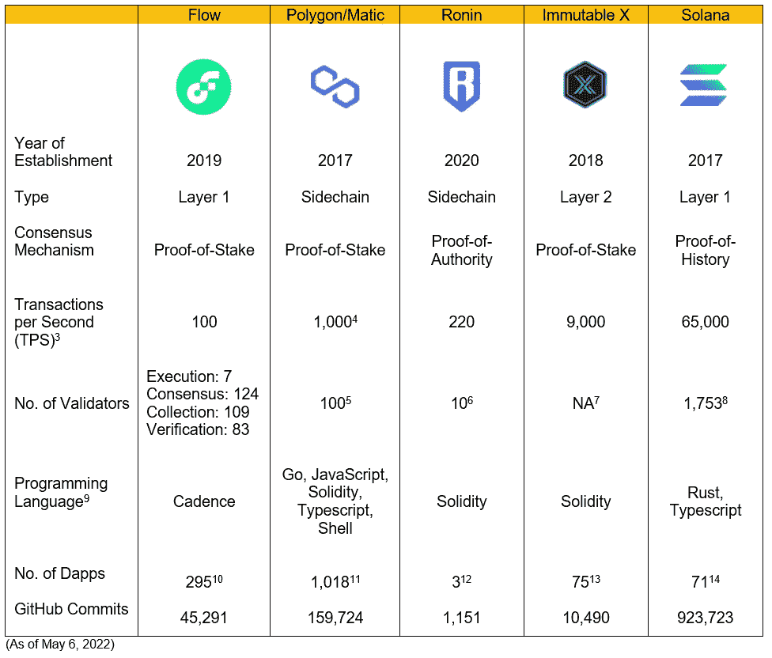

# 流量区块链:简单来说

> 原文：<https://medium.com/coinmonks/flow-blockchain-in-a-nutshell-b558f1e248f0?source=collection_archive---------17----------------------->

(最后编辑时间:2022 年 5 月 6 日)

low 是由 CryptoKitties 和 NBA Top Shot 背后的公司 Dapper Labs 开发的第一层区块链。它是为 NFT 开发设计的，因为 2017 年底的 CryptoKitties 热潮导致以太坊网络严重拥堵，从而导致昂贵的天然气费用。为了大幅提高其竞争对手的交易速度和吞吐量，Flow 采用了一种完全不同的架构方法:

1.  **多节点架构** : Flow 放弃了分片[【1】](#_ftn1)(以太坊和许多其他区块链使用的)作为可伸缩性解决方案，因为它增加了数据库和区块链应用程序的复杂性。相反，Flow 的节点被分配到四个功能之一:验证、共识、收集和执行，这样每个节点仍然参与每个事务的验证，但只是验证阶段中的一个。通过保持事务的原子性和 ACID[【2】](#_ftn2)兼容性，流可以扩展到数千倍的吞吐量。

Source: onflow.org

2. **Cadence 作为面向资源的语言**:与面向对象的语言相比，Cadence 作为面向资源的语言是一种更直接的表示 NFTs 所有权的方式。资源模型不是像以太坊那样将所有的 NFT 存储在一个巨大的列表中，而是将 NFT 直接存储在拥有它的帐户中。这种安排使得智能合约开发人员不容易出错，并且更有效率。

3.**可升级的智能合约** : Flow 允许开发人员灵活地调整代码，并在永久不变地推出之前将升级置于 mainnet 上的“测试状态”。它为编程错误提供了额外的保护，即使在最有才华的程序员中，编程错误也是常见的。

4.**消费者友好的入职培训**:在区块链设计中，流程优先考虑安全性。例如，流事务格式是人类可读的，这样用户将知道什么样的更改可以或不可以进行。此外，他们的支付入口是主流就绪的。

Flow 自成立以来一直处于快速发展中。据 Github 称，Flow 的存储库中有超过 40，000 个提交。就 Github 提交数量而言，它是过去 6 个月增长最快的第一层区块链之一。此外，目前大约有 300 个 dapps 在流动，600 多个项目在秘密进行。根据 DappRadar 的说法，BloctoBay 是一个分散的 NFT 市场，NBA TopShhot 是 NBA moments 的授权数字收藏品，BloctoSwap 是一个分散的交易所，是 Flow 上有史以来交易量最高的三个 dapps，占 Flow 上总交易量的 90%以上。

我相信 Flow 拥有超越其他一级区块链的巨大潜力，因为它独特的架构更适合 NFT 的发展，经验丰富的创始团队，以及 NFT 巨大的潜在市场。Dapper Labs 是密码领域最成功的 Dapp 团队之一。迄今为止，他们的交易收藏品游戏 CryptoKitties 已完成超过 1，200 ETH 的交易。最重要的是，NBA Top Shot 是 2021 年最受欢迎的 Dapps 之一，销售额达到 2.24 亿美元。在宏观层面上，NFT 的发展才刚刚开始——根据 Jefferies 的数据，NFT 市值预计将在 2022 年达到 350 亿美元，2025 年达到 800 亿美元，CAGR 为 32%。

尽管对于 NFT 开发来说，Cadence 是一种更好的编程语言，但还是有一些潜在的问题:目前，大多数 NFT 项目仍然在以太坊上。此外，Flow 上总用户数的 98%来自 NBA Top Shot，其销量自去年以来一直在下降。因此，开发人员可能不愿意学习新的语言，除非他们看到对 Flow 有意义的牵引。此外，以太坊和其他第一层区块链正在竞相解决他们的可扩展性问题。预计今年晚些时候推出的“以太坊合并”将把以太坊的共识机制从工作证明转变为利益证明，这可能会留住大多数已经开始使用以太坊编程语言 Solidity 的开发者。

脚注:

[【1】](#_ftnref1)分片将一个事务分解成称为分片的块，这有助于减少网络的延迟。

[【2】](#_ftnref2)酸是“原子的、一致的、孤立的、持久的”的简称。它是数据库事务为了得到可靠处理而必须遵守的一组属性。

[3] TPS 测量吞吐量

[4]来源:[https://blog . polygon . technology/what-you-preferred-maximum-security-or-cheap-transactions/](https://blog.polygon.technology/what-do-you-prefer-maximum-security-or-cheaper-transactions/)

[5]来源:[https://polygon.technology/](https://polygon.technology/)

[6]资料来源:[https://explorer.roninchain.com/validators](https://explorer.roninchain.com/validators)

[7]不可变 X 采用以太坊的共识机制

[8]来源:[https://solana.com/validators](https://solana.com/validators)

[9]资料来源:GitHub

[10]资料来源:Flowverse

[11]资料来源:DappRadar

[12]资料来源:DappRadar

[13]资料来源:DappRadar

[14]资料来源:DappRadar

要查看其他与加密相关的内容，请点击此处的。

> 加入 Coinmonks [电报频道](https://t.me/coincodecap)和 [Youtube 频道](https://www.youtube.com/c/coinmonks/videos)了解加密交易和投资

# 另外，阅读

*   [氹欞侊贸易评论](https://coincodecap.com/anny-trade-review) | [CoinSpot 评论](https://coincodecap.com/coinspot-review)
*   [新加坡十大最佳加密交易所](https://coincodecap.com/crypto-exchange-in-singapore) | [购买 AXS](https://coincodecap.com/buy-axs-token)
*   [投资印度的最佳加密软件](https://coincodecap.com/best-crypto-to-invest-in-india-in-2021) | [WazirX P2P](https://coincodecap.com/wazirx-p2p)
*   [7 个最佳零费用加密交易平台](https://coincodecap.com/zero-fee-crypto-exchanges)
*   [最佳网上赌场](https://coincodecap.com/best-online-casinos) | [期货交易机器人](/coinmonks/futures-trading-bots-5a282ccee3f5)