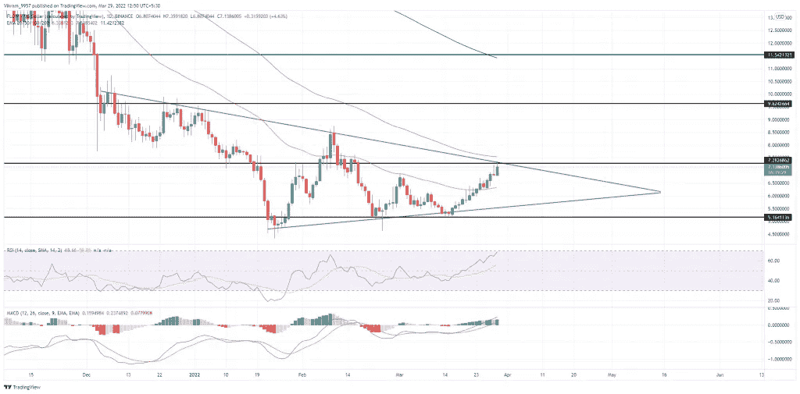

# 流动技术分析:从底部突破 25%的跳跃

> 原文：<https://medium.com/coinmonks/flow-technical-analysis-breakout-from-rounding-bottom-teases-25-jump-e12eb22ba98?source=collection_archive---------88----------------------->

**Visit our website:-** [**https://bitcoinsupports.com/**](https://bitcoinsupports.com/)

流币的价格正在逼近三角形态的阻力，凸显突破概率。你应该在突破前考虑购买吗？

关键技术点:

-流量价格在过去两周上涨了 38%。

—多头反弹穿越 50 日均线。

—最后，Flow 的 24 小时交易额为 14.9 亿美元，同比增长 48%。

**流币前期表现**

3 月初，流币价格奋力突破 50 天指数均线上方，但是从支撑趋势线的反转改变了一切。反向反弹优于 50 天指数移动平均线，在到达阻力趋势线之前的最后两周上涨了近 40%。

**Visit our website:-** [**https://bitcoinsupports.com/**](https://bitcoinsupports.com/)

**流量技术分析**

流量币的日线蜡烛图展示了一根看涨蜡烛接近阻力趋势线，涨幅 5%，削弱了之前的倒锤蜡烛。因此，买家完全控制了趋势，并可能很快克服卖家驱动的趋势线。

市场价格正在逼近 100 天指数移动平均线，并在 50 天均线上出现反转。因此，突破 100 日均线将放大购买压力和趋势动力。

**RSI 指标:**RSI 斜率揭示了潜在看涨情绪的惊人增加，因为 RSI 线增加了 30 点，以挑逗超买边界。此外，14 天的 SMA 本周穿越中点，增加了持续买入压力的可能性。

**MACD 指标:**MACD 和信号线在短暂下跌后恢复多头势头。在短暂下跌后，看涨的 MACD 直方图也重新出现。线与线之间的扩展增加了上升趋势持续的可能性。

总之，随着市场的反弹和买家的增多，流量技术分析强调突破性反弹的可能性越大。

**即将到来的趋势**

流通币价格在三角形形态内呈现出强劲的上涨势头，这增加了趋势线突破的可能性。因此，上涨有可能达到 10 美元的水平，如果买家夺回 100 日均线堡垒，价格将上涨 30%。

**支撑位:**6.75 美元和 6 美元

**阻力位:**8.5 美元和 10 美元

**访问我们的网站:-**[**https://bitcoinsupports.com/**](https://bitcoinsupports.com/)

**免责声明:这些是作者的观点，不应被视为投资建议。读者应该自己做研究。**

> 加入 Coinmonks [电报频道](https://t.me/coincodecap)和 [Youtube 频道](https://www.youtube.com/c/coinmonks/videos)了解加密交易和投资

# 另外，阅读

*   [OKEx vs KuCoin](https://coincodecap.com/okex-kucoin) | [摄氏替代品](https://coincodecap.com/celsius-alternatives) | [如何购买 VeChain](https://coincodecap.com/buy-vechain)
*   [币安期货交易](https://coincodecap.com/binance-futures-trading)|[3 comas vs Mudrex vs eToro](https://coincodecap.com/mudrex-3commas-etoro)
*   [如何购买 Monero](https://coincodecap.com/buy-monero) | [IDEX 评论](https://coincodecap.com/idex-review) | [BitKan 交易机器人](https://coincodecap.com/bitkan-trading-bot)
*   [CoinDCX 评论](/coinmonks/coindcx-review-8444db3621a2) | [加密保证金交易交易所](https://coincodecap.com/crypto-margin-trading-exchanges)
*   [红狗赌场评论](https://coincodecap.com/red-dog-casino-review) | [Swyftx 评论](https://coincodecap.com/swyftx-review) | [CoinGate 评论](https://coincodecap.com/coingate-review)