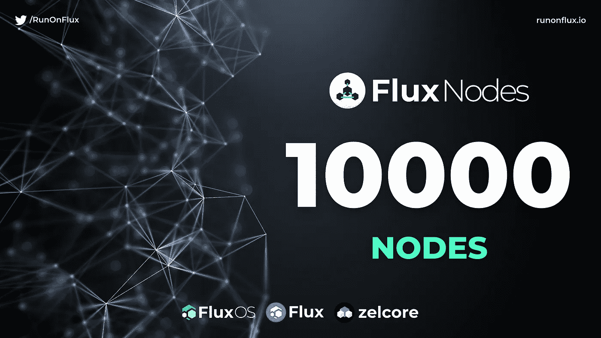

# Flux 10，000 节点庆典 AMA 总结

> 原文：<https://medium.com/coinmonks/flux-10-000-node-celebration-ama-summary-8aa88d350728?source=collection_archive---------6----------------------->

为了庆祝 Flux 达到 10，000 live nodes，Daniel 举办了一场即兴的 AMA。

*你可以在 YouTube 这里看回 AMA:*[*https://www.youtube.com/watch?v=ipC4UKwUnSk*](https://www.youtube.com/watch?v=ipC4UKwUnSk)

## 什么是通量？

Flux 是一套全面的分散式计算服务和区块链即服务解决方案。Flux 生态系统包括:Fluxnodes 的分散式基础设施、FluxOS 云操作系统、Zelcore 自托管多资产钱包和区块链应用套件，以及用于链上治理、经济和并行资产的 Flux 区块链，以提供与其他区块链和 DeFi access 的互操作性。

Flux 为新的互联网提供了关键的、高可用性的基础设施。项目和开发团队不必依赖 Flux 区块链来利用 FluxOS，因此他们可以访问必要的基础设施，同时保持自己链的所有独特属性。Flux 是专注于下一代互联网的平衡分布式计算产品组合的重要组成部分。

# 这是 AMA 的书面摘要

## 问题:如果所有可用的 Flux 令牌都被锁定在节点中，应用程序开发人员将如何支付在 Flux 网络上部署他们的应用程序的费用？

这种特殊的情况是极不可能的，由于经济学的变化和一般的金融市场。然而，通量能够被分成微通量，低至 0.0000001 通量。就像比特币有 satoshis 一样，Flux 可以在微观上交易，而不是在整个代币上交易。

至于部署的支付，这可以被评估和调整以匹配当前的价格和通量的可用性，以确保系统工作。

## 问:当开采完最后一个通量时，通量经济模型将如何变化？

据估计，最后一个通量令牌将在大约 125 年的时间开采。从现在到那时，有足够的时间来做出调整经济模式以适应当前形势的决策。

## 问:我们什么时候能期待新的网速基准实施？

Flux 团队计划在实施该基准之前收集网络上所有节点的互联网速度的量化数据，但是该基准对于 Flux 提供企业级性能是必要的。

Flux 团队保证互联网速度基准将尽可能低，不会对 Flux 网络作为行业领先的 Web3 计算网络的输出造成任何影响。

## 问题:节点运营商会从支付 dApp 部署费用的开发者那里获得一部分收入吗？

目前，在 Flux 网络上启动 dApp 的成本是收支平衡的。这种价格模式是为了吸引新的开发者，让 Flux 网络运转起来。根据计划，这一 Flux 收入流将返回到基金会(现在有超过 50 名开发人员和团队成员)，以继续支持和开发 Flux，但在未来，社区 xDAO 可用于分配这一 Flux 收入流。

## 问:节点运营商的额外收入来源计划是什么？

目前，在循环排队系统中，节点操作者被支付通量块奖励。没有计划改变这一点，随着更多的节点上线，来自这一流的收入很可能会进一步减少。但是，未来节点运营商增加收入还有另外两种方式。

首先，节点将被进一步细分为类，每个类将关注一个特定的用例或功能。例如，将选择一个目前尚未宣布的节点层来运行 project Thunder，这是一个数据持久性节点，将专注于数据和数据库的长期存储(如 NFT 媒体)。这些级别都有自己的等级和基准要求，并将为运营商带来额外的激励。

其次，Flux Labs 项目和 marketplace 应用程序将在其项目的奖励令牌中向节点运营商提供奖励，就像当前 Flux 节点上的 KDA 和预搜索一样。

## 问题:当部署在 project Thunder 上时，数据和代码库可以私有吗？

是的。持久存储节点将安全和秘密地存储数据，然而目前运行的 Thunder 节点测试还没有秘密地存储数据。

## 问:Flux 计划如何对抗节点奖励的稀释，以至于操作员可能要在节点奖励之间等待数月？

Flux 没有计划改变 Flux 的经济结构或阻止奖励。如前所述，节点越多，节点运营商积极创收的机会就越多。

然而，Titan nodes 可以为投资者提供一定的稳定性和抵抗力，以应对不断变化的 APY 或由于节点离线而错过回报的问题，每次锁定抵押品 3 个月、6 个月或 1 年。

## 问:我们能查看 Flux 网络上当前运行的 dApps 以及它们使用了多少资源吗？

是啊！Jetpack 2.0 将提供一个仪表板，实时显示网络上运行的 dApps 的指标和数据，以及网络的容量和处理能力。这些实时数据可用于在 Flux 和其他 Web3 项目或 Web2 产品(如 AWS 或 Microsoft Azure)之间进行比较。Jetpack 2.0 还计划集成所有这些数据的 API。

## 问:是什么防止非法数据被托管在 Flux 上？

目前，Flux 网络上部署的所有东西都由 Flux dev 团队审查。然而，在未来，部署到 Flux 上的任何东西都需要遵守社区服务条款，由 xDAO 管理。

最终，Flux 不对 Flux 网络上部署的内容负责，因为没有任何实体控制或拥有 Flux。Flux 网络上数据的责任和所有权可以追溯到最初部署它的用户(可以使用 ZelID 进行跟踪)。

## 问题:非功能性思维会改变吗？

NFT 由两部分组成；管理和代表区块链上的 NFT 的智能合同/令牌，以及链接到令牌的数字媒体。

ZelCore 计划支持 NFTs，Flux 非常适合通过即将到来的 Thunder 项目为 NFT 媒体提供后端分散数据存储和持久性。

## 问:Flux 上可以部署多少并行资产有限制吗？

不，Flux 希望尽可能在每个链上有一个并行资产，并允许 Flux 连接链和 Web3。

## 问:在最初的 10 次空投之后，还会有类似的空投吗？

在第十次空投完成后，没有继续进行平行资产空投的计划。此外，作为 Flux 通缩经济模型的一部分，5 月 5 日快照之前的每一次快照都将使 pa 占总 Flux 余额的百分比越来越低。

## 问:泰坦节点会有最大数量吗？

最初，Titan 节点只能由可信的社区成员、基金会和可信的合作伙伴部署。这将是暂时的，以允许 Flux 确保 Titan 节点的平稳运行，以及适当的工作系统到位。

试用期过后，有限数量的 Titan 节点将存在于网络上，Flux 团队将密切关注这些节点，以确保它们正常运行并正确设置。这些节点将交错部署，以确保它们分布在世界所有地区，并且不会同时过期。

## 问:泰坦节点的选址会考虑绿色能源或可再生能源吗？

是啊！Flux 计划大力推动绿色科技，其中一部分将围绕绿色科技规划泰坦节点。Flux 努力减少运行所有这些技术的碳足迹，PoUW 是 Flux 不想浪费任何一个字节的另一个例子。

## 问:你能提供更多关于 PoUW(有用工作证明)的细节吗？我们什么时候能从它那里得到更多？

pow 将彻底改变我们开采加密货币的方式。PoUW 将利用图形卡的全部计算能力为 Flux 网络提供有用的工作(如渲染视频或生成计算机模拟等图形密集型任务)。这一切都将有可能与一个新的挖掘算法仍在发展中。Flux 计划将这种算法开源，永远改变密码球。更多细节计划在第三季度至第四季度发布。

## 问:有关于 M-group 营销公告的任何细节吗？

Flux 决定与 M-Group 合作，作为 Flux 更加关注企业客户的更大战略的一部分。Flux 将改变 it 营销的方式，提供更加一致和专业的营销标准。这一点已经可以在 Flux 的 medium 文章中感受到，这些文章更加关注技术和后勤细节，以及 Flux 团队内部的变化。

这并不意味着 Flux 放弃其零售营销策略，事实上恰恰相反。流动大军提供了强大的社区推动力，流动大使继续在世界各地的流动市场推广中发挥关键作用。

## 问题:如果一家风险投资公司想涉足 Flux，他们该如何做最好？

买！Flux 团队不卖代币，也从来没有卖过代币。助焊剂只能公开购买。

## 问:有计划举行公开的开发者会议吗？

是的。Flux 计划举行公开的开发者会议，可能在周六，你可以收听并进行有限的互动。

## 问题:Flux 和 ZelCore 的计划中有多 sig 钱包吗？

Flux 和 ZelCore 都计划推出多签名钱包。泰坦节点将需要多签名钱包用于他们的共享抵押品锁定，目前 Flux 多签名钱包确实存在于测试环境中。

## 问:我如何加入 Flux 团队？

最好的办法是加入到官方的纷争中，找一个能给你指出正确方向的主持人。

## 问:在裸机(家庭主机)上运行 Flux 节点会有激励吗

是的。更多细节将在第三季度公布。

另外，Cirrus nodes 将几乎只在裸机上运行。

## 问:Flux 如何知道你是在家里托管，而不是在云提供商那里托管？

这将主要由机构群体来决定。IP 地址是最简单的载体，但 Flux 团队正在努力研究其他解决方案。更多信息将于第三季度发布。

## 问题:有没有 ZelCore 硬件钱包的计划？

它在候选名单上。ZelCore 计划提供热钱包的 UI 前端，然后硬件钱包为您的资产提供冷存储。这种集成将允许用户利用 ZelCore 和 Flux 节点的所有功能，同时获得硬件钱包的保护和所有权。计划在明年的某个时候。

要了解更多关于 Flux 的信息，请访问[Flux-去中心化云基础设施(runonflux.io)](https://runonflux.io/index.html)

> 加入 Coinmonks [电报频道](https://t.me/coincodecap)和 [Youtube 频道](https://www.youtube.com/c/coinmonks/videos)了解加密交易和投资

# 另外，阅读

*   [最好的卡达诺钱包](https://coincodecap.com/best-cardano-wallets) | [Bingbon 副本交易](https://coincodecap.com/bingbon-copy-trading)
*   [印度最佳 P2P 加密交易所](https://coincodecap.com/p2p-crypto-exchanges-in-india) | [柴犬钱包](https://coincodecap.com/baby-shiba-inu-wallets)
*   [8 大加密附属计划](https://coincodecap.com/crypto-affiliate-programs) | [eToro vs 比特币基地](https://coincodecap.com/etoro-vs-coinbase)
*   [最佳以太坊钱包](https://coincodecap.com/best-ethereum-wallets) | [电报上的加密货币机器人](https://coincodecap.com/telegram-crypto-bots)
*   [交易杠杆代币的最佳交易所](https://coincodecap.com/leveraged-token-exchanges) | [购买 Floki](https://coincodecap.com/buy-floki-inu-token)