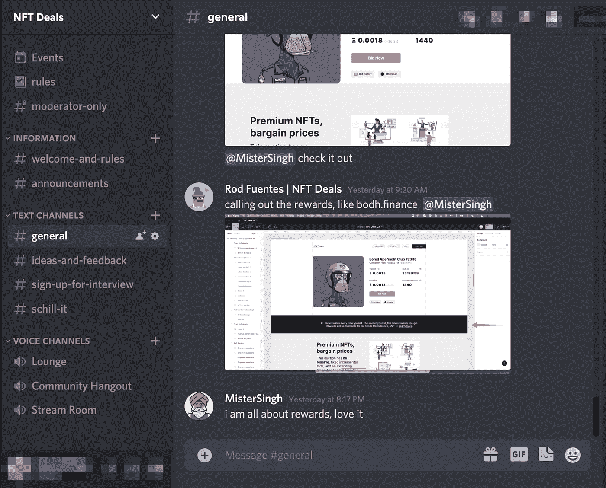

# 跟随我的旅程，作为一个成功的 web2 创始人建立一个 web3 创业

> 原文：<https://medium.com/coinmonks/follow-my-journey-as-a-successful-web2-founder-building-a-web3-startup-d78c3a8ed528?source=collection_archive---------13----------------------->

## 我读到过。我想过了。我已经谈过了。现在我正在做:这是我的# BuildInPublic #宣言。

当我打这个的时候，我感觉很脆弱。以如此公开的方式分享我一生的工作——包括缺点和全部——让我紧张。所以这是我的倒计时… 3… 2… 1…开始。

你好，我是罗德·富恩特斯。我是一名科技企业家，在过去的 11 年里一直在创业，通常从事产品、销售和营销工作。我的上一家创业公司 ListenLoop 是一家基于账户的广告软件，于 2019 年被 Integrate.com 收购。卖掉我的创业公司后，我在一家快速发展的 B2B SaaS 公司做了三年的产品副总裁。然后，几个月前，我渴望开始另一次冒险——这次是在 web3。但是当我把我的计划分享给原生加密人时，他们给了我令人惊讶的反馈:

> 你可能已经成功地启动了 web2，但这是 web3，你不知道如何在这里构建。#NGMI

他们的反馈不是关于区块链编码，而是关于不熟悉 web3 文化，它的优点和缺点，以及走向市场的策略。例如，web3 中[构建的精髓部分就是在公共场合](https://twitter.com/gregisenberg/status/1478743443497271296?s=20&t=5dIcVp32d2zCMo7PBuSeyQ)这样做。而且，是的，这个想法起初感觉违反直觉和可怕。类似于:

> 为什么我要做所有的客户发现和产品开发，却让其他人叉[克隆]代码，削弱我们的业务？

这种感觉让我想起了 2007 年我的第一次创业经历，那时我还很天真，在分享我的*宝贵的*想法之前，先申请了 NDA。🤣(感谢乔、伦纳德、迈克尔、塞萨尔娱乐我的错觉。)就像我必须习惯于在没有 NDA 的情况下分享想法一样，我现在必须习惯于分享我的产品和可分叉的代码。

老实说，要克服保护自己经济利益的本能欲望并不容易。所以我在想，“我是不是这样一个婴儿潮一代，以至于不能过渡到 web3？”看着我。#LFG

# 为什么要在公共场合建造？

我已经决定拥抱 web3 的精神，并在公共场合建立*。我的目标是利用[社区的超级力量](https://www.thetilt.com/audience/web3-control-community)——包括更快的创新周期、产品宣传和受众培养——超越我使用 web2 剧本所能完成的任何事情。正如 Gabriel Anderson 强调的，“利用 web3 社区就像在类固醇上构建开源软件一样。”*

*除了[提到的](/on-startups/why-you-should-build-your-product-in-public-e28c54629bc1)[公开建造](https://www.buildinpublic.xyz/)的好处之外，我这样做的动机是因为它将**增加问责制**。在没有后果的情况下，用崇高的路线图制定宏伟的计划太容易了。公开分享我们的计划和进展是一种强迫功能，会迫使我去实现那些目标。反过来，我也必须非常现实，描绘出一条通往成功的道路，不要夸大其词或胡说八道。此外，公共建设将使我在社区推动我实现目标时保持责任感。*

# *你能从我这里期待什么？*

*以下是我和我的另一半正在打造的东西(事实上，我的联合创始人就像一个“创业配偶”，已经十年了！):*

> *对于没有足够资金或内部渠道的 NFT 买家来说，
> 只有 **NFT 交易**赋予他们以低价购买蓝筹股 NFT 的权力
> ，因为我们的游戏化拍卖没有底价，起价为 1 美元。*

*如果我们能证明这是成功的，那么我们的目标是将后端转换成 DAO 管理的协议，任何人都可以使用或构建到他们的 dApps 中。这将允许任何人未经许可和可组合地举办我们的游戏化拍卖风格。但稍后会详细介绍。这篇文章的目的不是推销这个产品。事实上，这是可能的，我们将经历许多支点，因为这个想法只有几个星期之久！*

*现在，考虑到这个产品，下面是我打算分享的内容类型:*

*   ***周/月总结**。我设想类似于 sprint 回顾会，在那里我描述亮点、不足之处，以及我们下一次 sprint 想做得更好的地方。*
*   ***早庆祝，常庆祝**。让我们一起享受我们的小胜利和大胜利。例如，我们最近被高度选择性的[*Consensys Mesh:Tachyon*](https://mesh.xyz/tachyon/)项目接受，这是一个为早期区块链和 Web 3.0 创业公司提供的加速器🎉*
*   ***反省亏损，太过**。成功不是好老师。我的目标是与你分享我的损失，因为这将迫使我反思、学习和改进。*
*   ***记录流程**。我会分享我们一路走来的过程和进展，包括截图，Miro 板，Figma mocks，代码行，产品辩论。你将看到“[香肠是如何制作的](https://quoteinvestigator.com/2010/07/08/laws-sausages/)”来学习，或者告诉我们怎么做更好！*
*   ***反馈、想法和协作**。你应该觉得你是在和我们一起打造这个产品。我会征求你们的反馈和想法，我保证会倾听和参与。也期待听到路障。然后就潜在的解决方案与我们合作。*
*   ***创业诀窍**。朋友、顾问和投资者与我分享了他们的时间和创业智慧，我一直试图通过对他人的一对一指导来*支付这种前进*。不幸的是，这种方法是不可扩展的。希望这次#BuildInPublic 的旅程，能和更多的创业者一起，分发难以找到的，不知道怎么问的知识。*

# *一起，瓦格米*

*我很兴奋(也很紧张！)和你一起开始这段旅程。如果你对这篇文章很感兴趣，那么请使用下面的链接跟随这个旅程。*

*   *[**加入我们的不和**](http://discord.gg/GHkXZdc5) 。这是一个来自我们创始团队和社区的活跃的信息来源。我们将分享想法、模仿、更新，以及偶尔庆祝寿司的照片🍣*

**

*   *[**关注我**](https://twitter.com/rodrigofuentes7) **和** [**NFT 交易**](https://twitter.com/NFT_Deals_xyz) **上推特**。每天发几条推文，突出关键见解。*

*   *[**加盟我们的邮件简讯**](/@rodrigofuentes7/subscribe) 。偶尔总结一下以上所有内容。*

*我期待着很快见到你！*

> **加入 Coinmonks* [*电报频道*](https://t.me/coincodecap) *和* [*Youtube 频道*](https://www.youtube.com/c/coinmonks/videos) *了解加密交易和投资**

# *另外，阅读*

*   *[有哪些交易信号？](https://coincodecap.com/trading-signal) | [Bitstamp vs 比特币基地](https://coincodecap.com/bitstamp-coinbase) | [买索拉纳](https://coincodecap.com/buy-solana)*
*   *[ProfitFarmers 点评](https://coincodecap.com/profitfarmers-review) | [如何使用 Cornix Trading Bot](https://coincodecap.com/cornix-trading-bot)*
*   *[十大最佳加密货币博客](https://coincodecap.com/best-cryptocurrency-blogs) | [YouHodler 评论](https://coincodecap.com/youhodler-review)*
*   *[MyConstant 点评](https://coincodecap.com/myconstant-review) | [8 款最佳摇摆交易机器人](https://coincodecap.com/best-swing-trading-bots)*
*   *[MXC 交易所评论](/coinmonks/mxc-exchange-review-3af0ec1cba8c) | [Pionex vs 币安](https://coincodecap.com/pionex-vs-binance) | [Pionex 套利机器人](https://coincodecap.com/pionex-arbitrage-bot)*
*   *[我的加密副本交易经历](/coinmonks/my-experience-with-crypto-copy-trading-d6feb2ce3ac5) | [比特币基地评论](/coinmonks/coinbase-review-6ef4e0f56064)*