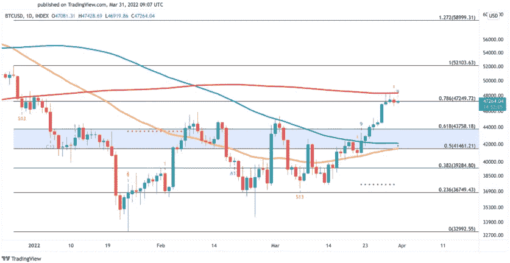
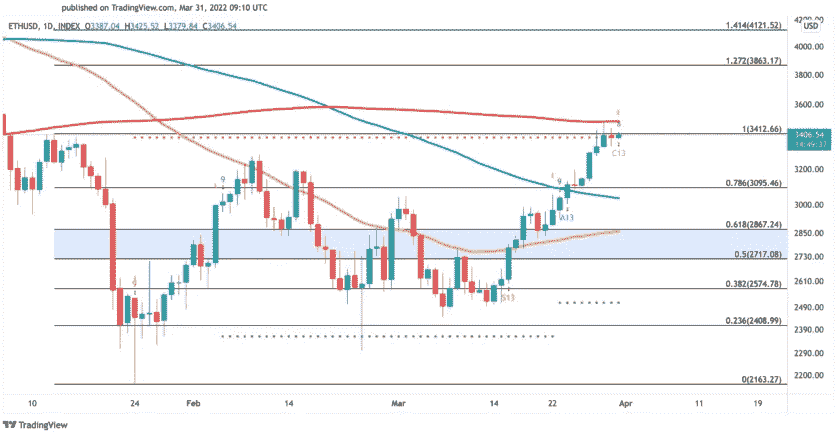

# 在反弹之后，比特币和以太坊面临阻力

> 原文：<https://medium.com/coinmonks/following-their-rally-bitcoin-and-ethereum-are-facing-resistance-2d269f682ded?source=collection_archive---------39----------------------->

**Visit our website:-** [**https://bitcoinsupports.com/**](https://bitcoinsupports.com/)

排名前两位的加密货币比特币和以太坊正在强阻力位下方企稳。大幅调整可能即将到来。

**比特币和以太坊奋力突破**

比特币和以太坊近日表现平平，尽管低市值资产激增。

在过去两周内，排名前两位的加密资产表现出了很高的相关系数。它们几乎同步上涨，市值增加了 28%以上。然而，比特币和以太坊似乎都达到了一个关键的阻力位，卖出迹象正在出现。

自 3 月 28 日以来，比特币一直试图突破 200 日均线，但未能成功。尽管阻力往往会随着时间的推移而减弱，但在当前价格水平附近，交易量似乎正在减弱。由于缺乏购买需求，比特币可能会被拒绝，以便在进一步上涨之前收集流动性。Tom DeMark (TD)序列指标目前在比特币的日线图上显示出卖出信号，这为短期负面观点提供了依据。获利回吐可能会确认熊市格局，导致一至四个日线蜡烛图回撤。在这种情况下，比特币可能会跌至 43，760 美元至 41，460 美元的需求区间。

**Visit our website:-** [**https://bitcoinsupports.com/**](https://bitcoinsupports.com/)

3500 美元左右的 200 天移动均线似乎也阻止了以太坊的上涨。当以太币交易低于这个关键阻力位时，短期修正的可能性增加。此外，TD 序列指标预测会出现负面结果。

以太坊的日线图上，人气指标已经闪现了连击 13 烛台，可以解读为卖出信号。如果卖单在当前价格水平附近增加，以太坊可能会在试图夺回 200 天移动平均线之前跌破 2870 美元或 2720 美元。

**Visit our website:-** [**https://bitcoinsupports.com/**](https://bitcoinsupports.com/)

虽然比特币和以太坊似乎面临着巨大的阻力，但其他分析师认为，目前的整合有利于未来的价格上涨。日线蜡烛线收于 200 日移动平均线上方，可能会令短期悲观看法失效。如果比特币突破 200 天移动平均线，它可能会达到 5200 美元。同时以太坊如果能突破有机会达到 3900 美元。

**访问我们的网站:-**[**https://bitcoinsupports.com/**](https://bitcoinsupports.com/)

**免责声明:以上为作者观点，不应视为投资建议。读者应该自己做研究。**

> 加入 Coinmonks [电报频道](https://t.me/coincodecap)和 [Youtube 频道](https://www.youtube.com/c/coinmonks/videos)了解加密交易和投资

# 另外，阅读

*   [密码本交易平台](/coinmonks/top-10-crypto-copy-trading-platforms-for-beginners-d0c37c7d698c) | [Coinmama 审核](/coinmonks/coinmama-review-ace5641bde6e)
*   [印度的加密交易所](/coinmonks/bitcoin-exchange-in-india-7f1fe79715c9) | [比特币储蓄账户](/coinmonks/bitcoin-savings-account-e65b13f92451)
*   [OKEx vs KuCoin](https://coincodecap.com/okex-kucoin) | [摄氏替代品](https://coincodecap.com/celsius-alternatives) | [如何购买 VeChain](https://coincodecap.com/buy-vechain)
*   [币安期货交易](https://coincodecap.com/binance-futures-trading)|[3 comas vs Mudrex vs eToro](https://coincodecap.com/mudrex-3commas-etoro)
*   [如何购买 Monero](https://coincodecap.com/buy-monero) | [IDEX 评论](https://coincodecap.com/idex-review) | [BitKan 交易机器人](https://coincodecap.com/bitkan-trading-bot)