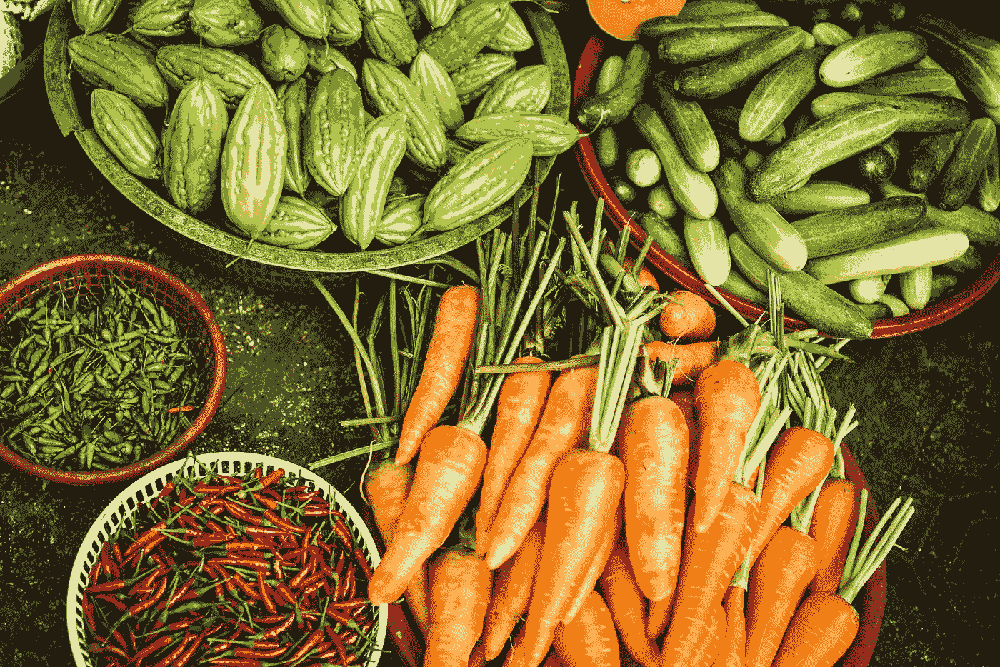

# 食物短缺…一个迫在眉睫的危险！

> 原文：<https://medium.com/coinmonks/food-shortages-a-very-present-danger-30b5ee551244?source=collection_archive---------58----------------------->

source: [Megan Thomas](https://unsplash.com/@organicdesignco)

## 哥哥，哥哥…怎么回事？

如果你有世界上所有的钱，但是没有一个钱可以给你买食物和水，因为它不是一个重要的交换工具，你会怎么做？嗯，这是我们应该问自己的问题…因为我们似乎快到了…我们几乎处于全球粮食短缺的临界点。这种现实的天意已经…