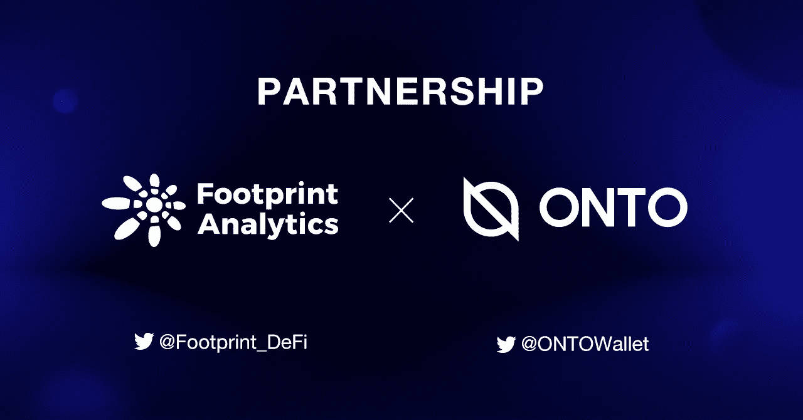

# 足迹分析与钱包达成战略合作伙伴关系

> 原文：<https://medium.com/coinmonks/footprint-analytics-has-reached-a-strategic-partnership-with-onto-wallet-91893f9542f6?source=collection_archive---------99----------------------->

我们很高兴地宣布，Footprint Analytics 和 ONTO(一种基于 DID 的无缝 Web3 体验网关)有助于在一个地方管理数字身份、数据和资产。

Footprint Analytics 和 ONTO Wallet 已经建立了战略合作伙伴关系，以促进未来活动的更深入整合和协作。

ONTO Wallet 帮助用户创建一个分散的数字身份，通过加密算法充分保护他们的隐私数据。

**关于合作:**

*   营销合作

Footprint Analytics 和 ONTO Wallet 正计划开展营销活动，以提高彼此的曝光率。

作为我们的战略营销合作伙伴之一，ONTO Wallet 将开展一些营销活动，为足迹分析提供营销支持。Footprint Analytics 也很高兴推出其他类型的营销公司。

*   进一步合作

在产品集成和其他方面的进一步合作也在进行中。在未来，足迹分析和钱包之间将有更深入的合作。

**钱包里装的是什么**

ONTO 是一个基于 DID 的网关，提供无缝的 Web3 体验。安全管理您的身份、数据和数字资产的最佳一体化选项，ONTO 允许您管理您的加密资产(包括 NFT)，执行跨链交换，随时访问各种 dApps，并通过 ONTO news feed 实时了解所有重要信息。

通过 ONTO Wallet，用户可以创建一个 ONT ID，这是一个分散的数字身份，支持一键创建和管理多链钱包地址，并通过加密算法充分保护他们的私人数据。

[网站](https://onto.app/) | [推特](https://twitter.com/ONTOWallet) | [媒体](https://medium.com/onto) | [电报](https://t.me/ONTOWallet)

**什么是足迹分析**

足迹分析是一个一体化的分析平台，用于可视化区块链数据和发现见解。它清理和整合链上数据，因此任何经验水平的用户都可以快速开始研究令牌，项目和协议。凭借一千多个仪表板模板和一个拖放界面，任何人都可以在几分钟内构建自己的定制图表。发掘区块链数据，利用足迹进行更明智的投资。

[网站](https://www.footprint.network/) | [推特](https://twitter.com/Footprint_DeFi) | [不和](https://discord.com/invite/3HYaR6USM7) | [电报](https://t.me/joinchat/4-ocuURAr2thODFh)|[Youtube](https://www.youtube.com/channel/UCKwZbKyuhWveetGhZcNtSTg)|[Linkedin](https://www.linkedin.com/company/footprintanalytics/people/)

> 加入 Coinmonks [电报频道](https://t.me/coincodecap)和 [Youtube 频道](https://www.youtube.com/c/coinmonks/videos)了解加密交易和投资

# 另外，阅读

*   [如何匿名购买比特币](https://coincodecap.com/buy-bitcoin-anonymously) | [比特币现金钱包](https://coincodecap.com/bitcoin-cash-wallets)
*   [瓦济里克斯 NFT 评论](https://coincodecap.com/wazirx-nft-review) | [比茨盖普 vs 皮奥克斯](https://coincodecap.com/bitsgap-vs-pionex) | [坦吉姆评论](https://coincodecap.com/tangem-wallet-review)
*   [如何使用 Solidity 在以太坊上创建 DApp？](https://coincodecap.com/create-a-dapp-on-ethereum-using-solidity)
*   [币安 vs FTX](https://coincodecap.com/binance-vs-ftx) | [最佳(SOL)索拉纳钱包](https://coincodecap.com/solana-wallets)
*   [如何在 Uniswap 上交换加密？](https://coincodecap.com/swap-crypto-on-uniswap) | [A-Ads 评论](https://coincodecap.com/a-ads-review)