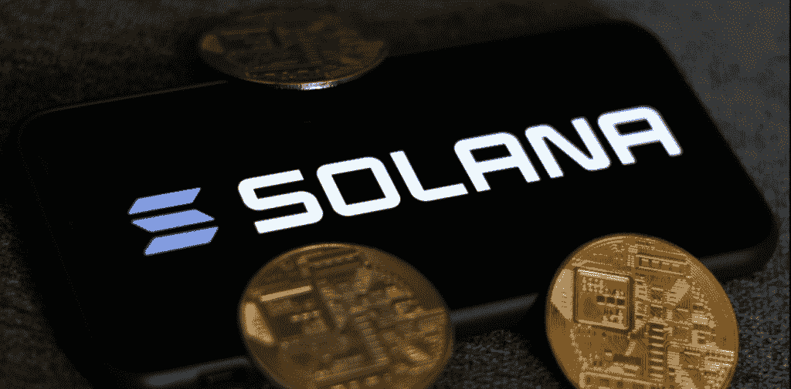

# 对美国银行来说，索拉纳可能成为签证的加密等价物

> 原文：<https://medium.com/coinmonks/for-bank-of-america-solana-could-become-the-crypto-equivalent-of-visa-c2de90a21b7f?source=collection_archive---------6----------------------->

DeFi 行业让几个加密网络相互竞争。在这场“战争”中，一些密码公司做出了不同的战略选择。例如，Solana 严重依赖其可伸缩性，而牺牲了

For Bank of America, Solana could become the crypto equivalent of Visa

索拉纳是 2021 年的一个不错的秘密惊喜。随着价格超过 10，000% ，索拉纳强势进入…