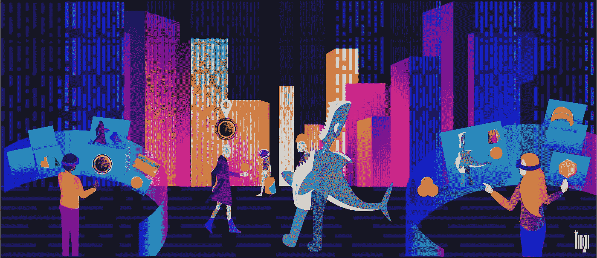

# 无论好坏:元宇宙

> 原文：<https://medium.com/coinmonks/for-better-or-worse-metaverse-d47196672095?source=collection_archive---------33----------------------->

Inner desires unleashed, or delusions gone unchecked?

> “参与的人数越多，他们就越容易自欺欺人，认为自己所做的事情一定是明智的。”—迈克尔·刘易斯，骗子的扑克

元宇宙这个词是两个词的组合词或嵌合体，其中第一个词“元”在语义上超越了第二个词“宇宙”，后者代表了物质、能量、空间、时间和所有由……表达的力以及它们之间的力的总和