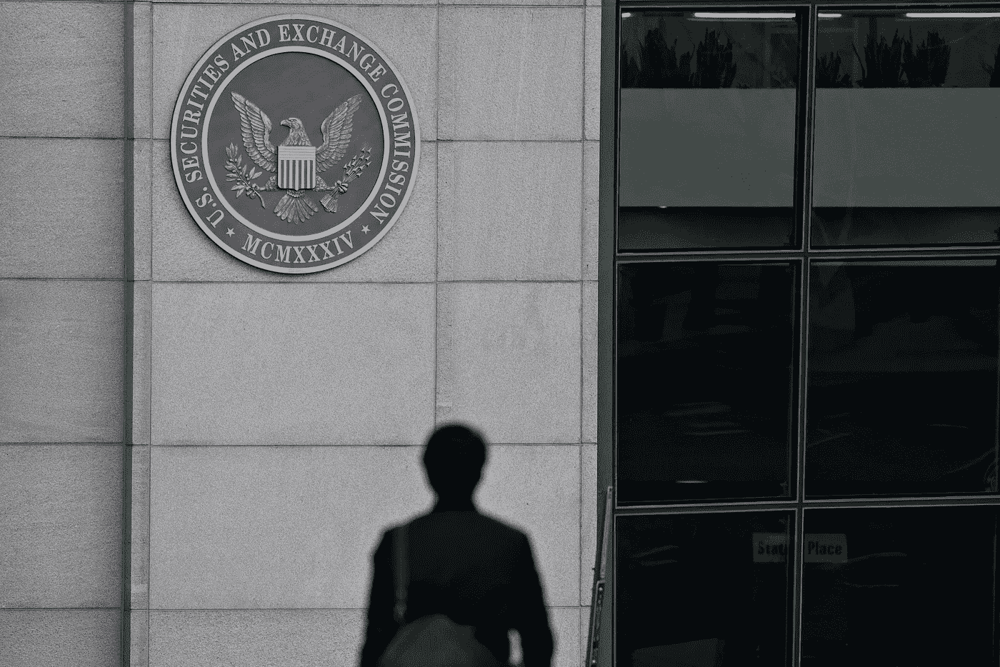

# 对于自行报告违反证券法的行为，加密公司仍可能面临 SEC 的处罚:报告

> 原文：<https://medium.com/coinmonks/for-self-reporting-securities-law-violations-crypto-companies-may-still-face-sec-penalties-report-c0766f6fe29e?source=collection_archive---------42----------------------->

**Visit our website:-** [**https://bitcoinsupports.com/**](https://bitcoinsupports.com/)

据报道，SEC 的执法负责人 Gurbir Grewal 表示，该机构不会忽视加密公司向他们提出的任何违反货币或证券法的行为。

据报道，美国证券交易委员会的执行主任表示，加密货币公司不会因报告可能违反证券法而获得特赦。

根据路透社周一发表的一篇文章，美国证券交易委员会的执法主任 Gurbir Grewal 表示，如果加密业务首先自我报告违反证券法的行为，该机构可能会“更积极地”看待加密业务的行为。不过，他澄清说，虽然企业可能面临的处罚会减轻，但他们不会完全免除责任。

“我们给加密企业的信息不是，‘注册你的产品，我们会忽略你在这个加密贷款产品中控制的数十亿美元以及你违反证券法的行为，’”格雷瓦尔解释道。

2021 年 7 月，SEC 执法总监从新泽西州总检察长办公室来到该机构。他对 SEC 将在 11 月份使用“执法监管”来监管加密和其他证券的说法进行了反击:“首先，也是最重要的，让我明确声明，我们支持并鼓励将创新技术用于资本发展。它们有潜力提高我们市场的效率和活力，并促进投资者的参与。但是，更重要的是，向美国投资者提供或出售的任何证券，无论其形式或名称如何，都必须遵守美国证券法规。”格雷瓦尔所谓的声明似乎与美国证交会主席加里·詹斯勒(Gary Gensler)一再要求加密企业“进来聊聊”，即在监管机构注册其证券的要求相矛盾。根据 Gensler 的说法，许多加密业务及其产品可能属于 SEC 的监管范围，必须注册以保护投资者。被业内许多人称为“加密妈妈”的 SEC 专员赫斯特·皮尔斯(Hester Peirce)一再指责该机构缺乏对加密公司和潜在证券法违规行为的监管透明度。

随着加密领域的发展，美国证券交易委员会似乎正在加大对加密业务的执法力度。该机构指控两名个人和一家总部位于开曼群岛的公司在 2021 年 8 月利用 DeFi 技术进行了 3000 万美元的证券欺诈案件。加密贷款公司 BlockFi 本月表示，作为和解的一部分，它将向 SEC 支付 5000 万美元，以及 5000 万美元的州级执法诉讼，原因是据称未能注册高收益利息账户。

**访问我们的网站:-**[**【https://bitcoinsupports.com/】**](https://bitcoinsupports.com/)

**免责声明:这些是作者的观点，不应被视为投资建议。读者应该自己做研究。**

> 加入 Coinmonks [电报频道](https://t.me/coincodecap)和 [Youtube 频道](https://www.youtube.com/c/coinmonks/videos)了解加密交易和投资

# 另外，阅读

*   [比诺莫评论](https://coincodecap.com/binomo-review) | [斯多葛派 vs 3Commas vs TradeSanta](https://coincodecap.com/stoic-vs-3commas-vs-tradesanta)
*   [Capital.com 评论](https://coincodecap.com/capital-com-review) | [香港的加密借贷平台](https://coincodecap.com/crypto-lending-hong-kong)
*   如何在 Uniswap 上交换加密？ | [A-Ads 评论](https://coincodecap.com/a-ads-review)
*   [WazirX vs CoinDCX vs bit bns](/coinmonks/wazirx-vs-coindcx-vs-bitbns-149f4f19a2f1)|[block fi vs coin loan vs Nexo](/coinmonks/blockfi-vs-coinloan-vs-nexo-cb624635230d)
*   [本地比特币评论](/coinmonks/localbitcoins-review-6cc001c6ed56) | [加密货币储蓄账户](https://coincodecap.com/cryptocurrency-savings-accounts)
*   [什么是融资融券交易](https://coincodecap.com/margin-trading) | [成本平均法](https://coincodecap.com/dca)
*   [支持卡审核](https://coincodecap.com/uphold-card-review) | [信任钱包 vs 元掩码](https://coincodecap.com/trust-wallet-vs-metamask)
*   [Exness 评论](https://coincodecap.com/exness-review)|[moon xbt Vs bit get Vs Bingbon](https://coincodecap.com/bingbon-vs-bitget-vs-moonxbt)
*   [如何开始通过加密贷款赚取被动收入](https://coincodecap.com/passive-income-crypto-lending)