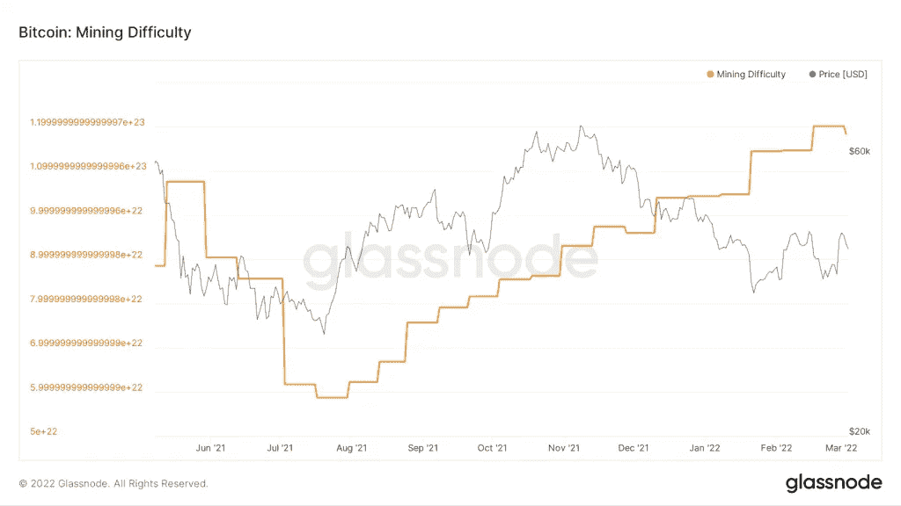

# 今年第一次，挖掘比特币的难度降低了

> 原文：<https://medium.com/coinmonks/for-the-first-time-this-year-the-difficulty-of-mining-bitcoin-has-decreased-398b27b932ef?source=collection_archive---------65----------------------->

**Visit our website:-** [**https://bitcoinsupports.com/**](https://bitcoinsupports.com/)

比特币开采难度在 2021 年首次向下调整，下降了 1.5%。

比特币(BTC)挖掘难度调整自 2021 年 11 月以来首次下降，降幅为 1.49%。这一变化发生在连续六次正难度调整之后，在此期间，挖掘难度和散列率达到了历史最高水平。

在过去的两周内，平均哈希速率已降至每秒 197.19 万亿次(EH/s)，而平均阻塞时间已超过 10 分钟的目标，为 10 分 09 秒。努力解决下一个有效区块的矿工会发现难度调整后会稍微容易一点。

**Visit our website:-** [**https://bitcoinsupports.com/**](https://bitcoinsupports.com/)

难度调整是比特币协议的重要组成部分。每两周或每 2016 个验证区块，挖掘新区块的难度会根据之前 2016 个区块的平均值进行“调整”，使挖掘区块变得更容易或更困难。

根据中本聪的比特币白皮书，“工作证明的难度是由基于每小时平均块数的移动平均值设定的。”如果它们生成得太快，难度就会增加。"

据推断，在过去的 2016 个块中，块生成得太慢了—平均 10 分 09 秒。因此，难度调整会自动降低，使矿工在接下来的 2，016 个区块中解决有效区块稍微容易一些。

据知名比特币矿工丹佛比特币(Denver Bitcoin)预测，今年的-1.49%修正可能是最后一次。

[https://Twitter . com/denverbitcoin/status/1499426584805183493](https://twitter.com/denverbitcoin/status/1499426584805183493)

1.49%的修正与 2021 年 5 月至 7 月的采矿黑暗时代相比相形见绌，当时中国禁止比特币采矿导致哈希率灾难性下降。然而，它在 2021 年迅速恢复，随着哈萨克斯坦和加拿大等国家填补了空缺，飙升了 31%，显示了网络的弹性。

比特币挖矿市场的竞争越来越激烈，英特尔等科技领域的参与者渴望降低散列率，发展自己的矿商。正如丹佛比特币所提到的，300 eh/s 的哈希速率可能在 2022 年成为可能，特别是随着采矿表现出越来越强的弹性和地理灵活性。

**访问我们的网站:-**[**https://bitcoinsupports.com/**](https://bitcoinsupports.com/)

**免责声明:以上为作者观点，不应视为投资建议。读者应该自己做研究。**