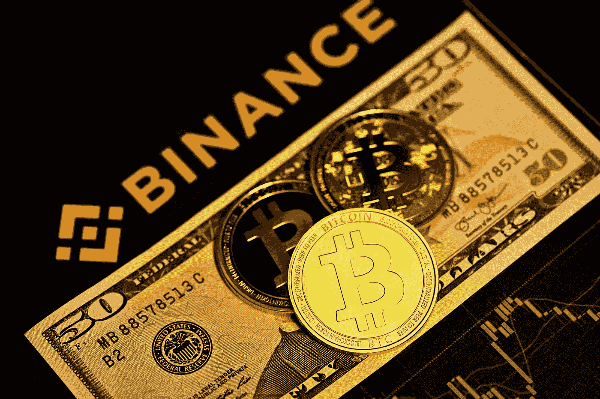
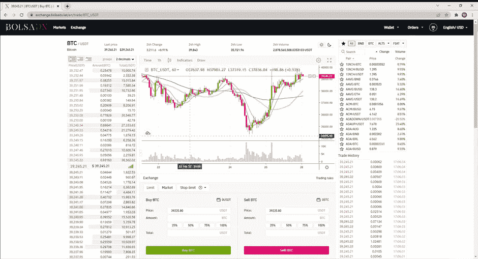

# 一个可以从任何地方(通过 VPN)访问的没有 KYC 的交换机？这是一个游戏规则改变者——bols adx 交易所

> 原文：<https://medium.com/coinmonks/for-those-that-cant-trade-on-binance-com-7c956ead223a?source=collection_archive---------12----------------------->

在过去的几年里，很多国家都无法进入 Binance.com。其他地方的[币安](https://bit.ly/3OfkcKY)，像币安。美国已经成立，以满足客户无法访问。com 版本。这使得他们可以获得更少的加密硬币进行交易，从而让他们尝试在其他地方获得这些硬币。

当时，这并不意味着什么，因为 KYC 并没有要求币安每天提取最多 2BTC。去年，这种情况发生了变化，所有客户都需要 KYC。实际上，这阻止了这些人根据他们居住的地区注册和使用 Binance.com 服务。

但是,**是一种在没有的情况下获得,[Binance.com 上所有资产的途径。想知道怎么做吗？和](https://bit.ly/3OfkcKY) [BolsaDX](https://bit.ly/39jxEyn) 打个招呼(可以在这里报名[打九折交易费)。你将需要一个 VPN 从美国访问它。你可以在 NordVPN](https://bit.ly/39jxEyn) [这里](https://go.nordvpn.net/aff_c?offer_id=15&aff_id=67791)享受优惠。**

BolsaDX 没有 KYC 的要求，您每天最多可以提取 2 个 BTC。听起来熟悉吗？请继续阅读…..

BolsaDX 是一家在拉丁美洲运营的交易所。交易所的后台是 Binance.com T21，但它的商标是 BolsaDX。所有的资产都是一样的，界面也是一样的，你的密码由币安持有，让你感觉就像在使用 Binance.com 一样。这实际上给了你进入 Binance.com 的机会。你甚至可以请求 API 密匙将它集成到你的第三方应用中(因为它只是[Binance.com](https://bit.ly/3OfkcKY))。你甚至可以在最后一张截图中看到是这样说的:

“使用 API 私钥可以通过第三方网站或应用程序访问币安的市场和实时交易服务。”

我在下面附上了一些截图，这些看起来熟悉吗？

**那么，有什么坏处呢？**

如果你喜欢用杠杆或保证金交易，这是不可用的，但现货选项与 Binance.com 的[完全相同(因为它只是 Binance.com 的](https://bit.ly/3OfkcKY)！！)

这就是这篇文章，简短而甜蜜，但我想与你分享！！记住，你可以在 BolsaFX 上获得 10%的交易费优惠！！

**附属链接**

更多优惠还可以在这里找到:[https://linktr.ee/RealisticCrypto](https://linktr.ee/RealisticCrypto)

还有，如果你想请我喝杯咖啡或者啤酒:) :

BTC—BC 1 qaxaq 2 q 9 js 89 gyzhr 0202 sxt 6 hgchprqjga 5 px

基于 ETH、BNB、AVAX、SOL 和 FTM 的令牌—0 x3b 7b 843d 8125 Fe 7 EBA 541 e 1d 751 a4 a 73 f 0 cfad 4c

**免责声明**

这不是财务建议，我不是财务顾问或会计或税务专家。这是我对帮助过我的软件工具的体验，以及我使用它们的经历。

我在本指南中使用了推荐链接。使用这些工具有助于以后的文章，所以如果你觉得这篇文章有用，并且想看看我提到的工具，请使用它们。我还会叫出你在哪里打折——双赢对吧？

> 加入 Coinmonks [电报频道](https://t.me/coincodecap)和 [Youtube 频道](https://www.youtube.com/c/coinmonks/videos)了解加密交易和投资

# 另外，阅读

*   [如何开始用加密贷款赚取被动收入](https://coincodecap.com/passive-income-crypto-lending)
*   [Coldcard 评论](https://coincodecap.com/coldcard-review) | [BOXtradEX 评论](https://coincodecap.com/boxtradex-review)|[uni swap 指南](https://coincodecap.com/uniswap)
*   [比特币基地 vs 瓦济克斯](https://coincodecap.com/coinbase-vs-wazirx) | [波洛涅克斯 vs 比特雷克斯](https://coincodecap.com/poloniex-vs-bittrex) | [购买流量令牌](https://coincodecap.com/buy-flow-token)
*   [阿联酋 5 大最佳加密交易所](https://coincodecap.com/best-crypto-exchanges-in-uae) | [SimpleSwap 评论](https://coincodecap.com/simpleswap-review)
*   [购买 Dogecoin 的 7 种最佳方式](https://coincodecap.com/ways-to-buy-dogecoin) | [ZebPay 评论](https://coincodecap.com/zebpay-review)
*   [如何在 Bitbns 上购买柴犬(SHIB)币？](https://coincodecap.com/buy-shiba-bitbns)
*   [最佳加密分析或链上数据](https://coincodecap.com/blockchain-analytics) | [Bexplus 评论](https://coincodecap.com/bexplus-review)
*   [NFT 十大市场造币集锦](https://coincodecap.com/nft-marketplaces)