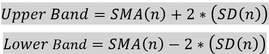

# 利用高维多元数据预测次日 BTC 价格

> 原文：<https://medium.com/coinmonks/forecasting-next-day-btc-prices-using-a-high-dimensional-multivariate-data-cb833ab61183?source=collection_archive---------0----------------------->

## 一个预测比特币价格的端到端项目。


Photo by [Kanchanara](https://unsplash.com/@kanchanara?utm_source=unsplash&utm_medium=referral&utm_content=creditCopyText) on [Unsplash](https://unsplash.com/s/photos/bitcoin?utm_source=unsplash&utm_medium=referral&utm_content=creditCopyText)

在一个政府用不同货币控制我们所有金融的世界里，比特币是作为一种数字和无形的货币引入的，也是第一种中央政府和银行都无权监管的加密货币。它给用户完全的控制权，不像金融机构。这使得潜在投资者信任并投资于它。在过去的几年里，比特币激发了成千上万种基于其技术的新加密货币进入市场。

# 内容:

[*简介*](#843e)[*获取数据*](#4f58)[*探索性数据分析*](#3751)[*特征工程*](#3f3e)[*特征选择*](#78c8)[*建模*](#01bc)

# 简介:

比特币形成背后的关键意图是创造一种不受任何中央权力机构管理的货币。它使用点对点技术，确保发送方和接收方之间的直接交易，而无需中介。交易信息被记录在不可变的分布式分类账中，称为区块链。共享但不可变的分类帐确保了安全性。

比特币是作为成功开采区块的奖励而产生的。挖掘是通过解决复杂的数学计算来创造新比特币的过程。块是永久记录比特币网络相关数据的文件，就像账本中的一页。节点在将每个数据块和事务添加到区块链网络之前对其进行验证。

许多投资者都在关注比特币和其他加密货币的潜力。尽管比特币很受欢迎，但由于其波动性的本质，对它的接受程度仍有争议。这表明研究预测价格的方法是很重要的。不幸的是，预测比特币或任何其他加密货币的价格非常具有挑战性，因为它们容易受到各种外部因素的影响。虽然公众情绪在价格波动中起着主要作用，但采矿周期、需求和供应、经济因素、市场因素和社交媒体趋势等其他因素也可能影响比特币价格。

基本上有两种类型的时间序列预测模型，单变量和多变量。像 ARIMA 这样的单变量时间序列模型只需要目标变量，即价格。但是随着时间的到来，各种数据驱动的公司依赖于随时间变化的多个数据库。为了在这些数据库的基础上进行预测，公司通常使用多元时间序列预测。rnn 往往比任何其他模型更适合多变量时间序列预测，因为它们也可以记住以前的输入，但我们永远不知道。

# 获取数据:

***来源 1:***

使用 BeautifulSoup 库通过自定义 python 代码收集数据。

```
*https://bitinfocharts.com/bitcoin/*
```

***来源二:***

```
*https://alternative.me/crypto/fear-and-greed-index/*
```

***来源 3:***

```
*https://investpy.readthedocs.io/_api/crypto.html*
```

***来源 4:***

```
*https://data.nasdaq.com/data/BCHAIN/MIREV-bitcoin-miners-revenue*
```

# 探索性数据分析:

**1。目标分析:**

目标变量次日 BTC 价格通过将收盘价上移一天来设定。我基本上遵循了一种天真的预测方法，即假设今天的价格与昨天相同。虽然天真的预测总是在性能方面胜出，但它仍然没有能力学习价格的变化，即非常重要的 R 平方得分，特别是在回归问题的情况下，它也是一个单变量问题。在这个项目中，我严格遵循朴素预测方法，并试图建立具有更好的学习价格差异和多元数据能力的模型。但是这里没有采用前一天的价格，而是采用前一天的一些观察值作为输入。


从目标分析和相关图中，我们可以发现与其他特征相关的多个特征。以下是一些值得注意的观察。

***观察:***

1.  散列率和难度高度相关，并且几乎与其他特征具有相同的相关性。
2.  同样，交易费用中位数和交易费用高度相关，并且几乎与其他特征具有相同的相关性。
3.  在所有变量中，矿工的收入与目标变量密切相关。
4.  与其他独立变量密切相关的特征。(I)通过地址和有效地址发送的具有大小的交易,( ii)通过具有有效地址的地址发送的交易，硬币供应量，大小，交易,( iii)通过地址发送的具有交易的块大小。

**2。每日 BTC 交易笔数:**


比特币交易是使用加密技术进行数字签名并发送到整个比特币网络进行验证的消息。

***观察:***

1.  它与地址发送的特征、大小、活动地址和硬币供应量密切相关。这是可以解释的，因为随着事务数量的增加，块的大小增加，供应增加，并且网络中唯一地址的数量增加。
2.  它与目标变量的低相关值表明，更多的交易并不意味着价格会更高。

**3。块大小:**


块就像我们存储数据的数据库。这里我们存储了比特币加密交易信息，用长数字表示。并且块大小被限制为 1MB。

***观察:***

1.  它与每天通过地址、活跃地址和硬币供应量发送的交易数量密切相关。
2.  当事务数量增加时，网络中涉及的地址数量也会增加，并且需要存储的事务信息量也会增加，从而增加了块的大小。

**4。平均阻塞确认时间:**


是矿工解决区块中复杂的数学问题生成一个新区块所花费的时间。比特币试图通过其复杂的算法将阻塞时间保持在 10 分钟左右，但它可能会根据难度和每秒哈希速率等因素略有波动。

***观察:***

1.  均值为 10 的对称分布在这里是可以预期的，因为在观察中没有太多的变化，而且大多数时候它应该等于 10，但从图中可以看出并非如此。
2.  它与难度、方块大小和硬币供应量的相关性相对较高，但与目标变量的相关性较低。

**5。散列和难度:**


难度是衡量一个比特币区块开采难度的指标。Hashrate 是衡量比特币网络挖掘一个区块的处理能力的指标。它们都是相互关联的。难度和散列率的值越大，挖掘者的散列能力、安全性以及对攻击的抵抗力就越强。

***观察:***

1.  难度和散列率彼此高度相关，也与目标变量高度相关。原因是比特币受欢迎程度的突然膨胀，这增加了需要高哈希能力的网络的复杂性。

**6。矿业盈利能力:**


如果比特币的价格超过开采成本，矿商就能获利。但随着比特币受欢迎程度的提高，交易数量增加，这使得问题变得更加复杂。解决这样一个复杂的问题要花很多钱。

***观察:***

1.  这是高度偷看和积极倾斜。
2.  随着时间的推移，随着越来越多的交易必然发生，预计采矿的盈利能力只会下降。
3.  它与目标变量以及其他自变量呈负相关，且相关性非常差。因此，它对做预测没什么用。

7 .**。平均&交易费用中位数:**


交易费是支付给矿工以验证交易的金额。价值是由供给和需求决定的，就像人们想要的其他东西一样。哪里需要更快地处理交易，哪里的费用就会更高。

***观察:***

1.  平均交易费用和中间交易费用彼此高度相关。
2.  平均交易费用与目标变量有较高的相关性。这是可以解释的，因为平均值会受到突然通货膨胀的影响，而中位数不会。
3.  右偏和高峰分布。

**8。平均和中间交易值:**


***观察:***

1.  交易价值的平均值和中值之间应该有很好的相关性，就像交易费用的平均值和中值一样，但是在这里它们没有很好的相关性。
2.  原因之一可能是离群值的存在。中位数可能不会受到异常值的影响，但平均值会。但在我们的案例中，随着价格波动，这些异常值可能是真实的。中位数基本不会受到这种波动的影响。这可能是平均交易值与中值交易值相比与目标变量高度相关的原因。

**9。交易费奖励比:**


它是平均交易费用在比特币总奖励中所占的百分比。

***观察:***

1.  它与特征交易费和中间交易费有一定的相关性，是可以解释的，具有正偏态分布。
2.  比特币的回报往往每 4 年减少一半，交易费只有在 BTC 价格突然上涨时才会达到最高。但这并不意味着交易费用会随着 BTC 价格的上涨而增加。
3.  尽管价格较高，但交易费与前几年相比仍然较低。这表明比特币奖励和交易费用都在逐年下降。
4.  谈到费用回报比，与交易费用的减少相比，回报价值的减少更多，这表明总体比率可能每 4 年相对增加一次。

**10。谷歌趋势和推特趋势:**


在过去几年中，社交媒体趋势在加密货币价格的上涨或下跌中发挥了至关重要的作用。它是可能影响投资者的因素之一，与其他经济因素一起影响买卖。基于这些趋势，人们倾向于恐慌性抛售或贪婪购买。每天的许多趋势可能是积极的，也可能是消极的。因此，我们不能说更多的趋势将是价格。如果我们能够知道所有趋势中积极趋势的数量，这将是一个非常有用的特征。

***观察:***

1.  虽然趋势的数量可能会影响 BTC 价格，但它们在预测中可能没有那么有用，因为我们不知道其中有多少是积极的。但是，它们似乎都与目标变量有很好的相关性。

**11。发送地址&有效地址:**


比特币地址是一个唯一的标识符，用作加密货币可以发送到的虚拟位置。Sentbyaddresses 是进行支付的地址，而 Active addresses 是交易中涉及的所有唯一地址，即往来地址。

***观察:***

1.  两者高度相关，这是可以理解的，因为两者都包含发送地址。
2.  它们与交易、规模和硬币供应量密切相关，这也是可以解释的。因为涉及的地址越多，交易越多，硬币供应越多，街区的大小也就越大。

**12。最富有的 100 个硬币地址:**


这是前 100 个地址占 BTC 硬币总数的百分比。在最初几年，比特币的供应量很低，所有交易过去都只通过少数几个地址进行，这使它们成为最富裕的地址。随着时间的推移，交易的数量增加了，这使得更多的块被添加到区块链网络，导致更多的 BTC 硬币在流通。从图中，我们可以分析随着硬币(即分母)的增加，最富有地址的百分比如何下降。

**13。发送的美元硬币:**


它与交易价值有较高的相关性，与目标变量也有很好的相关性。与高峰值分布正相关。

**14。矿工收入:**


成功验证一个区块的矿工将获得奖励，奖励以比特币支付，用于验证一个比特币交易区块。矿商还将从一个区块的所有交易中赚取交易费。

***观察:***

1.  在所有特征中，它与目标变量的相关性最高。高矿工收入表明，更多的区块在区块链网络，更多的流通供应，每天发生更多的交易。
2.  供应和交易数量的增加导致价格上涨。

15。流通中的硬币:

流通中的比特币总数。比特币 2100 万的供应上限是为了确保货币没有通货膨胀。大约 90%的比特币已经在流通。比特币的价格取决于流通中的硬币供应量。随着 90%的比特币被开采，比特币的需求超过了供应，这可能导致价格上涨。

**16。恐惧与齿轮指数:**


秘密市场行为非常依赖于人们的情绪。当市场上涨时，他们往往变得贪婪，因为害怕错过机会而买入。同时，人们经常在市场价值下跌时卖掉他们的硬币。该情绪指数包括各种经济和社会因素，如波动性、市场容量、社交媒体、调查以及与其他密码相比的主导地位。

***观察:***

1.  预计它与目标变量有很好的相关性，但我们可以从上面的图中清楚地看到，情况并非如此。

# 特征工程:

技术分析指标决定支撑位和阻力位。支撑位表明价格是否下跌，阻力位表明价格是否上涨。它们帮助我们识别上升和下降趋势。通过库 [TA-lib](https://mrjbq7.github.io/ta-lib/) ，平滑技术被用于从现有的原始特征中提取无噪声特征，从而突出重要的模式。下面是我用来执行特征工程的指标，但是在现实世界中，这个列表是很广泛的。

[***【简单移动平均线(SMA)***](https://www.investopedia.com/ask/answers/071414/whats-difference-between-moving-average-and-weighted-moving-average.asp)***:***它根据所选价格范围内的周期数来计算该范围内价格的平均值。

[***加权移动平均线(WMA)***](https://www.investopedia.com/ask/answers/071414/whats-difference-between-moving-average-and-weighted-moving-average.asp)***:***它是给定的价格乘以其关联的权重，然后将值相加得到的。给予当前价格数据更多的权重。

[***【指数移动平均线(EMA)***](https://www.investopedia.com/ask/answers/071414/whats-difference-between-moving-average-and-weighted-moving-average.asp)***:***它是一种加权移动平均线，赋予最近的价格数据更多的权重，但一个价格与其前一个价格之间的下降率不是一致的，而是指数的。


其中:
t =今天
y =昨天
N =均线天数(即平滑范围)
k = 2 \u( N+1)

[***【双指数移动平均线】(DEMA)***](https://www.investopedia.com/terms/d/double-exponential-moving-average.asp)***:***为了消除滞后，使用了两个 EMAs。它比 EMA 反应更快。


其中:
n =回望期

[***【三重指数移动平均线】(TEMA):***](https://www.investopedia.com/terms/t/triple-exponential-moving-average.asp)*减少滞后超过 DEMA。它使用原始均线的多个均线，减去一些滞后。*

**

**其中:*
EMA 1 = EMA(n)
EMA 2 = EMA(EMA 1(n))
EMA 3 = EMA(EMA 2(n))
n =回望期*

****标准差和方差:*** 标准差常用来衡量一项资产的相对风险程度。它测量值沿轴偏离平均值的范围。高标准差意味着高价格波动，同样，低标准差意味着低波动。方差与标准差密切相关，但它不能解释像标准差这样的意外事件，投资者仍然使用这两个指标来衡量波动性。*

*[***【相对强弱指数(RSI)***](https://www.investopedia.com/terms/r/rsi.asp)***:***它是衡量近期价格变动幅度的动量指标，用以评估价格中的超买或超卖情况。RSI 显示为一个读数从 0 到 100 的振荡器。计算中使用的平均收益或损失是回顾期内收益或损失的平均百分比。*

**

*[***变化率(ROC):***](https://www.investopedia.com/search?q=Rate+of+change)*它是变量在特定时间段内变化的速度。它被表示为一个变量的变化相对于另一个变量的相应变化的比率。**

****

**[***布林线***](https://www.investopedia.com/terms/b/bollingerbands.asp)***:***布林线是在价格的简单移动平均线上方和下方的标准偏差水平绘制的趋势线。上限和下限通常是简单移动平均线的 2 个标准差+/-的值。简单移动平均线被称为中间带。**

****

**其中:
SMA(n)= n 天回顾期的简单移动平均线
SD(n)= n 天回顾期的标准差**

# **功能选择:**

****

**Image created by the author**

**在特征工程之后，执行线性插值并移除一些不需要的特征。此后，所有特征被分成每组周期(平滑范围)和技术指标的块，然后在需要时进行缺失值插补。然后，使用随机森林回归器作为估计器，对每个集合进行 [RFECV](https://scikit-learn.org/stable/modules/generated/sklearn.feature_selection.RFECV.html) 拟合。RFECV 对特性进行排序，并选择最重要的特性。步长设置为 0.6，这将在每次迭代中删除 60%最不重要的特征。从每个块中选择等级为 1 的特征。使用[方差膨胀因子(VIF)](https://corporatefinanceinstitute.com/resources/knowledge/other/variance-inflation-factor-vif/) 移除与其他独立特征高度相关的特征。**

# **建模:**

*****拆分数据:*****

**测试预测模型的两种主要方法是滑动窗口法和扩展窗口法。**

****

**我在这里采用了滑动窗口方法，每个窗口大小为 500 个数据点。其中前 400 个点被设置用于训练，其余的用于测试模型。**

*****缩放:*****

**特征缩放是最重要的预处理步骤之一。离群值的存在会影响缩放，标准缩放器使用平均值来缩放数据，我们知道平均值对离群值不稳定。使用稳健标度，我们可以首先移除异常值，然后使用标准标度或最小-最大标度。稳健标度基于百分位数，因此不受少数非常大的边际异常值的影响。对于像 [SVR](https://scikit-learn.org/stable/modules/generated/sklearn.svm.SVR.html) 这样的算法，通过使用标准标度，性能得到了改善。这里，我们使用最小-最大规模，然后是稳健规模，或者是基于性能的标准规模。**

*****绩效指标:*****

**RMSE 告诉你数据在最佳拟合线附近有多集中。它通过平方误差来给大误差更多的权重。RMSE 是一个非常有用的指标，因为 BTC 价格本质上是波动的。**

**MAE 是实际值和预测值之间的绝对差值。MAPE 在解释结果方面比梅做得更好。但是，当数据为零时，它会失败，因为以零作为分母的 MAPE 是未定义的。**

*****型号:*****

**SVM 算法的目标是在 N 维空间中找到一个分类数据点的超平面。它被广泛用于分类，但是我们也可以用它来解决回归问题。**

**[DummyRegressor](https://scikit-learn.org/stable/modules/generated/sklearn.dummy.DummyRegressor.html?highlight=dummyregressor#sklearn.dummy.DummyRegressor) :**

****

**[随机森林](https://scikit-learn.org/stable/modules/generated/sklearn.ensemble.RandomForestRegressor.html?highlight=randomforest#sklearn.ensemble.RandomForestRegressor):**

****

**集成模型非常适合训练数据集，但未能在测试数据集上推广，这是由于数据中的高方差和低偏差。尝试通过减少 max_features 和 max_dept 进行超参数调整，但结果大致相同。**

**[XGBoost](https://www.geeksforgeeks.org/xgboost-for-regression/) :**

****

**LSTM :**

****

**这里我们的主要问题是预测第二天的价格，只观察前一天的价格会得到更好的结果。通过增加单元数量或增加更多层，LSTM 的性能正在改善，但在模型性能和低延迟方面仍落后于经典 ML 模型。**

**[SGDRegressor](https://scikit-learn.org/stable/modules/generated/sklearn.linear_model.SGDRegressor.html) :**

****

**[SupportVectorRegressor](https://scikit-learn.org/stable/modules/generated/sklearn.svm.SVR.html?highlight=svr#sklearn.svm.SVR) :**

****

**支持向量回归机在低延迟方面优于使用 SGD 优化器的线性回归，并且表现优于基线模型和其他机器学习和深度学习模型。**

*****结果:*****

****

*****部署:*****

**[](https://div-bitcoin-forecast-app.herokuapp.com/) [## 使用高维多元数据预测次日比特币价格

### 使用部署在 Heroku 平台上的 Flask API 的 Web 应用程序。

herokuapp.com](https://div-bitcoin-forecast-app.herokuapp.com/) 

***GitHub:***

[](https://github.com/divya-777/Forecasting-Next-Day-Bitcoin-Prices) [## GitHub-divya-777/预测-次日-比特币-价格

### 我预测第二天 BTC 价格的端到端项目的完整代码可以在这里找到。

github.com](https://github.com/divya-777/Forecasting-Next-Day-Bitcoin-Prices) 

# 参考资料:

1.  [https://www.appliedaicourse.com/](https://www.appliedaicourse.com/)
2.  [https://bitinfocharts.com/](https://bitinfocharts.com/)
3.  [https://link . springer . com/content/pdf/10.1007/s 00521-020-05129-6 . pdf](https://link.springer.com/content/pdf/10.1007/s00521-020-05129-6.pdf)
4.  [https://en.wikipedia.org/wiki/Bitcoin](https://en.wikipedia.org/wiki/Bitcoin)
5.  [https://www.investopedia.com/terms/b/blockchain.asp](https://www.investopedia.com/terms/b/blockchain.asp)
6.  [https://www . trading technologies . com/x trader-help/x-study/technical-indicator-definitions/momentum-mom/](https://www.tradingtechnologies.com/xtrader-help/x-study/technical-indicator-definitions/momentum-mom/)
7.  [https://www . geeks forgeeks . org/detecting-multi 共线性-with-vif-python/](https://www.geeksforgeeks.org/detecting-multicollinearity-with-vif-python/)
8.  [https://www . stats models . org/v 0 . 13 . 0/generated/stats models . stats . outliers _ influence . variance _ inflation _ factor . html](https://www.statsmodels.org/v0.13.0/generated/statsmodels.stats.outliers_influence.variance_inflation_factor.html)
9.  [https://towards data science . com/unlocking-the-true-power-of-support-vector-regression-847 FD 123 a4 A0](https://towardsdatascience.com/unlocking-the-true-power-of-support-vector-regression-847fd123a4a0)
10.  [https://colah.github.io/posts/2015-08-Understanding-LSTMs/](https://colah.github.io/posts/2015-08-Understanding-LSTMs/)
11.  [https://sci kit-learn . org/stable/modules/generated/sk learn . feature _ selection。RFECV.html](https://scikit-learn.org/stable/modules/generated/sklearn.feature_selection.RFECV.html)
12.  [https://machinelingmastery . com/rfe-feature-selection-in-python/](https://machinelearningmastery.com/rfe-feature-selection-in-python/)

> 交易新手？尝试[加密交易机器人](/coinmonks/crypto-trading-bot-c2ffce8acb2a)或[复制交易](/coinmonks/top-10-crypto-copy-trading-platforms-for-beginners-d0c37c7d698c)**