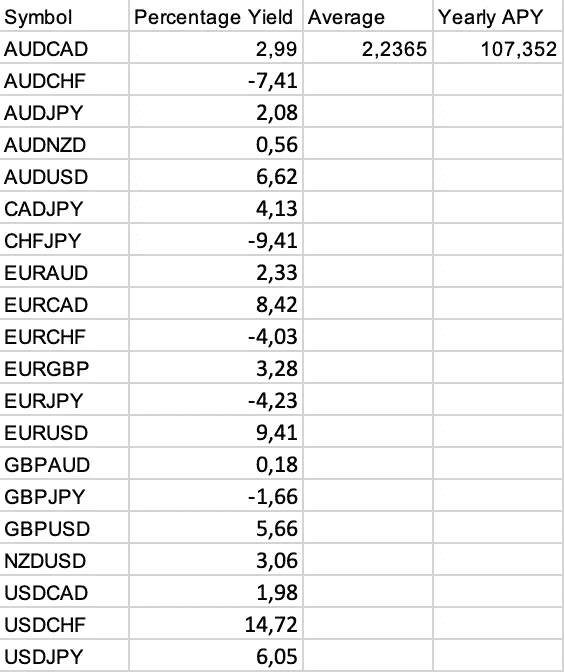

# 外汇算法交易更新周 1: 107%年利率收益率

> 原文：<https://medium.com/coinmonks/forex-trading-update-week-1-107-apr-yield-4332562e78a2?source=collection_archive---------9----------------------->

你好，几天前，我向你介绍了我的[外汇交易算法](https://slothtrading/forex)，在那里我展示了使用深度神经网络，我能够相当准确地预测 20 种不同外汇对的价格。

今天，又一周过去了，我将向你展示我本周在外汇交易方面取得的成果。

计算利润/损失的程序非常简单，在我提到的网站上解释得非常清楚。一周时间框架预测的有趣数据。我提取了在[slot trading](https://slothtrading.com)上发布的关于所有不同外汇对的数据，并将其粘贴到 Excel 表格上。

以下是我得到的信息:

Last week’s forex yield extracted from [SlothTrading](https://slothtrading.com/forex)

如你所见，在 20 对可能的对子中，我从 15 对中获利，占所有对子的 75%。如果我们对结果进行平均，那么在考虑交易费用的情况下，上周我们获得了 2.23%的利润。

如果我把它推断为一年，这将是一个惊人的 107%的年利率，这是非常诱人的。

所有的数据都在[slot trading](https://slothtrading.com/forex)公开发布，并且每小时实时更新，所以你可以看到我没有发明任何上述的价值观。

关注我，关注新的更新:)

我的[网站](https://slothtrading.com/)，所有数据都在这里发布。

在推特上关注我。

给我们一笔[捐款](https://ko-fi.com/slothtrading)继续开发这个项目，我们将不胜感激:)。

> 加入 Coinmonks [电报频道](https://t.me/coincodecap)和 [Youtube 频道](https://www.youtube.com/c/coinmonks/videos)了解加密交易和投资

# 另外，阅读

*   [德国最佳加密交易所](https://coincodecap.com/crypto-exchanges-in-germany) | [Arbitrum:第二层解决方案](https://coincodecap.com/arbitrum)
*   [币安交易机器人](/coinmonks/binance-trading-bots-d0d57bb62c4c) | [OKEx 评论](/coinmonks/okex-review-6b369304110f) | [阿塔尼评论](https://coincodecap.com/atani-review)
*   [最佳加密交易信号电报](/coinmonks/best-crypto-signals-telegram-5785cdbc4b2b) | [MoonXBT 评论](/coinmonks/moonxbt-review-6e4ab26d037)
*   [如何在 Bitbns 上购买柴犬(SHIB)币？](https://coincodecap.com/buy-shiba-bitbns) | [买弗洛基](https://coincodecap.com/buy-floki-inu-token)
*   [CoinFLEX 评论](https://coincodecap.com/coinflex-review) | [AEX 交易所评论](https://coincodecap.com/aex-exchange-review) | [UPbit 评论](https://coincodecap.com/upbit-review)
*   [十大最佳加密货币博客](https://coincodecap.com/best-cryptocurrency-blogs) | [YouHodler 评论](https://coincodecap.com/youhodler-review)