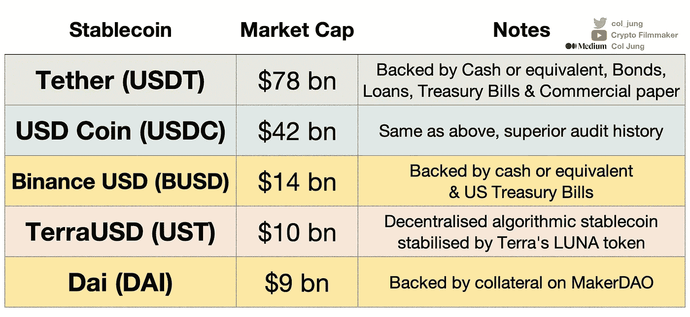

# Terra Anchor 协议——收益和风险，赚取 20%的美元

> 原文：<https://medium.com/coinmonks/forget-banks-earn-20-on-your-usd-in-defi-on-the-terra-blockchain-2b1d2844574?source=collection_archive---------0----------------------->

## 忘记银行——进入稳定的被动收入时代？

Top 5 stablecoins by market cap

***编辑:*** 看我在 YouTube 上的穿越[这里](https://www.youtube.com/watch?v=xaRrrzidQUI)。

**Stablecoins** 在加密货币市场中扮演着不可或缺的角色。

它们在交易所提供重要的流动性，并作为投资者和投资者的避险资产