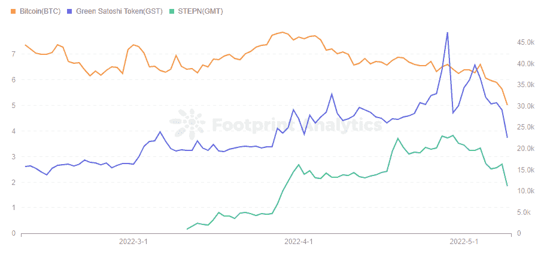
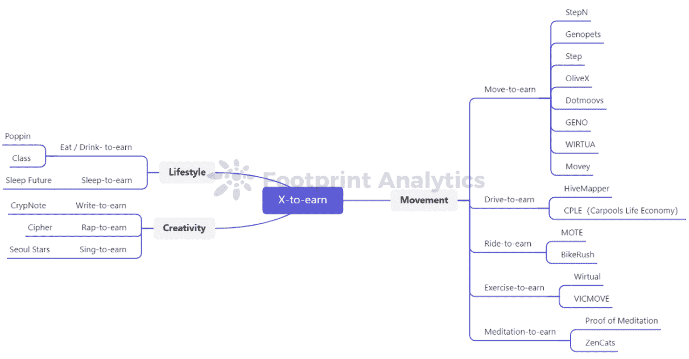
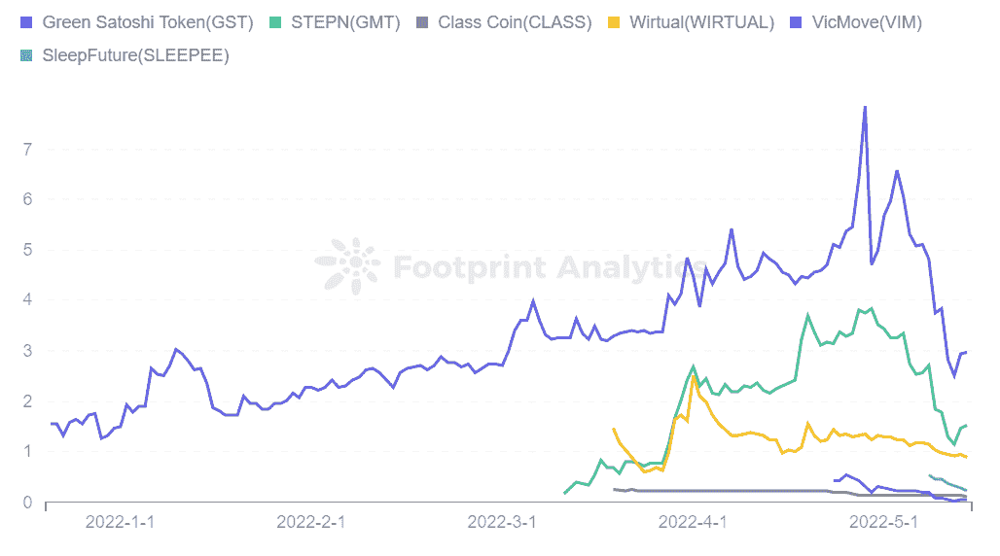

# 忘掉游戏盈利吧——crypto 可能很快会将几十种日常活动货币化

> 原文：<https://medium.com/coinmonks/forget-gaming-for-profit-crypto-may-soon-monetize-dozens-of-daily-activities-79b77d86bc78?source=collection_archive---------41----------------------->

2022 年 5 月

数据来源:[足迹分析 X-to-earn 代币仪表板](https://www.footprint.network/@DamonSalvatore/X-to-earn-Token-Dashboard?channel=ENG-251)

根据[足迹分析](https://www.footprint.network/?channel=ENG-251)，目前有超过 1400 个 GameFi 项目。

但是以 Axie Infinity 的流行为代表的 P2E [游戏](https://www.footprint.network/guest/dashboard/dashboard-for-game-fi-industry-fp-f7d88ee8-9341-49ae-b497-088bee7ec038?date=past60days&channel=ENG-251#secret=2E95108712AF5CB1949BCFBB804F139C)已经因为缺乏想象力、机械和投机驱动而受到批评。

现实是，如果不是为了钱，很少有人会继续玩目前这批 GameFi 游戏。因此，出现了行会制度来推动游戏活动，在这种制度下，NFT 所有者将他们的资产出租给贫穷国家的学者。

但是如果你可以通过做你真正喜欢的事情来赚钱呢？还是为了强化有益的习惯？

这是新一批“X-to-Earn”项目的承诺——X 代表你能想到的任何活动——特别是移动到收入游戏 [STEPN](https://www.footprint.network/@DamonSalvatore/StepN-Dashboard?date_range=past90days&channel=ENG-251) 。

这些以活动为导向的 GameFi 项目有光明的、可持续的未来吗，还是都是炒作？在这篇文章中，我们将探索一些最有趣的新的赚钱项目。

# 1.活动

*   移动到收入

最著名的 Move-to-Earn 项目是 StepN，它将 GameFi 的理念扩展到了传统游戏之外。用户使用购买的鞋子走路、慢跑或跑步来赚取代币。StepN 将健康与收入和社区联系起来。根据 Footprint Analytics 的数据，自上市以来，StepN 的价格也表现良好。

*Footprint Analytics — StepN Token Price*

还有各种对 StepN 的模仿，但由于先发优势，发展远没有 StepN 的快。其中，Genopets 将运动与游戏内宠物升级相结合，拥有更多游戏属性。其他项目有 OliveX、Dotmoovs、GENO、Movey 和 WIRTUAL。

*   努力赚钱

HiveMapper 是第一款支持加密的 dashcam，它使用加密技术，允许用户在驾驶时通过增长地图来挖掘令牌蜜糖。我们在生活中使用的地图大多来自谷歌这样的大公司，在免费使用的同时，也在被公司用来免费获取私人数据。HiveMapper 将于今年上线测试版，将权力还给人民。

CPLE(拼车生活经济)想用去中心化的方式做一个拼车 app，防止价格管制，降低信息发布的成本。

*   乘车挣钱

Sweetgum Labs 的 MOTE 是世界上第一个游戏化的碳抵消项目，允许用户通过可持续交通直接参与碳中和。用户骑自行车时将收到$OCO 代币。该项目尚未上线，官网上也没有太多信息。

BikeRush 是一个项目，用户用 NFT 装备自己，通过户外骑行赚取游戏代币$BST。BikeRush 也是以健康生活和绿色环境为理念，联合创始人也都是骑行爱好者。该项目仍处于基本功能设计阶段。

*   锻炼赚钱

还有一些项目统称为“锻炼挣钱”，类似于“移动挣钱”和“骑自行车挣钱”，但包含更广泛的活动。

例如，在 wi tual 中，用户可以通过跑步、游泳、骑自行车、跳舞和健身来获得$ WIRTUAL 代币，并获得代币来购买或在商店中获得折扣。据该网站称，目前每月活跃用户超过 4 万人。

VICMOVE 还集成了步行、跑步和骑行。目前的体验类似于 StepN，用户需要从 BSC、以太坊或 Polygon 购买一个盒子，通过练习赚取盒子的碎片或 token $VIM。

*   冥想赚钱

当你可以冥想来赚取密码时，为什么要冥想来将自己从世俗的依附中解放出来，对吗？

冥想的证明有一个 21 天的每月学习周期，用户将首先朝着这个目标投入代币。如果他们错过了一次冥想，一部分代币将被锁定在池中。21 天后，那些没有错过冥想的人将收到他们的赌注代币，并在池中分配代币。

ZenCats 还将于今年 9 月使用$AWAKE 和 Zen cats NFTS 与区块链的第一个冥想和正念 DApp 一起上线。

# 2.生活方式

*   吃饭/喝酒挣钱

Poppin 是 Solana 上的第一款吃到赚的游戏，允许用户收集、战斗和种植名为 Poppins 的幻想生物。Poppin 计划在 9 月份进行公开测试。用户可以通过拍摄食物的照片来计算一天的总热量摄入和营养平衡，越接近标准，升级 Poppin 的积分越高。

Class 属于新生的“靠喝酒赚钱”类别，这是一家连锁咖啡店，2013 年起源于泰国呵叻府，目前拥有 19 家连锁店。$CLASS 是其发行的数字基础，允许用户使用代币购买产品和服务。$CLASS 存在于名为 vel erosore 的社区中，用户可以在这里交换 NFT 和土地，用户可以在这里参与各种在线活动。

*   睡觉挣钱

世界上有大量的人睡眠不足，睡眠质量差，影响了他们白天的学习和工作能力。Sleep Future 旨在通过根据其用户的睡眠质量发行代币$SLEEPEE 来改善这一问题，代币可以在 SleepTown 和 SLEEPEE 商店中使用。该项目计划在今年晚些时候推出测试版。

# 3.创造力

*   写 **-** 到-赚

CrypNote 是一个 Web3 产品，用于永久存储笔记和协作。它适合于 DAO 组织通过激励池在创造、激励、共享、同步和鼓励有效的价值创造和洞察力分析方面进行协作。它也没有汽油费，并将获得一个免费的维基个人域名来创建一个 Web3 主页。但它目前处于测试阶段。

*   说唱挣钱

Cipher 为创作者提供制作 RAP NFT 的工具，未被发现的艺人可以通过制作 RAP NFT 进行销售来获得收入，平台收取 10%的佣金。但是受众还是比较少，销量好像也不高。

*   唱歌挣钱

首尔之星有两个游戏——一个在线节奏游戏(DJ-to-earn)和一个卡拉 ok 游戏(Sing-to-earn)。K-pop 在线节奏游戏通过在正确的时间击中水滴来得分。而卡拉 ok 游戏让玩家用麦克风唱歌。得分是基于球员的高音，节奏和准确性。在游戏中使用 NFT 将导致更高的收益率，但该游戏尚未推出测试版。

*Footprint Analytics*

根据足迹分析中包含的 X-to-Earn 项目的象征性价格，StepN 最高，领先于 Wirtual。其他代币仍处于早期阶段，价格不到 1 美元。

*Footprint Analytics — X-to-earn Token Price*

# 摘要

各种 X-to-Earn 概念正在出现，但大多数仍处于初始阶段，有些甚至还没有上线。

问题是，你准备好做任何事情来赚取现金了吗？你会将你的生活货币化吗？这是权力给人民，还是黑镜插曲？

只有时间能证明一切。

本文由[足迹分析](https://www.footprint.network/?channel=ENG-251)社区提供。

Footprint 社区是一个世界各地的数据和加密爱好者相互帮助了解和获得关于 Web3、元宇宙、DeFi、GameFi 或区块链新兴世界任何其他领域的见解的地方。在这里，你会发现活跃的、不同的声音相互支持，推动着社区向前发展。

> *加入 Coinmonks* [*电报频道*](https://t.me/coincodecap) *和* [*Youtube 频道*](https://www.youtube.com/c/coinmonks/videos) *了解加密交易和投资*

# 另外，阅读

*   [有哪些交易信号？](https://coincodecap.com/trading-signal) | [Bitstamp vs 比特币基地](https://coincodecap.com/bitstamp-coinbase) | [买索拉纳](https://coincodecap.com/buy-solana)
*   [加密交易机器人](/coinmonks/crypto-trading-bot-c2ffce8acb2a) | [维护审查](https://coincodecap.com/uphold-review)
*   [如何给 MetaMask 钱包添加 Arbitrum？](https://coincodecap.com/how-to-add-arbitrum-to-metamask-wallet)
*   [KuCoin vs 北海巨妖 vs BitYard](https://coincodecap.com/kucoin-vs-kraken-vs-bityard)
*   [加密交易的最佳 VPN](https://coincodecap.com/best-vpns-for-crypto-trading)
*   [ProfitFarmers 点评](https://coincodecap.com/profitfarmers-review) | [如何使用 Cornix Trading Bot](https://coincodecap.com/cornix-trading-bot)