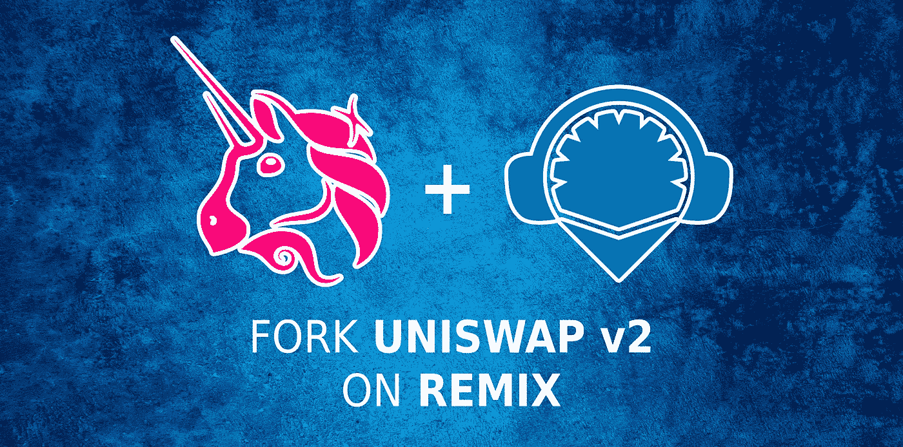

# Fork Uniswap v2 智能合同和基于 Remix 的 UI

> 原文：<https://medium.com/coinmonks/fork-uniswap-v2-smart-contracts-ui-on-remix-e885d6cea176?source=collection_archive---------0----------------------->

了解如何在 Remix 上派生 Uniswap v2，并运行自己的去中心化 Exchange (Dex)。

无论是构建您自己的增强型平台与 Uniswap 竞争，还是为您的投资者提供定制解决方案，在快速发展的分散式金融(DeFi)市场中，能够部署、定制和管理您自己的分散式交易所(Dex)都会有所帮助。